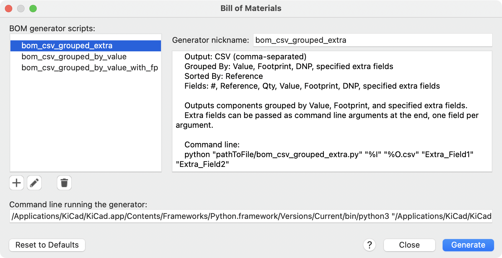

:experimental:

[[advanced]]
== Advanced Topics

[[color-settings]]
[[configuration-and-customization]]
[[preferences-field-name-templates]]
[[preferences-schematic-display-options]]
=== Configuration and Customization

NOTE: This section of the KiCad documentation has not yet been written.  We
      appreciate your patience as our small team of volunteer documentation
      writers work to update and expand the documentation.

[[text-variables]]
=== Text variables

KiCad supports text variables, which allow you to substitute the variable name
with a defined text string. This substitution happens anywhere the variable name
is used inside the variable replacement syntax of `${VARIABLENAME}`.

You can define project text variables in the
<<schematic-setup-text-variables,schematic>> or
xref:../pcbnew/pcbnew.adoc#board-setup-text-variables[board setup]
dialogs. Project text variables are defined for the whole project, so a project
text variable defined in the Schematic Editor can also be used in the Board
Editor.

There are also a number of built-in system text variables. System
text variables may be available in some contexts and not others. The following
system text variables can be used in schematic text, label names, label
fields, hierarchical sheet fields, symbol text, symbol fields, and drawing
sheet fields. There are also a number of
xref:../pcbnew/pcbnew.adoc#text-variables[variables that can be used in the PCB Editor].

Variables used in hierarchical sheet fields refer to the properties of the
hierarchical sheet, not the parent, unless otherwise noted. For example, `${#}`
returns the subsheet's page number when used in a hierarchical sheet field, but
the parent sheet's page number when used in graphic text in the parent sheet.

Variables can also be used for field names. A field with a variable as its name
will automatically have its value set to the same variable. For example, in a
project with a project variable `MY_VAR` set to `MY_VALUE`, a user-created
symbol field named `${MY_VAR}` will automatically have its value set to
`${MY_VAR}`, which will then resolve to `MY_VALUE`. If the field's **Show Name**
property is set, the variable's name will be displayed as the field name, for
example `MY_VAR: MY_VALUE`. 

[options="header",cols="20%,80%"]
|====
| Variable name | Description
| `#`
  | Sheet number.
| `##`
  | Total number of schematic sheets.
| `COMMENT1` - `COMMENT9`
  | Contents of drawing sheet's `Comment<n>` field.
| `COMPANY`
  | Contents of drawing sheet's `Company` field.
| `CURRENT_DATE`
  | Today's date, in ISO format.
| `FILENAME`
  | Filename of the *root schematic sheet*, with a file extension.
| `FILEPATH`
  | Full file path of the *root schematic sheet*, with a file extension.
| `ISSUE_DATE`
  | Contents of drawing sheet's `Issue Date` field.
| `KICAD_VERSION`
  | Current version of KiCad. This variable is only available in drawing sheet fields.
| `PAPER`
  | Current sheet's paper size. This variable is only available in drawing sheet fields.
| `PROJECTNAME`
  | Project name, without a file extension.
| `REVISION`
  | Contents of drawing sheet's `Revision` field.
| `SHEETFILE`
  | Filename of the *current sheet*, with a file extension.
| `SHEETNAME`
  | Sheet name of the current sheet.
| `SHEETPATH`
  | Sheet path of the current sheet.
| `TITLE`
  | Contents of drawing sheet's `Title` field.
| `<variablename>`
  | Contents of <<schematic-setup-text-variables,project text variable>>
  `<variablename>`.
| `<fieldname>`
  | Contents of symbol field, symbol attribute, hierarchical sheet field, or
    label field `<fieldname>`. Fields can only be accessed from within their
    parent object, so symbol fields can be accessed from other text or fields
    within the symbol, and hierarchical sheet fields can be accessed within the
    sheet or in other sheet fields of the sheet.

    Both built-in and user-defined fields are available. Built-in fields use all
    uppercase letters: for example, to access a symbol's value, use `${VALUE}`.

    Built-in symbol fields are `DATASHEET`, `DESCRIPTION`, `FOOTPRINT`,
    `FOOTPRINT_LIBRARY`, `FOOTPRINT_NAME`, `NET_CLASS(<pin_number>)`,
    `NET_NAME(<pin_number>)`, `OP`, `PIN_NAME(<pin_number>)`, `REFERENCE`,
    `SHORT_NET_NAME(<pin_number>)`, `SHORT_REFERENCE`, `SYMBOL_DESCRIPTION`,
    `SYMBOL_KEYWORDS`, `SYMBOL_LIBRARY`, `SYMBOL_NAME`, `UNIT`, `VALUE`.

    Built-in symbol attributes are `DNP`, `EXCLUDE_FROM_BOARD`,
    `EXCLUDE_FROM_BOM`, and `EXCLUDE_FROM_SIM`. These attributes expand to the
    friendly name of the attribute if the attribute is set (e.g. `Excluded from
    board` for `EXCLUDE_FROM_BOARD` and `DNP` for `DNP`), or to an empty string
    if the attribute is not set.

    Built-in sheet fields are `SHEETFILE`, `SHEETNAME`, and `SHEETPATH`. These
    refer to the child sheet's filename, sheet name, and sheet path,
    respectively, rather than the parent sheet's.

    Built-in label fields are `CONNECTION_TYPE`, `NET_CLASS`, `NET_NAME`,
    `OP`, `SHORT_NET_NAME`, and `INTERSHEETREFS` (global labels only).

| `<refdes>:<fieldname>`
  | Contents of field or attribute `<fieldname>` in symbol `<refdes>`.
    
    Both built-in and user-defined fields are available. Built-in fields use all
    uppercase letters: for example, to access the value of `U1`, use
    `${U1:VALUE}`.
    
    Built-in symbol fields are `DATASHEET`, `DESCRIPTION`, `FOOTPRINT`,
    `FOOTPRINT_LIBRARY`, `FOOTPRINT_NAME`, `NET_CLASS(<pin_number>)`,
    `NET_NAME(<pin_number>)`, `OP`, `PIN_NAME(<pin_number>)`, `REFERENCE`,
    `SHORT_NET_NAME(<pin_number>)`, `SYMBOL_DESCRIPTION`, `SYMBOL_KEYWORDS`,
    `SYMBOL_LIBRARY`, `SYMBOL_NAME`, `UNIT`, `VALUE`.

    Built-in symbol attributes are `DNP`, `EXCLUDE_FROM_BOARD`,
    `EXCLUDE_FROM_BOM`, and `EXCLUDE_FROM_SIM`. These attributes expand to the
    friendly name of the attribute if the attribute is set (e.g. `Excluded from
    board` for `EXCLUDE_FROM_BOARD` and `DNP` for `DNP`), or to an empty string
    if the attribute is not set.
| `ERC_ERROR <errorname>`
  | Generates an <<text-var-erc,ERC error>> named `<errorname>`. Everything
    inside the braces resolves to an empty string, while everything after the
    braces is included in the descriptive text for the ERC violation. The text
    variable must be at the beginning of the text item.
    
    For example, a text item containing `${ERC_ERROR TODO}Calculate resistor
    value` would display as the text "Calculate resistor value" and generate a
    ERC error named "TODO" with the description "Calculate resistor value".
| `ERC_WARNING <warningname>`
  | Generates an <<text-var-erc,ERC warning>> named `<warningname>`. This behaves
    the same as `ERC_ERROR`, except a warning is generated rather than an error.

|====

////
[[preferences-common]]
===== Common Preferences
NOTE: This section of the KiCad documentation has not yet been written.  We
      appreciate your patience as our small team of volunteer documentation
      writers work to update and expand the documentation.


[[preferences-mouse]]
===== Mouse and Touchpad
[width="100%",cols="40%,60%",]
|============
|Center and warp cursor on zoom | If checked, the pointed location is warped
to the screen center when zooming in/out.

|Use touchpad to pan |When enabled, view is panned using scroll wheels (or
touchpad gestures) and to zoom one needs to hold kbd:[Ctrl]. Otherwise scroll
wheels zoom in/out and kbd:[Ctrl]/kbd:[Shift] are the panning modifiers.

|Pan while moving object |If checked, automatically pans the window
if the cursor leaves the window during drawing or moving.
|============

[[preferences-controls]]
===== Hotkeys

Redefine hotkeys.


Select a new hotkey by double clicking an
action or right click on an action to show a popup menu:

[width="100%",cols="40%,60%",]
|============
|Edit | Define a new hotkey for the action (same as double click).
|Undo Changes | Reverts the recent hotkey changes for the action.
|Clear Assigned Hotkey |
|Restore Default | Sets the action hotkey to its default value.
|============

[[preferences-display]]
===== Display Options


[width="100%",cols="40%,60%",]
|=======================================================================
|Grid Size| Grid size selection.

It is *recommended* to work with normal grid (0.050 inches or 1,27 mm). Smaller
grids are used for component building.

|Bus thickness |Pen size used to draw buses.

|Line thickness |Pen size used to draw objects that do not have a
specified pen size.

|Part ID notation |Style of suffix that is used to denote symbol units (U1A,
U1.A, U1-1, etc.)

|Icon scale| Adjust toolbar icons size.

|Show Grid | Grid visibility setting.

|Restrict buses and wires to H and V orientation| If checked, buses and
wires are drawn only with vertical or horizontal lines.
Otherwise buses and wires can be placed at any orientation.

|Show hidden pins: |Display invisible (or __hidden__) pins, typically
power pins.

|Show page limits |If checked, shows the page boundaries on screen.

|Footprint previews in symbol chooser| Displays a footprint preview frame and
footprint selector when placing a new symbol.

*Note:* it may cause problems or delays, use at your own risk.
|=======================================================================

[[preferences-editing]]
===== Editing Options


[width="100%",cols="40%,60%",]
|=======================================================================
|Measurement units |Select the display and the cursor coordinate units
(inches or millimeters).

|Horizontal pitch of repeated items |
Increment on X axis during element duplication (default: 0)
(after placing an item like a symbol, label or wire,
a duplication is made by the kbd:[Insert] key)

|Vertical pitch of repeated items| Increment on Y axis during
element duplication (default: 0.100 inches or 2,54 mm).

|Increment of repeated labels |Increment of label value during duplication of texts ending
in a number, such as bus members (usual value 1 or -1).

|Default text size |Text size used when creating new text items or labels.

|Auto-save time interval |Time in minutes between saving backups.

|Automatically place symbol fields | If checked, symbol fields (e.g. value and
reference) in newly placed symbols might be moved to avoid collisions with
other items.

|Allow field autoplace to change justification | Extension of 'Automatically
place symbol fields' option. Enable text justification adjustment for symbol fields when placing
a new part.

|Always align autoplaced fields to the 50 mil grid |Extension of 'Automatically
place symbol fields' option. If checked, fields are autoplaced using 50 mils
grid, otherwise they are placed freely.
|=======================================================================

[[preferences-colors]]
===== Colors

Color scheme for various graphic elements. Click on any of the color swatches to
select a new color for a particular element.


[[preferences-default-fields]]
===== Default Fields

Define additional custom fields and corresponding values that will appear in
newly placed symbols.


////

[[database-libraries]]
=== Database Libraries

A database library is a type of KiCad symbol library that holds data about parts in an external
SQL database.  Database libraries do not contain any symbol or footprint definitions by themselves.
Instead, they **reference** symbols and footprints found in other KiCad libraries. Each database
library entry maps a KiCad symbol (from another library) to a set of properties (fields) and
usually a KiCad footprint (from a footprint library).

Using database libraries allows you to create fully-defined parts (sometimes called *atomic parts*)
out of KiCad symbols and footprints without needing to store all the part properties in a symbol
library.  The external database can be linked to third-party tools for managing part data and
lifecycles.  Database library workflows are generally more complex than the standard KiCad library
workflows, and so this type of library is typically only used in situations where it makes managing
a large library of fully-defined parts more efficient (such as in organization or team settings).

KiCad does not provide a GUI for editing a SQL database or defining a database library.  It is up
to the user to find the most appropriate workflow and toolchain for creating and updating the
database itself.  Some users may want to directly edit the database through a third-party database
client, and some may use other third-party software such as a part lifecycle management (PLM) tool
to create and edit data.

In a database library, there are one or more **tables** that generally represent a single type of
part (such as Resistors or Capacitors).  Each table can have an independent schema, meaning that
different types of parts can have different properties that are translated into symbol fields in
KiCad.  Each table must have a unique ID column which is used as the identifier for a symbol placed
from that table.  This unique ID will typically be a part number (either a manufacturer's part
number, or an internal organization part number).  Each table must also have a column that contains
a mapping to a KiCad symbol, in the form `LibraryNickname:SymbolName`.  The `LibraryNickname` must
match a symbol library that is present in the KiCad library tables.  Tables may also contain a
column containing a KiCad footprint, in the form `LibraryNickname:FootprintName`.  If this column
is present, symbols placed from the table will include a footprint mapping.

Tables may also contain arbitrary additional columns that may optionally be mapped to symbol fields
in KiCad.  The KiCad database library configuration file controls how these fields should be named,
whether or not to make the fields visible, and whether or not to include the fields in the data
displayed in the Symbol Chooser.

==== Database Library Configuration Files

To create a database library, you must create a configuration file that contains the necessary
information for KiCad to connect to your database and retrieve data from tables.  Copy the template
below into a new file and save it with a `kicad_dbl` extension.  You can then add this file to your
global symbol library table using the Configure Symbol Libraries dialog.

[source,json]
----
{
    "meta": {
        "version": 0
    },
    "name": "My Database Library",
    "description": "A database of components",
    "source": {
        "type": "odbc",
        "dsn": "",
        "username": "",
        "password": "",
        "timeout_seconds": 2,
        "connection_string": ""
    },
    "libraries": [
        {
            "name": "Resistors",
            "table": "Resistors",
            "key": "Part ID",
            "symbols": "Symbols",
            "footprints": "Footprints",
            "fields": [
                {
                    "column": "MPN",
                    "name": "MPN",
                    "visible_on_add": false,
                    "visible_in_chooser": true,
                    "show_name": true,
                    "inherit_properties": true
                },
                {
                    "column": "Value",
                    "name": "Value",
                    "visible_on_add": true,
                    "visible_in_chooser": true,
                    "show_name": false
                }
            ],
            "properties": {
                "description": "Description",
                "footprint_filters": "Footprint Filters",
                "keywords": "Keywords",
                "exclude_from_bom": "No BOM",
                "exclude_from_board": "Schematic Only"
            }
        }
    ]
}
----

NOTE: Database library files are in JSON format.  Standard JSON syntax rules apply.  To check if
your file contains syntax errors, you may use a JSON validator or linter (available online). 

===== Configuring the source

KiCad currently only supports ODBC connections to SQL databases.  You can either connect with a
DSN or a connection string.  If a DSN name is supplied, the optional `username` and `password`
fields will be used to connect to the DSN.  If a connection string is supplied, the `dsn`,
`username`, and `password` fields are ignored.  The connection string will be passed directly to
the ODBC driver, so you can include any parameters your ODBC driver supports.

When using a DSN connection, leave the `connection_string` property blank or omit it from the file.
When using a connection string, leave the `dsn`, `username`, and `password` fields blank or omit
them from the file.  Connection strings must start with a `Driver` key indicating to the ODBC
manager which driver should be used, and may include other keys that depend on the specific driver.
Check the documentation for your ODBC driver for details.  You may also find a reference site like
link:https://www.connectionstrings.com/[connectionstrings.com] useful when configuring a database
connection.

KiCad does not recommend or endorse any particular ODBC driver or database server, but has been
tested to work with Sqlite, MySQL, MariaDB, and PostgreSQL.

NOTE: Windows users: the backslash character (``\``) must be escaped with a second backslash when
included in a JSON quoted string.  If including a file path in your connection string, make sure to
use double backslashes (`\\`).

NOTE: Flatpak users: You need to install the corresponding ODBC drivers as Flatpak extensions.
You can do this via the "Add-ons" section for KiCad in your software manager (i.e. GNOME
Software), or via the command line:  Run `flatpak install org.kicad.KiCad.ODBCDriver.sqliteodbc`
for SQLite, `flatpak install org.kicad.KiCad.ODBCDriver.mariadb-connector-odbc` for MariaDB
or MySQL, or `flatpak install org.kicad.KiCad.ODBCDriver.psqlodbc` for PostgreSQL.

NOTE: Flatpak users: Due to Flatpak sandboxing, a possible way to connect to database servers
running on your local machine is via TCP/IP.  Make sure that your database server allows TCP/IP
connections, then add the required `Port` parameter to your connection string. For example, add
`Port=3306;` for the default TCP port of MySQL/MariaDB, or `Server=localhost;Port=5432;`
to force PostgreSQL to use a TCP connection to the local server. Using the default UNIX domain
socket connections for MySQL, MariaDB, or PostgreSQL is only possible when overriding host
file system permissions via `flatpak override`.

===== Configuring libraries

Each database library can contain "sub-libraries" mapped to a single database table.  The
`libraries` entry in the configuration file contains a list of objects that each define a single
library.  The following settings must exist for each library:

`name`: The name of the sub-library (table) that will be shown in the KiCad UI and included as a
prefix in each symbol name placed from this sub-library.  This name can include any valid 
characters for a symbol name except for a forward slash (`/`) because the slash character is used
as a separator between the sub-library name and the symbol name.  If this field is left blank, no
prefix will be added to symbols in this sub-library.

`table`: The name of the table in the database.

`key`: The column name containing a unique key that will be used to identify parts from the table.

`symbols`: The column name containing KiCad symbol references.

`footprints`: The column name containing KiCad footprint references.

`fields`:  A list of field definitions.  Each field defined here will be added to the symbol when
it is placed on the schematic.  If a field with a matching name is already defined in the source
symbol, the value from the database table will override whatever value was defined in the source
symbol. Each field definition may contain:

`column`: The name of the database table column that should be mapped to a field.

`name`: The name of the KiCad field to populate from the database.

`visible_on_add`: If `true`, this field will be visible in the schematic when a symbol is added. If
this setting is not specified, it will default to `false`.

`visible_in_chooser`: If `true`, this field will be shown in the Symbol Chooser as a column. If
this setting is not specified, it will default to `false`.

`show_name`: If `true`, the field's name will be shown in addition to its value in the schematic.
If this setting is not specified, it will default to `false`.

`inherit_properties`: If `true`, and a field with the given `name` already exists on the source
symbol, only the field contents will be updated from the database, and the other properties
(`visible_on_add`, `show_name`, etc) will be kept as they were set in the source symbol.  If the
given field name does not exist in the source symbol, this setting is ignored.  If this setting is
not specified, it will default to `false`.

`properties`: A map of symbol properties to database columns.  All properties are optional; any
that are not specified in the database library configuration will be inherited from the values set
for the source symbol.  The following properties are supported:

`description`: The symbol's Description property.

`footprint_filters`: Reserved for future expansion.

`keywords`: The symbol's Keywords property.

`exclude_from_bom`: The symbol's "Exclude from Bill of Materials" setting.  The column named here
must be a numeric type, and will be taken as a boolean (0 for false, 1 for true).

`exclude_from_board`: The symbol's "Exclude from PCB" setting. The column named here must be a
numeric type, and will be taken as a boolean (0 for false, 1 for true).

`exclude_from_sim`: The symbol's "Exclude from simulation" setting. The column named here must be a
numeric type, and will be taken as a boolean (0 for false, 1 for true).

Database columns may be mapped to custom (user-defined) fields, or to certain built-in KiCad
fields, including `Value` and `Datasheet`.

NOTE: KiCad only supports text (string) fields.  If you map a database column containing a numeric
SQL data type, it will be converted to a string using a general-purpose conversion algorithm that
will switch to scientific notation for very large or very small numbers.  This format conversion
cannot be fine-tuned by the user, so if explicit control over number-to-string conversion is
needed, a new column or view should be used to do the conversion in the database.

==== Using database libraries

After creating your configuration file and adding it to your symbol library table, you can place
parts from the database tables using the Symbol Chooser.  Parts placed from a database library can
be updated using the Update Symbols from Library function, which will update any fields that were
changed in the database as well as updating the underlying symbol if it was changed in the source
library.

Note that any source library referenced by a database table must also be present in the symbol
library table for the database library to function.  If you want to use a library only as a source
of symbols for a database library, you can hide it from the Symbol Chooser by clearing the
"Visible" checkbox in the Manage Symbol Libraries dialog.

[[http-libraries]]
=== HTTP Libraries
HTTP libraries are a type of KiCad symbol library that sources data about parts for an external source such as an ERP system. They do not contain any symbol or footprint definitions as standard KiCad libraries do. Instead, they *reference* symbols and footprints found in other KiCad libraries. 

HTTP libraries are read only and support REST or REST-like APIs.

==== HTTP Library Configuration Files
To create an HTTP library, you must create a configuration file that contains the necessary information for KiCad to connect to the providing library (API) and to retrieve data from it. 

Copy the template below into a new file and save it using the `.kicad_httplib` file extension. You should then edit this file and replace `root_url` and `token` values with your own. Once saved, add this file to your global symbol library table using the Configure Symbol Libraries dialog which can be found under *Preferences->Manage Symbol Libraries...*.

Users have the option to configure two timeout settings. The `timeout_parts_seconds` setting dictates the validity duration of a part's information, while the `timeout_categories_seconds` setting determines how long categories remain valid. The default values are set to 60 seconds and 600 seconds respectively, but if the data for either setting is anticipated to remain unchanged, users can opt for higher values. This will significantly speed up the opening of the symbol chooser. It's important to note that KiCad will re-cache the data on the initial startup regardless of these timeout settings.

```
{
    "meta": {
        "version": 1.0
    },
    "name": "KiCad HTTP Library",
    "description": "A KiCad library sourced from a REST API",
    "source": {
        "type": "REST_API",
        "api_version": "v1",
        "root_url": "http://localhost:8000/kicad-api",
        "token": "usertokendatastring",
        "timeout_parts_seconds": 60,
        "timeout_categories_seconds": 600
    }
}
```

==== Authentication
Authentication is done via an *Access Token* only. Users need to ask their administrators to get a valid token issued if the HTTP library is maintained externally.

==== Caching Behaviour for Categories
KiCad caches all available Categories once when opening the Symbol Chooser Dialog. Subsequently, any alterations made to the categories on the server side will remain undetected by KiCad until the user performs a program restart. This implementation is intentionally designed to conserve bandwidth resources, as it prevents KiCad from attempting to retrieve data from the API every time the user opens the Symbol Chooser Dialog. Such continuous data fetching, especially under constrained bandwidth conditions, would severely impede KiCad's performance.

==== Server Response Codes
If KiCad receives an API error, it will display an error message to the user. For more information about API errors and server responses, see the APIs and Bindings section at dev-docs.kicad.org. 


[[custom-netlist-and-bom-formats]]
=== Custom Netlist and BOM Formats

KiCad can output netlists and BOMs in various formats, and users can define new
formats if desired.

The process of exporting a netlist is described in the
<<netlist-export,netlist export section>>. BOM output is described in the
<<bom-export,BOM export section>>.

The following section describes how to create an exporter for a new output
format.

[[adding-new-netlist-generators]]
==== Adding new netlist generators

New netlist generators are added to the **Export Netlist** dialog by clicking
the **Add Generator...** button.


New generators require a name and a command. The name is shown in the tab label,
and the command is run whenever the **Export Netlist** button is clicked.

When the netlist is generated, KiCad creates an intermediate XML file which
contains all of the netlist information from the schematic. The generator
command is then run in order to transform the intermediate netlist into the
desired netlist format.

The netlist command must be set up properly so that the netlist generator script
takes the intermediate netlist file as input and outputs the desired netlist
file. The exact netlist command will depend on the generator script used. The
<<generator-command-line-format,command format>> is described below.

Python and XSLT are commonly used tools to create custom netlist generators.

==== Adding a new BOM generator

KiCad also uses the intermediate netlist file to generate BOMs with the
<<bom-export,Generate BOM tool>>.



Additional scripts can be added to the list of BOM generator scripts by clicking
the image:images/icons/small_plus_16.png[Plus icon] button. Scripts can be
removed by clicking the image:images/icons/small_trash_16.png[Delete icon]
button. The image:images/icons/small_edit_16.png[Edit icon] button opens the
selected script in a text editor.

Generator scripts written in Python and XSLT can contain a header comment that
describes the generator's functionality and usage. This header comment is
displayed in the BOM dialog as the description for each generator. The header
comment must contain the string `@package`. Everything following that string
until the end of the comment is used as the description for the generator.

KiCad automatically fills the command line field when a new generator script is
added, but the command line might need to be adjusted by hand depending on the
generator script. KiCad attempts to automatically determine the output file
extension from the example command line in the generator script's header.

[[generator-command-line-format]]
==== Generator command line format

The command line for a netlist or BOM exporter defines the command that KiCad
will run to generate the selected output file.

For a netlist exporter using `xsltproc`, an example is:

`xsltproc -o %O.net /usr/share/kicad/plugins/netlist_form_pads-pcb.asc.xsl %I`

For a BOM exporter using Python, an example is:

`/usr/bin/python3 /usr/share/kicad/plugins/bom_csv_grouped_by_value.py "%I" "%O.csv"`

NOTE: It is recommended to surround arguments in the command line with quotes
(`"`) in case they contain spaces or other special characters.

Some character sequences like `%I` and `%O` have a special meaning in the
command line, because KiCad replaces them with a filename or path before
executing the command.

[options="header",width="100%",cols="10%,30%,60%"]
|===
|Parameter |Replaced with... |Description
|`%I` 
    |`<project path>/<project name>.xml`
    |Absolute path and filename of the intermediate netlist file, which is the input
    to the BOM or netlist generator plugin
|`%O`
    |`<project path>/<project name>`
    |Absolute path and filename of the output BOM or netlist file (without file
    extension). An appropriate file extension may need to be specified after the
    `%O` sequence.
|`%B`
    |`<project name>`
    |Base filename of the output BOM or netlist file (without path or file
    extension). An appropriate file extension may need to be specified after the
    `%B` sequence.
|`%P`
    |`<project path>`
    |Absolute path of the project directory, without trailing slash.
|===

[[intermediate-netlist-file]]
==== Intermediate Netlist File

When exporting BOM files and netlists, KiCad creates an intermediate netlist
file and then runs a separate tool which post-processes the intermediate netlist
into the desired netlist or BOM format.

The intermediate netlist uses XML syntax. It contains a large amount of data
about the design. Depending on the output (BOM or netlist), different subsets of
the complete intermediate netlist file will be included in the final output
file.

The structure of the intermediate netlist file is described in detail
<<intermediate-netlist-structure,below>>.

Because the conversion from intermediate netlist file to output netlist or BOM
is a text-to-text transformation, the post-processing filter can be written
using Python, XSLT, or any other tool capable of taking XML as input.

NOTE: XSLT is not recommended for new netlist or BOM exporters; Python or
another tool should be used instead. Beginning with KiCad 7, `xsltproc` is no
longer installed with KiCad, although it can be installed separately.
Nevertheless, several examples of netlist exporters using XSLT are included
below.

[[intermediate-netlist-structure]]
==== Intermediate Netlist structure

This sample gives an idea of the netlist file format.

[source,xml]
----
<?xml version="1.0" encoding="utf-8"?>
<export version="D">
  <design>
    <source>F:\kicad_aux\netlist_test\netlist_test.sch</source>
    <date>29/08/2010 21:07:51</date>
    <tool>eeschema (2010-08-28 BZR 2458)-unstable</tool>
  </design>
  <components>
    <comp ref="P1">
      <value>CONN_4</value>
      <libsource lib="conn" part="CONN_4"/>
      <sheetpath names="/" tstamps="/"/>
      <tstamps>4C6E2141</tstamps>
    </comp>
    <comp ref="U2">
      <value>74LS74</value>
      <libsource lib="74xx" part="74LS74"/>
      <sheetpath names="/" tstamps="/"/>
      <tstamps>4C6E20BA</tstamps>
    </comp>
    <comp ref="U1">
      <value>74LS04</value>
      <libsource lib="74xx" part="74LS04"/>
      <sheetpath names="/" tstamps="/"/>
      <tstamps>4C6E20A6</tstamps>
    </comp>
    <comp ref="C1">
      <value>CP</value>
      <libsource lib="device" part="CP"/>
      <sheetpath names="/" tstamps="/"/>
      <tstamps>4C6E2094</tstamps>
    <comp ref="R1">
      <value>R</value>
      <libsource lib="device" part="R"/>
      <sheetpath names="/" tstamps="/"/>
      <tstamps>4C6E208A</tstamps>
    </comp>
  </components>
  <libparts/>
  <libraries/>
  <nets>
    <net code="1" name="GND">
      <node ref="U1" pin="7"/>
      <node ref="C1" pin="2"/>
      <node ref="U2" pin="7"/>
      <node ref="P1" pin="4"/>
    </net>
    <net code="2" name="VCC">
      <node ref="R1" pin="1"/>
      <node ref="U1" pin="14"/>
      <node ref="U2" pin="4"/>
      <node ref="U2" pin="1"/>
      <node ref="U2" pin="14"/>
      <node ref="P1" pin="1"/>
    </net>
    <net code="3" name="">
      <node ref="U2" pin="6"/>
    </net>
    <net code="4" name="">
      <node ref="U1" pin="2"/>
      <node ref="U2" pin="3"/>
    </net>
    <net code="5" name="/SIG_OUT">
      <node ref="P1" pin="2"/>
      <node ref="U2" pin="5"/>
      <node ref="U2" pin="2"/>
    </net>
    <net code="6" name="/CLOCK_IN">
      <node ref="R1" pin="2"/>
      <node ref="C1" pin="1"/>
      <node ref="U1" pin="1"/>
      <node ref="P1" pin="3"/>
    </net>
  </nets>
</export>
----

[[general-netlist-file-structure]]
===== General netlist file structure

The intermediate Netlist accounts for five sections.

* The header section.
* The components section.
* The lib parts section.
* The libraries section.
* The nets section.

The file content has the delimiter `<export>`

[source,xml]
----
<export version="D">
...
</export>
----

[[the-header-section]]
===== The header section

The header has the delimiter `<design>`

[source,xml]
----
<design>
<source>F:\kicad_aux\netlist_test\netlist_test.sch</source>
<date>21/08/2010 08:12:08</date>
<tool>eeschema (2010-08-09 BZR 2439)-unstable</tool>
</design>
----

This section can be considered a comment section.

[[the-components-section]]
===== The components section

The component section has the delimiter `<components>`

[source,xml]
----
<components>
<comp ref="P1">
<value>CONN_4</value>
<libsource lib="conn" part="CONN_4"/>
<sheetpath names="/" tstamps="/"/>
<tstamps>4C6E2141</tstamps>
</comp>
</components>
----

This section contains the list of components in your schematic. Each
component is described like this:

[source,xml]
----
<comp ref="P1">
<value>CONN_4</value>
<libsource lib="conn" part="CONN_4"/>
<sheetpath names="/" tstamps="/"/>
<tstamps>4C6E2141</tstamps>
</comp>
----

[width="100%",cols="37%,63%",]
|=======================================================================
|Element name |Element description

|`libsource` |name of the lib where this component was found.
|`part` |component name inside this library.
|`sheetpath` |path of the sheet inside the hierarchy: identify the sheet
within the full schematic hierarchy.
|`tstamps` |timestamp of the component.
|=======================================================================

[[note-about-time-stamps-for-components]]
====== Note about time stamps for components

To identify a component in a netlist and therefore on a board, the
timestamp reference is used as unique for each component. However KiCad
provides an auxiliary way to identify a component which is the
corresponding footprint on the board. This allows the re-annotation of
components in a schematic project and does not lose the link between
the component and its footprint.

A time stamp is an unique identifier for each component or sheet in a
schematic project. However, in complex hierarchies, the same sheet is
used more than once, so this sheet contains components having the same
time stamp.

A given sheet inside a complex hierarchy has an unique identifier: its
sheetpath. A given component (inside a complex hierarchy) has a unique
identifier: the sheetpath and its timestamp.

[[the-libparts-section]]
===== The libparts section

The libparts section has the delimiter `<libparts>`, and the content of
this section is defined in the schematic libraries.

[source,xml]
----
<libparts>
<libpart lib="device" part="CP">
  <description>Condensateur polarise</description>
  <footprints>
    <fp>CP*</fp>
    <fp>SM*</fp>
  </footprints>
  <fields>
    <field name="Reference">C</field>
    <field name="Valeur">CP</field>
  </fields>
  <pins>
    <pin num="1" name="1" type="passive"/>
    <pin num="2" name="2" type="passive"/>
  </pins>
</libpart>
</libparts>
----

|=======================================================================
|Element name |Element description

|`<footprints>` | The symbol's footprint filters. Each footprint filter is in a separate `<fp>` tag.
|`<fields>` |The symbol's fields. Each field's name and value is given in a separate `<field name="fieldname">...</field> tag.
|`<pins>` |The symbol's pins. Each pin is given in a separate `<pin num="pinnum" type="pintype"/>` tag. Possible pintypes are described below.
|=======================================================================

Possible electrical pin types are:

[width="94%",cols="25%,75%",]
|================================================================
|Pintype |Description

|Input |Usual input pin
|Output |Usual output
|Bidirectional |Input or Output
|Tri-state |Bus input/output
|Passive |Usual ends of passive components
|Unspecified |Unknown electrical type
|Power input |Power input of a component
|Power output |Power output like a regulator output
|Open collector |Open collector often found in analog comparators
|Open emitter |Open emitter sometimes found in logic
|Not connected |Must be left open in schematic
|================================================================

[[the-libraries-section]]
===== The libraries section

The libraries section has the delimiter `<libraries>`. This section
contains the list of schematic libraries used in the project.

[source,xml]
----
<libraries>
  <library logical="device">
    <uri>F:\kicad\share\library\device.lib</uri>
  </library>
  <library logical="conn">
    <uri>F:\kicad\share\library\conn.lib</uri>
  </library>
</libraries>
----

[[the-nets-section]]
===== The nets section

The nets section has the delimiter `<nets>`. This section describes the
connectivity of the schematic by listing all nets and the pins connected to
each net.

[source,xml]
----
<nets>
  <net code="1" name="GND">
    <node ref="U1" pin="7"/>
    <node ref="C1" pin="2"/>
    <node ref="U2" pin="7"/>
    <node ref="P1" pin="4"/>
  </net>
  <net code="2" name="VCC">
    <node ref="R1" pin="1"/>
    <node ref="U1" pin="14"/>
    <node ref="U2" pin="4"/>
    <node ref="U2" pin="1"/>
    <node ref="U2" pin="14"/>
    <node ref="P1" pin="1"/>
  </net>
</nets>
----

A possible net contains the following.


[source,xml]
----
<net code="1" name="GND">
  <node ref="U1" pin="7"/>
  <node ref="C1" pin="2"/>
  <node ref="U2" pin="7"/>
  <node ref="P1" pin="4"/>
</net>
----

[width="77%",cols="20%,80%",]
|================================================
|Element name | Element Description

|`net code` | an internal identifier for this net
|`name` | the net name
|`node` | the pin (identified by `pin`) of a symbol (identified by `ref`) which is connected to the net
|================================================

==== Example netlist exporters

Some example netlist exporters using XSLT are included below.

XSLT itself is an XML language very suitable for XML transformations.
http://xmlsoft.org/XSLT/xsltproc.html[The `xsltproc` program] can be used to
read the Intermediate XML netlist input file, apply a style-sheet to transform
the input, and save the results in an output file. Use of `xsltproc` requires a
style-sheet file using XSLT conventions. The full conversion process is handled
by KiCad, after it is configured once to run `xsltproc` in a specific way.

The document that describes XSL Transformations (XSLT) is available
here: http://www.w3.org/TR/xslt

NOTE: When writing a new netlist exporter, consider using Python or another tool rather than XSLT.

===== PADS netlist example using XSLT

The following example shows how to create an exporter for the PADS netlist
format using `xlstproc`.

The PADS netlist format is comprised of two sections:

    * A list of footprints
    * A list of nets, together with the pads connected to each net.

Below is an XSL style-sheet which converts the intermediate netlist file to the
PADS netlist format.

[source,xml]
----
<?xml version="1.0" encoding="ISO-8859-1"?>
<!--XSL style sheet to Eeschema Generic Netlist Format to PADS netlist format
    Copyright (C) 2010, SoftPLC Corporation.
    GPL v2.

    How to use:
        https://lists.launchpad.net/kicad-developers/msg05157.html
-->

<!DOCTYPE xsl:stylesheet [
  <!ENTITY nl  "&#xd;&#xa;"> <!--new line CR, LF -->
]>

<xsl:stylesheet version="1.0" xmlns:xsl="http://www.w3.org/1999/XSL/Transform">
<xsl:output method="text" omit-xml-declaration="yes" indent="no"/>

<xsl:template match="/export">
    <xsl:text>*PADS-PCB*&nl;*PART*&nl;</xsl:text>
    <xsl:apply-templates select="components/comp"/>
    <xsl:text>&nl;*NET*&nl;</xsl:text>
    <xsl:apply-templates select="nets/net"/>
    <xsl:text>*END*&nl;</xsl:text>
</xsl:template>

<!-- for each component -->
<xsl:template match="comp">
    <xsl:text> </xsl:text>
    <xsl:value-of select="@ref"/>
    <xsl:text> </xsl:text>
    <xsl:choose>
        <xsl:when test = "footprint != '' ">
            <xsl:apply-templates select="footprint"/>
        </xsl:when>
        <xsl:otherwise>
            <xsl:text>unknown</xsl:text>
        </xsl:otherwise>
    </xsl:choose>
    <xsl:text>&nl;</xsl:text>
</xsl:template>

<!-- for each net -->
<xsl:template match="net">
    <!-- nets are output only if there is more than one pin in net -->
    <xsl:if test="count(node)>1">
        <xsl:text>*SIGNAL* </xsl:text>
        <xsl:choose>
            <xsl:when test = "@name != '' ">
                <xsl:value-of select="@name"/>
            </xsl:when>
            <xsl:otherwise>
                <xsl:text>N-</xsl:text>
                <xsl:value-of select="@code"/>
            </xsl:otherwise>
        </xsl:choose>
        <xsl:text>&nl;</xsl:text>
        <xsl:apply-templates select="node"/>
    </xsl:if>
</xsl:template>

<!-- for each node -->
<xsl:template match="node">
    <xsl:text> </xsl:text>
    <xsl:value-of select="@ref"/>
    <xsl:text>.</xsl:text>
    <xsl:value-of select="@pin"/>
    <xsl:text>&nl;</xsl:text>
</xsl:template>

</xsl:stylesheet>
----

And here is the PADS netlist output file after running `xsltproc`:

----
*PADS-PCB*
*PART*
P1 unknown
U2 unknown
U1 unknown
C1 unknown
R1 unknown
*NET*
*SIGNAL* GND
U1.7
C1.2
U2.7
P1.4
*SIGNAL* VCC
R1.1
U1.14
U2.4
U2.1
U2.14
P1.1
*SIGNAL* N-4
U1.2
U2.3
*SIGNAL* /SIG_OUT
P1.2
U2.5
U2.2
*SIGNAL* /CLOCK_IN
R1.2
C1.1
U1.1
P1.3

*END*
----

The command line to make this conversion is:

`kicad\\bin\\xsltproc.exe -o test.net kicad\\bin\\plugins\\netlist_form_pads-pcb.xsl test.tmp`

===== Cadstar netlist example using XSLT

The following example shows how to create an exporter for the Cadstar netlist
format using `xlstproc`.

The Cadstar format is comprised of two sections:

    * The footprint list
    * The Nets list: grouping pads references by nets

Below is an XSL style-sheet which converts the intermediate netlist file to the
Cadstar netlist format.

[source,xml]
----
<?xml version="1.0" encoding="ISO-8859-1"?>
<!--XSL style sheet to Eeschema Generic Netlist Format to CADSTAR netlist format
    Copyright (C) 2010, Jean-Pierre Charras.
    Copyright (C) 2010, SoftPLC Corporation.
    GPL v2. -->

<!DOCTYPE xsl:stylesheet [
  <!ENTITY nl  "&#xd;&#xa;"> <!--new line CR, LF -->
]>

<xsl:stylesheet version="1.0" xmlns:xsl="http://www.w3.org/1999/XSL/Transform">
<xsl:output method="text" omit-xml-declaration="yes" indent="no"/>

<!-- Netlist header -->
<xsl:template match="/export">
    <xsl:text>.HEA&nl;</xsl:text>
    <xsl:apply-templates select="design/date"/>  <!-- Generate line .TIM <time> -->
    <xsl:apply-templates select="design/tool"/>  <!-- Generate line .APP <eeschema version> -->
    <xsl:apply-templates select="components/comp"/>  <!-- Generate list of components -->
    <xsl:text>&nl;&nl;</xsl:text>
    <xsl:apply-templates select="nets/net"/>          <!-- Generate list of nets and connections -->
    <xsl:text>&nl;.END&nl;</xsl:text>
</xsl:template>

 <!-- Generate line .TIM 20/08/2010 10:45:33 -->
<xsl:template match="tool">
    <xsl:text>.APP "</xsl:text>
    <xsl:apply-templates/>
    <xsl:text>"&nl;</xsl:text>
</xsl:template>

 <!-- Generate line .APP "eeschema (2010-08-17 BZR 2450)-unstable" -->
<xsl:template match="date">
    <xsl:text>.TIM </xsl:text>
    <xsl:apply-templates/>
    <xsl:text>&nl;</xsl:text>
</xsl:template>

<!-- for each component -->
<xsl:template match="comp">
    <xsl:text>.ADD_COM </xsl:text>
    <xsl:value-of select="@ref"/>
    <xsl:text> </xsl:text>
    <xsl:choose>
        <xsl:when test = "value != '' ">
            <xsl:text>"</xsl:text> <xsl:apply-templates select="value"/> <xsl:text>"</xsl:text>
        </xsl:when>
        <xsl:otherwise>
            <xsl:text>""</xsl:text>
        </xsl:otherwise>
    </xsl:choose>
    <xsl:text>&nl;</xsl:text>
</xsl:template>

<!-- for each net -->
<xsl:template match="net">
    <!-- nets are output only if there is more than one pin in net -->
    <xsl:if test="count(node)>1">
    <xsl:variable name="netname">
        <xsl:text>"</xsl:text>
        <xsl:choose>
            <xsl:when test = "@name != '' ">
                <xsl:value-of select="@name"/>
            </xsl:when>
            <xsl:otherwise>
                <xsl:text>N-</xsl:text>
                <xsl:value-of select="@code"/>
        </xsl:otherwise>
        </xsl:choose>
        <xsl:text>"&nl;</xsl:text>
        </xsl:variable>
        <xsl:apply-templates select="node" mode="first"/>
        <xsl:value-of select="$netname"/>
        <xsl:apply-templates select="node" mode="others"/>
    </xsl:if>
</xsl:template>

<!-- for each node -->
<xsl:template match="node" mode="first">
    <xsl:if test="position()=1">
       <xsl:text>.ADD_TER </xsl:text>
    <xsl:value-of select="@ref"/>
    <xsl:text>.</xsl:text>
    <xsl:value-of select="@pin"/>
    <xsl:text> </xsl:text>
    </xsl:if>
</xsl:template>

<xsl:template match="node" mode="others">
    <xsl:choose>
        <xsl:when test='position()=1'>
        </xsl:when>
        <xsl:when test='position()=2'>
           <xsl:text>.TER     </xsl:text>
        </xsl:when>
        <xsl:otherwise>
           <xsl:text>         </xsl:text>
        </xsl:otherwise>
    </xsl:choose>
    <xsl:if test="position()>1">
        <xsl:value-of select="@ref"/>
        <xsl:text>.</xsl:text>
        <xsl:value-of select="@pin"/>
        <xsl:text>&nl;</xsl:text>
    </xsl:if>
</xsl:template>

</xsl:stylesheet>
----

Here is the Cadstar output file.

----
.HEA
.TIM 21/08/2010 08:12:08
.APP "eeschema (2010-08-09 BZR 2439)-unstable"
.ADD_COM P1 "CONN_4"
.ADD_COM U2 "74LS74"
.ADD_COM U1 "74LS04"
.ADD_COM C1 "CP"
.ADD_COM R1 "R"


.ADD_TER U1.7 "GND"
.TER     C1.2
         U2.7
         P1.4
.ADD_TER R1.1 "VCC"
.TER     U1.14
         U2.4
         U2.1
         U2.14
         P1.1
.ADD_TER U1.2 "N-4"
.TER     U2.3
.ADD_TER P1.2 "/SIG_OUT"
.TER     U2.5
         U2.2
.ADD_TER R1.2 "/CLOCK_IN"
.TER     C1.1
         U1.1
         P1.3

.END
----

===== OrcadPCB2 netlist example using XSLT

This format has only one section which is the footprint list. Each footprint
includes a list of its pads with reference to a net.

Below is an XSL style-sheet which converts the intermediate netlist file to the
Orcad netlist format.

[source,xml]
----
<?xml version="1.0" encoding="ISO-8859-1"?>
<!--XSL style sheet to Eeschema Generic Netlist Format to CADSTAR netlist format
    Copyright (C) 2010, SoftPLC Corporation.
    GPL v2.

    How to use:
        https://lists.launchpad.net/kicad-developers/msg05157.html
-->

<!DOCTYPE xsl:stylesheet [
  <!ENTITY nl  "&#xd;&#xa;"> <!--new line CR, LF -->
]>

<xsl:stylesheet version="1.0" xmlns:xsl="http://www.w3.org/1999/XSL/Transform">
<xsl:output method="text" omit-xml-declaration="yes" indent="no"/>

<!--
    Netlist header
    Creates the entire netlist
    (can be seen as equivalent to main function in C
-->
<xsl:template match="/export">
    <xsl:text>( { Eeschema Netlist Version 1.1  </xsl:text>
    <!-- Generate line .TIM <time> -->
<xsl:apply-templates select="design/date"/>
<!-- Generate line eeschema version ... -->
<xsl:apply-templates select="design/tool"/>
<xsl:text>}&nl;</xsl:text>

<!-- Generate the list of components -->
<xsl:apply-templates select="components/comp"/>  <!-- Generate list of components -->

<!-- end of file -->
<xsl:text>)&nl;*&nl;</xsl:text>
</xsl:template>

<!--
    Generate id in header like "eeschema (2010-08-17 BZR 2450)-unstable"
-->
<xsl:template match="tool">
    <xsl:apply-templates/>
</xsl:template>

<!--
    Generate date in header like "20/08/2010 10:45:33"
-->
<xsl:template match="date">
    <xsl:apply-templates/>
    <xsl:text>&nl;</xsl:text>
</xsl:template>

<!--
    This template read each component
    (path = /export/components/comp)
    creates lines:
     ( 3EBF7DBD $noname U1 74LS125
      ... pin list ...
      )
    and calls "create_pin_list" template to build the pin list
-->
<xsl:template match="comp">
    <xsl:text> ( </xsl:text>
    <xsl:choose>
        <xsl:when test = "tstamp != '' ">
            <xsl:apply-templates select="tstamp"/>
        </xsl:when>
        <xsl:otherwise>
            <xsl:text>00000000</xsl:text>
        </xsl:otherwise>
    </xsl:choose>
    <xsl:text> </xsl:text>
    <xsl:choose>
        <xsl:when test = "footprint != '' ">
            <xsl:apply-templates select="footprint"/>
        </xsl:when>
        <xsl:otherwise>
            <xsl:text>$noname</xsl:text>
        </xsl:otherwise>
    </xsl:choose>
    <xsl:text> </xsl:text>
    <xsl:value-of select="@ref"/>
    <xsl:text> </xsl:text>
    <xsl:choose>
        <xsl:when test = "value != '' ">
            <xsl:apply-templates select="value"/>
        </xsl:when>
        <xsl:otherwise>
            <xsl:text>"~"</xsl:text>
        </xsl:otherwise>
    </xsl:choose>
    <xsl:text>&nl;</xsl:text>
    <xsl:call-template name="Search_pin_list" >
        <xsl:with-param name="cmplib_id" select="libsource/@part"/>
        <xsl:with-param name="cmp_ref" select="@ref"/>
    </xsl:call-template>
    <xsl:text> )&nl;</xsl:text>
</xsl:template>

<!--
    This template search for a given lib component description in list
    lib component descriptions are in /export/libparts,
    and each description start at ./libpart
    We search here for the list of pins of the given component
    This template has 2 parameters:
        "cmplib_id" (reference in libparts)
        "cmp_ref"   (schematic reference of the given component)
-->
<xsl:template name="Search_pin_list" >
    <xsl:param name="cmplib_id" select="0" />
    <xsl:param name="cmp_ref" select="0" />
        <xsl:for-each select="/export/libparts/libpart">
            <xsl:if test = "@part = $cmplib_id ">
                <xsl:apply-templates name="build_pin_list" select="pins/pin">
                    <xsl:with-param name="cmp_ref" select="$cmp_ref"/>
                </xsl:apply-templates>
            </xsl:if>
        </xsl:for-each>
</xsl:template>


<!--
    This template writes the pin list of a component
    from the pin list of the library description
    The pin list from library description is something like
          <pins>
            <pin num="1" type="passive"/>
            <pin num="2" type="passive"/>
          </pins>
    Output pin list is ( <pin num> <net name> )
    something like
            ( 1 VCC )
            ( 2 GND )
-->
<xsl:template name="build_pin_list" match="pin">
    <xsl:param name="cmp_ref" select="0" />

    <!-- write pin numner and separator -->
    <xsl:text>  ( </xsl:text>
    <xsl:value-of select="@num"/>
    <xsl:text> </xsl:text>

    <!-- search net name in nets section and write it: -->
    <xsl:variable name="pinNum" select="@num" />
    <xsl:for-each select="/export/nets/net">
        <!-- net name is output only if there is more than one pin in net
             else use "?" as net name, so count items in this net
        -->
        <xsl:variable name="pinCnt" select="count(node)" />
        <xsl:apply-templates name="Search_pin_netname" select="node">
            <xsl:with-param name="cmp_ref" select="$cmp_ref"/>
            <xsl:with-param name="pin_cnt_in_net" select="$pinCnt"/>
            <xsl:with-param name="pin_num"> <xsl:value-of select="$pinNum"/>
            </xsl:with-param>
        </xsl:apply-templates>
    </xsl:for-each>

    <!-- close line -->
    <xsl:text> )&nl;</xsl:text>
</xsl:template>

<!--
    This template writes the pin netname of a given pin of a given component
    from the nets list
    The nets list description is something like
      <nets>
        <net code="1" name="GND">
          <node ref="J1" pin="20"/>
              <node ref="C2" pin="2"/>
        </net>
        <net code="2" name="">
          <node ref="U2" pin="11"/>
        </net>
    </nets>
    This template has 2 parameters:
        "cmp_ref"   (schematic reference of the given component)
        "pin_num"   (pin number)
-->

<xsl:template name="Search_pin_netname" match="node">
    <xsl:param name="cmp_ref" select="0" />
    <xsl:param name="pin_num" select="0" />
    <xsl:param name="pin_cnt_in_net" select="0" />

    <xsl:if test = "@ref = $cmp_ref ">
        <xsl:if test = "@pin = $pin_num">
        <!-- net name is output only if there is more than one pin in net
             else use "?" as net name
        -->
            <xsl:if test = "$pin_cnt_in_net>1">
                <xsl:choose>
                    <!-- if a net has a name, use it,
                        else build a name from its net code
                    -->
                    <xsl:when test = "../@name != '' ">
                        <xsl:value-of select="../@name"/>
                    </xsl:when>
                    <xsl:otherwise>
                        <xsl:text>$N-0</xsl:text><xsl:value-of select="../@code"/>
                    </xsl:otherwise>
                </xsl:choose>
            </xsl:if>
            <xsl:if test = "$pin_cnt_in_net &lt;2">
                <xsl:text>?</xsl:text>
            </xsl:if>
        </xsl:if>
    </xsl:if>

</xsl:template>

</xsl:stylesheet>
----

Here is the OrcadPCB2 output file.

----
( { Eeschema Netlist Version 1.1  29/08/2010 21:07:51
eeschema (2010-08-28 BZR 2458)-unstable}
 ( 4C6E2141 $noname P1 CONN_4
  (  1 VCC )
  (  2 /SIG_OUT )
  (  3 /CLOCK_IN )
  (  4 GND )
 )
 ( 4C6E20BA $noname U2 74LS74
  (  1 VCC )
  (  2 /SIG_OUT )
  (  3 N-04 )
  (  4 VCC )
  (  5 /SIG_OUT )
  (  6 ? )
  (  7 GND )
  (  14 VCC )
 )
 ( 4C6E20A6 $noname U1 74LS04
  (  1 /CLOCK_IN )
  (  2 N-04 )
  (  7 GND )
  (  14 VCC )
 )
 ( 4C6E2094 $noname C1 CP
  (  1 /CLOCK_IN )
  (  2 GND )
 )
 ( 4C6E208A $noname R1 R
  (  1 VCC )
  (  2 /CLOCK_IN )
 )
)
*
----
