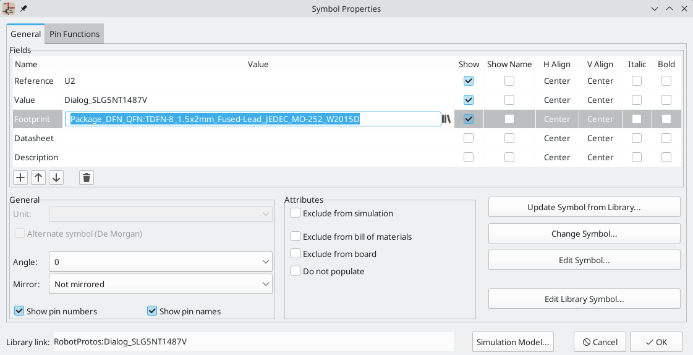
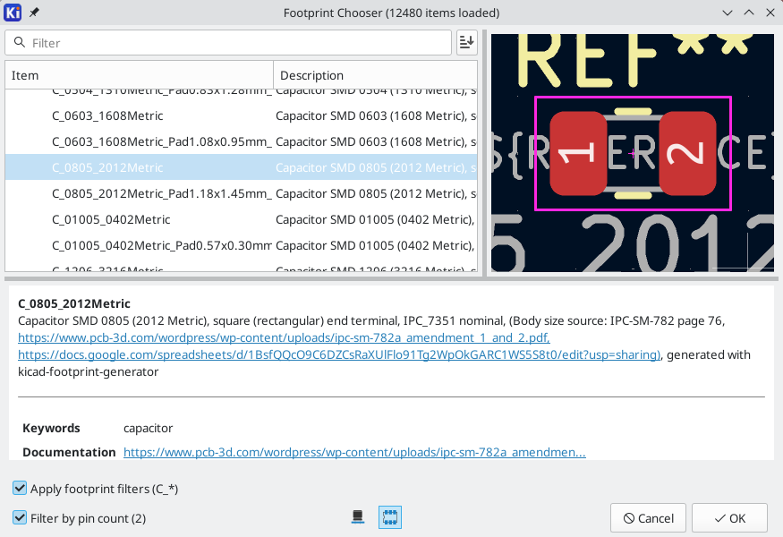
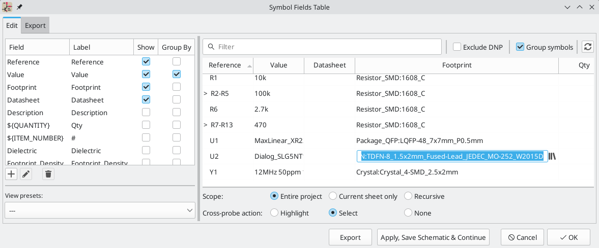
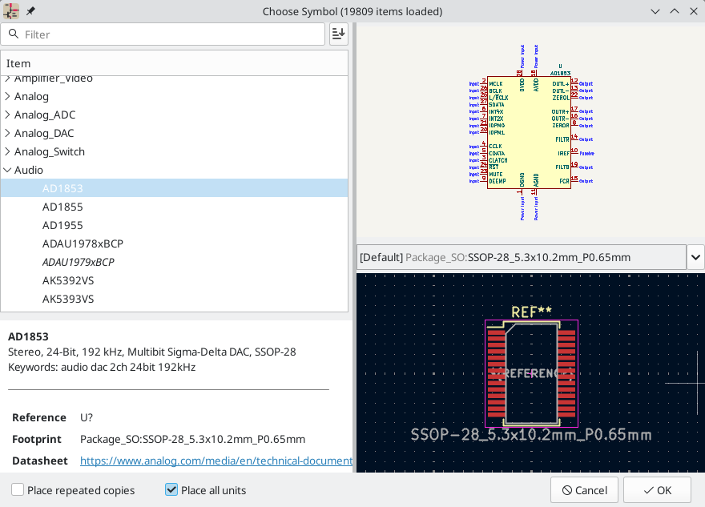
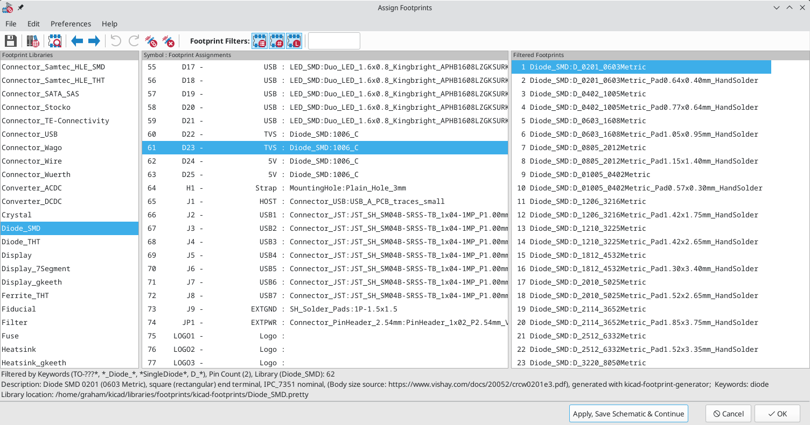
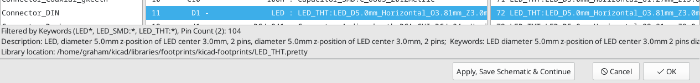
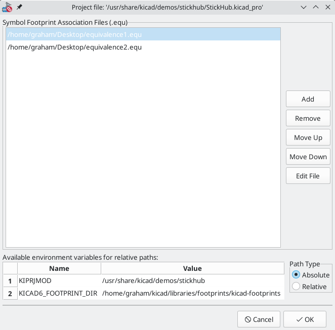
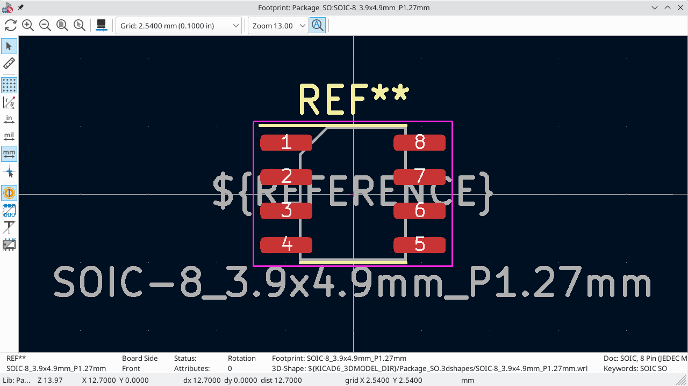
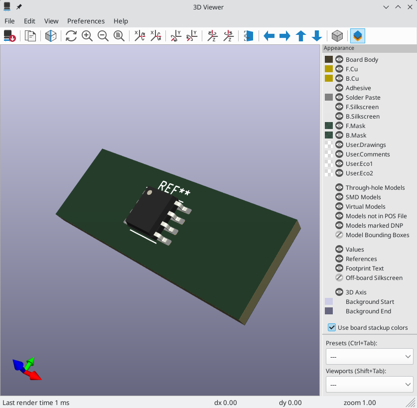

:experimental:

[[assigning-footprints]]
== Assigning Footprints

Before routing a PCB, footprints need to be selected for every component that
will be assembled on the board. Footprints define the copper connections between
physical components and the routed traces on a circuit board.

Some symbols come with footprints pre-assigned, but for many symbols there
are multiple possible footprints, so the user needs to select the appropriate
one.

KiCad offers several ways to assign footprints:

* Symbol Properties
** Symbol Properties Dialog
** Symbol Fields Table
* While placing symbols
* Footprint Assignment Tool

Each method will be explained below. Which to use is a matter of preference;
one method may be more convenient depending on the situation. All of these
methods are equivalent in that they store the name of the selected footprint in
the symbol's `Footprint` field.

NOTE: The Footprint Library Table needs to be configured before footprints can
be assigned. For information on configuring the Footprint Library Table, please
see the
xref:../pcbnew/pcbnew.adoc#managing-footprint-libraries[PCB Editor manual].

[[assigning-footprints-in-symbol-properties]]
=== Assigning Footprints in Symbol Properties

A symbol's `Footprint` field can be edited directly in the symbol's Properties window. 

Clicking the image:images/icons/small_library_16.png[library icon] button in the
`Footprint` field opens the Footprint Chooser, which shows the available
footprints sorted by footprint libraries.

The Footprint Chooser filters footprints by name, description, and keywords, as
well as any fields that are shown as columns, according to what you type into
the search field. `*` and `?` wildcards are available. The footprint search
behaves the same as in the <<placing-symbols,symbol chooser dialog>>.

If the symbol defines any <<footprint-filters,footprint filters>>,
the **apply footprint filters** option can be used to hide footprints that don't
match those filters. If the **filter by pin count** option is selected, only
footprints that match the symbol's pincount will be listed. You can choose to sort search
results alphabetically or by best match by clicking on the
image:images/icons/small_sort_desc_16.png[sort button] button. 

Single clicking a footprint name selects the footprint and displays it in the
preview pane on the right. You can switch between a 2D and 3D preview of the
footprint by clicking the 
and  buttons. Double
clicking on a footprint closes the chooser and sets the symbol's `Footprint`
field to the selected footprint.

[[assigning-footprints-with-the-symbol-fields-table]]
==== Assigning Footprints with the Symbol Fields Table

Rather than editing the properties of each symbol individually, the Symbol
Fields Table can be used to view and edit the properties of all symbols in the
design in one place. This includes assigning footprints by editing the
`Footprint` field of each symbol.

The Symbol Fields Table is accessed with **Tools** -> **Edit Symbol Fields...**,
or with the 
button on the top toolbar.

The `Footprint` field behaves the same here as in the Symbol Properties window:
it can be edited directly, or footprints can be selected visually with the
Footprint Library Browser.

For more information on the Symbol Fields Table, see the
<<symbol-fields-table,section on editing symbol properties>>.

[[assigning-footprints-while-placing-symbols]]
=== Assigning Footprints While Placing Symbols

Footprints can be assigned to symbols when the symbol is first added to the schematic.

Some symbols are defined with a default footprint. These symbols will have this
footprint preassigned when they are added to the schematic. If a symbol has a
default footprint, the footprint will be graphically previewed in the symbol
chooser dialog when the symbol is selected. For symbols without a default symbol
defined, the footprint dropdown will say "No default footprint", and the
footprint preview canvas will say "No footprint specified".

Symbols can have footprint filters that specify which footprints are appropriate
to use with that symbol. If footprint filters are defined for the selected
symbol, all footprints that match the footprint filters will appear as options
in the footprint dropdown. The selected footprint will be displayed in the
preview canvas and will be assigned to the symbol when the symbol is added to
the schematic.

NOTE: Footprint options will not appear in the footprint dropdown unless the
footprint libraries are loaded. Footprint libraries are loaded the first time
the Footprint Editor or Footprint Library Browser are opened in a session. 

For more information on footprint filters, see the
<<footprint-filters,Symbol Editor Documentation>>.

[[footprint-assignment-tool]]
=== Assigning Footprints with the Footprint Assignment Tool

The Footprint Assignment Tool allows you to associate symbols in your schematic
to footprints used when laying out the printed circuit board. It provides
footprint list filtering, footprint viewing, and 3D component model viewing to
help ensure the correct footprint is associated with each component.

Components can be assigned to their corresponding footprints manually or
automatically by creating equivalence files (.equ files). Equivalence files are
lookup tables associating each component with its footprint.

Run the tool with **Tools** -> **Assign Footprints...**, or by clicking the
 icon
in the top toolbar.

==== Footprint Assignment Tool Overview

The image below shows the main window of the Footprint Assignment Tool.

* The left pane contains the list of available footprint libraries associated with
  the project.
* The center pane contains the list of symbols in the schematic.
* The right pane contains the list of available footprints loaded from the
  project footprint libraries.
* The bottom pane describes the filters that have been applied to the footprint
  list and prints information about the footprint selected in the rightmost
  pane.

The top toolbar contains the following commands:

[width="80%",cols="10%,90%",]
|=======================================================================
|image:images/icons/save_24.png[]
|Transfer the current footprint associations to the schematic.

|
|Edit the global and project footprint library tables.

|
|View the selected footprint in the footprint viewer.

|image:images/icons/left_24.png[]
|Select the previous symbol without a footprint association.

|image:images/icons/right_24.png[]
|Select the next symbol without a footprint association.

|image:images/icons/undo_24.png[]
| Undo last edit.

|image:images/icons/redo_24.png[]
| Redo last edit.

|
|Perform automatic footprint association using an equivalence file.

|
|Delete all footprint assignments.

|image:images/icons/module_filtered_list_24.png[]
|Filter footprint list by footprint filters defined in the selected symbol.

|image:images/icons/module_pin_filtered_list_24.png[]
|Filter footprint list by pin count of the selected symbol.

|
|Filter footprint list by selected library.
|=======================================================================

The following table lists the keyboard commands for the Footprint Assignment Tool:

[width="80%",cols="15%,85%",]
|=======================================================================
|Right Arrow / Tab|Activate the pane to the right of the currently activated pane.
Wrap around to the first pane if the last pane is currently activated.

|Left Arrow |Activate the pane to the left of the currently activated
pane. Wrap around to the last pane if the first pane is currently activated.

|Up Arrow |Select the previous item of the currently selected list.

|Down Arrow |Select the next item of the currently selected list.

|Page Up |Select the item one full page upwards of the currently selected
item.

|Page Down |Select the item one full page downwards of the currently selected
item.

|Home |Select the first item of the currently selected list.

|End |Select the last item of the currently selected list.
|=======================================================================

==== Manually Assigning Footprints with the Footprint Assignment Tool

To manually associate a footprint with a component, first select a component in
the component (middle) pane. Then select a footprint in the footprint (right)
pane by double-clicking on the name of the desired footprint. The footprint will
be assigned to the selected component, and the next component without an
assigned footprint is automatically selected.

NOTE: If no footprints appear in the footprint pane, check that the
<<filtering-the-footprint-list,footprint filter options>> are correctly applied.

When all components have footprints assigned to them, click the **OK** button to
save the assignments and exit the tool. Alternatively, click **Cancel** to
discard the updated assignments, or **Apply, Save Schematic & Continue** to save
the new assignments without exiting the tool.

[[filtering-the-footprint-list]]
===== Filtering the Footprint List

There are four filtering options which restrict which footprints are displayed
in the footprint pane. The filtering options are enabled and disabled with three
buttons and a textbox in the top toolbar.

* image:images/icons/module_filtered_list_24.png[]: Activate
  <<footprint-filters,filters that can be defined in each symbol>>.
  For example, an opamp symbol might define filters that show only SOIC and DIP
  footprints.
* image:images/icons/module_pin_filtered_list_24.png[]: Only show footprints
  that match the selected symbol's pin count.
* : Only show footprints from the
  library selected in the left pane.
* Entering text in the textbox hides footprints that do not match the text. This
  filter is disabled when the box is empty.

When all filters are disabled, the full footprint list is shown.

The applied filters are described in the bottom pane of the window, along with
the number of footprints that meet the selected filters. For example, when the
symbol's footprint filters and pin count filters are enabled, the bottom pane
prints the footprint filters and pin count:

Multiple filters can be used at once to help narrow down the list of possibly
appropriate footprints in the footprint pane. The symbols in KiCad's standard
library define footprint filters that are designed to be used in combination
with the pin count filter.

[[automatically-associating-footprints-to-components]]
==== Automatically Assigning Footprints with the Footprint Assignment Tool

The Footprint Assignment Tool allows you to store footprint assignments in an
external file and load the assignments later, even in a different project. This
allows you to automatically associate symbols with the appropriate footprints.

The external file is referred to as an equivalence file, and it stores a mapping
of a symbol value to a corresponding footprint. Equivalence files typically use
the `.equ` file extension. Equivalence files are plain text files with a simple
syntax, and must be created by the user using a text editor. The syntax is
described below.

You can select which equivalence files to use by clicking **Preferences** ->
**Manage Footprint Association Files** in the Footprint Assignment Tool.

* Add new equivalence files by clicking the *Add* button.
* Remove the selected equivalence file by clicking the *Remove* button.
* Change the priority of equivalence files by clicking the *Move Up* and *Move
  Down* buttons. If a symbol's value is found in multiple equivalence files, the
  footprint from the last matching equivalence file will override earlier
  equivalence files.
* Open the selected equivalence file by clicking the *Edit File* button.
  
Relevant environment variables are shown at the bottom of the window. When the
*Relative* path option is checked, these environment variables will
automatically be used to make paths to selected equivalence files relative to
the project or footprint libraries.

Once the desired equivalence files have been loaded in the correct order,
automatic footprint association can be performed by clicking the

button in the top toolbar of the Footprint Assignment Tool.

All symbols with a value found in a loaded equivalence file will have their
footprints automatically assigned. However, symbols that already have footprints
assigned will not be updated.

[[equivalence-file-format]]
===== Equivalence File Format

Equivalence files consist of one line for each symbol value. Each line has
the following structure:

`'<symbol value>' '<footprint library>:<footprint name>'`

Each name/value must be surrounded by single quotes (`'`) and separated by one
or more spaces. Lines starting with `#` are comments.

For example, if you want all symbols with the value `LM4562` to be assigned the
footprint `Package_SO:SOIC-8_3.9x4.9_P1.27mm`, the line in the equivalence file
should be:

`'LM4562' 'Package_SO:SOIC-8_3.9x4.9_P1.27mm'`

Here is an example equivalence file:

----
#integrated circuits (smd):
'74LV14' 'Package_SO:SOIC-14_3.9x8.7mm_P1.27mm'
'EL7242C' 'Package_SO:SOIC-8_3.9x4.9_P1.27mm'
'DS1302N' 'Package_SO:SOIC-8_3.9x4.9_P1.27mm'
'LM324N' 'Package_SO:SOIC-14_3.9x8.7mm_P1.27mm'
'LM358' 'Package_SO:SOIC-8_3.9x4.9_P1.27mm'
'LTC1878' 'Package_SO:MSOP-8_3x3mm_P0.65mm'
'24LC512I/SM' 'Package_SO:SOIC-8_3.9x4.9_P1.27mm'
'LM2903M' 'Package_SO:SOIC-8_3.9x4.9_P1.27mm'
'LT1129_SO8' 'Package_SO:SOIC-8_3.9x4.9_P1.27mm'
'LT1129CS8-3.3' 'Package_SO:SOIC-8_3.9x4.9_P1.27mm'
'LT1129CS8' 'Package_SO:SOIC-8_3.9x4.9_P1.27mm'
'LM358M' 'Package_SO:SOIC-8_3.9x4.9_P1.27mm'
'TL7702BID' 'Package_SO:SOIC-8_3.9x4.9_P1.27mm'
'TL7702BCD' 'Package_SO:SOIC-8_3.9x4.9_P1.27mm'
'U2270B' 'Package_SO:SOIC-16_3.9x9.9_P1.27mm'

#regulators
'LP2985LV' 'Package_TO_SOT_SMD:SOT-23-5_HandSoldering'
----

==== Viewing the Current Footprint

The Footprint Assignment Tool contains a footprint viewer. Clicking the
 button
in the top toolbar launches the footprint viewer and shows the selected
footprint.

The top toolbar contains the following commands:

[width="90%",cols="10%,90%",]
|=======================================================================
|image:images/icons/refresh_24.png[]
|Refresh view
|image:images/icons/zoom_in_24.png[]
|Zoom in

|image:images/icons/zoom_out_24.png[]
|Zoom out

|image:images/icons/zoom_fit_in_page_24.png[]
|Zoom to fit drawing in display area

|
|Show 3D viewer
|=======================================================================

The left toolbar contains the following commands:

[width="90%",cols="10%,90%",]
|=======================================================================
|image:images/icons/cursor_24.png[]
|Use the select tool

|
|Interactively measure between two points

|image:images/icons/grid_24.png[]
|Display grid dots or lines

|image:images/icons/polar_coord_24.png[]
|Switch between polar and cartesian coordinate systems

|image:images/icons/unit_inch_24.png[]
|Use inches

|image:images/icons/unit_mil_24.png[]
|Display coordinates in mils (1/1000 of an inch)

|image:images/icons/unit_mm_24.png[]
|Display coordinates in millimeters

|image:images/icons/cursor_shape_24.png[]
|Toggle display of full-window crosshairs

|
|Toggle between drawing pads in sketch or normal mode

|image:images/icons/pad_sketch_24.png[]
|Toggle between drawing pads in normal mode or outline mode

|image:images/icons/text_sketch_24.png[]
|Toggle between drawing text in normal mode or outline mode

|
|Toggle between drawing graphic lines in normal mode or outline mode
|=======================================================================

===== Viewing the Current 3D Model
Clicking the  button opens the
footprint in the 3D model viewer.

NOTE: If a 3D model does not exist for the current footprint, only the footprint
itself will be shown in the 3D Viewer.

The 3D Viewer is described in the
xref:../pcbnew/pcbnew.adoc#threed-viewer[PCB Editor manual].

