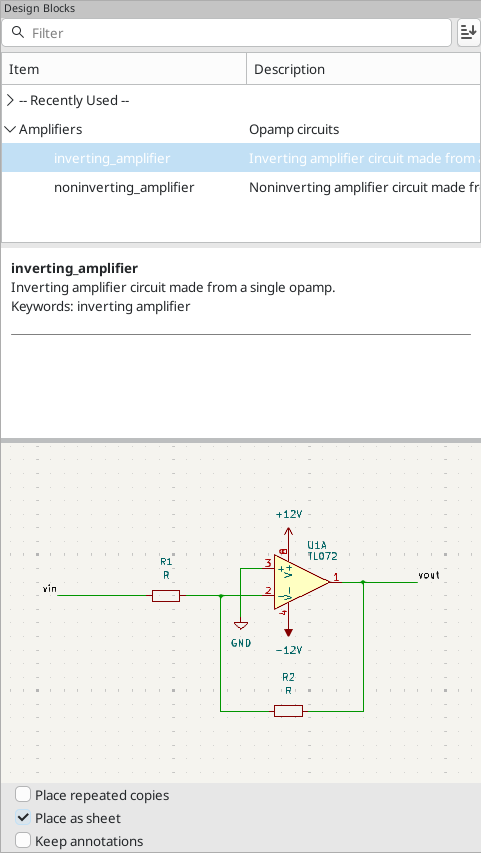
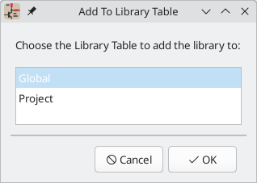
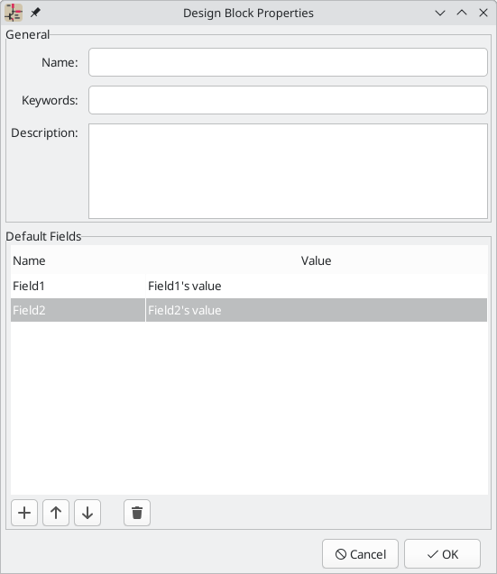

:experimental:

[[schematic-design-blocks]]
== Schematic design blocks

Schematic design blocks allow you to save a portion of a schematic and reuse it
later. You can reuse design blocks within the same schematic or in different
schematics. Design blocks are saved and organized in design block libraries,
much like symbols and footprints. When you use a design block, the saved
schematic fragment is inserted into the current schematic, either in the current
sheet or in a new subsheet.

To use schematic design blocks, first show the Design Blocks panel by clicking
**View** -> **Panels** -> **Design Blocks**. This opens a docked panel on the
right side of the schematic editor. To close the panel, use the same menu entry
or right click in the panel and choose **Hide Library Tree**.

=== Using design blocks in a schematic

The Design Blocks panel contains a library tree that lists your design block
libraries and the design blocks contained in each library. Each library can be
expanded or collapsed to show or hide the design blocks in that library. There
is a **Recently Used** pseudo-library at the top of the tree that contains any
design blocks that you have recently placed. You can pin any libraries to the
top of the list by right clicking the library and selecting **Pin Library**.

You can filter design blocks by their name, description, and keywords using the
filter textbox at the top of the Design Blocks panel. By default, matches are
sorted by best match, but you can change to sorting alphabetically using the
 button.

When you select a design block in the library tree, the design block's name and
metadata are displayed below the library tree along with a graphical preview of
the design block. The metadata includes the block's description and keywords.

To add a design block to the schematic, double click it in the library tree or
right click a design block and select **Place Design Block**.

If the **Place as sheet** checkbox is enabled, you will need to click twice in
the editing canvas to place two corners of a
<<hierarchical-sheets,hierarchical sheet>>. The design block contents will be
placed in the new sheet. If the **Place as sheet** checkbox is not enabled,
clicking once in the canvas will place the contents of the design block directly
into the current schematic.

If the **Place repeated copies** checkbox is enabled, KiCad will begin placing
the design block again when you finish placing the previous block. To cancel
placing the next block, press kbd:[Esc] or right click and select **Cancel**.

If the **Keep annotations** checkbox is enabled, KiCad will insert the design
block without changing the symbol annotations as defined in the saved design
block. If it is not enabled, KiCad will reset the symbol annotations while
inserting the design block and reannotate all of the symbols in the block
according to the current annotation settings.

Once placed in a schematic, the contents of a design block behave the same as
any other schematic objects and can be edited, moved, deleted, etc. exactly as
if they were added to the schematic normally.

=== Saving and managing design blocks

Design blocks are saved in design block libraries, so you need to add a library
before you can save any design blocks. To create a new library, right click in
the library tree and select **New Library...**. At this point you must choose
whether the new library should be added to the global design block library table
or the project design block library table. Libraries in the global library table
will be available to all projects, while libraries in the project library table
will only be available in the current project.

NOTE: The global and project design block library tables are managed using
      **Preferences** -> **Manage Design Block Libraries...**. This includes
      deleting and renaming design block libraries. The design block library
      tables behave in the same way as the symbol library tables. For more
      information about managing library tables, see the
      <<managing-symbol-libraries,symbol library table documentation>>.

Following selection of the library table, you must choose a name and location
for the new library. A new, empty library will be created at the specified
location.

After creating the desired design block library, you can create new design blocks
and save them in the library. Design blocks can be created either from the entire
contents of a schematic sheet or from a selection of schematic objects. To
create and save a new design block, select the desired source objects, either by
opening the desired sheet or selecting the objects in the editing canvas. Then
right click the design block library that will contain the block and select
**Save Current Sheet as Design Block...** or **Save Selection as Design Block**
as appropriate.

This brings up the Design Block Properties dialog, where you can edit the
properties of the new design block.

* **Name**: this is the name of the new design block, which is shown in the
  library tree and the preview pane. It is also used when filtering design
  blocks with the filter textbox. When design blocks are added to a schematic
  as a sheet, this is the default name of the new sheet.
* **Keywords**: these are space-separated keywords describing the design block.
  They are displayed in the design block preview pane and used when filtering
  design blocks with the filter textbox.
* **Description**: this is a description of the design block, which is shown in
  the library tree and the preview pane. It is also used when filtering design
  blocks with the filter textbox.
* **Default Fields**: these are key/value pairs which are included as
  <<hierarchical-sheets,hierarchical sheet fields>> when the design block is
  placed as a sheet. Fields are ignored when the design block is not placed as a
  sheet.

You can edit a design block's properties after creating it by right clicking
the design block in the design block library tree and selecting
**Properties...**.

