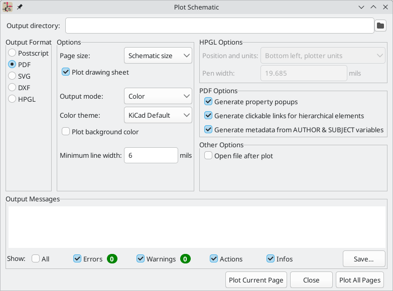
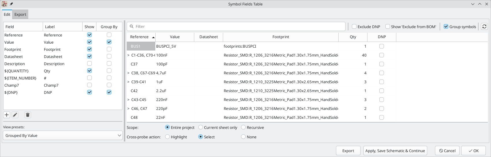

:experimental:

[[generating-outputs]]
== Generating Outputs

=== Printing

KiCad can print the schematic to a standard printer using **File**->**Print...**.

==== Printing options

**Print drawing sheet:** Include the drawing sheet border and
title block in the printed schematic.

**Output mode:** Print the schematic in color or black and white.

**Print background color:** Include the background color in the printed
schematic. This option is only enabled if **Print in black and white only** is
disabled.

**Use a different color theme for printing:** Select a different color scheme
for printing than the one selected for display in the Schematic Editor.

**Page Setup...:** Opens a page setup dialog for setting paper size and
orientation.

**Preview:** Opens a print preview dialog.

**Close:** Closes the dialog without printing.

**Print:** Opens the system print dialog.

NOTE: Printing uses platform- and printer-specific drivers and may have
unexpected results. When printing to a file, *Plotting* is recommended instead
of *Printing*.

=== Plotting

KiCad can plot schematics to a file using **File** -> **Plot...**. 

The supported output formats are Postscript, PDF, SVG, DXF, and HPGL. 

The **Output Messages** pane displays messages about the generated files.
Different kinds of messages can be shown or hidden using the checkboxes, and the
messages can be saved to a file using the **Save...** button.

The **Plot Current Page** button plots the current page of the schematic. The
**Plot All Pages** button plots all pages of the schematic. One file is
generated for each page, except for PDF output, which plots each schematic page
as a separate page in a single PDF file.

==== Plotting options

**Output directory:** Specify the location to save plotted files. If this is a
relative path, it is created relative to the project directory.

**Output Format:** Select the format to plot in. Some formats have different
options than others.

**Page size:** Sets the page size to use for the plotted output. This can be set
to match the schematic size or to another sheet size.

**Plot drawing sheet:** Include the drawing sheet border and title block in the
printed schematic.

**Output mode:** Sets the output to color or black and white. Not all output
formats support color.

**Color theme:** Selects the color theme to use for the plotted output.

**Plot background color:** Includes the schematic background color in the
plotted output. The background color will not be plotted if the output format
does not support color or the output mode is black and white.

**Minimum line width:** Selects the minimum width for lines.

**Position and units:** Sets the plotter origin and units. This option only
applies for HPGL output.

**Pen width:** Sets the plotter's pen width. This option only applies for HPGL output.

**Generate property popups:** Enables or disables the interactive PDF features
described below. This option only applies for PDF output.

**Open file after plot:** automatically opens the plotted output file when
plotting is complete.

==== Interactive PDF features

Plotted PDFs can optionally have several interactive features.

* Hyperlinks can be clicked.
* The table of contents is populated with schematic sheets as well as the
  symbols and hierarchical labels in each sheet.
* Clicking on many schematic elements displays a popup menu containing relevant
  information.
  ** Symbols display their symbol fields.
  ** Hierarchical subsheets display their sheetname and filename, as well as an
     option to enter the sheet itself.
  ** Labels display the resolved net and netclass.
  ** Buses display their members.

NOTE: Some of these features are not supported in all PDF readers.

[[bom-export]]
=== Generating a bill of materials

KiCad can generate a bill of materials that lists all of the components in the
design. BOMs are configurable: you can select which components are included, how
components are ordered, which symbol fields are included and in what order, and
what the output format is.

BOMs are exported using the <<symbol-fields-table,Symbol Fields Table>>. As a
shortcut to open the **Export** tab of this dialog, you can select **Tools** ->
**Generate Bill of Materials...** or use the
 button on the top toolbar.

The contents of the BOM are configured in the **Edit** tab. The format of the
exported BOM file is configured in the **Export** tab. The BOM is written when
you press the **Export** button at the bottom of the dialog.

==== BOM contents

The exported BOM will contain exactly the components (rows) and fields (columns)
shown in the **Edit** tab, with the same grouping and sorting. Components with
the **Exclude from BOM** attribute set are shown in the **Edit** tab but will
not be included in the BOM export. Components with the DNP (do not populate)
attribute set can be optionally excluded from both the table in the **Edit** tab
and the exported BOM by checking the **Exclude DNP** box. You can also limit the
displayed components to those in the current sheet, the current sheet and all of
its subsheets, or the entire schematic.

Fields with the **Show** box checked will be included as columns in the BOM, and
fields with the **Group By** box checked are used to group components together.
Components are grouped into the same line if all of their **Group By** fields
are identical and the **Group symbols** box is checked. You can set an arbitrary
column name for each field and reorder columns by dragging their headers.

Presets are available to configure the list of fields. Presets store which
fields are displayed, which fields are used for grouping, and the column order.
You can create and save your own presets or use one of several default presets.
Custom presets can be deleted in this dialog or in the
<<schematic-setup,Schematic Setup>> dialog.

The built-in presets "Grouped By Value" and "Grouped By Value and Footprint"
replicate <<legacy-bom-export,legacy BOM scripts>>, while "Attributes" shows
only the reference and value fields and the DNP, exclude from board, exclude
from simulation, and exclude from BOM attributes.

Some virtual fields are available that may be useful in BOM exports. Adding a
field in the Symbol Fields Table beginning with a
<<text-variables,text variable>> will not create a new field in the symbols, but
will create a special column in the table and BOM with auto-generated values for
each component. The following variables may be especially useful for creating
virtual fields in custom BOM formats:

* `${QUANTITY}` creates a field that contains the number of grouped instances
  of that component.
* `${ITEM_NUMBER}` creates a field that contains the row number of the component 
  in the BOM.
* `${SYMBOL_NAME}` creates a field that contains the name of the schematic
  symbol.
* `${SYMBOL_LIBRARY}` creates a field that contains the name of the schematic
  symbol library.
* `${DNP}` creates a field with a checkbox that controls the component's DNP
  attribute. In the BOM, this field resolves to the string "DNP" if the
  component's DNP attribute is set, or an empty string otherwise.
* `${EXCLUDE_FROM_BOARD}` creates a field with a checkbox that controls the
  component's exclude from board attribute. In the BOM, this field resolves to
  the string "Excluded from board" if the component's exclude from board
  attribute is set, or an empty string otherwise.
* `${EXCLUDE_FROM_SIM}` creates a field with a checkbox that controls the
  component's exclude from simulation attribute. In the BOM, this field resolves
  to the string "Excluded from simulation" if the component's exclude from
  simulation attribute is set, or an empty string otherwise.
* `${EXCLUDE_FROM_BOM}` creates a field with a checkbox that controls the
  component's exclude from BOM attribute. Components with the exclude from BOM
  attribute set are not included in the BOM.

Other text variables are also available.

The full functionality of the **Edit** tab, including virtual field behavior, is
explained in more detail in the
<<symbol-fields-table,Symbol Fields Table documentation>>.

==== BOM format

The **Export** tab contains settings concerning the output file format for the
BOM and displays a preview of the raw BOM file output.

At the top you can specify the output file. Pressing the **Export** button will
write the BOM to this file path. This path can contain
<<text-variables,text variables>>.

The settings on the left control how the BOM information is formatted in the
file. You can change the delimiter between fields, the delimiter that surrounds
each field, the delimiter that separates a sequence of references (e.g. the
comma in `R1,R3`), and the delimiter for a range of references (e.g. the dash in
`R1-R3`). If no range delimiter is given, ranges will not be used: `R1-R3` will
be written out as `R1,R2,R3`, for example, assuming `,` as a reference
delimiter. Tabs and newlines in fields can be preserved or stripped, depending
on the **Keep tabs** and **Keep line breaks** settings.

Several default format presets are available. You can select a comma-separated
value (CSV) format, a tab-separated value (TSV) format, or a semicolon-separated
format. You can also create and save your own presets. Custom presets can be
deleted in this dialog or in the <<schematic-setup,Schematic Setup>> dialog.

[[legacy-bom-export]]
==== Legacy BOM generation

Previous versions of KiCad used external scripts to process the design
information into the desired output format. This BOM generation tool is still
available by selecting **Tools** -> **Generate Legacy Bill of Materials...**.

image::images/en/dialog_bom.png[alt="BOM dialog",scaledwidth="60%"]

Several BOM generator scripts are included with KiCad, and users can also create
their own. BOM generator scripts generally use Python or XSLT, but other tools
can be used as long as you can specify a <<generator-command-line-format,command
line>> for KiCad to execute when running the generator.

You can select which BOM generator to use in the *BOM generator scripts* list.
The rest of the dialog displays information about the selected generator. You
can change the displayed name of the generator with the *Generator nickname*
textbox.

The pane at right displays information about the selected script. When the
generator is executed, the right pane instead displays output from the script.

The text box at the bottom contains the command that KiCad will use to execute
the generator. It is automatically populated when a script is selected, but the
command may need to be hand-edited for some generators. KiCad saves the command
line for each generator when the BOM tool is closed, so command line
customizations are preserved. For more details about the command line, see the
<<generator-command-line-format,advanced documentation>>.

On Windows, the BOM Generator dialog has an additional option *Show console
window*. When this option is unchecked, BOM generators run in a hidden console
window and any output is redirected and printed in the dialog. When this option
is checked, BOM generators run in a visible console window, which may be
necessary if the generator plugin provides a graphical user interface.

===== BOM generator scripts

By default, the legacy BOM tool presents three output script options.

* `bom_csv_grouped_extra` outputs a CSV with a single section containing every
  component in the design. Components are grouped by value, footprint, DNP (do
  not populate), and any additional fields that are specified on the command
  line. To specify extra fields, add the desired field names as quoted strings
  at the end of the command line. For example, to include the `MPN` field, the
  end of the command line would be: `<path to script>/bom_csv_grouped_extra.py
  "%I" "%O.csv" "MPN"`. The columns in the BOM are:

  ** Line item number
  ** Reference designator(s)
  ** Quantity
  ** Value
  ** Footprint
  ** DNP
  ** Specified extra fields

* `bom_csv_grouped_by_value` outputs a CSV with two sections. The first section
  contains every component in the design, with a single component on each line.
  The second section also contains every component, but components are grouped
  by symbol name, value, footprint, and DNP (do not populate). The columns in
  the BOM are: 
  
  ** Line item number
  ** Quantity
  ** Reference designator(s)
  ** Value
  ** Symbol library and symbol name
  ** Footprint
  ** Datasheet
  ** DNP
  ** Any other symbol fields

* `bom_csv_grouped_by_value_with_fp` outputs a CSV with a single section
  containing every component in the design. Components are grouped by value,
  footprint, and DNP (do not populate). The columns in the BOM are:

  ** Reference designator(s)
  ** Quantity
  ** Value
  ** Symbol name
  ** Footprint
  ** Symbol description
  ** Vendor
  ** DNP

Additional generator scripts are installed with KiCad but are not populated in
the generator script list by default. The location of these scripts depends on
the operating system and may vary based on installation location.

[options="header",cols="30%,70%"]
|===
|Operating System |Location
|Windows |`C:\Program Files\KiCad\8.0\bin\scripting\plugins\`
|Linux |`/usr/share/kicad/plugins/`
|macOS |`/Applications/KiCad/KiCad.app/Contents/SharedSupport/plugins/`
|===

Additional scripts can be added to the list of BOM generator scripts by clicking
the image:images/icons/small_plus_16.png[Plus icon] button. Scripts can be
removed by clicking the image:images/icons/small_trash_16.png[Delete icon]
button. The  button opens the
selected script in a text editor.

For more information on creating and using custom BOM generators, see the
<<custom-netlist-and-bom-formats,advanced documentation>>.

==== BOM export from PCB editor

The PCB Editor can export a BOM through **File** -> **Fabrication Outputs** ->
**BOM...**. This method provides no control over the output format and does
not include all symbol information, but is useful for PCB-only workflows that do
not involve a schematic. In general, it is recommended to use the schematic
editor's BOM export tool instead.

[[netlist-export]]
=== Generating a Netlist

A netlist is a file which describes electrical connections between symbol pins.
These connections are referred to as nets. Netlist files contain:

* A list of symbols and their pins.
* A list of connections (nets) between symbol pins.

Many different netlist formats exist. Sometimes the symbols list and the
list of nets are two separate files. This netlist is fundamental in the
use of schematic capture software, because the netlist is the link with
other electronic CAD software, such as PCB layout software, simulators, and
programmable logic compilers.

KiCad supports several netlist formats:

* KiCad format, which can be imported by the KiCad PCB Editor. However,
  the <<eeschema_schematic_to_pcb.adoc#schematic-to-pcb,"Update PCB from Schematic">>
  tool should be used instead of importing a KiCad netlist into the PCB editor.
* OrCAD PCB2 format, for designing PCBs with OrCAD.
* CADSTAR format, for designing PCBs with CADSTAR.
* Spice format, for use with various external circuit simulators.

NOTE: In KiCad version 5.0 and later, it is not necessary to create a netlist
      for transferring a design from the schematic editor to the PCB editor.
      Instead, use the
      <<eeschema_schematic_to_pcb.adoc#schematic-to-pcb,"Update PCB from Schematic">> tool.

NOTE: Other software tools that use netlists may have restrictions on spaces and
      special characters in component names, pins, nets, and other fields. For
      compatibility, be aware of such restrictions in other tools you plan to
      use, and name components, nets, etc. accordingly.

[[netlist-formats]]
==== Netlist formats

Netlists are exported with the Export Netlist dialog (**File**->**Export**->**Netlist...**).

KiCad supports exporting netlists in several formats: KiCad, OrcadPCB2, CADSTAR,
Spice, and Spice Model. Each format can be selected by selecting the
corresponding tab at the top of the window. Some netlist formats have additional
options.

Clicking the **Export Netlist** button prompts for a netlist filename and saves
the netlist.

[NOTE]
Netlist generation can take up to several minutes for large schematics.

Custom generators for other netlist formats can be added by clicking the **Add
Generator...** button. Custom generators are external tools that are called by
KiCad, for example Python scripts or XSLT stylesheets. For more information on
custom netlist generators, see
<<custom-netlist-and-bom-formats,the section on adding custom netlist generators>>.

===== Spice Netlist Format

The Spice netlist format offers several options.

When the **use current sheet as root** is selected, only the current sheet is
exported to a subcircuit model. Otherwise, the entire schematic sheet is
exported.

The **save all voltages** option adds a `.save all` command to the netlist,
which causes the simulator to save all node voltages. The **save all currents**
option adds a `.probe alli` command to the netlist, which causes the simulator
save all node currents. The **save all power dissipations** adds `.probe`
commands to save the power dissipation in each component.

NOTE: Exact behavior may vary between simulation tools.

Passive symbol values are automatically adjusted to be compatible with various
Spice simulators. Specifically:

* `&mu;` and `M` as unit prefixes are replaced with `u` and `Meg`, respectively
* Units are removed (e.g. `4.7k&ohm;` is changed to `4.7k`)
* Values in RKM format are rewritten to be Spice-compatible (e.g. `4u7` is
  changed to `4.7u`)

The Spice netlist exporter also provides an easy way to simulate the generated
netlist with an external simulator. This can be useful for running a simulation
without using <<simulator,KiCad's internal ngspice simulator>>,
or for running an ngspice simulation with options that are not supported by
KiCad's simulator tool.

Enter the path to the external simulator in the text box, with `%I` representing
the generated netlist. Check the **run external simulator command** box to
generate the netlist and automatically run the simulator.

NOTE: The default simulator command (`spice "%I"`) must be adjusted to point to
      a simulator installed on your system.

Spice simulators expect simulation commands (`.PROBE`, `.AC`, `.TRAN`, etc.) to
be included in the netlist. Any text line included in the schematic diagram
starting with a period (`.`) will be included in the netlist. If a text object
contains multiple lines, only the lines beginning with a period will be
included.

`.include` directives for including model library files are automatically
added to the netlist based on the Spice model settings for the symbols in
the schematic.

===== Spice Model Netlist Format

KiCad can also export a netlist of the schematic as a Spice subcircuit model,
which can be included in a separate Spice simulation. Any hierarchical labels in
the schematic are used as pins for the subcircuit model. Each pin in the model
is annotated with a comment describing the pin's electrical direction:

* `Input` hierarchical labels are mapped to an `input` annotation
* `Output` hierarchical labels are mapped to an `output` annotation
* `Bidirectional` hierarchical labels are mapped to an `inout` annotation
* `Tri-state` hierarchical labels are mapped to a `tristate` annotation
* `Passive` hierarchical labels are mapped to a `passive` annotation

When the **use current sheet as root** is selected, only the current sheet is
exported to a subcircuit model. Otherwise, the entire schematic sheet is
exported.

[[netlist-examples]]
==== Netlist examples

Below is the schematic from the `sallen_key` project included in KiCad's
simulation demos.

The KiCad format netlist for this schematic is as follows:

----
(export (version "E")
  (design
    (source "/usr/share/kicad/demos/simulation/sallen_key/sallen_key.kicad_sch")
    (date "Sun 01 May 2022 03:14:05 PM EDT")
    (tool "Eeschema (6.0.4)")
    (sheet (number "1") (name "/") (tstamps "/")
      (title_block
        (title)
        (company)
        (rev)
        (date)
        (source "sallen_key.kicad_sch")
        (comment (number "1") (value ""))
        (comment (number "2") (value ""))
        (comment (number "3") (value ""))
        (comment (number "4") (value ""))
        (comment (number "5") (value ""))
        (comment (number "6") (value ""))
        (comment (number "7") (value ""))
        (comment (number "8") (value ""))
        (comment (number "9") (value "")))))
  (components
    (comp (ref "C1")
      (value "100n")
      (libsource (lib "sallen_key_schlib") (part "C") (description ""))
      (property (name "Sheetname") (value ""))
      (property (name "Sheetfile") (value "sallen_key.kicad_sch"))
      (sheetpath (names "/") (tstamps "/"))
      (tstamps "00000000-0000-0000-0000-00005789077d"))
    (comp (ref "C2")
      (value "100n")
      (fields
        (field (name "Fieldname") "Value")
        (field (name "SpiceMapping") "1 2")
        (field (name "Spice_Primitive") "C"))
      (libsource (lib "sallen_key_schlib") (part "C") (description ""))
      (property (name "Fieldname") (value "Value"))
      (property (name "Spice_Primitive") (value "C"))
      (property (name "SpiceMapping") (value "1 2"))
      (property (name "Sheetname") (value ""))
      (property (name "Sheetfile") (value "sallen_key.kicad_sch"))
      (sheetpath (names "/") (tstamps "/"))
      (tstamps "00000000-0000-0000-0000-00005789085b"))
    (comp (ref "R1")
      (value "1k")
      (fields
        (field (name "Fieldname") "Value")
        (field (name "SpiceMapping") "1 2")
        (field (name "Spice_Primitive") "R"))
      (libsource (lib "sallen_key_schlib") (part "R") (description ""))
      (property (name "Fieldname") (value "Value"))
      (property (name "SpiceMapping") (value "1 2"))
      (property (name "Spice_Primitive") (value "R"))
      (property (name "Sheetname") (value ""))
      (property (name "Sheetfile") (value "sallen_key.kicad_sch"))
      (sheetpath (names "/") (tstamps "/"))
      (tstamps "00000000-0000-0000-0000-0000578906ff"))
    (comp (ref "R2")
      (value "1k")
      (fields
        (field (name "Fieldname") "Value")
        (field (name "SpiceMapping") "1 2")
        (field (name "Spice_Primitive") "R"))
      (libsource (lib "sallen_key_schlib") (part "R") (description ""))
      (property (name "Fieldname") (value "Value"))
      (property (name "SpiceMapping") (value "1 2"))
      (property (name "Spice_Primitive") (value "R"))
      (property (name "Sheetname") (value ""))
      (property (name "Sheetfile") (value "sallen_key.kicad_sch"))
      (sheetpath (names "/") (tstamps "/"))
      (tstamps "00000000-0000-0000-0000-000057890691"))
    (comp (ref "U1")
      (value "AD8051")
      (fields
        (field (name "Spice_Lib_File") "ad8051.lib")
        (field (name "Spice_Model") "AD8051")
        (field (name "Spice_Netlist_Enabled") "Y")
        (field (name "Spice_Primitive") "X"))
      (libsource (lib "sallen_key_schlib") (part "Generic_Opamp") (description ""))
      (property (name "Spice_Primitive") (value "X"))
      (property (name "Spice_Model") (value "AD8051"))
      (property (name "Spice_Lib_File") (value "ad8051.lib"))
      (property (name "Spice_Netlist_Enabled") (value "Y"))
      (property (name "Sheetname") (value ""))
      (property (name "Sheetfile") (value "sallen_key.kicad_sch"))
      (sheetpath (names "/") (tstamps "/"))
      (tstamps "00000000-0000-0000-0000-00005788ff9f"))
    (comp (ref "V1")
      (value "AC 1")
      (libsource (lib "sallen_key_schlib") (part "VSOURCE") (description ""))
      (property (name "Sheetname") (value ""))
      (property (name "Sheetfile") (value "sallen_key.kicad_sch"))
      (sheetpath (names "/") (tstamps "/"))
      (tstamps "00000000-0000-0000-0000-000057336052"))
    (comp (ref "V2")
      (value "DC 10")
      (fields
        (field (name "Fieldname") "Value")
        (field (name "Spice_Node_Sequence") "1 2")
        (field (name "Spice_Primitive") "V"))
      (libsource (lib "sallen_key_schlib") (part "VSOURCE") (description ""))
      (property (name "Fieldname") (value "Value"))
      (property (name "Spice_Primitive") (value "V"))
      (property (name "Spice_Node_Sequence") (value "1 2"))
      (property (name "Sheetname") (value ""))
      (property (name "Sheetfile") (value "sallen_key.kicad_sch"))
      (sheetpath (names "/") (tstamps "/"))
      (tstamps "00000000-0000-0000-0000-0000578900ba"))
    (comp (ref "V3")
      (value "DC 10")
      (fields
        (field (name "Fieldname") "Value")
        (field (name "Spice_Node_Sequence") "1 2")
        (field (name "Spice_Primitive") "V"))
      (libsource (lib "sallen_key_schlib") (part "VSOURCE") (description ""))
      (property (name "Fieldname") (value "Value"))
      (property (name "Spice_Primitive") (value "V"))
      (property (name "Spice_Node_Sequence") (value "1 2"))
      (property (name "Sheetname") (value ""))
      (property (name "Sheetfile") (value "sallen_key.kicad_sch"))
      (sheetpath (names "/") (tstamps "/"))
      (tstamps "00000000-0000-0000-0000-000057890232")))
  (libparts
    (libpart (lib "sallen_key_schlib") (part "C")
      (footprints
        (fp "C?")
        (fp "C_????_*")
        (fp "C_????")
        (fp "SMD*_c")
        (fp "Capacitor*"))
      (fields
        (field (name "Reference") "C")
        (field (name "Value") "C"))
      (pins
        (pin (num "1") (name "") (type "passive"))
        (pin (num "2") (name "") (type "passive"))))
    (libpart (lib "sallen_key_schlib") (part "Generic_Opamp")
      (fields
        (field (name "Reference") "U")
        (field (name "Value") "Generic_Opamp"))
      (pins
        (pin (num "1") (name "+") (type "input"))
        (pin (num "2") (name "-") (type "input"))
        (pin (num "3") (name "V+") (type "power_in"))
        (pin (num "4") (name "V-") (type "power_in"))
        (pin (num "5") (name "") (type "output"))))
    (libpart (lib "sallen_key_schlib") (part "R")
      (footprints
        (fp "R_*")
        (fp "Resistor_*"))
      (fields
        (field (name "Reference") "R")
        (field (name "Value") "R"))
      (pins
        (pin (num "1") (name "") (type "passive"))
        (pin (num "2") (name "") (type "passive"))))
    (libpart (lib "sallen_key_schlib") (part "VSOURCE")
      (fields
        (field (name "Reference") "V")
        (field (name "Value") "VSOURCE")
        (field (name "Fieldname") "Value")
        (field (name "Spice_Primitive") "V")
        (field (name "Spice_Node_Sequence") "1 2"))
      (pins
        (pin (num "1") (name "") (type "input"))
        (pin (num "2") (name "") (type "input")))))
  (libraries
    (library (logical "sallen_key_schlib")
      (uri "/usr/share/kicad/demos/simulation/sallen_key/sallen_key_schlib.kicad_sym")))
  (nets
    (net (code "1") (name "/lowpass")
      (node (ref "C1") (pin "1") (pintype "passive"))
      (node (ref "U1") (pin "2") (pinfunction "-") (pintype "input"))
      (node (ref "U1") (pin "5") (pintype "output")))
    (net (code "2") (name "GND")
      (node (ref "C2") (pin "2") (pintype "passive"))
      (node (ref "V1") (pin "2") (pintype "input"))
      (node (ref "V2") (pin "2") (pintype "input"))
      (node (ref "V3") (pin "1") (pintype "input")))
    (net (code "3") (name "Net-(C1-Pad2)")
      (node (ref "C1") (pin "2") (pintype "passive"))
      (node (ref "R1") (pin "1") (pintype "passive"))
      (node (ref "R2") (pin "2") (pintype "passive")))
    (net (code "4") (name "Net-(C2-Pad1)")
      (node (ref "C2") (pin "1") (pintype "passive"))
      (node (ref "R2") (pin "1") (pintype "passive"))
      (node (ref "U1") (pin "1") (pinfunction "+") (pintype "input")))
    (net (code "5") (name "Net-(R1-Pad2)")
      (node (ref "R1") (pin "2") (pintype "passive"))
      (node (ref "V1") (pin "1") (pintype "input")))
    (net (code "6") (name "VDD")
      (node (ref "U1") (pin "3") (pinfunction "V+") (pintype "power_in"))
      (node (ref "V2") (pin "1") (pintype "input")))
    (net (code "7") (name "VSS")
      (node (ref "U1") (pin "4") (pinfunction "V-") (pintype "power_in"))
      (node (ref "V3") (pin "2") (pintype "input")))))
----

In Spice format, the netlist is as follows:

----
.title KiCad schematic
.include "ad8051.lib"
XU1 Net-_C2-Pad1_ /lowpass VDD VSS /lowpass AD8051
C2 Net-_C2-Pad1_ GND 100n
C1 /lowpass Net-_C1-Pad2_ 100n
R2 Net-_C2-Pad1_ Net-_C1-Pad2_ 1k
R1 Net-_C1-Pad2_ Net-_R1-Pad2_ 1k
V1 Net-_R1-Pad2_ GND AC 1
V2 VDD GND DC 10
V3 GND VSS DC 10
.ac dec 10 1 1Meg
.end
----
