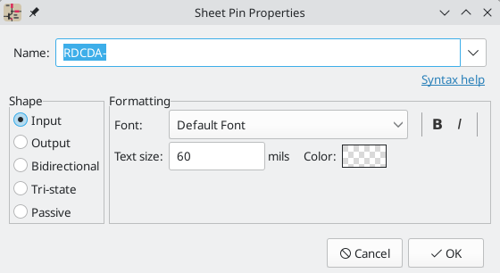

:experimental:

[[hierarchical-schematics]]
== Hierarchical schematics

=== Introduction

In KiCad, multi-sheet schematics are hierarchical: there is a single root sheet,
and additional sheets are created as subsheets of either the root sheet or
another subsheet. Sheets can be included in a hierarchy multiple times, if
desired.

Carefully drawing a schematic as a hierarchical design improves schematic
legibility and reduces repetitive drawing.

Creating a hierarchical schematic starts from the root sheet. The process is to
create a subsheet, then draw the circuit in the subsheet and make the necessary
electrical connections between sheets. Connections can be made between nets in a
subsheet and nets in the parent sheet using hierarchical pins and labels, or
between any two nets in the hierarchy using global labels.

=== Adding sheets to a design

You can add a subsheet to a design with the Add Hierarchical Sheet tool
(kbd:[S] hotkey, or the
image:images/icons/add_hierarchical_subsheet_24.png[Add Hierarchical Sheet icon]
button in the right toolbar). Launch the tool, then click twice in the canvas to
draw the upper left and lower right corners of the subsheet symbol. Make the
sheet outline large enough to fit the
<<hierarchical-sheet-pins,hierarchical pins you will add later>>.

The Sheet Properties dialog will appear and prompt you for a sheet name and
filename.

The *sheet name* must be unique, as it is used in the full net name for any nets
in the subsheet. For example, a net with the local label `net1` in the sheet
`sheet1` would have a full net name of `/sheet1/net1`. The sheet name is also
used to refer to the sheet in various places in the GUI, including the
<<sheet-title-block,title block>> and the
<<navigating-between-sheets,hierarchy navigator>>.

The *sheet file* specifies the file that the new sheet will be saved to or
loaded from. The path to the sheet file can be relative or absolute. It is
usually preferable to save subsheet files in the project directory and use a
relative path so that the project is portable.

A single sheet file can be used more than once in a project by
specifying the same filename for each repeated sheet; the circuit drawn in the
sheet will be instantiated once per usage, and any edits in once instance will
be reflected in the other instances. 

NOTE: Sheet files can be shared between multiple projects to allow design reuse
between projects. However, this is not recommended due to path portability
concerns and the risk of unintentionally changing other projects while editing a
shared sheet.

The sheet's *page number* is configurable here. The page number is displayed in
the sheet <<sheet-title-block,title block>> and the
<<navigating-between-sheets,hierarchy navigator>>, and sheets are sorted by page
number in the hierarchy navigator and when
<<generating-outputs,printing or plotting>>.

Several graphical options are also available. *Border width* sets the width of
the border around the sheet shape. *Border color* and *Background fill* set the
color for the border and fill of the sheet shape, respectively. If no color is
set, a checkerboard swatch is shown and the default values from the color theme
are used.

Sheets support arbitrary custom fields, which can be added and removed with the
 and
image:images/icons/small_trash_16.png[trash icon] buttons, respectively. Sheet
fields can be optionally displayed on the schematic by checking their **Show**
box, and they can be accessed from inside the sheet or in other sheet fields
using <<text-variables,text variables>>.

The Sheet Properties dialog can be accessed at any time by selecting a sheet
symbol and using the kbd:[E] hotkey, or by right-clicking on a sheet symbol and
selecting **Properties...**.

[[navigating-between-sheets]]
=== Navigating between sheets

You can enter a hierarchical sheet from the parent sheet by double-clicking the
child sheet's shape, or right-clicking the child sheet and selecting **Enter
Sheet**. 

Return to the parent sheet by using the
 button in the top toolbar, or by
right-clicking in an empty part of the schematic and clicking **Leave Sheet**.

You can jump to the next sheet with the
 button, or to the previous
sheet with the image:images/icons/left_24.png[left arrow icon] button.

Alternatively, you can jump to any sheet with the hierarchy navigator. To open
the hierarchy navigator, click the
 button in the
left toolbar. The hierarchy navigator docks at the left of the screen. Each
sheet in the design is displayed as an item in the tree. Clicking a sheet name
opens that sheet in the editing canvas.

=== Electrical connections between sheets

==== Label overview

Electrical connections between sheets are made with <<labels,labels>>. There are
several kinds of labels in KiCad, each with a different connection scope.

* *Local labels* only make connections within a sheet. Therefore local
  labels cannot be used to connect between sheets. Local labels are added with
  the image:images/icons/add_label_24.png[Local Label icon] button.

* *Global labels* make connections anywhere in a schematic, regardless of sheet.
  Global labels are added with the
   button.

* *Hierarchical labels* connect to *hierarchical sheet pins* accessible in the
  parent sheet. Hierarchical designs rely on hierarchical labels and pins to
  make connections between parent sheets and child sheets; you can think of
  hierarchical pins as defining the interface for a sheet. Hierarchical labels
  are added with the
  
  button.

NOTE: Labels that have the same name will connect, regardless of the label type,
      if they are in the same sheet.

NOTE: <<hidden-power-pins,Hidden power pins>> can also be considered global
      labels, because they connect anywhere in the schematic hierarchy.

[[hierarchical-sheet-pins]]
==== Hierarchical sheet pins

After placing hierarchical labels within the subsheet, matching *hierarchical
pins* can be added to the subsheet symbol in the parent sheet. You can then make
connections to the hierarchical pins with wires, labels, and buses. Hierarchical
pins in a subsheet symbol are connected to the matching hierarchical labels in
the subsheet itself.

NOTE: Hierarchical labels must be defined in the subsheet before the
      corresponding hierarchical sheet pin can be imported in the sheet symbol.

For every hierarchical label in the subsheet, import the corresponding
hierarchical pin into the sheet symbol by clicking the
image:images/icons/import_hierarchical_label_24.png[Import Hierarchical Pin icon]
button in the right toolbar, then clicking on the sheet symbol. A sheet
pin for the first unmatched hierarchical label will be attached to the cursor,
where it can be placed anywhere along the border of the sheet symbol. Clicking
again with the tool will continue to import additional sheet pins until there
are no more hierarchical pins to import from the subsheet. Sheet pins can
also be imported by selecting **Import Sheet Pin** in a sheet symbol's
right-click context menu.

You can edit the properties of a sheet pin in the Sheet Pin Properties dialog.
Open this dialog by double-clicking a sheet pin, selecting a sheet pin and using
the kbd:[E] hotkey, or right-clicking a sheet pin and selecting
**Properties...**.

The sheet pin's *name* can be edited in the textbox or by selecting from the
dropdown list of hierarchical labels in the subsheet. A sheet pin's name has to
match the corresponding hierarchical label in the subsheet, so if a pin name is
changed the label must change as well.

*Shape* changes the shape of the sheet pin, and has no electrical
effect. It can be set to Input, Output, Bidirectional, Tri-state, or Passive.
The pin's *font*, *text size*, *color*, and emphasis (bold or italic) can also
be changed.

=== Hierarchical design examples

Hierarchical designs can be put into one of several categories:

* *Simple:* each sheet is used only once.
* *Complex:* some sheets are instantiated multiple times.
* *Flat:* a sub-case of a *simple* hierarchy, without connections between
  subsheets and their parent. Flat hierarchies can be used to represent a
  non-hierarchical design.

Each hierarchy model can be useful; the most appropriate one depends on the
design.

==== Simple hierarchy

An example of a simple hierarchy is the `video` demo project included with
KiCad. The root sheet contains seven unique subsheets, each with hierarchical
labels and sheet pins linking the sheets to each other in the root sheet. Two of
the subsheet symbols are shown below.

==== Complex Hierarchy

The `complex_hierarchy` demo project is an example of a complex hierarchy.
The root sheet contains two subsheet symbols, which both refer to the same sheet
file (`ampli_ht.kicad_sch`). This allows the design to include two copies of the
same amplifier circuit. Although the two sheet symbols refer to the same
filename, the sheet names are unique (`ampli_ht_vertical` and
`ampli_ht_horizontal`). Inside each subsheet the circuits are identical except
for the reference designators, which as always are unique.

This project contains no sheet pin connections. The only connections between the
root sheet and the subsheets are global power connections made with
<<power-symbols,power symbols>>. However, sheets in a complex hierarchy could
include sheet pin connections if appropriate for the design.

[[flat-hierarchy]]
==== Flat hierarchy

The `flat_hierarchy` demo project is an example of a flat hierarchy. The root
sheet contains two unique subsheet symbols with no hierarchical sheet pins. The
root sheet in this project does nothing except hold the subsheets, and the
subsheets are used only as additional pages in the schematic.

NOTE: This is the simplest way to create multi-page schematics in KiCad.

