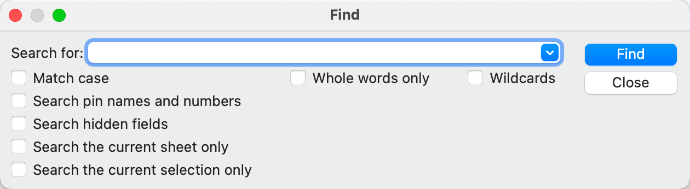
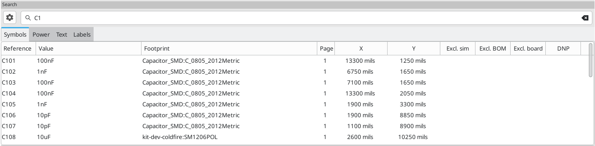

:experimental:

[[inspecting-a-schematic]]
== Inspecting a schematic

=== Find tool

The Find tool searches for text in the schematic, including reference
designators, pin names, symbol fields, and graphic text. When the tool finds a
match, the canvas is zoomed and centered on the match and the text is
highlighted. Launch the tool using the 
button in the top toolbar.

The Find tool has several options:

*Match case:* Selects whether the search is case-sensitive.

*Whole words only:* When selected, the search will only match the search term
with complete words in the schematic. When unselected, the search will match if
the search term is part of a larger word in the schematic.

*Wildcards:* When selected, wildcards can be used in the search terms. `?`
matches any single character, and `\*` matches any number of characters. Note
that when this option is selected, partial matches are not returned: searching
for `abc*` will match the string `abcd`, but searching for `abc` will not.

*Search pin names and numbers:* Selects whether the search should apply to pin
names and numbers.

*Search hidden fields:* Selects whether the search should apply only to visible
fields or if it should include hidden symbol fields.

*Search the current sheet only:* Selects whether the search should be limited to
the current schematic sheet.

*Search the current selection only:* Selects whether the search should be
limited to the current selection.

There is also a Find and Replace tool which is activated with the
 button in the top
toolbar. This tool behaves the same as the Find tool, but additionally can
replace some or all matches with different text.

image::images/en/find_replace_dialog.png[alt="Find and Replace dialog",scaledwidth="50%"]

If the *Replace matches in reference designators* option is checked, reference
designators will be modified if they contain matching text. Otherwise reference
designators will not be affected.

=== Search panel

The search panel is a docked panel that lists information about symbols, text,
and labels from the schematic. Show or hide the search panel with **View** ->
**Panels** -> **Search** or use the kbd:[Ctrl+G] shortcut.

You can optionally filter the list based on a search string. When no filter is
used, all items in the design are listed in the corresponding tab. Items from
the entire schematic are listed, not just items in the current sheet. Items are
filtered based on their properties:

* Symbols and power symbols are filtered by all non-hidden fields
* Text (text and textboxes) is filtered by the text content
* Labels are filtered by their netnames

You can sort the filtered results in ascending or descending
order of the value in a particular column by clicking on that column header.

Filters support wildcards: `*` matches any characters, and `?` matches any
single character. You can also use
http://docs.wxwidgets.org/3.2/overview_resyntax.html[regular expressions], such
as `/symbol value/`.

The displayed information depends on the item type:

* All items list their name and/or value, page number, and X/Y location in the
  sheet
* Symbols additionally list their reference designator, footprint and attributes
  (Exclude from Simulation, Exclude from BOM, Exclude from Board, and Do Not
  Populate)
* Power symbols additionally list their reference designator
* Text and labels additionally list their type, e.g. textbox or hierarchical

When you click an item in the search panel, the schematic editor switches to the
item's schematic sheet, and the item is selected in the editing canvas.
Depending on what is configured in the image:images/icons/config_16.png[] menu,
the schematic editor will also pan and/or zoom to the selected item in the
editing canvas. Double-clicking an item in the search panel opens its properties
dialog.

[[net-highlighting]]
=== Net highlighting

An electrical net can be highlighted in the schematic editor to visualize all of
the places it appears in the schematic. Net highlighting can be activated in the
Schematic Editor or by highlighting the corresponding net in the PCB editor when
cross-probe highlighting is enabled (see below). When net highlighting is
active, the highlighted net will be shown in a different color. By default this
color is pink, but it is configurable in the Color section of the Preferences
dialog.

Nets can be highlighted by clicking on a wire or pin using the Highlight Net
tool in the right toolbar (image:images/icons/net_highlight_schematic_24.png[Net
Highlight icon]). Alternatively, the Highlight Net hotkey (kbd:[`]) highlights
the net under the cursor.

Net highlighting can be cleared by using the Clear Net Highlight action (hotkey
kbd:[~]) or by using the Highlight net tool on an empty region in the schematic.
By default, kbd:[Esc] also clears net highlighting, but this can be disabled if
desired in **Preferences** -> **Schematic Editor** -> **Editing Options**.

=== Net navigator

The net navigator is a docked panel that shows the location of every occurrence
of a highlighted net in a schematic. Show or hide the net navigator with
**View** -> **Panels** -> **Net Navigator**.

When you highlight a net in the schematic, every place where that net is shown
in the schematic is listed in the net navigator panel. All labels, symbol pins,
and sheet pins connected to the net are listed. Each occurrence is sorted under
its schematic sheet. Clicking on an occurrence displays that item in the editing
canvas.

When no net is highlighted, the net navigator displays this information for all
nets in the schematic.

NOTE: The net navigator displays <<net-highlighting,highlighted>> nets, not
selected nets.

=== Cross-probing from the PCB

KiCad allows bi-directional cross-probing between the schematic and the PCB.
There are several different types of cross-probing.

*Selection cross-probing* allows you to select a symbol or pin in the schematic
to select the corresponding footprint or pad in the PCB (if one exists) and
vice-versa. By default, cross-probing will result in the display centering on
the cross-probed item and zooming to fit. You can disable the centering and
zooming behavior, or disable selection cross-probing entirely, in the Display
Options section of the Preferences dialog. Even when selection cross-probing is
disabled, you can manually cross-probe from the schematic to the PCB by
right-clicking an object and selecting **Select on PCB**, or from the PCB to the
schematic by right-clicking an object *and choosing *Select** ->
**Select on Schematic**.

*Highlight cross-probing* allows you to highlight a net in the schematic and PCB
at the same time. If the option "Highlight cross-probed nets" is enabled in the
Display Options section of the Preferences dialog, highlighting a net or bus in
the schematic editor will cause the corresponding net or nets to be highlighted
in the PCB editor, and vice versa.

[[erc]]
=== Electrical Rules Check

The Electrical Rules Check (ERC) tool checks for certain errors in your
schematic, such as unconnected pins, unconnected hierarchical symbols, shorted
outputs or other illegal connections, etc. ERC violations are reported as errors
or warnings depending on the severity of the issue detected.

ERC is imperfect and cannot detect all errors, but it can detect many common
issues and oversights. All detected issues should be checked and addressed
before proceeding. The quality of the ERC is directly related to the care taken
in declaring <<pin-electrical-types,electrical pin properties>> during symbol
creation. If symbols are designed incorrectly, ERC will not report accurate
information.

ERC can be started by clicking on the
image:images/icons/erc_24.png[ERC icon] button in the top toolbar and clicking
the **Run ERC** button.

Any warnings or errors are reported in the **Violations** tab, and markers for
each violation are placed in the schematic so that they point to the relevant
part of the schematic. Warnings are indicated by yellow arrows, and errors have
red arrows. Excluded violations are shown as green arrows. A list of the ignored
tests are shown in the **Ignored Tests** tab. A report file in plain text format
can be created after running DRC using the **Save...** button.

NOTE: Selecting a violation in the ERC window jumps to the selected violation
      marker in the schematic.

The numbers at the bottom of the window show the number of errors, warnings, and
exclusions. Each type of violation can be filtered from the list using the
respective checkboxes. Clicking **Delete Marker** will clear the selected
violation until ERC is run again, while clicking **Delete All Markers** will
clear all violations until the next ERC run.

Violations can be right-clicked in the dialog to ignore them or change their
severity:

* *Exclude this violation:* ignores this particular violation, but does not
  affect any other violations. You can un-exclude a violation by right clicking
  the excluded violation and selecting *Remove exclusion for this violation*.
* *Exclude with comment...:* the same as *Exclude this violation*, but prompts
  for a comment explaining the reason for the exclusion. When excluded
  violations are unhidden (using the *Exclusions* checkbox), exclusion comments
  are shown with the corresponding excluded violation. To edit an existing
  exclusion comment or add a comment to an existing exclusion, right click an
  excluded violation and select *Edit exclusion comment...*.
* *Change severity:* changes a type of violation from warning to error, or error
  to warning. This affects all violations of a given type.
* *Ignore all:* ignores all violations of a given type. This test will now
  appear in the **Ignored Tests** tab rather than the **Violations** tab. You
  can un-ignore the test again by right clicking the test in the
  **Ignored Tests** tab, or in the Violation Severity panel in
  <<schematic-setup,Schematic Setup>>.
* *Edit violation severities...: opens the Violation severity panel in
  <<schematic-setup,Schematic Setup>>, for editing the severities of all DRC
  violation types.

You can also exclude the selected marker with **Inspect** -> **Exclude Marker**,
and show or hide each category of marker (errors, warnings, and exclusions) with
the **View** menu.

Excluded and ignored violations are remembered between runs of the design rule
checker. Excluded violations are hidden unless the **Exclusions** checkbox is
enabled. Ignored violations are not shown, but there is a list of ignored tests
in the **Ignored Tests** tab.

==== ERC example

There are three errors in the screenshot above.

* Two outputs have been connected together (red arrow at right).
* Two inputs have been left unconnected (red arrows at left). This is actually
  two errors per pin: each pin is unconnected, and each pin is an input pin that
  is not driven by an output pin.

Selecting an ERC marker displays a description of the violation in the message
pane at the bottom of the window.

[[power-pins-and-power-flags]]
==== Power pins and power flags

It is common to have an "Input Power pin not driven by any Output Power pins"
error on power pins, as shown in the example below, even though the power pins
seem to be properly connected to a power rail. This happens in designs where the
power is provided through connectors or other components that are not marked as
power outputs. In these cases ERC won't detect any Output Power pins connected
to the net and will determine the Input Power pin is not driven by a power
source.

To avoid this warning, connect the net to `PWR_FLAG` symbol on such a power net
as shown in the following example. The `PWR_FLAG` symbol is found in the `power`
symbol library. Alternatively, connect any power output pin to the net;
`PWR_FLAG` is simply a symbol with a single power output pin.

Ground nets often need a `PWR_FLAG` as well, because voltage regulators have
outputs declared as power outputs, but their ground pins are typically marked as
power inputs. Therefore grounds can appear unconnected to a source unless a
`PWR_FLAG` symbol is used.

For more information about power pins and power flags, see the
<<pwr-flag,`PWR_FLAG` documentation>>.

[[erc-configuration]]
==== ERC Configuration

The **Violation Severity** panel in <<schematic-setup,Schematic Setup>> lets you
configure what types of ERC messages should be reported as Errors, Warnings, or
ignored.

image::images/eeschema_erc_severity.png[alt="Schematic ERC severity settings",scaledwidth="70%"]

The **Pin Conflicts Map** panel in <<schematic-setup,Schematic Setup>> allows
you to configure connectivity rules to define electrical conditions for errors
and warnings based on what types of pins are connected to each other. For
example, by default an error is produced when an output pin is connected to
another output pin.

image::images/eeschema_erc_options.png[alt="Schematic ERC Pin Conflicts Map",scaledwidth="70%"]

Rules can be changed by clicking on the desired square of the matrix, causing it
to cycle through the choices: allowed, warning, error.

[[list-of-erc-checks]]
==== List of ERC checks

The table below lists the electrical rules that KiCad checks and the default
violation severity for each check. All severities are configurable.

===== Connections ERC checks

These ERC checks look for issues with wire and label connections in the
schematic.

[options="header",cols="30%,50%,20%"]
|=======================================================================
| Violation
  | Description
  | Default Severity
| Pin not connected
  | This violation occurs when a symbol pin is not connected to a net, unless
    the pin has a <<no-connection-symbols,no-connect flag>> or has electrical
    type Unconnected.
  | Error
| Input pin not driven by any Output pins
  | This violation occurs when a symbol pin with electrical type Input is not
    connected to a driving pin. Driving pins are pins with the type output,
    bidirectional, tristate, power output, or passive pins.
  | Error
| Input Power pin not driven by any Output Power pins
  | This violation occurs when a symbol pin with electrical type Input Power is
    not connected to an Output Power pin. A common cause of this violation is
    <<power-pins-and-power-flags,described above>>.
  | Error
| A pin with a "no connection" flag is connected
  | The violation occurs when a symbol pin with a
    <<no-connection-symbols,no connection flag>> is connected to a net.
  | Warning
| Unconnected "no connection" flag
  | This violation occurs when a <<no-connection-symbols,No connection flag>>
    is not connected to a pin or label.
  | Warning
| Label not connected to anything
  | This violation occurs when a global, hierarchical, local, or directive label
    is not connected to a pin or another label.
  | Error
| Global label not connected anywhere else in the schematic
  | This violation occurs when there are fewer than two symbol pins on a net
    with a global label (if there are fewer than two pins, then the label isn't
    being used to connect anything as it is only connected to a single symbol
    pin).
  | Warning
| Global label only appears once in the schematic
  | This violation occurs when a global label only appears once in the
    schematic, meaning that the label is not forming any global connections.
    This violation is ignored by default to allow users to use global labels to
    label nets, even if the net does not connect anywhere else.
  | Ignore
| Local and global labels have the same name
  | This violation occurs when a local label has the same name as a global
    label. If these labels are on separate sheets, they will not connect,
    although they may have been intended to connect. Note that while a local
    label and a global label with the same name won't connect if they are on
    different sheets, they will connect if they are on the same sheet.
  | Warning
| Wires not connected to anything
  | This violation occurs when a wire is not connected to any pin or label.
  | Error
| Bus Entry needed
  | This violation only applies to projects imported from EAGLE projects. It
    indicates places where the importer was unable to automatically add bus
    entries to the imported schematic, so you must add them by hand.
  | Error
| Symbol pin or wire end off connection grid
  | This violation occurs when a symbol pin or wire end is not aligned to the
    connection grid. Symbol pins and wire ends need to be aligned to the grid in
    order to connect to each other. The grid used for this check is defined by
    the **connection grid** setting in
    <<schematic-setup-formatting,**Schematic Setup** -> **Formatting** -> **Connection grid**>>.
  | Warning
| Four connection points are joined together
  | This violation occurs when wires join in a four-way (cross) junction. Such
    junctions are sometimes considered harmful because it can be unclear if all
    four wires are intended to be joined or if two wires were intended to cross
    without a junction.
  | Ignore
| Multiple pins with the same pin number
  | This violation occurs when two pins in the same symbol have the same pin
    number. Symbol pins must be uniquely numbered within a symbol, and therefore
    this violation is always an error.
  | Error (not configurable)
| Label connects more than one wire
  | This violation occurs when a label anchor connects to two wires (where two
    wires cross without connecting). In this situation is not possible to
    determine which net the label should connect to.
  | Warning
| Unconnected wire endpoint
  | This violation occurs when a wire endpoint is not connected to anything.
  | Warning

|=======================================================================

===== Conflicts ERC checks

These ERC checks look for conflicting information in symbols, sheets, and buses.

[options="header",cols="30%,50%,20%"]
|=======================================================================
| Violation
  | Description
  | Default Severity
| Duplicate reference designators
  | This violation occurs when two symbols have the same reference designator.
  | Error
| Units of same symbol have different values
  | This violation occurs when units of a single symbol have different values.
  | Error
| Different footprint assigned in another unit of the symbol
  | This violation occurs when units of a single symbol have different assigned
    footprints.
  | Error
| Different net assigned to a shared pin in another unit of the symbol
  | This violation occurs when a pin that is shared between multiple units of a
    symbol is not connected to the same net in each unit.
  | Error
| Duplicate sheet names within a given sheet
  | This violation occurs when two hierarchical sheets in the same parent sheet
    have the same name.
  | Error
| Mismatch between hierarchical labels and sheet pins
  | This violation occurs when a hierarchical label does not have a
    corresponding hierarchical sheet pin in the parent sheet, or a hierarchical
    sheet pin does not have a corresponding hierarchical label in the child
    sheet.
  | Error
| More than one name given given to this bus or net
  | This violation occurs when a net has multiple labels attached. Nets can only
    have a single name, so if multiple labels are attached to a net, one name
    will be selected and used as the canonical name.
  | Warning
| Conflict between bus alias definitions across schematic sheets
  | This violation occurs when a bus alias has different members in different
    sheets. If the same bus alias name is used in multiple sheets, the members
    of the alias must be the same for each sheet.
  | Error
| Buses are graphically connected but share no bus members
// TODO this one seems to be impossible to hit and may be removed from the
// severity panel
  | This violation occurs when buses that are graphically connected do not have
    bus members in common.
  | Error
| Invalid connection between bus and net items
  | This violation occurs when a bus is connected to a net item, such as a wire,
    a label referring to a single net, or a sheet pin referring to a single net.
    Labels and sheet pins can only be connected to buses if they refer to buses
    rather than individual signals.
  | Error
| Net is graphically connected to a bus but not a bus member
  | This violation occurs when a net is connected to a bus with a bus entry but
    the net is not a member of that bus.
  | Warning
|=======================================================================

===== Miscellaneous ERC checks

These ERC checks look for other miscellaneous issues in the schematic.

[options="header",cols="30%,50%,20%"]
|=======================================================================
| Violation
  | Description
  | Default Severity
| Symbol is not annotated
  | This violation occurs when a symbol is not
    <<reference-designators-and-symbol-annotation,annotated with a unique reference designator>>.
  | Error
| Unresolved text variable
  | This violation occurs when a text variable (`${variable_name}`) is used
    without being defined in <<schematic-setup-text-variables,Schematic Setup>>.
  | Error
| SPICE model issue
  | This violation occurs when a SPICE model has a syntax error or other
    problem.
  | Ignore
| Labels are similar (lower/upper case difference only)
  | This violation occurs when two labels are similar and differ only by the
    case of some letters. This may be a typo causing two labels to be
    disconnected when they are intended to be connected.
  | Warning
| Power pins are similar (lower/upper case difference only)
  | This violation occurs when the net names driven by two
    <<power-symbols,global power pins>> are similar and differ only by the case
    of some letters. This may be a typo causing two global power pins to be
    disconnected when they are intended to be connected.
  | Warning
| Power pin and label are similar (lower/upper case difference only)
  | This violation occurs when a label and the net name driven by a
    <<power-symbols,global power pin>> are similar and differ only by the case
    of some letters. This may be a typo causing two global power pins to be
    disconnected when they are intended to be connected.
  | Warning
| Library symbol issue
  a| This violation occurs when one of several symbol library issues is
     detected:

    * The symbol library for a symbol is not included and enabled in the 
      <<managing-symbol-libraries,library table>>
    * A symbol in the schematic does not exist in its symbol library
  | Warning
| Symbol doesn't match copy in library
  | This violation occurs when a symbol in the schematic is different than
    the library version of the symbol.
    
    You can compare between the schematic and library versions of the symbol
    using the <<comparing-symbols,Compare Symbol with Library>> tool, which is
    available by right clicking the violation in the ERC window. If desired,
    you can <<updating_and_exchanging_symbols,update the schematic symbol>> to
    match the library symbol.
  | Warning
| Footprint link issue
  a| This violation occurs when one of several footprint assignment issues is
     detected:

    * The footprint assignment for a symbol is not a valid footprint identifier
    * The footprint library given in a symbol's footprint assignment is not
      included and enabled in the
      xref:../pcbnew/pcbnew.adoc#managing-footprint-libraries[library table]
    * The footprint assigned to a symbol does not exist in the specified
      footprint library
  | Warning
| Assigned footprint doesn't match footprint filters
  | This violation occurs when the footprint assigned to a symbol does not match
    the symbol's footprint filters. If the symbol doesn't have any footprint
    filters, no violation occurs.
  | Warning
| Symbol has more units than are defined
  | This violation occurs when a symbol has more units placed in the schematic
    than are defined in the symbol. Units in the schematic must correspond
    exactly to the symbol definition.
  | Error
| Symbol has units that are not placed
  | This violation occurs when a unit from a multi-unit symbol is not placed in
    the schematic. Unplaced units will not be connected to anything.
  | Warning
| Symbol has input pins that are not placed
  | This violation occurs when a multi-unit symbol has units with input
    pins that are not placed, so those input pins will not be connected to
    anything.
  | Warning
| Symbol has bidirectional pins that are not placed
  | This violation occurs when a multi-unit symbol has units with bidirectional
    pins that are not placed, so those input pins will not be connected to
    anything.
  | Warning
| Symbol has power input pins that are not placed
  | This violation occurs when a multi-unit symbol has units with power input
    pins that are not placed, so those input pins will not be connected to
    anything.
  | Error
| Conflict problem between pins
  | This violation occurs when a connection between pins is not allowed per the
    allowed connections in the <<erc-configuration,Pin Conflicts Map>>.
  | From Pin Conflicts Map
|=======================================================================

[[text-var-erc]]
==== User-definable ERC violations

You can manually trigger schematic ERC warnings or errors using special
<<text-variables,text variables>>. These items will appear as errors or warnings
when ERC runs. This can be useful to flag items for later followup or review.

To cause an ERC violation, use the text variable `${ERC_ERROR <violation name>}`
or `${ERC_WARNING <violation name>}` depending on whether an error or warning is
desired. You can place this in a text item, text box, or field, including
symbol fields, sheet fields, and label fields.
When ERC runs, this will generate a ERC violation with the given violation name.
These text variables resolve to an empty string in the schematic, and any text
after the braces is included in the ERC violation's description. The text
variable must be placed at the start of the text object in order to trigger a violation.

For example, a text item containing `${ERC_ERROR TODO}Calculate resistor value`
will appear in the board as just the text "Calculate resistor value", and will
generate an ERC error named "TODO" with "Calculate resistor value" in the
description.

==== ERC report file

An ERC report file can be generated and saved by clicking the **Save...** button
in the ERC dialog. The file extension for ERC report files is `.rpt`. An example
ERC report file is given below.

----------------------------------------------------------------------
ERC report (Fri 21 Oct 2022 02:07:05 PM EDT, Encoding UTF8)

***** Sheet /
[pin_not_driven]: Input pin not driven by any Output pins
    ; Severity: error
    @(149.86 mm, 60.96 mm): Symbol U1B [74LS00] Pin 4 [, Input, Line]
[pin_not_connected]: Pin not connected
    ; Severity: error
    @(149.86 mm, 60.96 mm): Symbol U1B [74LS00] Pin 4 [, Input, Line]
[pin_not_connected]: Pin not connected
    ; Severity: error
    @(149.86 mm, 66.04 mm): Symbol U1B [74LS00] Pin 5 [, Input, Line]
[pin_to_pin]: Pins of type Output and Output are connected
    ; Severity: error
    @(165.10 mm, 63.50 mm): Symbol U1B [74LS00] Pin 6 [, Output, Inverted]
    @(165.10 mm, 46.99 mm): Symbol U1A [74LS00] Pin 3 [, Output, Inverted]
[pin_not_driven]: Input pin not driven by any Output pins
    ; Severity: error
    @(149.86 mm, 66.04 mm): Symbol U1B [74LS00] Pin 5 [, Input, Line]

 ** ERC messages: 5  Errors 5  Warnings 0
----------------------------------------------------------------------
