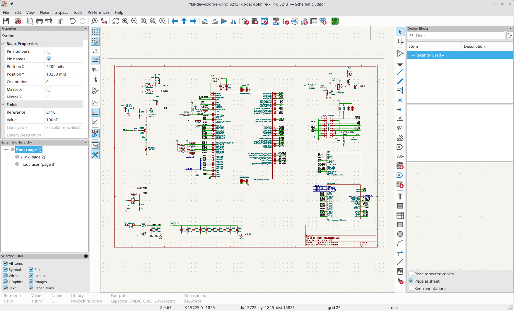

:experimental:

== Introduction to the KiCad Schematic Editor

=== Description

The KiCad Schematic Editor is a schematic capture software distributed as a
part of KiCad and available under the following operating systems:

* Linux
* Apple macOS
* Windows

Regardless of the OS, all KiCad files are 100% compatible from one OS to
another.

The Schematic Editor is an integrated application where all functions of
drawing, control, layout, library management and access to the PCB design
software are carried out within the editor itself.

The KiCad Schematic Editor is intended to cooperate with the KiCad PCB Editor,
which is KiCad's printed circuit design software. It can also export netlist
files, which lists all the electrical connections, for other packages.

The Schematic Editor includes a symbol library editor, which can create and
edit symbols and manage libraries.
It also integrates the following additional but essential functions needed for
modern schematic capture software:

* Electrical rules check (ERC) for the automatic control of incorrect and missing
  connections
* Export of plot files in many formats (Postscript, PDF, HPGL, and SVG)
* Bill of Materials generation (via Python or XSLT scripts, which allow many flexible formats).

The Schematic Editor supports multi-sheet schematics in several ways:

* Flat hierarchies (schematic sheets are not explicitly connected in a master
  diagram).
* Simple hierarchies (each schematic sheet is used only once).
* Complex hierarchies (some schematic sheets are used multiple times).

Hierarchical schematics are described in detail
<<hierarchical-schematics,later in the manual>>.

[[initial-configuration]]
=== Initial Configuration

When the Schematic Editor is run for the first time, if the the global symbol
library table file `sym-lib-table` is not found in the KiCad configuration
folder then KiCad will ask how to create this file:

image::images/en/symbol-lib-table-configuration.png[scaledwidth="80%",alt="symbol library table initial configuration"]

The first option is recommended (*Copy default global symbol library table
(recommended)*). The default symbol library table includes all of the
standard symbol libraries that are installed as part of KiCad.

If this option is disabled, KiCad was unable to find the default global
symbol library table. This probably means you did not install the standard
symbol libraries with KiCad, or they are not installed where KiCad expects to
find them. On some systems the KiCad libraries are installed as a separate
package.

* If you have installed the standard KiCad symbol libraries and want to use
  them, but the first option is disabled, select the second option and browse to
  the `sym-lib-table` file in the directory where the KiCad libraries were
  installed.
* If you already have a custom symbol library table that you would like to use,
  select the second option and browse to your `sym-lib-table` file.
* If you want to construct a new symbol library table from scratch, select
  the third option.

Symbol library management is described in more detail <<managing-symbol-libraries,later>>.

=== The Schematic Editor User Interface

The main Schematic Editor user interface is shown above. The center contains the
main editing canvas, which is surrounded by:

* Top toolbars (file management, zoom tools, editing tools)
* Left toolbar (display options), <<navigating-between-sheets,Hierarchy Navigator>>
  and <<properties-manager,Properties Manager>> at left
* Message panel and status bar at bottom
* Right toolbar (drawing and design tools)

=== Navigating the editing canvas

The editing canvas displays the schematic being designed. You can pan and zoom
to different parts of the schematic and open any schematic sheet in the design.

By default, dragging with the middle or right mouse button will pan the canvas
view and scrolling the mouse wheel will zoom the view in or out. You can change
this behavior in the Mouse and Touchpad section of the preferences (see
<<configuration-and-customization,Configuration and Customization>> for
details).

Several other zoom tools are available in the top toolbar:

* image:images/icons/zoom_in_24.png[Zoom In icon] zooms in on the center of the
  viewport.

* image:images/icons/zoom_out_24.png[Zoom Out icon] zooms out from the center of
  the viewport.

* image:images/icons/zoom_fit_in_page_24.png[Zoom to Page icon] zooms to fit the
  frame around the drawing sheet.

*  zooms to
  fit every item in the schematic (not including the drawing sheet). For
  instance, if there are items placed outside of the drawing sheet, they will be
  visible after zooming to objects.

* image:images/icons/zoom_area_24.png[Zoom to Selection icon] allows you to
  draw a box to determine the zoomed area.

The cursor's current position is displayed at the bottom of the window (X and
Y), along with the current zoom factor (Z), the cursor's relative position (dx,
dy, and dist), the grid setting, and the display units.

The relative coordinates can be reset to zero by pressing kbd:[Space]. This is
useful for measuring distance between two points or aligning objects.

=== Hotkeys

The kbd:[Ctrl+F1] shortcut displays the current hotkey list. The default hotkey
list is included in the <<eeschema-actions-reference,Actions Reference>> section
of the manual.

The hotkeys described in this manual use the key labels that appear on a
standard PC keyboard. On an Apple keyboard layout, use the kbd:[Cmd] key in
place of kbd:[Ctrl], and the kbd:[Option] key in place of kbd:[Alt].

Many actions do not have hotkeys assigned by default, but hotkeys can be
assigned or redefined using the hotkey editor (**Preferences** ->
**Preferences...** -> **<<preferences-controls,Hotkeys>>**).

NOTE: Many of the actions available through hotkeys are also available in
context menus. To access the context menu, right-click in the editing canvas.
Different actions will be available depending on what is selected or what tool
is active.

Hotkeys are stored in the file `user.hotkeys` in KiCad's configuration
directory. The location is platform-specific:

* Windows: `%APPDATA%\kicad\8.0\user.hotkeys`
* Linux: `~/.config/kicad/8.0/user.hotkeys`
* macOS: `~/Library/Preferences/kicad/8.0/user.hotkeys`

KiCad can import hotkey settings from a `user.hotkeys` file using the **Import
Hotkeys** button in the hotkey editor.

=== Mouse operations and selection

Selecting items in the editing canvas is done with the left mouse button.
Single-clicking on an object will select it. Clicking and dragging will perform
a box selection. A box selection from left to right will only select items that
are fully inside the box. A box selection from right to left will select any
items that touch the box. A left-to-right selection box is drawn in yellow, with
a cursor that indicates exclusive selection, and a right-to-left selection box
is drawn in blue with a cursor that indicates inclusive selection.

The selection action can be modified by holding modifier keys while clicking or
dragging. The following modifier keys apply when clicking to select single items:

[options="header",cols="20%,20%,20%,40%",]
|====
| Modifier Keys (Windows) | Modifier Keys (Linux)   | Modifier Keys (macOS)
  | Selection Effect
| kbd:[Ctrl]              | kbd:[Ctrl]              | kbd:[Cmd]
  | Toggle selection.
| kbd:[Shift]             | kbd:[Shift]             | kbd:[Shift]
  | Add the item to the existing selection.
| kbd:[Ctrl + Shift]      | kbd:[Ctrl + Shift]      | kbd:[Cmd + Shift]
  | Remove the item from the existing selection.
| long click              | long click or kbd:[Alt] | long click or kbd:[Option]
  | Clarify selection from a pop-up menu.
|====

The following modifier keys apply when dragging to perform a box selection:

[options="header",cols="20%,20%,20%,40%",]
|====
| Modifier Keys (Windows)   | Modifier Keys (Linux)     | Modifier Keys (macOS)
  | Selection Effect
| kbd:[Ctrl] | kbd:[Ctrl] | kbd:[Cmd]
  | Toggle selection.
| kbd:[Shift] | kbd:[Shift] | kbd:[Shift]
  | Add item(s) to the existing selection.
| kbd:[Ctrl + Shift]        | kbd:[Ctrl + Shift]        | kbd:[Cmd + Shift]
  | Remove item(s) from the existing selection.
|====

Selecting an object displays information about the object in the message panel
at the bottom of the window. Double-clicking an object opens a window to edit
the object's properties.

Pressing kbd:[Esc] will always cancel the current tool or operation and return
to the selection tool. Pressing kbd:[Esc] while the selection tool is active
will clear the current selection.

[[left-toolbar]]
=== Left toolbar display controls

The left toolbar provides options to change the display of items in the
Schematic Editor.

[width="100%",cols="5%,95%",]
|=======================================================================

| image:images/icons/grid_24.png[grid visibility icon]
    | Turns grid display on/off.

    *Note:* by default, hiding the grid does not disable grid snapping.
    This behavior can be changed in the Display Options section of Preferences.

| image:images/icons/grid_override_24.png[grid override enable button]
    | Turns item-specific grid overrides on/off.

| image:images/icons/unit_inch_24.png[inch unit icon]

  image:images/icons/unit_mil_24.png[mil unit icon]

  image:images/icons/unit_mm_24.png[millimeter unit icon]
    | Display/entry of coordinates and dimensions in inches, mils, or millimeters.

| image:images/icons/cursor_shape_24.png[cursor shape icon]
    | Switches between full-screen and small editing cursor (crosshairs).

| image:images/icons/hidden_pin_24.png[hidden pin icon]
    | Turns invisible pin display on/off.

| 

  

  

    | Switches between free angle, 90 degree mode, and 45 degree mode for
      placement of new wires, buses, and graphical shapes.

| image:images/icons/hierarchy_nav_24.png[hierarchy navigator icon]
    | Opens and closes the docked hierarchy navigator pane.

| image:images/icons/tools_24.png[Properties Manager icon]
    | Opens and closes the docked Properties Manager pane.

|=======================================================================
