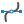
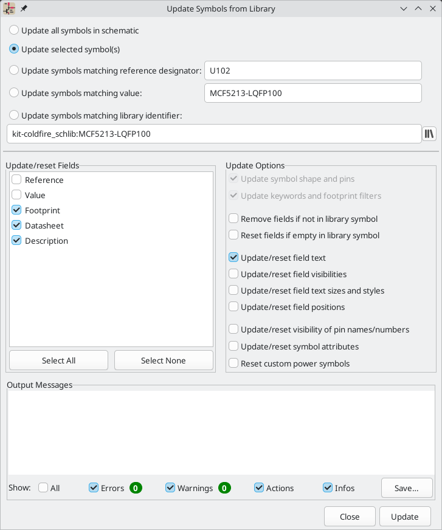
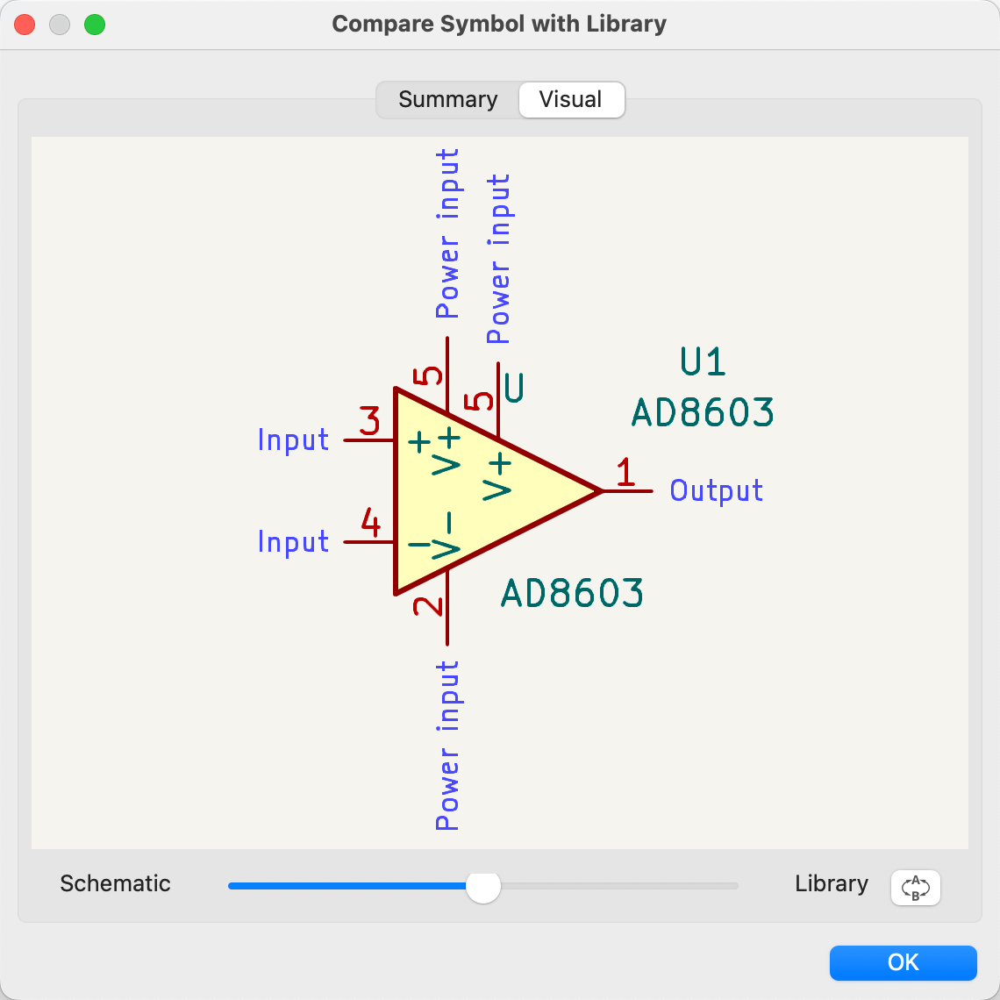
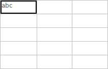
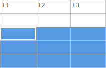
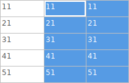
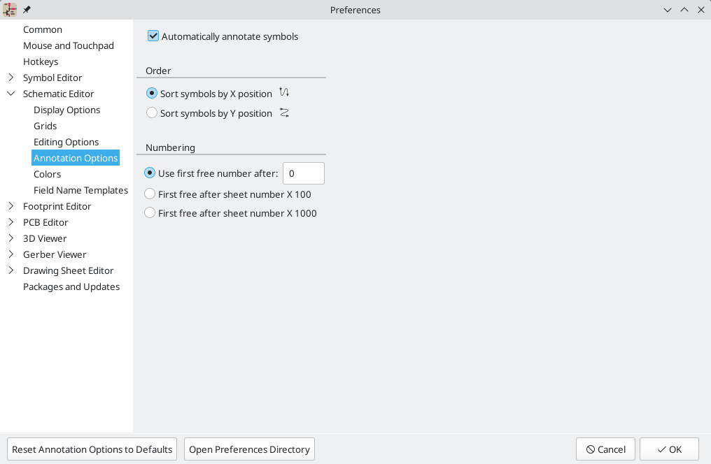
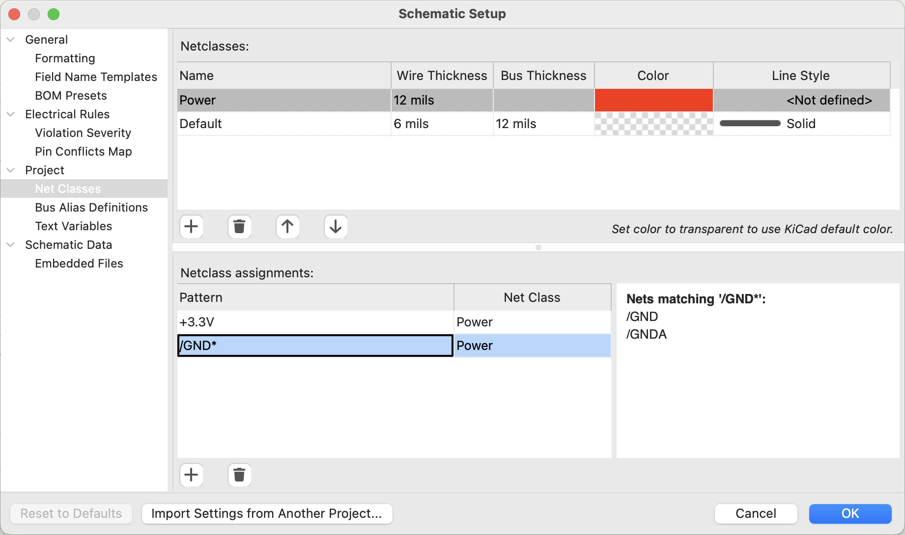

:experimental:

[[schematic-creation-and-editing]]
== Schematic Creation and Editing

=== Introduction

A schematic designed with KiCad is more than a simple graphic
representation of an electronic device. It is normally the entry point
of a development chain that allows for:

* Validating against a set of rules (<<erc,Electrical Rules Check>>) to detect
  errors and omissions.
* Automatically generating a
  <<creating-customized-netlists-and-bom-files,bill of materials>>.
* <<creating-customized-netlists-and-bom-files,Generating a netlist>> for
  simulation software such as SPICE.
* <<creating-customized-netlists-and-bom-files,Defining a circuit>> for
  transferring to PCB layout.

A schematic mainly consists of symbols, wires, labels, junctions,
buses and power symbols. For clarity in the schematic, you can place
purely graphical elements like bus entries, comments, and polylines.

Symbols are added to the schematic from symbol libraries. After
the schematic is made, the set of connections and footprints is imported into
the PCB editor for designing a board.

Schematics can be contained in a single sheet or split among multiple sheets. In
KiCad, multi-sheet schematics are organized hierarchically, with a root sheet
and sub-sheet(s). Each sheet is its own `.kicad_sch` file and is itself a
complete KiCad schematic. Working with hierarchical schematics is described in
the <<hierarchical-schematics,Hierarchical Schematics>> chapter.

[[schematic-editing-operations]]
=== Schematic editing operations

Schematic editing tools are located in the right toolbar.  When a tool is
activated, it stays active until a different tool is selected or the tool is
canceled with the kbd:[Esc] key. The selection tool is always activated when any
other tool is canceled.

[width="100%",cols="10%,90%",]
|=======================================================================
|
|<<selection,Selection tool>> (the default tool)

|
|<<net-highlighting,Highlight a net>> by marking its wires and net labels with a different color.
If the PCB Editor is also open then copper corresponding to the selected net
will be highlighted as well. Net highlighting can be cleared by clicking with
the highlight tool in an empty space, or by using the Clear Net Highlighting
hotkey (kbd:[~]).

|
|<<placing-symbols,Display the symbol selector dialog>> to place a new symbol.

|
|<<placing-power-symbols,Display the power symbol selector dialog>> to place a new power symbol.

|
|<<wires,Draw a wire>>.

|
|<<buses,Draw a bus>>.

|
|Draw <<buses,wire-to-bus entry points>>. These elements are only graphical and do not create
a connection, thus they should not be used to connect wires together.

|
|Place a <<no-connection-symbols,"no-connection" flag>>. These flags should be
placed on symbol pins which are meant to be left unconnected. "No-connection"
flags indicate to the Electrical Rule Checker that the pin is intentionally
unconnected and not an error. They also affect schematic connectivity for
stacked symbol pins.

|
|Place a <<wire-junctions,junction>>. This connects two crossing wires or a wire and a pin, which
can sometimes be ambiguous without a junction (i.e. if a wire end or a pin is
not directly connected to another wire end).

|
|Place a <<labels,local label>>. Local labels connect items located **in the same sheet**.
For connections between two different sheets, use global or hierarchical labels.

|
|Place a <<netclass-directive,net class directive label>>.

|image:images/icons/add_keepout_area_24.png[Directive rule area icon]
|Place a <<netclass-directive,directive rule area>>.

|image:images/icons/add_glabel_24.png[Global label icon]
|Place a <<labels,global label>>. All global labels with the same name are connected, even
when located on different sheets.

|image:images/icons/add_hierarchical_label_24.png[Hierarchical label icon]
|Place a <<hierarchical-labels,hierarchical label>>. Hierarchical labels are used to create a connection
between a subsheet and the sheet's parent sheet. See the
<<hierarchical-schematics,Hierarchical Schematics>> section for more information
about hierarchical labels, sheets, and pins.

|
|Place a <<drawing-hierarchical-sheets,hierarchical subsheet>>. You must specify the file name for this subsheet.

|
|Place a <<hierarchical-sheet-pins,hierarchical sheet pin>> on a sheet corresponding to a hierarchical label
that has been added in the target sheet.

|
|<<syncing-sheet-pins,Sync hierarchical sheet pins and hierarchical labels>>.
This displays a list of all the hierarchical labels in each subsheet and lets
you manage the corresponding hierarchical sheet pins.

|image:images/icons/text_24.png[place text icon]
|<<text-comments,Place text>>.

|image:images/icons/add_textbox_24.png[place textbox icon]
|<<text-comments,Place a text box>>.

|
|<<tables,Place a table>>.

|image:images/icons/add_rectangle_24.png[draw rectangle icon]
|<<graphic-lines,Draw a rectangle>>.

|image:images/icons/add_circle_24.png[draw circle icon]
|<<graphic-lines,Draw a circle>>.

|
|<<graphic-lines,Draw an arc>>.

|
|<<graphic-lines,Draw a bezier curve>>.

|
|<<graphic-lines,Draw graphic lines>>.

*Note:* Lines are graphical objects and are not the same as wires
placed with the Wire tool. They do not connect anything.

|image:images/icons/image_24.png[place bitmap icon]
|<<bitmap-images,Place a bitmap image>>.

|image:images/icons/delete_cursor_24.png[interactive delete tool icon]
|Delete clicked items.

|=======================================================================

[[grids]]
[[snapping]]
=== Grids and snapping

Schematic elements such as symbols, wires, text, and graphic lines are snapped
to the grid when moving, dragging, and drawing them. Additionally, the wire tool
snaps to pins even when grid snapping is disabled.

Both grid and pin snapping can be disabled while moving the mouse by using the
modifier keys in the table below.

NOTE: On Apple keyboards, use the kbd:[Cmd] key instead of kbd:[Ctrl].

[options="header",cols="40%,60%"]
|====
| Modifier Key | Effect
| kbd:[Ctrl] | Disable grid snapping.
| kbd:[Shift] | Disable snapping wires to pins.
|====

The default grid size is 50 mil (0.050") or 1.27 millimeters. This is the
recommended grid for placing symbols and wires in a schematic and for placing
pins when designing a symbol in the Symbol Editor. Smaller grids can also be
used, but this is intended only for text and symbol graphics, and not
recommended for placing pins and wires.

NOTE: Wires connect with other wires or pins only if their ends coincide
      *exactly*. Therefore it is very important to keep symbol pins and wires
      aligned to the grid. It is recommended to always use a 50 mil grid when
      placing symbols and drawing wires because the KiCad standard symbol
      library and all libraries that follow its style also use a 50 mil grid.
      *Using a grid size other than 50 mil will result in schematics without
      proper connectivity!*

NOTE: Symbols, wires, and other elements that are not aligned to the grid can be
      snapped back to the grid by selecting them, right clicking, and clicking
      **Align Elements to Grid**.

You can adjust the grid size by right-clicking and selecting a new grid from the
list in the **Grid** submenu. Pressing the kbd:[n] or kbd:[N] hotkeys will cycle
to the next and previous grid in the list, respectively.

You can also select a new grid or edit the available grids in the **Grids** pane
of the preferences dialog. As a shortcut to reach this dialog, right click the
image:images/icons/grid_24.png[show grid button] button on the left toolbar and
select **Edit Grids...**.

In this dialog you can select an active grid from the list of grids, reorder the
list of grids ( / ),
and add (image:images/icons/small_plus_16.png[]), remove (),
or edit (image:images/icons/small_edit_16.png[]) grids. Grids defined in this
dialog can have unequal X and Y spacing as well as an optional name. The grid
spacing and name are specified when you create or edit a grid.

This dialog also lets you designate two grids from the list as "Fast Grids",
which can be quickly selected using kbd:[Alt+1] and kbd:[Alt+2].

Finally, you can configure grid overrides for different types of objects. Grid
overrides let you set particular grid sizes for different types of objects which
will be used instead of the default grid when working with those objects. For
example, you can set a 50 mil grid for wires and connected items while using
smaller grids to finely position text and graphics. Grid overrides can be
individually enabled and disabled in this dialog, or globally enabled and
disabled using the
 button on
the left toolbar (kbd:[Ctrl+Shift+G]).

The visual appearance of the grid can also be customized in several ways. You
can change the thickness of the grid markings, switch their shape (dots, lines,
or crosses), and set the minimum displayed spacing in the **Display Options**
page of the preferences dialog, and you can change the grid color in the
**Colors** page of the preferences dialog.

The grid can be shown or hidden using the
image:images/icons/grid_24.png[show grid button] button on the left-hand
toolbar. By default the grid is still active even if it is hidden, but this is
configurable in the **Display Options** preferences page. There you can set the
grid to be disabled when it is hidden or even disable the grid entirely.

[[editing-object-properties]]
=== Editing object properties

All objects have properties that are editable in a dialog. Use the hotkey
kbd:[E] or select **Properties** from the right-click context menu to edit the
properties of selected item(s). You can only open the properties dialog if all
the items you have selected are of the same type.  For many object types, like
symbols, you can only edit the properties of a single item at one time. To edit
the properties of multiple items at once, including items with different types,
you can use the Properties Manager.

You can only use the properties dialog to edit one item at a time. To edit
multiple items, use the Properties Manager, described below. There are also
other tools that can be used to edit specific types of objects in bulk, such as
the <<eeschema-edit-text-and-graphics-properties,Edit Text and Graphics tool>>
for editing text, labels, and graphic shapes, or the
<<symbol-fields-table,Symbol Fields Table>> for editing symbol fields in bulk.

You can also view and edit item properties using the Properties Manager. The
Properties Manager is a docked panel that displays the properties of the
selected item or items for editing. If multiple types of items are selected at
once, the properties panel displays only the properties shared by all of the
selected item types.

Editing a property in the Properties Manager immediately applies the change.
When multiple items are selected, property modifications are applied to each
selected item individually, not to the whole selection as a group. For example,
when changing the orientation of multiple items, each item is individually
rotated around its own origin, not the group's origin.

Show the Properties Manager with **View** -> **Panels** -> **Properties** or the
image:images/icons/tools_24.png[Properties Manager icon] button on the left toolbar.

In properties dialogs and many other dialogs, any field that contains a numeric
value can also accept a basic math expression that results in a numeric value.
For example, a dimension may be entered as `2 * 2mm`, resulting in a value of
`4mm`. Basic arithmetic operators as well as parentheses for defining order of
operations are supported.

[[working-with-symbols]]
=== Working with symbols

[[placing-symbols]]
==== Placing symbols

To place a symbol in your schematic, use the
 button or the kbd:[A]
hotkey. The Choose Symbols dialog appears and lets you select a symbol to add.
Symbols are grouped by symbol library.

By default, only the symbol/library name and description columns are shown.
Additional columns can be added by right-clicking the column header and
selecting **Select Columns**.

The Choose Symbol dialog filters symbols by name, keywords, description, and
all additional symbol fields according to what you type into the search field.
You can choose to sort search results alphabetically or by best match by
clicking on the image:images/icons/small_sort_desc_16.png[sort button] button.

Some advanced filters are available:

* *Wildcards:* `*` matches any number of any characters, including none, and `?`
  matches any single character.
* *Key-value pairs:* if a library part's description or keywords contain a tag
  of the format "Key:123", you can match relative to that by typing
  "Key>123" (greater than), "Key<123" (less than), etc. Numbers may include
  one of the following case-insensitive suffixes:
+
[width="100%"]
|===
| p | n | u | m | k | meg | g | t
| 10^-12^ | 10^-9^ | 10^-6^ | 10^-3^ | 10^3^ | 10^6^ | 10^9^ | 10^12^
|===
+
[width="50%"]
|===
| ki | mi | gi | ti
| 2^10^ | 2^20^ | 2^30^ | 2^40^
|===

* *Regular expressions:* if you're familiar with regular expressions, these
  can be used too. The regular expression flavor used is the
  http://docs.wxwidgets.org/3.2/overview_resyntax.html[wxWidgets
  Advanced Regular Expression style], which is similar to Perl regular
  expressions.

If the symbol specifies a default footprint, this footprint will be previewed in
the lower right. If the symbol includes footprint filters, alternate footprints
that satisfy the footprint filters can be selected in the footprint dropdown
menu at right.

After selecting a symbol to place, the symbol will be attached to the cursor.
Left clicking the desired location in the schematic places the symbol into the
schematic. Before placing the symbol in the schematic, you can rotate it, mirror
it, and edit its fields, by either using the hotkeys or the right-click
context menu. These actions can also be performed after placement.

If the *Place repeated copies* option is checked, after placing a symbol KiCad
will start placing another copy of the symbol. This process continues until
the user presses kbd:[Esc].

For symbols with multiple units, if the *Place all units* option is checked,
after placing the symbol KiCad will start placing the next unit in the symbol.
This continues until the last unit has been placed or the user presses
kbd:[Esc].

[[placing-power-symbols]]
==== Placing power symbols

A <<power-symbols,power symbol>> is a symbol representing a connection to a
power net.  The symbols are grouped in the `power` library, so they can be
placed using the symbol chooser.  However, as power placements are frequent, the
 tool is available. This tool
is similar, except that the search is done directly in the `power` library and
any other library that contains power symbols.

[[moving-symbols]]
==== Moving symbols

Symbols can be moved using the Move (kbd:[M]) or Drag (kbd:[G]) tools. These
tools act on the selected symbol, or if no symbol is selected they act on the
symbol under the cursor.

The *Move* tool moves the symbol itself without maintaining wired connections to
the symbol pins.

The *Drag* tool moves the symbol without breaking wired connections to its pins,
and therefore moves the connected wires as well.

You can also Drag symbols by clicking and dragging them with the mouse,
depending on the *Left button drag gesture* setting in the *Mouse and Touchpad*
section of Preferences.

Symbols can also be rotated (kbd:[R]) or mirrored in the X (kbd:[X]) or Y
(kbd:[Y]) directions.

[[editing-symbol-properties]]
==== Editing symbol properties

Symbols in the schematic can be individually edited, both in terms of their
properties (fields, attributes, etc.) and in terms of their pins and graphics. Editing a symbol in the schematic only affects that
particular instance of the symbol; it does not affect any other copies of
that symbol in the schematic, and it does not affect the library symbol.

To edit the properties of a symbol in the schematic, open its properties dialog
(kbd:[E]). You can also double-click the symbol.

The Symbol Properties window displays all the fields of a symbol in a table. New
fields can be added, and existing fields can be deleted, edited, reordered,
moved, or resized. Fields can be arbitrarily named, but names beginning with
`ki_`, e.g. `ki_description`, are reserved by KiCad and should not be used for
user fields. All symbol fields will be added to the symbol's corresponding
footprint when the <<schematic-to-pcb,PCB is updated from the schematic>>.

Each field's name and value can be visible or hidden, and there are several
formatting options: horizontal and vertical alignment, orientation, position,
font, text color, text size, and bold/italic emphasis. Field autoplacement can
also be enabled on a per-field basis. The displayed position is always indicated
for a normally displayed symbol (no rotation or mirroring) and is relative
to the anchor point of the symbol.

NOTE: Formatting options for symbol fields can be shown or hidden by
      right-clicking on the header row of the symbol field table and enabling or
      disabling the desired columns. Not all columns are shown by default.

Symbols have several attributes that affect how the symbols are treated by other
parts of KiCad.

**Exclude from simulation** prevents the symbol from being included in SPICE
simulations. Symbols that are excluded from simulation appear desaturated and
with a grey "X" over them in the schematic. The color of the "X" is configurable
by editing the "Excluded-from-simulation Markers" color in the selected
colorscheme. The visual marker (the "X" and the desaturation) can be disabled
completely by unchecking **Mark items which are excluded from simulation** in
the Schematic Editor preferences.

**Exclude from bill of materials** prevents the component from being included in
<<bom-export,BOM exports>>.

**Exclude from board** means that the symbol is schematic-only, and a
corresponding footprint will not be added to the PCB.

**Do not populate** means that the component should not be attached to the PCB,
although a corresponding footprint should still be added to the board. DNP
symbols appear desaturated and with a red "X" over them in the schematic, as
shown below. The color of the "X" is configurable by editing the "DNP Markers"
color in the selected colorscheme.

image::images/dnp_symbol.png[alt="Symbol with DNP property set",scaledwidth="30%"]

To edit the symbols's form, i.e. its pins and graphics, you need to
use the <<creating-and-editing-symbols,symbol editor>>. There are two buttons for opening a symbol in the
editor, depending on whether you want to edit a single copy of a symbol in
the schematic or a symbol's source copy in the library.

* **Edit Symbol...** will open the specific instance of the symbol in the
  symbol editor. Editing this symbol will only affect this one instance of
  the symbol in the schematic. It will not affect other instances of the
  symbol in the schematic, and it will not affect the library copy of the
  symbol. You can also open a schematic symbol in the symbol editor by
  right clicking the symbol in the schematic and selecting
  **Edit with symbol editor** (kbd:[Ctrl+E]).
* **Edit Library Symbol...**  will open the library copy of the symbol in
  the symbol editor. Editing the library copy of the symbol will edit the
  symbol in the symbol library, but will not immediately affect any
  instances of that symbol in the schematic. To update symbols in the schematic
  with changes to the library symbol, use the
  **Update Symbol from Library...** tool. Editing the library symbol in
  this way is equivalent to opening the symbol editor, opening the
  appropriate symbol in its library, and editing it.

The **Update Symbol from Library...** button is used to update the schematic's
copy of the symbol to match the copy in the library. The **Change Symbol...**
button is used to swap the current symbol to a different
symbol in the library. These functions are described
<<updating-and-exchanging-symbols,later>>.

===== Editing symbol fields individually

An individual symbol text field can be edited directly with the kbd:[E] hotkey (with a field
selected instead of a symbol) or by double-clicking on the field.

Some symbol fields have their own hotkey to edit them directly. With the symbol
selected, the Reference, Value, and Footprint fields can be edited with the kbd:[U],
kbd:[V], or kbd:[F] hotkeys, respectively.

The options in this dialog are the same as those in the full Symbol Properties
dialog, but are specific to a single field.

Symbol fields can be automatically moved to an appropriate location with the
Autoplace Fields action (select a symbol and press kbd:[O]). Field autoplacement
is configurable in the Schematic Editor's Editing Options, including a setting
to always autoplace fields. You can also disable autoplacement for individual
fields in the Symbol Properties or Field Properties dialogs.

==== Alternate pin functions

Symbol pins can have alternate pin functions defined for them. Alternate pin
functions allow you to select a different name, electrical type, and
graphical style for a pin when a symbol has been placed in the schematic. This
can be used for pins that have multiple functions, such as microcontroller pins.

Alternate pin functions are selected once a symbol
has been placed in the schematic. The pin function is selected in the
**Pin Functions** tab of the Symbol Properties dialog. Alternate definitions are
selectable in the dropdown in the Alternate Assignment column. You can also
select an alternate pin by right-clicking the pin and selecting a new function
from the **Pin Function** menu.

Pins that have alternate functions available are displayed with a small
graphical indicator next to the pin name, as shown in the screenshot below. To
globally show or hide these indicators, use **View** ->
**Show Pin Alternate Icons**.

For information on how to add alternate pin functions to symbols, see the <<alternate-pin-definitions,symbol editor documentation>>.

[[updating-and-exchanging-symbols]]
==== Updating and exchanging symbols

When a symbol is added to the schematic, KiCad embeds a copy of the library
symbol in the schematic so that the schematic is independent of the system
libraries. Symbols that have been added to the schematic are not automatically
updated when the library changes. Library symbol changes are manually synced
to the schematic so that the schematic does not change unexpectedly.

NOTE: You can use the <<comparing-symbols,Compare Symbol with Library tool>>
      to inspect the differences between a symbol in a schematic with its
      corresponding library symbol.

To update symbols in the schematic to match the corresponding library symbol,
use **Tools** -> **Update Symbols from Library...**, or right click a symbol and
select **Update Symbol...**. You can also access the tool from the
<<editing-symbol-properties,symbol properties dialog>>.

The top of the dialog has options to choose which symbols will be updated:

* **Update all symbols in schematic**: all symbols in the schematic will be
  updated to match the library versions of the symbols.
* **Update selected symbol(s)**: symbols that are selected in the schematic will
  be updated.
* **Update symbols matching reference designator**: symbols matching the
  specified reference designator will be updated. The reference designator field
  supports wildcards: `*` matches any number of any characters, including none,
  and `?` matches any single character.
* **Update symbols matching value**: symbols with the specified value will be
  updated. The value field supports wildcards: `*` matches any number of any
  characters, including none, and `?` matches any single character.
* **Update symbols matching library identifier**: symbols that match the
  specified library identifier will be updated. Library identifiers consist of
  the symbol library name and the symbol name, separated by `:`.

The middle of the dialog has options to control what parts of the symbol will be
updated. On the left, you can select which fields will be modified (updated or
reset). On the right, you can select how to update those fields:

* **Update symbol shape and pins**: the symbol's shape and pins are always
  updated to match the library version of the symbol.
* **Update keywords and footprint filters**: The symbol's keywords and footprint
  filters are always updated to match the library version of the symbol.
* **Remove fields if not in library symbol**: if selected, any fields that are
  in the schematic version of the symbol but not the library version will be
  deleted.
* **Reset fields if empty in library symbol**: if selected, any fields that are
  empty in the library version of the symbol will be set to empty in the
  schematic version of the symbol.
* **Update/reset field text**: if selected, field contents in the schematic
  version of the symbol will be updated to match the fields in the library
  version of the symbol. Any fields that are empty in the library version of the
  symbol will not be updated unless **Reset fields if empty in library symbol**
  is selected.
* **Update/reset field visibilities**: if selected, fields in the schematic
  version of the symbol will have their visibility updated to match the library
  version of the symbol.
* **Update/reset field text sizes and styles**: if selected, fields in the
  schematic version of the symbol will have their text sizes and styles updated
  to match the library version of the symbol.
* **Update/reset field positions**: if selected, fields in the schematic version
  of the symbol will be moved to match the locations of the fields in the
  library version of the symbol.
* **Update/reset visibility of pin names/numbers**: if selected, the visibility
  of pin names and numbers in the schematic version of the symbol will be
  updated to match the visibility of the pin names and numbeers in the library
  version of the symbol.
* **Update/reset symbol attributes**: if selected, the schematic symbol
  attributes (**do not populate**, **exclude from simulation**,
  **exclude from BOM**, **exclude from board**) will be updated to match the
  library version of the symbol.
* **Reset custom power symbols**: if selected, the `Value` field of
  <<power-symbols,power symbols>> in the schematic will be updated to match the
  library versions of the symbols. If not selected, the `Value` field of power
  symbols will not be updated, even if the `Value` field of other non-power
  symbols would be updated. Note that changing the `Value` field of power
  symbols will change the global net associated with the power symbol.

The bottom of the dialog displays messages describing the update actions that
have been performed, with filters for which types of messages to display
(errors, warnings, actions, and/or infos).

To change an existing symbol to a different symbol, use **Edit** ->
**Change Symbols...**, or right click an existing symbol and select
**Change Symbol...**. This dialog is also accessible from the
<<editing-symbol-properties,symbol properties dialog>>.

The options for the Change Symbols dialog are very similar to the Update Symbols
from Library dialog.

Another way to swap existing symbols for new ones is to use **Tools** ->
**Edit Symbol Library Links...**. This dialog contains a table of every symbol
in the design, grouped by current library symbol. By choosing a new symbol in
the **New Library Reference** column, you can make all instances of the existing
symbol instead point to the new symbol. If the
**Update symbol fields from new library** option is used, the contents of the
existing symbols' fields will be updated to match the new symbols' fields.

The **Map Orphans** button attempts to automatically remap orphaned symbols to
symbols with the same name in an active library. For example, if there is a symbol
with the current library reference `mylib:symbol123`, but the `mylib` library
cannot be found, the **Map Orphans** button will attempt to find a symbol named
`symbol123` in any of the libraries that are present. This button is only
enabled if orphaned symbols are present in the schematic (see the
<<opening-legacy-schematics,legacy schematics>> section).

This dialog is primarily useful for managing symbols that appear in multiple
libraries, when you want to switch from one library to another. For example, if
a schematic uses symbols that are in both a global library and a
project-specific library, the Symbol Library References dialog could be used to
switch between using the global symbols or the equivalent project-specific
symbols. It does not have features for fine-grained control of how fields are
updated; for that, use the Change Symbols dialog.

[[comparing-symbols]]
==== Comparing symbols between schematic and library

When a symbol in a schematic diverges from the corresponding symbol in the
original symbol library, you can use the Compare Symbol with Library tool
to inspect the differences between the two versions of the symbol. Run the
tool using **Inspect** -> **Compare Symbol With Library**.

The **Summary** tab shows the name of the symbol, including its library and
schematic reference designator, and provides a list of the differences between
the schematic and library versions of the symbol.

The **Visual** tab shows a visual comparison of the schematic and library
versions of the symbol. This can be used as a visual diff tool.

By default, the comparison displays both versions of the symbol superimposed
on each other. To see the changes more easily, you can drag the slider at the
bottom of the tab to the right to emphasize the library version of the symbol
in the superimposed view (making the schematic version of the symbol more
transparent) or drag it to the left to emphasize the schematic version (making
the library version more transparent). At the far right and left ends of the
slider, the schematic and library versions of the symbol, respectively, are
fully hidden. It may be helpful to drag the slider back and forth to see the
changes more clearly.

You can press the **A/B** button, or use the kbd:[/] hotkey, to quickly toggle
back and forth between the schematic and library versions.

The screenshot above shows a visual comparison with the schematic version of the
symbol deemphasized. You can see a partially transparent pin 5 (from the
schematic version of the symbol) is in a different location than the fully
opaque pin 5 (from the library symbol). This indicates that the pin was moved in
either the schematic or library version of the symbol.

[[symbol-fields-table]]
==== Symbol Fields Table

The Symbol Fields Table allows you to view and modify field values for all
symbols in a spreadsheet interface. You can open the Symbol Fields Table with
the  button.

image::images/symbol_fields_table_edit.png[Symbol Fields Table]

Cells are navigated with the arrow keys, or with kbd:[Tab] / kbd:[Shift+Tab] to
move right / left and kbd:[Enter] to move down, respectively.

A range of cells can be selected by clicking and dragging. The whole range of
selected cells will be copied (kbd:[Ctrl+C]) or pasted into (kbd:[Ctrl+V]) on a
copy or paste action. Copying a range of cells from the table can be useful for
creating a BOM. More details of copying and pasting cells are described below.

Any symbol field can be shown or hidden using the *Show* checkboxes on the left
or by right-clicking on the header of the table. New symbol fields can be added
using the image:images/icons/small_plus_16.png[plus icon] button; a field with
that name will be added to every symbol. Each field can have its own label,
which doesn't have to be the same as the field name, and is used as the column
header. Fields can be renamed with the
image:images/icons/small_edit_16.png[pencil icon] button or deleted with the
 button.

Similar symbols can optionally be grouped by any symbol field using the *Group
By* checkboxes. Symbols are grouped into a single row in the table if all of
their **Group By** fields are identical. The grouped row can be expanded to show
the individual symbols by clicking the arrow at the left of the row. The **Group
Symbols** checkbox enables or disables symbol grouping, and the
 button recalculates
groupings.

Presets are available to configure the list of fields. Presets store which
fields are displayed, which fields are used for grouping, and the column order.
You can create and save your own presets or use one of several default presets.
Custom presets can be deleted in this dialog or in the
<<schematic-setup,Schematic Setup>> dialog.

Symbols can be filtered by reference designator using the **Filter** textbox at
the top. The filter supports wildcards: `*` matches any number of any
characters, including none, and `?` matches any single character. You can also
change the display scope, showing only symbols in the current sheet, the current
sheet and all of its subsheets, or the entire project. Symbols with the
DNP (do not populate) attribute set can be optionally excluded by checking
the **Exclude DNP** box.

You can cross-probe from this dialog by selecting a row in the table. Depending
on the **Cross-probe action** setting at the bottom of the dialog, this can
highlight the corresponding symbol in the schematic, select the corresponding
symbol in the schematic, or do nothing. The selection action can also select the
symbol's footprint in the board editor, depending on the PCB Editor
cross-probing settings.

The Symbol Fields Table is also a bill of materials tool. You can use the
**Export** button to save the symbol fields to an external file. The fields are
exported to the BOM exactly as they are currently shown in the spreadsheet view.
File format settings are configured in the **Export** tab. For more information
about exporting a BOM, see the <<bom-export,BOM tool documentation>>.

===== Virtual fields

If you create a field in the Symbol Fields Table whose name begins with a
<<text-variables,text variable>>, a virtual field will be created. Virtual
fields have a value that is evaluated for each symbol based on the contents of
the field name. For example, a virtual field named `${SYMBOL_NAME}` will
evaluate to the symbol's name for each symbol. A virtual field can contain any
text, as long as it starts with a text variable, so a virtual field named
`${SYMBOL_LIBRARY}:${SYMBOL_NAME}` will evaluate to `<library name>:<symbol
name>` for each symbol.

Virtual fields exist only in the Symbol Fields Table and in BOM exports. While
they are displayed as a column in the dialog and BOMs, and they can be used to
group or sort symbols in BOM exports just like regular fields, adding a virtual
field in the Symbol Fields Table does not add a corresponding field to each
symbol in the schematic.

Any <<text-variables,text variable>> can be used in virtual fields, including
sheet and project text variables.

Text variables that correspond to symbol attributes (`${DNP}`,
`${EXCLUDE_FROM_BOARD}`, `${EXCLUDE_FROM_SIM}`, `${EXCLUDE_FROM_BOM}`) are
displayed specially. In the Symbol Fields Table, they are shown as checkboxes
for each symbol that directly set or unset the corresponding symbol attribute.
In BOM exports, they expand to the friendly name of the attribute if the attribute is
set (e.g. `Excluded from board` for
`${EXCLUDE_FROM_BOARD}` and `DNP` for `${DNP}`) or to an empty string if the attribute is not set.

Finally, there are two special virtual fields that can be created:

* `${QUANTITY}` is a virtual field that contains the number of grouped instances
  of each symbol.
* `${ITEM_NUMBER}` is a virtual field that contains the row number of each
  symbol in the table.

===== Tricks to simplify filling fields

There are several special copy/paste methods in the spreadsheet for pasting
values into larger regions, including auto-incrementing pasted cells. These
features may be useful when pasting values that are shared in several symbols.

These methods are illustrated below.

[options="header"]
|==========================================
|1. Copy (kbd:[Ctrl+C]) |2. Select target cells |3. Paste (kbd:[Ctrl+V])

|
|
|

|
|
|

|
|
|

|
|
|image:images/copypaste43.png["4paste"]

|
|
|
|==========================================

NOTE: These techniques are also available in other dialogs with a grid control
element.

[[reference-designators-and-symbol-annotation]]
=== Reference Designators and Symbol Annotation

Reference designators are unique identifiers for components in a design. They
are often printed on a PCB and in assembly diagrams, and allow you to match
symbols in a schematic to the corresponding components on a board.

In KiCad, reference designators consist of a letter indicating the type of
component (`R` for resistor, `C` for capacitor, `U` for IC, etc.) followed by a
number. If the symbol has multiple units then the reference designator will also
have a trailing letter indicating the unit. Symbols that don't have a reference
designator set have a `?` character instead of the number. Reference designators
must be unique.

Reference designators can be automatically set when symbols are added to the
schematic, and you can set or reset reference designators yourself by
manually editing an individual symbol's reference designator field or in bulk
using the Annotation tool.

NOTE: The process of setting a symbol's reference designator is called
*annotation*.

==== Auto-annotation

When auto-annotation is enabled, symbols will be automatically annotated when
they are added to the schematic. You can enable auto-annotation by checking the
**Automatically annotate symbols** checkbox in the **Schematic Editor** ->
**Annotation Options** pane in **Preferences**. Auto-annotation can also be
toggled using the image:images/icons/annotate_24.png[auto-annotate icon] button
in the left toolbar.

When multiple symbols are added simultaneously, they are annotated according to
the **Order** setting, sorted by either X or Y position.

The **Numbering** option sets the starting number for new reference designators.
This can be the lowest available number, or a number based on the sheet number.

For more information about annotation options, see the documentation for the
<<annotation-tool, Annotation tool>>.

[[annotation-tool]]
==== Annotation tool

The Annotation tool automatically assigns reference designators to symbols in
the schematic. To launch the Annotation tool, click the
image:images/icons/annotate_24.png[Annotate icon] button in the top toolbar.

The tool provides several options to control how symbols are annotated.

*Scope:* Selects whether annotation is applied to the entire schematic, to only
the current sheet, or to only the selected symbols. If the
**Recurse into subsheets** option is selected, symbols in subsheets of the
selected scope will be reannotated; otherwise symbols in subsheets will not be
reannotated. For example, if **Recurse into subsheets** and **Selection only**
selected, symbols in any selected subsheets will be reannotated.

*Options:* Selects whether annotation should apply to all symbols and reset
existing reference designators, or apply only to unannotated symbols.

*Order:*  Chooses the direction of numbering. If symbols are sorted by X
position, all symbols on the left side of a schematic sheet will be lower
numbered than symbols on the right side of the sheet. If symbols are sorted by Y
position, all symbols on the top of a sheet will be lower numbered than symbols
at the bottom of the sheet.

*Numbering:* Selects the starting point for numbering reference designators. The
lowest unused number above the starting point is picked for each reference
designator. The starting point can be an arbitrary number (typically zero), or
it can be the sheet number multiplied by 100 or 1000 so that each part's
reference designator corresponds to the schematic page it is on.

The **Clear Annotation** button clears all reference designators in the selected
scope.

Annotation messages can be filtered with the checkboxes at the bottom or saved
to a report using the **Save...** button.

[[electrical-connections]]
=== Electrical Connections

There are two primary ways to establish connections: wires and labels. Wires
make direct connections, while labels connect to other labels with the same
name. Both wires and labels are shown in the schematic below.

Connections can also be made with buses and with implicit connections via
hidden power pins.

This section will also discuss two special types of symbols
that can be added with the "Power symbol" button on the right toolbar:

* *Power symbols*: symbols for connecting wires to a power or ground net.
* *PWR_FLAG*: a specific symbol for indicating that a net is powered when it is
  not connected to a power output pin (for example, a power net that is supplied
  by an off-board connector).

[[wires]]
==== Wires

Wires are used to directly establish electrical connections between two points.
To establish a connection, a segment of wire must be connected by its end to
another segment or to a pin. Only wire ends create connections; if a wire
crosses the middle of another wire, a connection will not be made.

Unconnected wire ends have a small square that indicates the connection point.
The square disappears when a connection is made to the wire end. Unconnected
pins have a circle, which also disappears when a connection is made.

NOTE: Wires connect with other wires or pins only if their ends coincide
      exactly. Therefore it is important to keep symbol pins and wires aligned
      to the grid. It is recommended to always use a 50 mil grid when placing
      symbols and drawing wires because the KiCad standard symbol library and
      all libraries that follow its style also use a 50 mil grid.

NOTE: Symbols, wires, and other elements that are not aligned to the grid can be
      snapped back to the grid by selecting them, right clicking, and selecting
      **Align Elements to Grid**.

[[drawing-and-editing-wires]]
===== Drawing and editing wires

To begin connecting elements with wire, use the Wire tool
 in the right toolbar
(kbd:[w]). Wires can also be automatically started by clicking on an unconnected
symbol pin or wire end.

You can restrict wires to 90 degree angles using the
image:images/icons/lines90_24.png[90 degree wire icon] button in the left
toolbar, or to 45 degree angles with the
 button. The
image:images/icons/lines_any_24.png[free angle wire icon] button allows you to
place wires at any angle. You can cycle through these modes using
kbd:[Shift+Space], or select the desired mode in **Preferences** -> **Schematic
Editor** -> **Editing Options**. These modes affect
<<graphic-lines,graphic lines>> in addition to wires.

xref:../pcbnew/pcbnew.adoc#track-posture[As in the PCB editor], the
kbd:[/] hotkey switches wire posture.

Wires can be moved and edited using the Move (kbd:[M]) or Drag (kbd:[G]) tools.
As with symbols, the *Move* tool moves only the selected segment, without
maintaining existing connections to other segments. The *Drag* tool maintains
existing connections.

You can select connected wires using the **Select Connection** tool
(kbd:[Alt+4]). This tool selects all connected wire segments until it reaches a
junction, starting with the selected segment or the segment under the cursor.
Using the tool again expands the existing selection to the next junction.

You can break a wire segment into two pieces by right-clicking a wire and
selecting **Slice**. The segment will be separated at the current mouse
position. You can also separate a wire segment from the adjacent segments by
right-clicking the segment and selecting **Break**.

Normally the line style of a wire follows the
net's <<schematic-setup-netclasses,net class settings>> (nets are in the
`Default` net class if no other net class is specified). However, the line style
for the selected wire segments can be overridden in the wire's properties dialog
(kbd:[E] when a wire segment is selected). The wire's width, color, and line
style (solid, dashed, dotted, etc.) can be set. Setting the width to `0`,
clearing the color, and using the `Default` line style uses the default width,
color, and style, respectively, from the net class settings. If a wire junction
is included in the selection, the junction size can also be edited here.

[[wire-junctions]]
===== Wire Junctions

Wires that cross are not implicitly connected. It is necessary to
join them by explicitly adding a junction dot if a connection is desired
( button in the right
toolbar). Junction dots will be automatically added to wires that start or end
on top of an existing wire.

Junction dots are used in the schematic figure above on the wires connected to
`P1` pins 18, 19, 20, 21, 22, and 23.

Junction size automatically follows the schematic's **Junction dot size**
setting in **Schematic Setup** -> **General** -> **Formatting**. Color follows
the <<schematic-setup-netclasses,net class setting>>. The automatic
size and color can be overridden in each junction dot's properties; a size of
`0` is equivalent to the schematic default size, and clearing the color uses the
net class color.

[[labels]]
==== Labels

Labels are used to assign net names to wires and pins. Wires with the same net
name are considered to be connected, so labels can be used to make connections
without drawing direct wire connections.

A net can only have one name. If two different labels are placed on the same
net, an ERC violation will be generated.  Only one of the net names will be used
in the netlist. The final net name is determined according to the
<<net-name-assignment-rules,rules described below>>.

There are three types of labels, each with a different connection scope.

* *Local labels*, also referred to simply as labels, only make connections
  within a sheet. Add a local label with the
   button in the right
  toolbar.

* *Global labels* make connections anywhere in a schematic, regardless of sheet.
  Add a global label with the
  image:images/icons/add_glabel_24.png[Global Label icon] button in the right
  toolbar.

* *Hierarchical labels* connect to hierarchical sheet pins and are used in
  <<hierarchical-schematics,hierarchical schematics>> for connecting child
  sheets to their parent sheet. Add a hierarchical label with the
  image:images/icons/add_hierarchical_label_24.png[Hierarchical Label icon]
  button in the right toolbar.

NOTE: Labels that have the same name will connect, regardless of the label type,
      if they are in the same sheet.

TIP: You can convert from one type of label to another type of label using the
     <<change-to,Change To>> tools.

===== Adding and editing labels

After using the appropriate button or hotkey to create a label, the Label
Properties dialog appears.

The *Label* field sets the label's text, which determines the net that the label
assigns to its attached wire. Label text supports <<text-markup,markup>> for
overbars, subscripts, etc., as well as <<text-variables,variable substitution>>.
Use the *Syntax help* link in the dialog for a summary.

There are several options to control the label's appearance. You can change the
<<font,font>>, size, and color of the text, and set bold and italic emphasis.
You can also set the orientation of the text relative to the label's connection
point. Hierarchical and global labels have several additional options: the
*Auto* option automatically sets the label orientation based on the connected
schematic elements, and *Shape* option controls the shape of the label outline
(*Input*, *Output*, *Bidirectional*, *Tri-state*, or *Passive*). The outline
shape is purely visual and has no electrical consequence.

NOTE: The default text size can be set for a schematic in
      <<schematic-setup-formatting,Schematic Setup>>, and the default font can
      be set in <<preferences-schematic-display-options,Preferences>>.

NOTE: Global labels have additional settings to control margins around the label
      text in the <<schematic-setup-formatting,Schematic Setup dialog>>.

Labels can also have fields added to them. Two fields have special meaning (`Net
Class` and `Sheet References`, described below), but arbitrary fields can also
be added. Label fields behave like <<editing-symbol-properties,symbol fields>>:
you can show or hide their name and value and adjust the alignment, orientation,
position, size, font, color, and emphasis.

NOTE: Formatting options for label fields can be shown or hidden by
      right-clicking on the header row of the label field table and enabling or
      disabling the desired columns. Not all columns are shown by default.

Like symbol fields, label fields can be edited individually by opening the
properties of a specific label field from the schematic (double click the label
field, or use kbd:[E]).

After accepting the label properties, the label is attached to the cursor for
placement. The connection point for a label is the small square in the corner of
the label. The square disappears when the label is connected to a wire or the
end of a pin.

The connection point's position relative to the label text can be changed by
choosing a different label orientation in the label's properties, or by
mirroring/rotating the label.

The Label Properties dialog can be accessed at any time by selecting a label and
using the kbd:[E] hotkey, double-clicking on the label, or with
**Properties...** in the right-click context menu.

[[label-netclass]]
===== Assigning net classes with labels

In addition to assigning net names, labels can be used to assign net classes. A
label field named `Net Class` assigns the specified net class to the net
associated with the label. To make it easier to assign net classes in this way,
`Net Class` is the default name for new label fields, and `Net Class` fields
present a dropdown list of all the net classes that have been specified in
<<schematic-netclasses,Schematic Setup>> or
xref:../pcbnew/pcbnew.adoc#board-setup-net-classes[Board Setup].

You can also type in a net class that isn't explicitly listed in the
Schematic/Board Setup priority list. Such implicit net classes can't be assigned
any design settings, like net class color or track width, but they can still be
used in DRC rule queries.

If multiple `Net Class` fields are added to a label, or multiple
labels with `Net Class` fields are applied to a net, all of the specified net
classes are assigned to the net.

For more information about assigning net classes, see the
<<schematic-netclasses,net class documentation>>.

[[intersheet-references]]
===== Inter-sheet references

Global labels can display inter-sheet references, which are a list of page
numbers for other places in the schematic where the same global label appears.
Clicking an inter-sheet reference travels to the listed page. If multiple
references are listed, clicking the reference list brings up a menu to select
the desired page.

Inter-sheet references are globally controlled in the
<<schematic-setup-formatting,Schematic Setup>> window's Formatting page.
References can be enabled or disabled, and the displayed format for the list can
be adjusted, including with optional prefix or suffix characters.

The image below shows a global label with inter-sheet references to two other
schematic pages. A prefix and suffix of `[` and `]`, respectively, were added in
Schematic Setup.

image::images/inter-sheet-refs.png[global label with inter-sheet references]

A `Sheet References` field with value `${INTERSHEET_REFS}` is automatically
added to global labels, and is used to control the appearance of inter-sheet
references for that label. The `${INTERSHEET_REFS}` text variable gets expanded
to the full list of inter-sheet references for the global label, as configured
in Schematic Setup. Visibility of inter-sheet references is globally controlled
in Schematic Setup rather than with the `Sheet References` field visibility
control. The `Sheet References` field has no meaning for other types of labels.

[[buses]]
==== Buses

Buses are a way to group related signals in the schematic in order to
simplify complicated designs.  Buses can be drawn like wires using the
bus tool , and are named using
labels the same way signal wires are.

In the following schematic, many pins are connected to buses, which are the
thick blue lines in the center.

[[bus-members]]
===== Bus members

There are two types of bus in KiCad 6.0 and later: vector buses and
group buses.

A *vector bus* is a collection of signals that start with a common prefix
and end with a number.  Vector buses are named `<PREFIX>[M..N]` where
`PREFIX` is any valid signal name, `M` is the first suffix number, and `N`
is the last suffix number.  For example, the bus `DATA[0..7]` contains the
signals `DATA0`, `DATA1`, and so on up to `DATA7`.  It doesn't matter which
order `M` and `N` are specified in, but both must be non-negative.

A *group bus* is a collection of one or more signals and/or vector buses.
Group buses can be used to bundle together related signals even when they
have different names.  Group buses use a special label syntax:

`<OPTIONAL_NAME>{SIGNAL1 SIGNAL2 SIGNAL3}`

The members of the group are listed inside curly braces (`{}`) separated
by space characters.  An optional name for the group goes before the opening
curly brace.  If the group bus is unnamed, the resulting nets on the PCB
will just be the signal names inside the group.  If the group bus has a
name, the resulting nets will have the name as a prefix, with a period (`.`)
separating the prefix from the signal name.

For example, the bus `{SCL SDA}` has two signal members, and in the netlist
these signals will be `SCL` and `SDA`.  The bus `USB1{DP DM}` will generate
nets called `USB1.DP` and `USB1.DM`.  For designs with larger buses that are
repeated across several similar circuits, using this technique can save time.

Group buses can also contain vector buses.  For example, the bus
`MEMORY{A[7..0] D[7..0] OE WE}` contains both vector buses and plain signals,
and will result in nets such as `MEMORY.A7` and `MEMORY.OE` on the PCB.

Bus wires can be drawn and connected in the same manner as signal wires,
including using junctions to create connections between crossing wires.
Like signals, buses cannot have more than one name -- if two conflicting
labels are attached to the same bus, an ERC violation will be generated.

[[connections-between-bus-members]]
===== Connections between bus members

Pins connected between the same members of a bus must be connected by
labels. It is not possible to connect a pin directly to a bus; this
type of connection will be ignored by KiCad.

In the example above, connections are made by the labels placed on wires
connected to the pins. Bus entries (wire segments at 45
degrees) to buses are graphical only, and are not necessary to form
logical connections.

In fact, using the repetition command (kbd:[Insert]), connections can
be very quickly made in the following way, if component pins are aligned
in increasing order (a common case in practice on components such as
memories, microprocessors...):

* Place the first label (for example `PCA0`)
* Use the repetition command as much as needed to place members.
  KiCad will automatically create the next labels (`PCA1`, `PCA2`...)
  vertically aligned, theoretically on the position of the other pins.
* Draw the wire under the first label. Then use the repetition command
  to place the other wires under the labels.
* If needed, place the bus entries by the same way (Place the first
  entry, then use the repetition command).

[NOTE]
====

In the **Schematic Editor** -> **Editing Options** section of the Preferences
menu, you can set the repetition parameters:

* Horizontal pitch
* Vertical pitch
* Label increment (labels can be incremented or decremented by 1, 2, 3, etc.)
====

[[bus-unfolding]]
===== Bus unfolding

The unfold tool allows you to quickly break out signals from a bus.  To unfold a
signal, right-click on a bus object (a bus wire, etc) and choose
**Unfold from Bus**.  Alternatively, use the *Unfold Bus* hotkey (default: kbd:[C])
when the cursor is over a bus object.  The menu allows you to select which bus
member to unfold.

After selecting the bus member, the next click will place the bus member
label at the desired location.  The tool automatically generates a bus entry
and wire leading up to the label location.  After placing the label, you
can continue placing additional wire segments (for example, to connect to a
component pin) and complete the wire in any of the normal ways.

[[bus-aliases]]
===== Bus aliases

Bus aliases are shortcuts that allow you to work with large group buses
more efficiently.  They allow you to define a group bus and give it a short
name that can then be used instead of the full group name across the schematic.

To create bus aliases, open the **Bus Alias Definitions** pane in
<<schematic-setup,Schematic Setup>>.

An alias may be named any valid signal name.  Using the dialog, you can add
signals or vector buses to the alias.  As a shortcut, you can type or paste
in a list of signals and/or buses separated by spaces, and they will all be
added to the alias definition.  In this example, we define an alias called
`USB` with members `DP`, `DM`, and `VBUS`.

After defining an alias, it can be used in a group bus label by putting the
alias name inside the curly braces of the group bus: `{USB}`.  This has the
same effect as labeling the bus `{DP DM VBUS}`.  You can also add a prefix
name to the group, such as `USB1{USB}`, which results in nets such as
`USB1.DP`.  For complicated buses, using aliases can
make the labels on your schematic much shorter.  Keep in mind that the aliases
are just a shortcut, and the name of the alias is not included in the netlist.

Bus aliases are saved in the schematic file that is opened when the alias is
created. The **Bus Alias Definitions** window shows the schematic file
associated with the selected alias at the bottom of the alias list. Any aliases
created in a given schematic sheet are available to use in any other schematic
sheet that is in the same hierarchical design. If multiple sheets in a
hierarchical design contain identically-named bus aliases, the aliases must all
have the same members. <<list-of-erc-checks,ERC will report a violation>> if
multiple bus aliases with the same name do not have consistent members.

[[bus-migration]]
===== Buses with more than one label

KiCad 5.0 and earlier allowed the connection of bus wires with different labels
together, and would join the members of these buses during netlisting. This
behavior has been removed in KiCad 6.0 because it is incompatible with group
buses, and also leads to confusing netlists because the name that a given signal
will receive is not easily predicted.

If you open a design that made use of this feature in a modern version of KiCad,
you will see the Migrate Buses dialog which guides you through updating the
schematic so that only one label exists on any given set of bus wires.

For each set of bus wires that has more than one label, you must choose the
label to keep.  The drop-down name box lets you choose between the labels that
exist in the design, or you can choose a different name by manually entering it
into the new name field.

[[power-symbols]]
==== Power Symbols

Power symbols are symbols that are conventionally used to represent a connection
to a power net, such as `VCC` or `GND`. Power symbols are virtual: they do not
represent a physical component on the PCB.

In addition to being a visual indicator that the attached net is a power rail,
power symbols make global connections: two power symbols with the `Value`
connect to each other anywhere in the schematic, regardless of sheet. The power
symbol's `Value` field determines the name of the attached net.

NOTE: In previous versions of KiCad, power symbols used invisible power input
      pins, which make implicit global connections based on the pin name as
      described <<hidden-power-pins,below>>. Beginning in KiCad 8, power symbols
      do not need to use invisible pins, and the global connection is made based
      on the power symbol's value.

In the figure below, power symbols are used to connect the positive and negative
terminals of the capacitors to the `VCC` and `GND` nets, respectively.

In the KiCad standard library, power symbols are found in the `power` library,
but power symbols can be created in any library. Creating custom power symbols
is described in the <<creating-power-symbols,symbol editor documentation>>.
Instead of making a new symbol, you can also modify an existing power symbol in
the schematic: changing its `Value` field will change the net the power symbol
connects to.

[[net-name-assignment-rules]]
==== Net name assignment rules

Every net in the schematic is assigned a name, whether that name is specified by
the user or automatically generated by KiCad.

When multiple labels are attached to the same net, the final net name is
determined in the following order, from highest priority to lowest:

1. Global labels
2. <<power-symbols,Power symbols>>
3. Local labels
4. Hierarchical labels
5. Hierarchical sheet pins

If there are multiple labels of one type attached to a net, the names are sorted
alphabetically and the first is used.

If a net travels through multiple sheets of a
<<hierarchical-schematics,hierarchy>>, it will take its name from the highest
level of the hierarchy where it has a hierarchical label or local label. As
usual, local labels take priority over hierarchical labels.

If none of the label types above are attached to a net, the net's name is
automatically generated based on the connected symbol pins.

[[pwr-flag]]
==== PWR_FLAG

Two `PWR_FLAG` symbols are visible in the screenshot above. They indicate to ERC
that the two power nets `VCC` and `GND` are actually connected to a power
source, as there is no explicit power source such as a voltage regulator output
attached to either net.

Without these two flags, the ERC tool would diagnose: __Error: Input Power pin
not driven by any Output Power pins.__

The `PWR_FLAG` symbol is found in the `power` symbol library. The same effect
can be achieved by connecting any power output pin to the net.

[[no-connection-symbols]]
==== No-connection flag

No-connection flags () are
used to indicate that a pin is intentionally unconnected. These flags prevent
"unconnected pin" <<erc,ERC warnings>> for pins that are intentionally
unconnected. Also, while symbol pins that are stacked on top of each other are
normally connected to the same net, if a no-connection flag is added to the
stacked pins they will instead be connected to separate nets.

Note that no-connection flags are distinct from the
<<pin-electrical-types,"unconnected" symbol pin type>>, although they both
prevent "unconnected pin" ERC warnings on the pin in question and prevent
stacked pins from connecting to each other.

[[power-symbols-connection]]
[[hidden-power-pins]]
==== Hidden Power Pins

When the power pins of a symbol are visible, they must be connected, as with any
other signal. However, symbols are sometimes drawn with hidden power input pins,
which are connected implicitly. KiCad automatically connects invisible pins with
type Power Input to a global net with the same name as the pin. For example, if
a symbol has a hidden power input pin named `VCC`, this pin will be globally
connected to the `VCC` net on all sheets. This kind of implicit connection is
not recommended in new designs.

WARNING: Care must be taken with hidden power input pins because they can create
      unintentional connections. By nature, hidden pins are invisible and do not
      display their pin name. This makes it easy to accidentally connect two
      power pins to the same net. For this reason, *using invisible power pins
      in symbols is not recommended* and is only supported for compatibility
      with legacy designs and symbols.

NOTE: Hidden pins can be shown in the schematic by checking the **Show hidden
      pins** option in the **Schematic Editor** -> **Display Options** section
      of the preferences, or by selecting **View** -> **Show hidden pins**.
      There is also a toggle icon  on the
      left toolbar.

[[schematic-netclasses]]
=== Net classes

Net classes are named groupings of nets that can be assigned design rules (for the PCB)
and graphical properties (for the schematic). 

More than one net class can be assigned to a net (through a combination of graphical
assignments and net class patterns). For nets with multiple net classes assigned, an
effective aggregate net class is formed, taking any net class properties from the
highest priority net class which has that property set. Net class priority is
determined by the ordering in the Schematic or Board Setup dialogs. The
`Default` net class is used as a fallback for any missing properties after all
explicit net classes have been considered; this means that
nets may be part of the `Default` net class even if they have other net classes
explicitly assigned.

Net classes may be created and edited in either the Schematic or Board Setup
dialogs. Nets can be added to net classes in either the schematic or board using
pattern-based assignments described below. Nets can also be assigned to
net classes in the schematic using graphical assignments with net class
directives or <<label-netclass,net labels>>.

Selecting a wire or label displays the net's net class in the message panel at
the bottom of the window.

[[schematic-setup-netclasses]]
==== Managing net classes in Schematic Setup

Net classes are managed in the **Net Classes** panel of the **Schematic Setup**
dialog.

The top pane lists the net classes that exist in the design. The `Default`
net class always exists, and you can add additional net classes with the
image:images/icons/small_plus_16.png[add net class icon] button or remove the
selected net class with the
 button.

Net classes can be moved up and down in priority order with the
 and
 buttons. Note
that the `Default` net class will always be the lowest priority net class and
can therefore not be moved.

Each net class can have unique graphic properties that determine how wires of
that net class are displayed in the schematic. Wire and bus thicknesses, color,
and line style (solid, dashed, dotted, etc.) can all be adjusted. Setting the
color to transparent will use the theme's default wire/bus color for the
net class, which is configurable in <<preferences-colors,Preferences>>.

You can also set board design rules for each net class, although the DRC fields
are hidden by default. Right click the header row to show or hide additional
columns. For more information about setting net class design rules, see the
xref:../pcbnew/pcbnew.adoc#board-setup-net-classes[PCB editor
documentation].

All net class parameters for user-defined net classes are optional. However, all
properties belonging to the `Default` net class must be set. When a net has
more than one net class assigned, the appropriate value for graphic properties
or board design rules is taken from the highest priority assigned net class with
the relevant value set. If only one net class is assigned which contains missing
properties, any missing values will be taken from the `Default` net class.

The bottom pane lists pattern-based net class assignments. Each row has a net
name pattern and a net class; nets with names that match the pattern are assigned
to the specified net class. If a net matches multiple patterns, the first match
is used. Pattern-based net class assignments are dynamic: when a new net is added
that matches an existing pattern, it will be assigned to the associated net class
automatically. Net patterns can use both wildcards (`*` to match any number of
any characters, including none, and `?` to match any character) and
https://docs.wxwidgets.org/3.2/overview_resyntax.html[regular expressions]. The
nets that match the selected pattern are displayed to the right of the pattern
list.

For example, the `net*` pattern matches nets named `net`, `net1`, `network`, and
any other net name beginning with `net`. Because `\*` has a slightly different
meaning in a regular expression (`*` matches zero or more of the preceding
character), the `net*` pattern would also match a net named `ne`.

NOTE: Remember that net names must include the full sheet path. For example, a
      locally labeled net in the root sheet has a name prefixed with `/`.

Use the image:images/icons/small_plus_16.png[add net class icon] button to add
a net class assignment pattern or the
 button to remove a
pattern.

Instead of adding net class patterns in the Schematic Setup dialog, you can
directly create net class patterns from the schematic canvas. Right click a net
and select **Assign Netclass...** to bring up the **Add Netclass Assignment**
dialog. The net class pattern is pre-filled with the name of the selected net,
but the pattern can be changed if desired. All nets matching the pattern are
displayed in the dialog. This method can only be used on nets with an assigned
name.

[[netclass-directive]]
==== Graphically assigning net classes in the schematic

As an alternative to pattern-based net class assignment, net classes can be
graphically assigned to nets in the schematic using either *directive labels*,
*net labels*, or *rule areas*.

In the image below, a directive label is used to assign signals to the `50R`
net class.

Directive labels are added with the
 button in the
right toolbar. They behave like <<labels,labels>>, except that they cannot be
used to name a net. The attached net is assigned a net class according to the
value of the directive's `Net Class` field. The `Net Class` field presents a
dropdown list of all the net classes that have been specified in
<<schematic-setup-netclasses,Schematic Setup>> or
xref:../pcbnew/pcbnew.adoc#board-setup-net-classes[Board Setup].

You can also type in a net class that isn't explicitly listed in the
Schematic/Board Setup priority list. Such implicit net classes can't be assigned
any design settings, like net class color or track width, but they can still be
used in DRC rule queries.

If multiple `Net Class` fields are added to a directive label, or multiple
directive labels with `Net Class` fields are applied to a net, all of the
specified net classes are assigned to the net.

If a directive is attached to a bus, all members of the bus are assigned to the
specified net class.

In addition to the associated net class, you can edit the directive's **shape**
(dot, circle, diamond, or rectangle), **orientation**, **pin length**, and
**color** in the directive's properties.

NOTE: <<label-netclass,Net labels can also be used to assign net classes>> to
      nets by adding a `Net Class` field to the label.

The Rule Area tool (image:images/icons/add_keepout_area_24.png[rule area button]) can be used to draw a shape to which net class directives can be attached.
Any <<wires,wire>>, <<buses,bus>>, <<labels,label>>, or symbol pin which crosses or is inside the rule area
will be assigned the net class of a net class directive attached to the rule area border. An
example is shown in the image below; all wires passing through the rule area will be assigned
the `RAM_ADDR` net class.

You can show or hide directive labels in the schematic using the **View** ->
**Show Directive Labels** option.

[[component-classes]]
=== Component classes

Component classes are named groupings of components: they are assigned to symbols in the schematic and also apply to the corresponding footprints on the board. They are used to group symbols into channels for xref:../pcbnew/pcbnew.adoc#multichannel[multichannel designs] and can also be used to group footprints in xref:../pcbnew/pcbnew.adoc#custom-design-rules[custom DRC rules].

To assign a component class to a symbol, you can add a symbol field named `Component Class` to the symbol. The symbol will then be a member of the component class named by the field.

You can also assign component classes using directive labels () in combination with rule areas (image:images/icons/add_keepout_area_24.png[rule area button]). The Rule Area tool can be used to draw a shape to which directive labels can be attached. Any symbol which crosses or is inside the rule area will be assigned to the component class specified by the directive label attached to the rule area border. An example is shown in the image below; R1 and R2 will be assigned to the `Channel 1` component class.

Components can have more than one class, and symbols take on a class if any of their sub-units have that class. If multiple `Component Class` fields are added to a directive label, or multiple directive labels with `Component Class` fields are applied to a rule area, the symbols in the rule area will take on all of the specified component classes.

=== Graphics and text

Text, graphic shapes, and images can be added to schematics for documentation
purposes. These items do not have any electrical effect on the schematic.

The image below shows graphic lines and text ("COMMUNICATION DSP") in addition
to symbols and several types of labels.

[[text-comments]]
==== Text and text boxes

Two kinds of text can be added to schematics, which are referred to as text
(image:images/icons/text_24.png[Add text icon]) and text boxes
(image:images/icons/add_textbox_24.png[Add textbox icon]). Both are added using
their respective buttons in the right toolbar. Text boxes are similar to regular
text except that they have an optional border and they automatically reflow text
within that border.

Both kinds of text item support multiline text and basic formatting features,
but text boxes wrap text to fit in the outline and have additional formatting
options. All text has adjustable fonts, color, size, bold and italic emphasis,
left and right alignment, and vertical and horizontal orientation. Text boxes
additionally support horizontal centering, vertical alignment options, and
colored borders and fill. You can also adjust the padding on each side of text
in a text box (padding can be set using the
<<editing-object-properties,Properties Manager>>, but not using the Text Box
Properties dialog).

NOTE: The default text size can be set for a schematic in
      <<schematic-setup-formatting,Schematic Setup>>, and the default font can
      be set in <<preferences-schematic-display-options,Preferences>>.

===== Links

Text and text boxes can be made into a link by entering a target in the *Link*
box in the text properties.

You can link to different kinds of resources depending on the link target. The
link target can be:

* a sheet in the current schematic, using `#` followed by the page number
* a local file on your machine, using a URL with the `file://` scheme
* a website, using a URL with the `http://` or `https://` scheme
* another resource, using a URL with the appropriate scheme, e.g. `ftp://`

If no protocol prefix is used, the target is assumed to be a local file as if
the `file://` scheme was used.

Sheet, file, and web links can be autofilled using the dropdown meu in the link
target box. Other kinds of links cannot be autofilled but will work if your
system can handle them.

[[fonts]]
===== Fonts

Text and text boxes support custom fonts, which are selectable with the **Font**
dropdown in the properties dialog for the text. In addition to the KiCad font,
you can use any TTF font installed on your computer.

NOTE: User fonts are not embedded in the project. If the project is opened on
another computer that does not have the selected font installed, a different
font will be substituted. For maximum compatibility, use the KiCad font.

[[text-markup]]
===== Text markup

Text supports markup for superscripts, subscripts, overbars, evaluating project
variables, and accessing symbol field values.

[options="header",cols="30%,40%,40%"]
|====
| Feature | Markup Syntax | Result
| Superscript
  | `text^{superscript}`
  | text^superscript^
| Subscript
  | `text_{subscript}`
  | text~subscript~
| Overbar
  | `~{text}`
  | [overline]#text#
| <<schematic-setup-text-variables,Variables>>
  | `${variable}`
  | _variable_value_
| <<text-variables,Symbol Fields>>
  | `${refdes:field}`
  | _field_value_ of symbol _refdes_
|====

NOTE: Variables must be defined in
      <<schematic-setup-text-variables,Schematic Setup>> before they can be
      used. There are also a number of
      <<text-variables,built-in system text variables>>.

===== Simulation directives

Text and textboxes can contain <<sim-directives,simulation directives>> for
SPICE simulations. The **Exclude from simulation** checkbox prevents text from
being interpreted as a simulation directive.

[[tables]]
==== Tables

You can use a table to organize text in a tabular format. Tables have customizable borders, cell sizes, colors, and headers.

To place a table, use the  button in the right toolbar. Click in the canvas to place the top left corner of the table, then click again to place the bottom right corner of the table and finish drawing the table. The bigger you draw the table, the more rows and columns will be added by default, but rows and columns can be added or deleted after the table is created.

===== Editing table properties

When you finish drawing a table, the Table Properties dialog appears. You can also open the Table Properties dialog in several other ways:

- Select any cell in the table, right click, and select **Edit Table** (kbd:[Ctrl] + kbd:[E])
- Select the entire table, right click, and select **Properties...** (kbd:[E]). You can select the entire table with a drag selection or by selecting a single cell, then right clicking and selecting **Select Table**.
- Click the **Edit Table...** button in the Table Cell Properties dialog.

This dialog lets you edit the properties of the entire table, including the text in each cell and the separators between cells. To change the formatting of text in a cell, edit the properties of individual cells, instead of the properties for the entire table.

NOTE: The properties for a table can also be edited in the <<editing-object-properties,Properties Manager>> when the entire table is selected.

The left side of the dialog displays an editable grid of the entire table. You can edit the contents of any cell by clicking on the cell in the grid. You can also edit the text in a cell by selecting the cell and using the Properties Manager.

NOTE: Text in table cells supports the markup described in the <<text-markup,text markup section>> (superscripts, subscripts, strikethroughs, etc.).

The right side of the dialog contains formatting options for the table.

- The **Locked** checkbox controls whether or not the table is <<locking,locked>>. Locked objects may not be manipulated or moved, and cannot be selected unless the **Locked Items** option is enabled in the Selection Filter panel.
- The **External border** and **Header border** checkboxes control whether there is a border drawn around the entire table and the cells in the top row, respectively. When **Header border** is enabled, the border below the cells in the top row is styled using these external border settings rather than the row/column line settings. The line width of the header borders is controlled by the **Width** field. When set to 0, the line width uses the default symbol line width configured in the **Formatting** panel of Schematic Setup. The line color is controlled by the **Color** picker, and the line style can be set to solid, dashed, dotted, dash-dot, or dash-dot-dot using the **Style** dropdown menu.
- The **Row Lines** and **Column lines** checkboxes enable horizontal lines between rows and vertical lines between columns, respectively. These have the same formatting options as the external and header borders.

===== Editing table cell properties

Instead of editing the properties of an entire table, you can also edit the properties of individual cells. This modifies selected cells, but does not affect other cells. To open the Table Cell Properties dialog, double click on a cell, or select a cell, right click, and choose **Properties...** (kbd:[E]). If you select multiple cells, the properties dialog will act on all of them at once.

NOTE: You can select multiple cells by clicking and dragging.

NOTE: To select all cells in a row or column, select a cell in that row or column, right click, and choose **Select Row(s)** or **Select Column(s)**. You can select multiple rows or columns in this way by starting with multiple cells selected.

This dialog contains formatting options for the text in each cell.

- **Horizontal alignment** and **Vertical alignment** control how text is positioned within the cell.
- **Font** controls the text font used in the cell.
- **Text size** controls the size of the text in the cell.
- The **Bold** and **Italic** checkboxes bold and italicize the text, respectively. These are three-state checkboxes, which can be set to off, on, or no change. No change is useful when multiple cells with different bold/italic settings are being edited at the same time.
- The **Text color** and **Background fill** color pickers control the color of the text and the cell background, respectively.
- The **Cell margins** textboxes control the amount of spacing around the top, bottom, left, and right of the text in the cell.

You can click the **Edit Table...** button to open the properties dialog for the entire table.

NOTE: The properties for a table cell can also be edited in the <<editing-object-properties,Properties Manager>> when one or more table cells is selected.

===== Editing table layout

The layout of a table (size and number of columns and rows) is initially set when you create a table, but you can also edit the layout after creation.

To resize a row or column, select a cell in that row or column, then drag the handle on the right (to change the column width) or the bottom (to change the row height) to the desired size.

To add rows or columns, select a cell next to where the new row or column should go, right click, then choose **Add Row Above**, **Add Row Below**, **Add Column Before**, or **Add Column After**, as desired.

To delete rows or columns, select a cell in the row or column you want to delete, then right click and choose **Delete Row(s)** or **Delete Column(s)**. To delete multiple rows or columns, start with a selection that spans all the rows or columns you want to delete.

You can merge multiple cells into a single cell by selecting all the cells you want to merge, right clicking, and choosing **Merge Cells**. To unmerge them, select the merged cell, right click, and choose **Unmerge Cells**.

[[graphic-lines]]
==== Graphic Shapes

Graphic rectangles (image:images/icons/add_rectangle_24.png[Add rectangle
icon]), circles (image:images/icons/add_circle_24.png[Add circle icon]), arcs
(), and lines
() can all be
added using their respective buttons in the right toolbar.

Line width, color, and style (solid, dashed, or dotted) can be configured in the
properties dialog for each shape (kbd:[E]). Rectangles, circles, and arcs can
also have a fill color set and have their outlines removed.

Setting a shape's line width to 0 uses the schematic default line width, which
is configurable in <<schematic-setup-formatting,Schematic Setup>>. Spacing for
line dashes is also configurable there. Removing a line or fill color uses the
color theme's graphics color, which is configurable in
<<preferences-colors,Preferences>>.

Like <<drawing-and-editing-wires,wires>>, graphic lines obey the line drawing
mode setting (90 degree, 45 degree, or free angle), which you can set using the
toggle buttons on the left toolbar
(image:images/icons/lines90_24.png[90 degree wire icon],
, and
image:images/icons/lines_any_24.png[free angle wire icon], respectively).
kbd:[Shift+Space] cycles through the modes.

xref:../pcbnew/pcbnew.adoc#track-posture[As with PCB tracks], the
kbd:[/] hotkey switches line posture.

[[bitmap-images]]
==== Bitmap Images

Bitmap images can be added to the schematic with the
image:images/icons/image_24.png[Add bitmap image icon] button. Images in the
schematic can be moved and scaled. The properties dialog allows setting a
location and scale as well as converting the image to greyscale.

[[eeschema-edit-text-and-graphics-properties]]
==== Bulk editing text and graphics

Properties of text and graphics can be edited in bulk using the *Edit Text and
Graphic Properties* dialog (**Tools** -> **Edit Text and Graphic
Properties...**). The tool can also modify visual properties of wires and buses.

===== Scope and Filters

*Scope* settings restrict the tool to editing only certain types of objects. If
no scopes are selected, nothing will be edited.

*Filters* restrict the tool to editing particular objects in the selected scope.
Objects will only be modified if they match all enabled and relevant filters
(some filters do not apply to certain types of objects. For example, symbol
field filters do not apply to wires and are ignored for the purpose of changing
wire properties). If no filters are enabled, all objects in the selected scope
will be modified. For filters with a text box, wildcards are supported: `*`
matches any number of any characters, including none, and `?` matches any single
character.

*Filter fields by name* filters to the specified symbol, label, or sheet field.

*Filter items by parent reference designator* filters to fields in the
symbol with the specified reference designator. *Filter items by parent symbol
library id* filters to fields in symbols with the specified library identifier.
*Filter items by parent symbol type* filters to fields in symbols of the
selected type (power or non-power).

*Filter items by net* filters to wires and labels on the specified net.

*Only include selected items* filters to the current selection.

===== Editable Properties

Properties for filtered objects can be set to new values in the bottom part of
the dialog.

Drop-down lists and text boxes can be set to `-- leave unchanged --` to preserve
existing values. Checkboxes can be checked or unchecked to enable or disable a
change, but can also be toggled to a third "leave unchanged" state. Color
properties must be checked to change the value; a checkerboard swatch indicates
that the color will be inherited from the default value from the the schematic
settings or net class properties.

Text properties that can be modified are *font*, *text size*, *text orientation*
(right/up/leftdown), *horizontal* and *vertical alignment*, *text color*,
emphasis (*bold* and *italic*), and *visibility* of fields and field names.

Graphic and wire properties that can be modified are *line width*, *line style*
(solid, dashed, and dotted lines), *line color*, *fill color* for shapes, and
*junction size* and *junction color* for wire junctions.

[[sheet-title-block]]
==== Sheet title block

The title block is edited with the Page Settings tool
().

Each field in the title block can be edited, as well as the paper size and
orientation. If the **Export to other sheets** option is checked for a field,
that field will be updated in the title block of all sheets, rather than only
the current sheet.

You can set the date to today's or any other date by pressing the left arrow
button next to **Issue Date**. Note that the date in the schematic will not be
automatically updated.

A drawing sheet template file can also be selected.

The sheet number (Sheet X/Y) is automatically updated, but sheet page numbers
can also be manually set using **Edit** -> **Edit Sheet Page Number...**.

=== Schematic editing convenience functions

There are several convenience features in the Schematic Editor that make some
common editing and connection operations faster.

==== Pin helpers

You can quickly add wires, labels, or no-connection markers to a selection of
pins using the **Pin Helpers** tools in the right-click context menu. This can
help you quickly break out unconnected pins from a symbol or hierarchical sheet. By selecting
**Pin Helpers** -> **Wire**, the wire tool will begin drawing a wire from all
selected pins at once. If you select **No Connect**, no-connection markers will
be added to the end of each selected pin. And if you choose **Net Label**,
**Hierarchical Label**, or **Global Label**, a label of the respective type will
be placed at the end of each selected pin. Each label's name will be set to the
corresponding pin name. The new labels will remain selected, so you can easily
move them away from the symbol using kbd:[M] or kbd:[G], depending on whether
you wish to maintain a wired connection between the pins and the labels.

NOTE: Pin helpers require you to select individual pins, not their parent symbol or sheet.
      Symbol pins cannot be individually selected if the **clicking on a pin selects
      the symbol** option is enabled in the Editing Options pane of the
      Schematic Editor preferences. Therefore, this option must be disabled to
      use the Pin Helper tools.

[[change-to]]
==== Converting between object types

Existing labels and text objects can be changed to another type of label or
text by right clicking the object(s) and selecting the target object type from
the **Change To** submenu. The allowed types for source and target objects are
local labels, global labels, hierarchical labels, directive labels, text
objects, and text boxes. The value of the original object is preserved in the
resulting object: when a text object is converted to a label, the label's value
(net name) will be the original text, and vice versa.

==== Swapping objects

You can swap the position of two selected objects using the Swap command
(kbd:[S]; also available in the right-click context menu). This works on
symbols, labels, and graphical items. The first object is assigned the location
and rotation of the second object, and vice versa. If there are more than two
objects selected, the locations are cycled: the last object gets the position of
the first object, the first object gets the location of the second, and so on.

TIP: One possible use of the swap command is to exchange two units within a
     a symbol, for example the two amplifiers in a dual op-amp. You could also
     use swap with a selection of labels to quickly modify net assignments to
     symbol pins. In combination with cross-selection from the PCB, this can be
     a convenient way to make schematic changes for easier routing. This is
     sometimes known as pin or gate swapping.

[[schematic-setup]]
=== Schematic Setup

The Schematic Setup window is used to set schematic options that are specific to
the currently active schematic. For example, the Schematic Setup window contains
formatting options, electrical rule configuration, net class setup, and schematic
text variable setup.

[[schematic-setup-formatting]]
==== Schematic formatting

The formatting panel contains settings for the appearance of symbols,
text, labels, graphics, and wires.

*Symbol unit notation* sets how each unit of a multi-unit symbol is referred to
in its reference designator. By default, a different letter for each unit is
appended to the reference designator with no separator, for example `U1B` for
the second unit of symbol `U1`, but this can be changed. Numbers can be used
instead of letters, and various separators can be used between the symbol
designator and the unit identifier (`.`, `-`, `_`, or none).

*Default text size* sets the default text height used by the text, text box, and
label tools. *Overbar offset ratio* controls the vertical spacing between text
and an overbar (`~{}`) over that text, as a ratio of the text height.
*Label offset ratio* controls the vertical spacing between a local label's text
and the attached wire, relative to the label's text size. This also affects the
spacing between symbol pins and their pin number. *Global label margin ratio*
defines the size of the box around a global label, relative to the global
label's text size. Increasing the margin may be useful to avoid overlapping text
with overbars (`~{}`) or letters with descenders, but this may cause closely
packed global labels to overlap with each other.

*Default line width* sets the default line width for symbol graphics, if the
symbol does not override the default line width. *Pin symbol size* scales symbol
pin graphic style annotations, such as the bubble on an inverted pin.

*Junction dot size* sets the schematic's default wire junction dot size. The
default size can be overridden by editing an individual junction dot's
properties. *Connection width* specifies the grid size used for the
*Symbol pin or wire end off connection grid* ERC check. Schematics typically use
a 50 mil grid for electrical connections, so this should usually remain set at
50 mils.

The Operating Point Overlay settings configure how operating point simulation
results are displayed on the schematic canvas. The *significant digits* settings
control the number of significant digits printed on voltage and current
overlays. The *range* settings control the units used to display voltage and
current measurements.

*Show inter-sheet references* enables or disables the display of
<<intersheet-references,inter-sheet references>>, which are a list of page
numbers next to a global labels that link to other places in the schematic where
the same global label appears. *Show own page reference* controls whether the
current page is included in the list of page numbers. *Standard* and
*abbreviated* determine whether to display the complete list of page numbers or
only the first and last page numbers. The *prefix* and *suffix* fields add
optional characters before and after the list of page numbers. In the image
of an inter-sheet reference below, a prefix and suffix of `[` and `]`,
respectively, have been added.

image::images/inter-sheet-refs.png[global label with inter-sheet references]

Dashed line appearance is controlled in the Formatting section. *Dash length*
controls the length of dashes, while *Gap length* controls the spacing between
dashes and dots. The dash and gap lengths are relative to the line width: a gap
length of `2` means twice the width of the line.

==== Field name templates

Field name templates are empty symbol fields that are automatically added to all
symbols in the schematic. These can be useful when every symbol in the schematic
needs additional fields beyond the fields that are defined in the library
symbols, for example a field for the manufacturer's part number.

Template fields can be set as visible or invisible, and can also be set as URL
fields.

Field name templates that are defined in schematic setup apply only to the
current project. Field name templates can also be defined in
<<preferences-field-name-templates,Preferences>>, which apply to all projects
edited on your computer.

==== BOM presets

BOM presets are saved configurations for the
<<symbol-fields-table,Symbol Fields Table>> and <<bom-export,BOM export tool>>.
There are two types of presets. *BOM presets* configure which fields are
displayed in the symbol fields table, which order they are displayed in, and how
they are used to group symbols. These fields are also directly used in the BOM
output. *BOM formatting presets* configure the output BOM file format,
including which separator characters are used to separate fields. Both types of
presets are created in the Symbol Fields Table, but can are listed and can be
deleted here.

==== ERC violation severity and pin conflicts map

The **Violation Severity** panel lets you configure what types of ERC messages
should be reported as Errors, Warnings, or ignored.

The **Pin Conflicts Map** allows you to configure connectivity rules to define
electrical conditions for errors and warnings based on what types of pins are
connected to each other. For example, by default an error is produced when an
output pin is connected to another output pin.

These panels are explained in more detail in the <<erc-configuration,ERC section>>.

==== Net classes

The **Net Classes** panel allows you to manage net classes for the project and
assign nets to net classes with patterns. Managing net classes in this panel
is equivalent to managing them in the
xref:../pcbnew/pcbnew.adoc#board-setup-net-classes[Board Setup dialog].
Nets can also be assigned to net classes in the schematic using graphical
assignments with <<netclass-directive,net class directives>> or
<<label-netclass,net labels>>.

Pattern-based net class assigment is explained in more detail in the
<<schematic-setup-netclasses,net classes section>>.

==== Bus alias definitions

The **Bus Alias Definitions** panel allows you to create bus aliases, which are
names for groups of signals in a bus. For more information about bus aliases,
see the <<bus-aliases,bus alias documentation>>.

[[schematic-setup-text-variables]]
==== Text variables

Text replacement variables can be created in the Text Variables section. These
variables allow you to substitute the variable name for any text string. This
substitution happens anywhere the variable name is used inside the variable
replacement syntax of `${VARIABLENAME}`.

For example, you could create a variable named `VERSION` and set the text
substitution to `1.0`. Now, in any text object on the PCB, you can enter
`${VERSION}` and KiCad will substitute `1.0`. If you change the substitution to
`2.0`, every text object that includes `${VERSION}` will be updated
automatically. You can also mix regular text and variables. For example, you
can create a text object with the text `Version: ${VERSION}` which will be
substituted as `Version: 1.0`.

Text variables can also be created in
xref:../pcbnew/pcbnew.adoc#board-setup-text-variables[Board Setup].
Text variables are project-wide; variables created in the schematic editor are
also available in the board editor, and vice versa.

There are also a number of <<text-variables,built-in system text variables>>.

[[sch-embedding-files]]
==== Embedding files

External files can be embedded within a schematic. Embedding a file stores a
copy of the file inside the schematic file. The design can then refer to the
embedded copy of the file instead of the external file, which makes the project
more portable as it doesn't rely on an external file. Fonts, datasheets, drawing
sheets, and 3D models can be embedded and used within KiCad. Other arbitrary
files can also be embedded to store them in the project for later export, but
they are not used by any KiCad functionality.

Embedded files are managed in the Embedded Files section of Schematic Setup. To
embed a file inside a schematic, click the
 button and select the file. The file is
then embedded inside the schematic and is listed in the embedded files list
along with its internal reference. The internal reference is a unique identifier
for the embedded file that begins with `kicad-embed://`. You can use the
internal reference elsewhere in the Schematic Editor to refer to the embedded
file as if it were an external file path. You can copy the internal reference by
right clicking and selecting **Copy Embedded Reference**. To remove an embedded
file, click the  button. Any remaining
links to the removed file will become invalid.

To embed any fonts used in a schematic, check the **Embed fonts** checkbox. All
fonts used in the schematic will be embedded, so text using that font can be
edited on any computer regardless of whether the font file is installed.

As an example, to embed a datasheet in a project and use it within several
symbols, you could embed the datasheet using the schematic setup dialog, copy
the internal reference, and paste the internal reference into the datasheet
field of each symbol that uses that datasheet. Each symbol would then have a
portable reference to the embedded datasheet.

Files can also be embedded in xref:../pcbnew/pcbnew.adoc#pcb-embedding-files[boards].

==== Importing settings

You can import some or all of the schematic setup from an existing schematic.
This allows you to choose a schematic to use as a template and select which
settings to import.

To import settings, click the **Import Settings from Another Project...** button
at the bottom of the Schematic Setup dialog and then choose the `.kicad_sch`
file you want to import from. Select which settings you want to import and the
current settings will be overwritten with the values from the chosen schematic.

The settings that are available to import are:

* Formatting preferences
* Field name templates
* BOM presets
* BOM format presets
* Violation severities
* Pin conflict map
* Net classes
* Bus alias definitions
* Text variables

[[opening-legacy-schematics]]
=== Opening legacy schematics

Modern versions of KiCad can always open projects created in older versions of
KiCad. However, schematics created in some older versions of KiCad have special
considerations that must be observed when opening them in order to prevent any
data loss.

==== Opening KiCad 5.0 and 5.1 schematics

Modern versions of KiCad can open schematics created in versions prior to KiCad
6.0, but the cache library file (`<projectname>-cache.lib`) must be present to
load the schematic correctly.

Since version 6.0, KiCad stores all symbols used in a project in the schematic.
This means that you can open a schematic made in KiCad 6.0 or later on any
computer, even if the libraries used in the project are not installed or have
changed. Modern KiCad schematic files use the `.kicad_sch` extension.

Prior to version 6.0, KiCad did not store symbols in the schematic. Instead,
KiCad stored references to the symbols and their libraries. It also stored a
copy of every symbol used by the project in a separate cache library file
(`<projectname>-cache.lib`). As long as the cache library was included with the
project, the project could be distributed without the system library files,
because KiCad could load any needed symbols from the cache library as a fallback
if the libraries referenced in the schematic were missing. Legacy KiCad
schematic files use the `.sch` extension.

When you open a legacy schematic, KiCad will look in the cache library to find
all of the symbols used in the schematic in the cache library. When you save the
legacy schematic, KiCad will save it as a new file in the modern schematic
format (`.kicad_sch`), with the necessary symbols embedded in the schematic
itself. The original legacy schematic and the cache library will remain,
unmodified, but they are no longer necessary once the schematic has been saved
in the modern format.

NOTE: Projects created in KiCad prior to version 6.0 must have a cache library.
      If the cache library is missing, the schematic will lose symbol
      information if the system symbol libraries are modified, reorganized,
      moved, or deleted. The libraries included with legacy versions of KiCad
      are substantially different than the modern KiCad libraries, so in
      practice KiCad will almost always fail to open legacy projects unless the
      cache library is present.

When you open a legacy schematic, KiCad may display the **Project Rescue
Helper** dialog. This means that one or more symbols in the cache library do not
match the corresponding symbol in the external library. The dialog helps you
"rescue" symbols from the cache library into your schematic, if desired. You can
also open the rescue dialog at any time using **Tools** -> **Rescue
Symbols...**. The cache library file must be present in order to use the rescue
tool.

image::images/eeschema_rescue_conflicts.png[alt="Rescue conflicts dialog",scaledwidth="60%"]

The rescue dialog lists all symbols that don't match between the cache library
and the external symbol library. The discrepancy can be because:

* the cached symbol or the library symbol has been modified, so the two symbols
  no longer match, or
* the cached symbol does not have a corresponding symbol in the symbol library,
  because the symbol or library was moved, renamed, deleted, or is not present
  on the current computer.

For each symbol in the list, selecting the symbol displays the reference
designator and value for each instance of the symbol, and shows a visual preview
of the symbol. If a corresponding symbol exists in the system symbol library,
the dialog shows both copies of the symbol for comparison. If the symbol only
exists in the cache library, the dialog only shows the cached symbol.

In this example, the project originally used a diode with the cathode facing
left, but the library now contains one with the cathode facing right. This
change would break the design, so it would be important to use the cached symbol
as the original designer intended.

Pressing **Rescue Symbols** here will cause the selected symbols from the cache
library to be saved into a special `rescue` library
(`<projectname>-rescue.kicad_sym`). The corresponding symbols in the schematic
will be updated to use the newly rescued symbols. Any unselected symbols will
not be rescued, but their symbol linkage can be updated in the schematic later.

Alternatively, pressing **Skip Symbol Rescue** will exit the dialog without
rescuing any symbols. KiCad will use the versions of the symbols found in the
external libraries. You can run the rescue function again with **Tools** ->
**Rescue Symbols...**, or manually edit symbol linkage in the symbol's
properties.

If you would prefer not to see this dialog, you can press **Never Show Again**.
This has the same effect as pressing **Skip Symbol Rescue** for the current
schematic and all future schematics.

If a symbol in a legacy schematic cannot be found in either the cache library or
the external library, KiCad cannot rescue that symbol. A placeholder symbol is
inserted into the schematic in its place, as shown below.

You can attempt to remap these orphaned symbols using the **Change Symbols** or
**Edit Symbol Library Links** dialogs, but either option may require
manual corrections to the schematic. These tools are explained in more detail in
the <<updating-and-exchanging-symbols,Updating and exchanging symbols>> section.

==== Opening pre-5.0 schematics

Modern versions of KiCad can open schematics created in versions prior to KiCad
5.0, but you will need to go through a symbol remapping process to open the
schematic without losing symbol information.

Since version 5.0, KiCad schematics refer to specific symbols using both the
symbol and library name. Even if multiple libraries each contain a symbol with
the same name, the designer's intended symbol is unambiguously specified.

Prior to version 5.0, KiCad schematics stored only the symbol name, not the
library name. Symbols in the schematic were indirectly mapped back to the
original library by searching through the project's library list for a matching
symbol. When you open a pre-5.0 schematic, KiCad will attempt to automatically
"remap" the symbols so that each bare symbol name is replaced with a
fully-specified symbol library and symbol name pair. The original schematics
will be backed up in a `rescue-backup` folder.

You can skip the automatic remapping, but you will need to remap the symbols
yourself using the <<updating-and-exchanging-symbols,Change Symbols dialog>>.
You can also re-run the Remap Symbols tool using **Tools** -> **Remap Legacy
Library Symbols...**.

