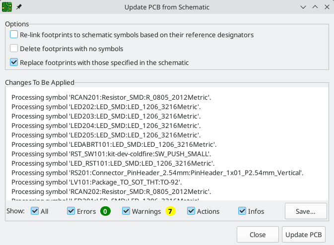
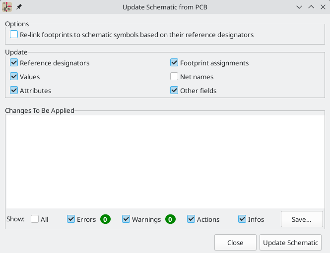

:experimental:

[[schematic-to-pcb]]
== Forward and back annotation

=== Update PCB from Schematic (forward annotation)

Use the Update PCB from Schematic tool to sync design information from the
Schematic Editor to the Board Editor. The tool can be accessed with **Tools** ->
**Update PCB from Schematic** (kbd:[F8]) in both the schematic and board
editors. You can also use the

icon in the top toolbar of the Board Editor. This process is often called
forward annotation.

NOTE: Update PCB from Schematic is the preferred way to transfer design
information from the schematic to the PCB. In older versions of KiCad, the
equivalent process was to export a netlist from the Schematic Editor and import
it into the Board Editor. It is no longer necessary to use a netlist file.

The tool adds the footprint for each symbol to the board and transfers updated
schematic information to the board. In particular, the board's net connections
are updated to match the schematic. Symbols with the
<<editing-symbol-properties,**Exclude from board** attribute>> are not
transferred to the PCB.

The changes that will be made to the PCB are listed in the _Changes To Be
Applied_ pane. The PCB is not modified until you click the **Update PCB**
button.

You can show or hide different types of messages using the checkboxes at the
bottom of the window. A report of the changes can be saved to a file using the
**Save...** button.

==== Options

The tool has several options to control its behavior.

[cols="1,2"]
|===
| Option | Description

| Re-link footprints to schematic symbols based on their reference designators
| Footprints are normally linked to schematic symbols via a unique identifier
created when the symbol is added to the schematic. A symbol's unique identifier
cannot be changed.

If checked, each footprint in the PCB will be re-linked to the symbol that has
the same reference designator as the footprint.

If unchecked, footprints and symbols will be linked by unique identifier as
usual, rather than by reference designator. Each footprint's reference
designator will be updated to match the reference designator of its linked
symbol.

This option should generally be left unchecked. It is useful for specific
workflows that rely on changing the links between schematic symbols and
footprints, such as refactoring a schematic for easier layout or replicating
layout between identical channels of a design.

| Delete footprints with no symbols
| If checked, any footprint in the PCB without a corresponding symbol in the
schematic will be deleted from the PCB. Footprints with the "Not in schematic"
attribute will be unaffected.

If unchecked, footprints without a corresponding symbol will not be deleted.

| Replace footprints with those specified in the schematic
| If checked, footprints in the PCB will be replaced with the footprint that is
specified in the corresponding schematic symbol.

If unchecked, footprints that are already in the PCB will not be changed, even
if the schematic symbol is updated to specify a different footprint.
|===

[[backannotation]]
=== Update Schematic from PCB (back annotation)

The typical workflow in KiCad is to make changes in the schematic and then sync
the changes to the board using the Update PCB From Schematic tool. However, the
reverse process is also possible: design changes can be made in the board and
then synced back to the schematic using **Tools** -> **Update Schematic From
PCB** in either the schematic or board editors. This process is also known as
backannotation.

The tool syncs changes in reference designators, values, attributes (like DNP or
Exclude From BOM), footprint assignments, other fields, and net names from the
board to the schematic. Each type of change can be individually enabled or
disabled.

The changes that will be made to the schematic are listed in the _Changes To Be
Applied_ pane. The schematic is not modified until you click the **Update
Schematic** button.

You can show or hide different types of messages using the checkboxes at the
bottom of the window. A report of the changes can be saved to a file using the
**Save...** button.

==== Options

The tool has several options to control its behavior.

[cols="1,2"]
|===
| Option | Description
| Re-link footprints to schematic symbols based on their reference designators
| If checked, each footprint in the PCB will be re-linked to the symbol that has
the same reference designator as the footprint. This option is incompatible with
updating symbol reference designators.

If unchecked, footprints and symbols will be linked by unique identifier as
usual, rather than by reference designator.

| Reference designators
| If checked, symbol reference designators will be updated to match the
reference designators of the linked footprints.

If unchecked, symbol reference designators will not be updated.

| Values
| If checked, symbol values will be updated to match the values of the linked
footprints.

| Values
| If checked, symbol attributes (like exclude from BOM and DNP) will be updated
to match the corresponding attributes of the linked footprints.

If unchecked, symbol values will not be updated.

| Footprint assignments
| If checked, footprint assignments will be updated for symbols which have had
their footprints changed or replaced in the board. 

If unchecked, symbol footprint assignments will not be updated.

| Net names
| If checked, the schematic will be updated with any net name changes that have
been made in the board. Net labels will be updated or added to the schematic as
necessary to match the board.

| Other fields
| If checked, other symbol fields will be updated to match the corresponding
fields of the linked footprints. Reference designator, value, and footprint are
each controlled by their own separate option.

If unchecked, net names will not be updated in the schematic.
|===

NOTE: The xref:../pcbnew/pcbnew.adoc#geographical-re-annotation[Geographical Reannotation]
      feature can be used in combination with backannotating reference
      designators to reannotate all components in the design based on their
      location in the layout.

==== Back annotation with CMP files

Select changes can also be synced from the PCB back to the schematic by
exporting a CMP file from the PCB editor (**File** -> **Export** -> **Footprint
Association (.cmp) File...**) and importing it in the Schematic Editor (**File**
-> **Import** -> **Footprint Assignments...**).

NOTE: This method can only sync changes made to footprint assignments and
footprint fields. It is recommended to use the Update Schematic from PCB tool
instead.