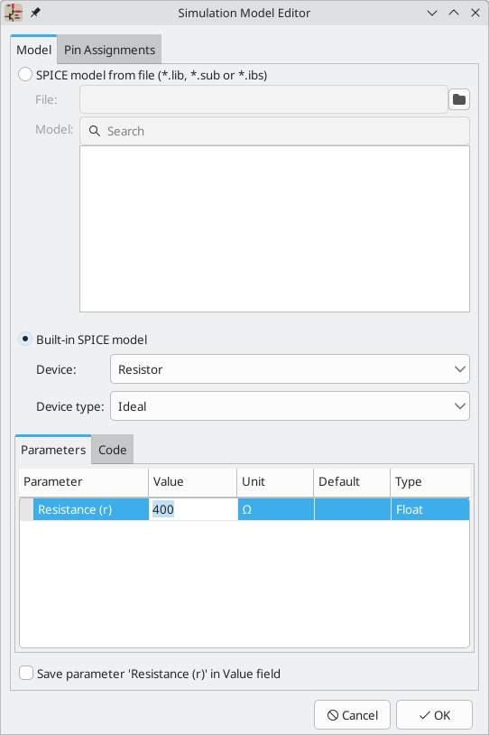
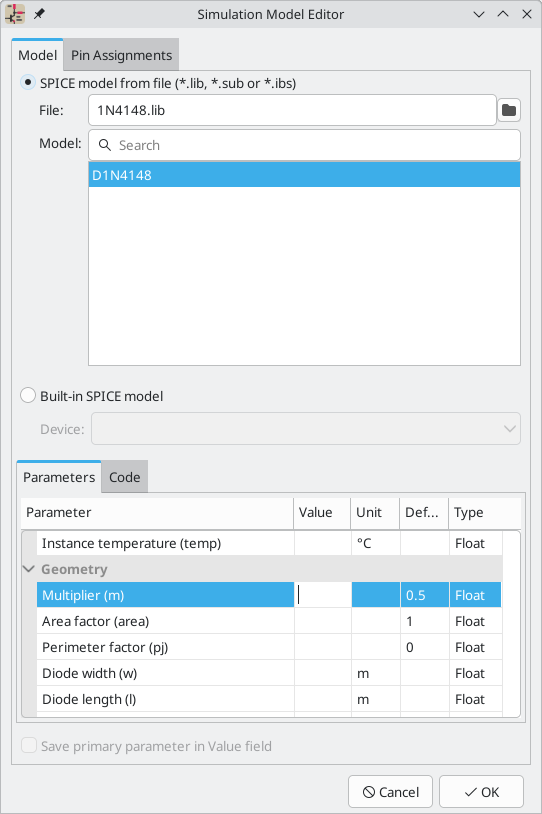
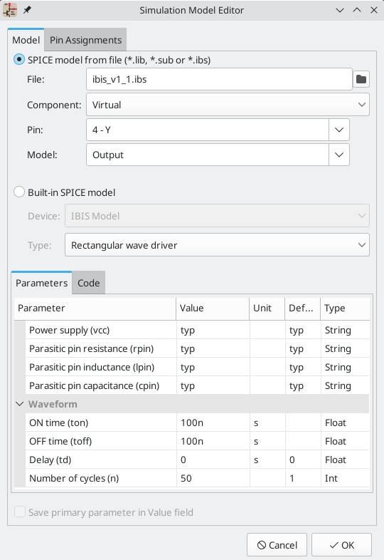
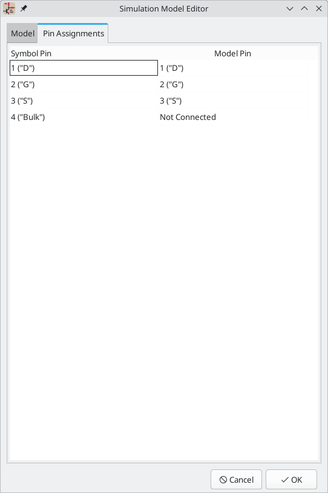
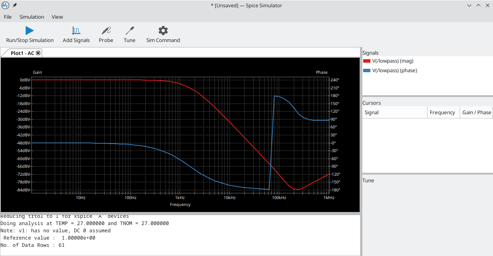
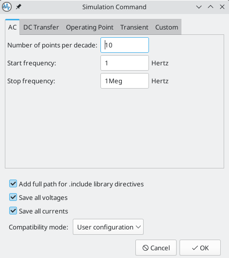
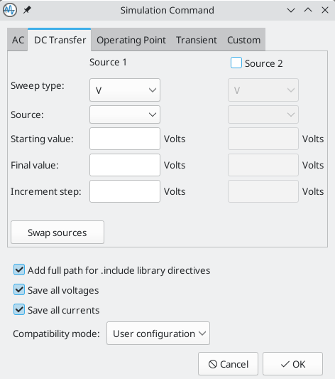
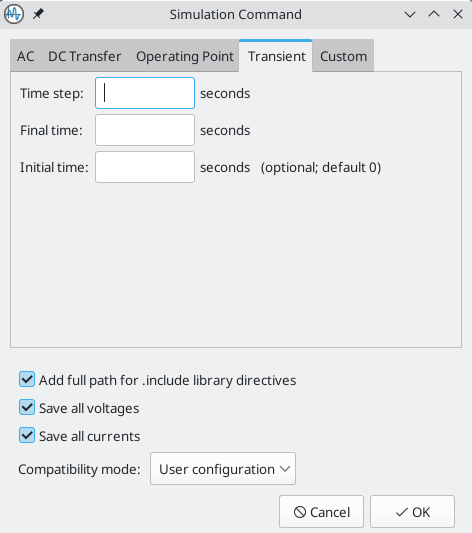
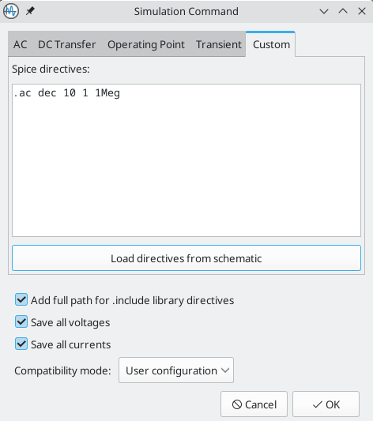
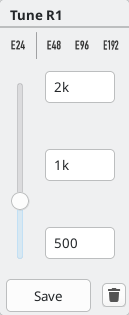

:experimental:
[[simulator]]
== Simulator ==

KiCad provides an embedded electrical circuit simulator using
http://ngspice.sourceforge.net[ngspice] as the simulation engine. ngspice is a SPICE simulator derived from the original widely used Berkeley SPICE program.

When working with the simulator, the `Simulation_SPICE` symbol library, installed with KiCad by default, may be useful. It contains common elements used for simulation such as
voltage and current sources, DC and AC signal sources, a ground reference, ideal passive circuit elements such as resistors, inductors and capacitors, and numerous other generic semiconductor device models.

While these elements enable a great variety of simulation work, users familiar with SPICE in other environments will be used to incorporating models of commercially-available semiconductors, integrated circuits and other devices as more complex SPICE models. Indeed, semiconductor manufacturers often freely supply these to help users simulate and develop circuits using their parts. Note that while KiCad does not include any commercial SPICE models in its distribution, you are free to use any models you may have, or have used with other circuit simulators, in KiCad's simulator.

In general, if a model works with other SPICE simulators, it should work with the KiCad simulator, although some SPICE simulators implement extensions that are unsupported by ngspice. ngspice offers several compatibility modes to improve compatibility with other simulators.

Finally, to quickly showcase the capabilities of the KiCad simulator, some demonstration projects are included in the KiCad distribution. They can be found in the `demos/simulation` directory.

=== Value notation
The simulator supports several notations for writing numerical values:

* Plain notation : `10100`, `0.003`,
* Scientific notation: `1.01e4`, `3e-3`,
* Prefix notation: `10.1k`, `3m`.
* RKM notation: `4k7`, `10R`.

You can mix prefix and scientific notations. As such, `3e-4k` is a
valid input and is equivalent to `0.3`. The list of valid prefixes is shown
below. They are case sensitive.

[width="50%",cols="1,1,1",]
|====
| Prefix | Name | Multiplier

| a | atto | 10^-18^ 
| f | femto | 10^-15^ 
| p | pico | 10^-12^ 
| n | nano | 10^-9^ 
| u | micro | 10^-6^ 
| m | milli | 10^-3^ 
| k | kilo | 10^3^ 
| M | mega | 10^6^ 
| G | giga | 10^9^ 
| T | tera | 10^12^ 
| P | peta | 10^15^ 
| E | exa | 10^15^ 
|====

[NOTE]
<<sim-builtin,Raw SPICE Element>> models and <<sim-directives,directives>> are
passed to ngspice directly, without KiCad reformatting the values for ngspice to
consume. Ngspice uses a different, case-insensitive notation: 1 mega (10^6^) is
denoted there as `1Meg`, while `1M` is 1 milli (10^-3^). Depending on the
compatibility mode selected, ngspice may not support the same value notations as
KiCad, so care should be taken when using raw SPICE elements and simulation
directives.

=== Assigning models

You need to assign simulation models to symbols before you can simulate your
circuit.

Each symbol can have only one model assigned, even if the symbol consists of
multiple units. For symbols with multiple units, you should assign the model to
the first unit.

SPICE model information is stored as text in symbol fields. Therefore you may
define it in either the symbol editor or the schematic editor. To assign a
simulation model to a symbol, open the Symbol Properties dialog and click the
**Simulation Model...** button, which opens the Simulation Model Editor dialog.

You can exclude a symbol from simulation entirely by checking the
**exclude from simulation** checkbox in the Symbol Properties dialog.

[[sim-inferred]]
==== Inferred models

Resistor, inductor, and capacitor models can be inferred, which means that KiCad
will detect that they are passives and automatically assign an appropriate
simulation model. Therefore they do not require any special settings; users only
need to set the `Value` field of the symbol.

KiCad infers simulation models for symbols based on the following criteria:

* The symbol has exactly two pins,
* The reference designator begins with `R`, `L` or `C`.

Inferred models are ideal models. If the simulation requires a non-ideal model, for example an inductor with parasitic capacitance included, you must explicitly assign a model that includes it.

[[sim-built-in]]
==== Built-in models
KiCad offers several standard simulation models. They do not require an
external model file, and their parameters can be edited in KiCad's Simulation
Model Editor GUI. The following devices are available:

* Resistors (including potentiometers)
* Capacitors
* Inductors
* Transmission lines
* Switches
* Voltage and current sources
* Diodes
* Transistors (BJTs, MOSFETs, MESFETs, and JFETs)
* XSPICE code models
* Raw SPICE elements

To add a built-in model to a symbol, open the Simulation Model Editor dialog
(**Symbol Properties** -> **Simulation Model...**) and select
**Built-in SPICE model**. You can then select the kind of device from the
**device** dropdown and the device subtype from the **device type**
dropdown.

Refer to the https://ngspice.sourceforge.io/docs.html[ngspice documentation] for
more details about these models and their parameters.

**Device** sets the type of device to simulate: a resistor, BJT, voltage source,
etc. This value is stored in the symbol's `Sim.Device` field.

**Device type** selects the type of model to use for the device. Most devices
have several types of models to choose from. Models may vary in their degree of
accuracy, which characteristics they are optimized for, what parameters they
have available, and how many pins they have. For example, the **ideal**
resistor type models a simple resistor with two terminals and a single
`resistance` parameter, while the **potentiometer** resistor type models an
adjustable resistor with three terminals and an additional parameter for wiper
position. Some devices have an especially large number of types to choose from:
N-channel MOSFETs, for example, have 17 available types, each of which uses a
different mathematical model to simulate the transistor behavior. One model may
be more or less appropriate than another for simulating a specific device or
circuit or for performing a particular analysis. Refer to the
https://ngspice.sourceforge.io/docs.html[ngspice documentation] for detailed
information about models and their parameters. The **device type** value is
stored in the symbol's `Sim.Type` field.

The **parameters** tab displays the parameters of the model and lets you edit
them. For example, a resistor's resistance, a voltage source's waveform, a
MOSFET's width and length, etc. Any parameters that differ from the model's
defaults are stored in the symbol's `Sim.Params` field.

The **code** tab displays the generated SPICE model as it will be written to the
SPICE netlist for simulation.

The **Save parameter '<parameter name>' in Value field** checkbox uses the
symbol's `Value` field for storing parameters instead of the `Sim.Params` field.
This may make it easier to edit simple models from the schematic, without
opening the Simulation Model Editor. This option is only available for ideal
passive models (R, L, C) and DC sources. If the field `Sim.Params` exists in the
symbol, it will take priority over the `Value` field.

[[sim-library]]
==== Library models

KiCad can also load SPICE models from external files, and this is typically how you will add a SPICE model of a specific commercially-available part (say, a 555 timer, or a TL071 operational amplifier, for example) to your simulation. These models must be in a standard SPICE format and must not be encrypted. Models such as these are readily available from numerous sources - manufacturer's web-sites being just one example.

To load a model from an external file, open the Simulation Model Editor dialog
(**Symbol Properties** -> **Simulation Model...**) and select
**SPICE model from file**.

**File** is the path to the model file to use. Unencrypted model files are plain, human-readable text files and often have extensions such as `.lib`, `.sub` etc., although KiCad will accept a valid model with any extension.

The path to the file can be absolute, or relative to the project folder. The path can also be relative to the value of `SPICE_LIB_DIR` if you have
xref:../kicad/kicad.adoc#kicad-environment-variables[defined that path variable].
The library filename is saved in the symbol's `Sim.Library` field.

**Model** is the name of the desired model in the model file. A model file may contain multiple models, and if so they will all be shown in the list. You can filter the list of models using the search box. The selected model is listed in the symbol's `Sim.Name` field.

Parameters can be overridden (or additional parameters specified) using
the **Parameters** tab. All parameters specified in the selected model or the
**Parameters** tab are stored in the symbol's `Sim.Params` field.

The **Code** tab displays the generated SPICE model as it will be written to the
SPICE netlist for simulation.

[NOTE]
KiCad is not distributed with SPICE models for specific commercial devices. These models are usually available from device manufacturers or other internet sources.

[[ibis-library]]
==== Library models (IBIS)

IBIS (I/O Buffer Information Specification) files are an alternative to SPICE
models for modeling the behavior of input/output buffers on digital parts. In
order to load an IBIS file, users should follow the procedure for SPICE library
models, but provide a `.ibs` file.

**File** is the path to the model file to use. The path can be absolute or
relative to the project folder. The path can also be relative to the value of
`SPICE_LIB_DIR` if you have
xref:../kicad/kicad.adoc#kicad-environment-variables[defined that path variable].
The library filename is saved in the symbol's `Sim.Library` field. If an IBIS
model file is loaded, the remaining fields in the dialog will relate to the IBIS
model.

**Component** selects which component from the IBIS file to use, as IBIS files
can contain multiple components. The component name is saved in the symbol's
`Sim.Name` field.

// TODO, mention "differential" checkbox
**Pin** selects which pin in the IBIS model to simulate. The selected pin must
be mapped to a symbol pin in the **Pin Assignments** tab. The chosen pin's
number is saved in the symbol's `Sim.Ibis.Pin` field.

**Model** is the list of models available for the selected pin, for example an
input or an output. The chosen model name is saved in the symbol's
`Sim.Ibis.Model` field.

**Type** selects what the pin should do in the simulation. A pin can be a passive
**device** that doesn't drive any value; it can be a **DC driver** that drives
high, low, or high-impedance; or it can be a **rectangular wave** or
**PRBS driver**.  This value is stored in the symbol's `Sim.Type` field.

The **Parameters** tab lets you see and edit the parameters of the model. For
each parameter, you can switch between a minimum, typical, or maximum value, as
defined in the IBIS file. You can also choose the parameters of the driven
waveform, depending on the pin's chosen **type**. Any parameters that differ
from the defaults are stored in the symbol's `Sim.Params` field.

[NOTE]
KiCad does not ship with IBIS models for symbols. IBIS models are usually
available from device manufacturers.

[NOTE]
KiCad's `Simulation_SPICE` symbol library provides several symbols that may be
useful for IBIS simulations. `IBIS_DEVICE` can be used for device (input) pins,
while `IBIS_DRIVER` can be used for simulating driver pins. There are also
variants of each for differential pins.

[[simulation-pin-assignment]]
==== Pin Assignment

Simulation models may have their pins numbered differently than the
corresponding symbol. For example, SPICE models for diodes usually consider
pin 1 to be the anode, while schematic symbols are usually drawn with pin 1 as
the cathode. Operational amplifier models are also very likely to have model pin assignments that do not match package or schematic pin numbers.

You can use the Simulation Model Editor's **Pin Assignments** tab to map the
symbol's pins to the simulation model pins.

NOTE: Always make sure symbol pins are correctly mapped to simulation model
      pins. Mistakes here can lead to erroneous or confusing simulation results, or a failure to simulate at all.

The left column displays the name and number of each symbol pin, i.e. the pin numbers and names that appear on the schematic part in KiCad. The right column displays the corresponding pin as defined in the model file in use. For each symbol pin, you can select the corresponding pin from the simulation model in the dropdown in the right column. In the cases where a schematic part has pins that are not in the model, as in the case of an operational amplifier with 'nulling' pins that are not modeled, the schematic part pin may be assigned to the 'Not Connected' option in the Pin Assignments dropdown. Unlike other pin assignments, 'Not Connected' may be assigned to multiple pins if necessary.

When you use a subcircuit model, the dialog displays the model's code under the
pin assignments for use as a reference while assigning pins. A well-written model will often include a helpful reference section (as a set of comments) to inform the user how the model pins are mapped.

[[sim-directives]]
=== SPICE directives

It is possible to add SPICE directives by placing them in text fields on a
schematic sheet. This approach is convenient for defining the default
simulation type. The list of supported directives in text fields is:

* Directives starting with a dot (e.g. `.tran 10n 1m`)
* Coupling coefficients for inductors (e.g. `K1 L1 L2 0.89`)

It is not possible to place additional components using text fields.

If a simulation command is included in schematic text, the simulator will use
it as the simulation command when you open the simulator. However, you can
override it in the Simulation Command dialog.

Refer to the https://ngspice.sourceforge.io/docs.html[ngspice documentation] for
more details about SPICE directives.

=== Running simulations

Circuits for simulation are drawn in the Schematic Editor, but simulations are run in the Simulator window.

==== User Interface

To run a simulation, open the SPICE simulator dialog by clicking 
**Inspect** -> **Simulator** in the schematics editor window or using the
 button in the top toolbar.

The dialog is divided into several sections:

* The top of the window has a toolbar with buttons for commonly used actions.

* The main part of the window graphically shows the simulation results. Signals
  need to be selected from the list of available signals or probed before they are displayed in the plot.

* Below the plot panel, the output console shows logs from the ngspice simulation
  engine.

* The right side of the window displays a list of signals, a list of
  active cursors, measurements, and a tuning tool for adjusting component values based on
  simulation results.

==== Workbooks

Workbooks are files that store information about the simulation environment,
including simulation setup parameters and the list of signals available for use.
They can be used to store the setup for a set of analyses, which can then be
reloaded and rerun at a later time. A workbook can include more than one simulation - for example, it may contain separate tabs for Transient (TRAN), Operating Point (OP), and Small Signal AC (AC) analyses which you added as you worked.

You can save a workbook using **File** -> **Save Workbook** and load one using 
**File** -> **Open Workbook**.

NOTE: Workbooks store simulation setup information, but they do not store
      simulation results. You can export simulation results to PNG (graphics) or
      CSV (simulation data values) with **File** -> **Export Current Plot as PNG...** and
      **File** -> **Export Current Plot as CSV...**. To recreate the results of simulations stored in a workbook, select the appropriate analysis tab in the Simulator window and run the simulation again (kbd:[R] or **Simulation** -> **Run Simulation**).

==== Running a Simulation

Before running a simulation, you need to select a simulation type and set the
simulation parameters. This can be done using **Simulation** -> **Settings...**
or the **Sim Command** button () and then
selecting one of the available analysis types:

* **OP** -- DC Operating Point
* **DC** -- DC Sweep Analysis
* **AC** -- AC Small-signal Analysis
* **TRAN** -- Transient Analysis
* **PZ** -- Pole-zero Analysis
* **NOISE** -- Noise Analysis
* **SP** -- S-parameter Analysis
* **FFT** -- (Fourier Transform) Frequency-content Analysis

These analysis types are explained in detail in the https://ngspice.sourceforge.io/docs.html[ngspice documentation].

Another way to configure a simulation is to type <<sim-directives,SPICE directives>> into text fields on schematics. Any text field directives related to a simulation command are overridden by the settings selected in the dialog. This means that once a simulation has run, the dialog
overrides the schematic directives until the simulator is reopened.

Once the simulation command is set, a simulation can be started with
**Simulation** -> **Start Simulation** (kbd:[Ctrl+R]) or the
**Run/Stop Simulation** button
().

===== AC analysis

Calculates the small-signal AC behavior of the circuit in response to a
stimulus. Performs a decade sweep of stimulus frequency.

To run an AC analysis you must choose a number of points to measure per decade
and the start and end frequencies for the decade sweep.

The output is displayed as a Bode plot (output magnitude and phase vs. frequency).

===== DC transfer analysis

Calculates the DC behavior of the circuit while sweeping one or two parameters: source values
(voltage or current), resistor values, or the simulation temperature.

To run a DC analysis, you must choose what type of sweep(s) to perform, which
source(s), resistor(s), or temperature value(s) to sweep, and what the sweep range(s)
and step(s) should be.

The output is displayed as a plot.

===== Operating point analysis

Calculates the DC operating point of the circuit. This analysis has no options,
and results are printed to the SPICE log and also displayed as labels giving the nodal voltages and currents at the operating point, added to the circuit schematic.

===== Transient analysis

Calculates the time-varying behavior of the circuit.

To run a transient analysis, you need to specify a suggested time step and a
final simulation time. You can optionally specify a starting time to override
the default of 0.

The output is displayed as a plot.

===== Custom analysis

A custom analysis lets you write SPICE commands to set up the analysis. Press
the **Load directives from schematic** button to copy any SPICE directives in
schematic text into the custom analysis textbox.

Refer to the https://ngspice.sourceforge.io/docs.html[ngspice documentation] for
more information about analysis commands.

===== Additional simulation settings

There are several simulation options that apply to all types of simulations.

**Add full path for .include library directives** controls whether to convert
relative paths to absolute in `.include` directives in schematic text.

**Save all voltages** and **Save all currents** controls whether the simulator
saves voltages and currents, respectively, for internal nodes of devices. When
unchecked, the simulator only saves voltages and currents for external nodes.

The **Compatibility mode** dropdown selects the compatibility mode that the
simulator uses to load models. The **User configuration** option refers to the
user's `.spiceinit` ngspice configuration file. Compatibility modes are
described in the https://ngspice.sourceforge.io/docs.html[ngspice documentation].

==== Probing signals

===== Using the signal list

You can display a list of available signals with **Simulation** ->
**Add signals** (kbd:[Ctrl+A] hotkey or 
 button). Double
clicking an element in the list will add it to list of probed signals. Several
signals can be selected at once using the kbd:[Ctrl] / kbd:[Shift] keys.

===== Using the probe tool 

A probe tool is available in the toolbar of the simulator window
(), which provides a user-friendly way of
selecting signals for plotting. When activated, users can click elements in the
schematic editor. To probe a voltage, click a wire with the probe tool. When
hovering over wires with the tool, the corresponding net is highlighted. To
probe a current, click on a symbol pin. When hovering over a pin, the cursor
will change from a voltage probe symbol to a current clamp symbol. It is not
possible to probe power signals with this tool.

===== Using a SPICE directive

While ngspice supports the `.plot` directive, it cannot be used in current
versions of KiCad.

===== Differential voltage

Probing differential voltages usually requires a simulation symbol. One is
available in `Simulation_SPICE:VOLTMETER_DIFF` in the official libraries. This
symbol has two terminals for differential voltage sensing, and one the user can
probe.

[NOTE]
A SPICE model called `kicad_builtin_vdiff` is preassigned to the built-in
`VOLTMETER_DIFF` symbol. Users should not define a SPICE model with the same
name.

It is also possible to probe across two-terminal devices such as a resistor by
placing the `.probe vd(X)` directive, where `X` is the name of the device (such
as `R1`). Then in order to probe it, enter `vd_X` when adding a signal using the
list of signals. Note that the signal will not appear in the list of signals, it
should be typed in by the user. This method has the advantage of not adding
extra symbols to the schematic sheet.

////
// TODO: AMMETER_DIFF is not in the official libs
===== Differential currents

Probing differential currents can be performed using the
`Simulation_SPICE:AMMETER_DIFF` symbol in the official libraries. It has four
input terminals, and two that should be shunted together. The latter two are
used for probing.

[NOTE]
A SPICE model called `kicad_builtin_adiff` is automatically called when using
the builtin `AMMETER_DIFF` symbol. Users should not define a SPICE model with
the same name.
////

===== Remove a signal probe

In order to remove a signal probe, clear its checkbox in the Signal list at the top-right of the simulator window.

==== Tuning components

It is possible to adjust the value of basic components in the schematic from
within the simulation interface, which lets you conveniently adjust component
values based on simulation results. Each time the component value is tuned, the
simulation is re-run with the new component value. You can tune the value of
passive resistors, inductors, and capacitors, or the voltage or current of DC
voltage and current sources.

To tune a component, use **Simulation** -> **Add Tuned Value...**, the keyboard
shortcut kbd:[T], or the  button in
the toolbar, and then click on the component to tune in the schematic. This adds
a tuning control for that component in the bottom right corner of the simulator
window. Multiple components can be tuned at once, with a separate tuning control
per component.

* The top text field sets the top end of the tuning range.
* The bottom text field sets the bottom end of the tuning range.
* The middle text field sets the actual component value that is used in the
  simulation. This value can also be adjusted using the slider.
* The **Save** button updates the schematic symbol with the tuned value. Until
  you press the **Save** button, the schematic symbol will keep its original
  value.
* The image:images/icons/small_trash_16.png[trash icon] button removes the
  component from the Tune panel and restores its original value.

In addition, it is possible to restrict the component values to those from a particular series of Preferred Values -- either of the E24, E48, E96 or E192 series. This is particularly useful when it is necessary to restrict component values to commercially available parts.

==== Visualizing results

===== Plots

Simulation results from the TRAN, AC, DC, NOISE, SP and FFT analyses are visualized as plots. As multiple analyses can be performed there can be multiple plots open in separate tabs, but only the active tab is updated when a simulation is executed. In this way it is possible to compare simulation results for different runs.

[NOTE]
Simulation results from OP and PZ analyses do not generate plots. Instead, they present their results in the Simulator output command window and, in the case of OP, as labels added to the source schematic.

You can zoom and move a plot using the following gestures:

* Scroll mouse wheel to zoom in/out. kbd:[Shift], kbd:[Ctrl], and kbd:[Alt] can
  modify the scroll action depending on the configuration in the Simulator panel
  in the Schematic Editor Preferences.
* Right click to open a context menu to adjust the view.
* Draw a selection rectangle to zoom in the selected area.
* Drag a cursor to change its coordinates.

====== Plot appearance

Colors of individual signals may be set by clicking the **Color** field associated with each signal in the Signals pane. You may choose from a predefined palette (**Defined Colors**), or select a custom color (**Color Picker**).

Plotted signals representing current or phase can be displayed with a dotted trace by selecting **View** -> **Dotted Current/Phase**. In AC simulations, this plots phases using dotted lines and gains using solid lines. In transient simulations, this plots currents using dotted lines and voltages using solid lines.

To show a grid behind the plotted signals, select **View** -> **Show Grid**. You can change the plot background color to either black or white using **View** -> **Dark Mode Plots**. When selected, the background color is black. When not selected, the background color is white.

You can show a plot legend using **View** -> **Show Legend**. You can drag the legend to reposition it.

===== Cursors

For precise measurement, cursors are available in the plot window. They are enabled and selected from within the signal pane on the right, using the checkboxes **Cursor 1** and **Cursor 2**. Each cursor is identified by a number in a triangular marker at the top of the plot pane. Cursors are moved and positioned within the plot window by clicking and dragging them.

===== Measurements

Measurements are associated with signals on plots.

[NOTE]
Measurements are made over **all the data** resulting from the simulation, not just the data that is visible in the plot window at the current zoom setting. This may be confusing in certain circumstances.

[NOTE]
It is not necessary to have selected a signal for plotting (by selecting its Plot checkbox) in order to make a measurement on it. Even unselected, and therefore unplotted, signals can be measured.

Predefined measurements associated with a signal are available by a right-click over a signal row which invokes a pop-up menu offering the following measurements:

* **Measure Min**: measures the minimum value of the entire signal,
* **Measure Max**: measures the minimum value of the entire signal,
* **Measure RMS**: measures the root-mean-square value of the entire signal,
* **Measure Peak-to-peak**: measures the peak-to-peak value of the entire signal,
* **Measure Time-of-min**: measures the time at which the minimum value of the entire signal occurs,
* **Measure Time-of-max**: measures the time at which the maximum value of the entire signal occurs,
* **Measure Integral**: computes the time integral value of the entire signal.

Measurement results are displayed in the Measurement pane at the lower right of the Simulator window. Multiple measurements will display as multiple rows in this area.

===== Numerical values

Some analysis types, such as the DC operating point analysis (OP), do not
have any graphical output to plot. Instead, their output is printed in the SPICE
console. In the case of the DC operating point analysis, labels are also added to the schematic indicating the operating point voltage and current values at the nodes.

==== Exporting results

KiCad's simulator offers two ways to export results:

* as a PNG (Portable Network Graphics format) image of a simulation data plot,
* as a plain text file of simulation data values, in CSV (Comma-Separated Value) format.

Only simulations that produce plots (see above) can be exported as an image or a CSV file. The results of OP and PZ analyses cannot be exported in this way.

===== Exporting the simulator plot as a graphics file

The currently-visible Simulator plot may be exported as a PNG file using the command **File** -> **Export Current Plot as PNG...**.

The size and aspect-ratio of the saved image will match that of the displayed plot in the Simulator.

===== Exporting the simulator plot as numerical data

The currently-visible Simulator plot may be exported as a CSV file using the command **File** -> **Export Current Plot as CSV...**.

The data in the simulation plot is exported as multiple columns. The precise format is dependent upon the analysis type. In general, there will be multiple columns of data, one corresponding to each variable selected for plotting. The first row of the file is a header row, containing the name of the variable in the column (i.e. 'time', 'V(/Vout)1' or similar).

[NOTE]
When exporting to CSV, only variables selected using their Plot checkbox will be included in the exported file.

[NOTE]
The data in the exported file contains all the data that would be plotted if the entire plot were displayed. If the plot is zoomed in to show a particular region this will still be the case, resulting in the output file containing more data than the user might expect.

[NOTE]
This function exports the data with data separated by semicolons (`;`) rather than commas. Programs reading this data may need to be configured to expect a semicolon as a delimiter.

==== Troubleshooting

Sometimes a simulation will fail, either with or without errors being reported. Paying attention to the error messages reported, taking care in the development and entry into KiCad of the circuit to be simulated, and making use of the KiCad, ngspice and general SPICE documentation and information from fellow users in forums is very worthwhile and can often point the way to a solution.

It's worth noting, for users unfamiliar with SPICE, ngspice or circuit simulation in general that some 'common' and interesting circuits can sometimes be tricky to simulate accurately or reliably. These include apparently simple circuits such as oscillators, which in some cases may fail to oscillate at all! It is nearly always possible to build a working simulation but sometimes this can more require SPICE experience than might be initially apparent, or the guidance of someone who already has it. The ngspice documentation, once again, is worth reading for insights into good and effective simulation practices if you are encountering difficulty.

===== Incorrect netlist

It is possible to inspect the SPICE netlist with **Simulation** ->
**Show SPICE netlist...**. This method of troubleshooting requires some SPICE
knowledge, but spotting errors in the netlist can help determine the cause of
simulation problems, as well as providing confirmation of what input ngspice is actually acting on.

===== Simulation error messages

The output console displays messages from the simulator. It is advisable to check
the console output to verify there are no errors or warnings. Messages appearing
in the console may be conveniently selected, copied, and pasted if you wish to
share them.

A common error message is "timestep too small". This message means that the
simulation engine is unable to calculate the next point in the simulation, even
when using the minimum possible time increment. This error can have many causes,
including numerical convergence issues with a simulation model used in the
circuit or with the circuit itself. It can also be caused by mistakes in
drawing the circuit, such as incorrectly
<<simulation-pin-assignment,assigning pins to the simulation model>> or
forgetting to provide a voltage supply.

===== Convergence problems

In case the simulation does not converge in a reasonable amount of time (or not
at all), it is possible to add the following SPICE directives. More information
is available in the ngspice manual.

[WARNING]
Changing convergence options can lead to erroneous results. These options should
be used with caution. 

....
.options gmin=1e-10 
.options abstol=1e-10 
.options reltol=0.003 
.options cshunt=1e-15 
....

* `gmin` is the minimum conductance allowed by the program.
  The default value is `1e-12` (1 pS).
* `abstol` is the absolute current error tolerance of the program. The default
  value is `1e-12` (1 pA).
* `reltol` is the relative error tolerance of the program. The default value is
  `0.001` (0.1%).
* `cshunt` adds a capacitor of the specified value from each voltage node in the
  circuit to ground.

===== Incorrect assignments of pins between the schematic and the SPICE model

If unexpected results are generated by a simulation despite it running without
obvious errors, it is worth double-checking that the
<<simulation-pin-assignment,assignments between the pins of the part instance in the KiCad schematic and that of the associated model>>
are correct. These have to be correct for each instance of the model in the schematic.

=== Helpful hints
Some helpful tips, hints and advice to help you get the most from using ngspice in KiCad for simulation.

==== The ngspice manual is your friend!
Fundamentally the KiCad Simulator is a user-friendly front-end to the powerful ngspice circuit simulator. Therefore problems with the details of simulation, the correct use of SPICE elements, models, etc. is beyond the scope of the KiCad documentation but is very likely to be fully and completely addressed in the ngspice documentation itself. It's therefore recommended not to overlook this https://ngspice.sourceforge.io/docs.html[valuable resource].

[NOTE]
KiCad updates may result in changes to the ngspice version used by the simulator. The current version of ngspice used in a particular version of KiCad is shown on the **Help** -> **About KiCad** dialog, under the **Version** tab. Referring to the online ngspice documentation will ensure you always have access to the latest information for reference.

==== Organizing third-party models
Although it is certainly possible to keep simulation models (i.e. `.lib`, `.sub` files) in the directories associated with individual KiCad projects, this will likely result in unnecessary copies of model files proliferating as you create simulations. Consider creating a dedicated storage location (directory, folder) for models, perhaps organized by manufacturer or device type, to hold these files. Then they may simply be referenced in simulations at a common location.
