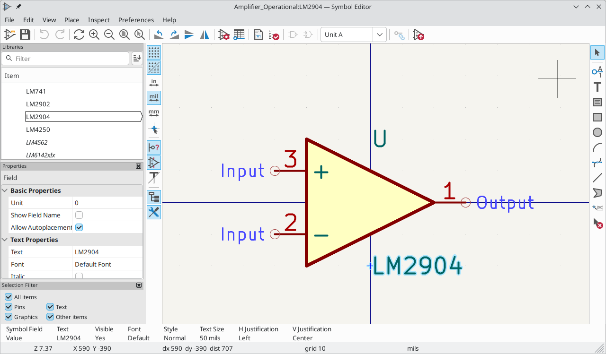

:experimental:

[[symbols-and-symbol-libraries]]
== Symbols and Symbol Libraries

KiCad organizes symbols into symbol libraries, which hold collections of
symbols. Each symbol in a schematic is uniquely identified by a full name that
is composed of a library nickname and a symbol name. For example, the identifier
`Audio:AD1853` refers to the `AD1853` symbol in the `Audio` library.

[[managing-symbol-libraries]]
=== Managing symbol libraries

KiCad uses a table of symbol libraries to map a symbol library nickname to an
underlying symbol library on disk.  Kicad uses a global symbol library table as
well as a table specific to each project. To edit either symbol library table,
use **Preferences** ->
**Manage Symbol Libraries...**.

image::images/en/options_symbol_lib.png[scaledwidth="80%",alt="sym lib table dlg"]

The global symbol library table contains the list of libraries that are
always available regardless of the currently loaded project. The table is
saved in the file `sym-lib-table` in the KiCad configuration folder.
xref:../kicad/kicad.adoc#config-file-location[The location of this folder]
depends on the operating system being used.

The project specific symbol library table contains the list of libraries that
are available specifically for the currently loaded project. If there are any
project-specific symbol libraries, the table is saved in the file
`sym-lib-table` in the project folder.

KiCad's symbol library management system allows directly using many types
of symbol libraries, including formats that are native to other non-KiCad EDA
tools:

* KiCad symbol libraries (`.kicad_sym` files)
* KiCad Legacy symbol libraries (`.lib` files)
* Altium Designer libraries (`.SchLib` or `.IntLib` files)
* CADSTAR Schematic Archive libraries (`.lib` files)
* <<database-libraries,KiCad database library configuration files>> (`.kicad_dbl` files)
* Eagle libraries (`.xml` files)
* EasyEDA (JLCEDA) Standard Edition libraries (`.json` files)
* EasyEDA (JLCEDA) Professional Edition libraries (`.elibz`, `.epro`, or `.zip` files)
* <<http-libraries,KiCad HTTP library configuration files>> (`.kicad_httplib` files)

Non-KiCad symbol libraries, including KiCad Legacy symbol libraries, can
be migrated to KiCad `.kicad_sym` format using the **Migrate Libraries** button
(see the <<migrating-symbol-libraries,migrating libraries>> section).

NOTE: KiCad only supports writing to KiCad's native `.kicad_sym` format symbol
libraries. All other symbol library formats are read-only. To modify a
non-KiCad format symbol library, you must first convert it to KiCad format.

==== Initial Configuration

The first time the KiCad Schematic Editor is run and the global symbol table
file `sym-lib-table` is not found in the KiCad configuration folder, KiCad will
guide the user through setting up a new symbol library table. This process is
described <<initial-configuration,above>>. You can re-run this process at any
time by clicking the **Reset Libraries**.

WARNING: Resetting your symbol library table will permanently change your symbol
         library table on disk.

==== Managing Table Entries

Symbol libraries can only be used if they have been added to either the
global or project-specific symbol library table.

Add a library either by clicking the
image:images/icons/small_folder_16.png[Folder icon] button and selecting a
library or clicking the image:images/icons/small_plus_16.png[Plus icon] button
and typing the path to a library file. The selected library will be added to the
currently opened library table (Global or Project Specific). Libraries can be
removed by selecting desired library entries and clicking the
image:images/icons/small_trash_16.png[Delete icon] button.

The image:images/icons/small_up_16.png[Up icon] and
image:images/icons/small_down_16.png[Down icon] buttons move the selected
library up and down in the library table. This does not affect the display order
of libraries in the Symbol Editor or Symbol Chooser.

Libraries can be made inactive by unchecking the *Active* checkbox in the first
column. Inactive libraries are still in the library table but do not appear in
any library browsers and are not loaded from disk, which can reduce loading
times.

A range of libraries can be selected by clicking the first library in the range
and then kbd:[Shift]-clicking the last library in the range.

Each library must have a unique nickname: duplicate library nicknames are not
allowed in the same table. However, nicknames can be duplicated between the
global and project library tables. Libraries in the project table take
precedence over libraries with the same name in the global table.

Library nicknames do not have to be related to the library filename or path. The
colon character (`:`) cannot be used in library nicknames or symbol names
because it is used as a separator between nicknames and symbols.

Each library entry must have a valid path. Paths can be defined as absolute,
relative, or by <<sym-path-variable-substitution,path variable substitution>>.

The appropriate library format must be selected in order for the library to be
properly read. The supported formats are listed above. Only KiCad format
libraries (`.kicad_sym`) can be saved. Other symbol library formats are
read-only and must be converted to KiCad format before you can modify them.

There is an optional description field to add a description of the library
entry. The option field is not used at this time so adding options will
have no effect when loading libraries.

[[sym-path-variable-substitution]]
==== Path Variable Substitution

The symbol library tables support path variable substitution, which
allows you to define path variables containing custom paths to where your
libraries are stored. Path variable substitution is supported by using
the syntax `${PATH_VAR_NAME}` in the symbol library path.

By default, KiCad defines several path variables which are described in
the xref:../kicad/kicad.adoc#kicad-environment-variables[project manager documentation].
Path variables can be configured in the **Preferences**
-> **Configure Paths...** dialog.

Using path variables in the symbol library tables allows libraries to
be relocated without breaking the symbol library tables, so long as the
path variables are updated when the library location changes.

NOTE: KiCad will automatically resolve versioned path variables from
      older versions of KiCad to the value of the corresponding variable from
      the current KiCad version, as long as the old variable is not explicitly
      defined itself. For example, `$\{KICAD8_SYMBOL_DIR\}` will
      automatically resolve to the value of `$\{KICAD9_SYMBOL_DIR\}` if there
      is no `KICAD8_SYMBOL_DIR` variable defined.

`${KIPRJMOD}` is a special path variable that always expands to the
absolute path of the current project directory. `${KIPRJMOD}` allows libraries
to be stored in the project folder without having to use an absolute path in the
project library table. This makes it possible to relocate projects without
breaking their project library tables.

==== Usage Patterns

Symbol libraries can be defined either globally or specifically to the currently
loaded project. Symbol libraries defined in the user's global table are always
available and are stored in the `sym-lib-table` file in the user's KiCad
configuration folder. The project-specific symbol library table is active only
for the currently open project file.

There are advantages and disadvantages to each method. Defining all
libraries in the global table means they will always be available when
needed. The disadvantage of this is that load time will increase.

Defining all symbol libraries on a project specific basis means that
you only have the libraries required for the project which decreases
symbol library load times. The disadvantage is that you always have
to remember to add each symbol library that you need for every
project.

One usage pattern would be to define commonly used libraries globally
and the libraries only required for the project in the project specific
library table. There is no restriction on how to define libraries.

[[migrating-symbol-libraries]]
==== Migrating symbol libraries to KiCad format

Non-KiCad format libraries, including legacy libraries (`.lib` files), are
read-only. They need to be converted to KiCad format (`.kicad_sym` files) before
you can save changes to them.

NOTE: As with most KiCad files, newer versions of KiCad can open older-format
      library files, but older versions of KiCad cannot read files once they
      have been saved by a newer version of KiCad.

Libraries in other formats can be converted to KiCad libraries by selecting them
in the symbol library table and clicking the **Migrate Libraries** button.
Multiple libraries can be selected and migrated at once by kbd:[Ctrl]-clicking
or kbd:[shift]-clicking.

Libraries can also be converted one at a time by opening them in the Symbol
Editor and saving them as a new library.

==== Legacy Project Remapping

When loading a schematic created prior to the symbol library table
implementation, KiCad will attempt to remap the symbol library
links in the schematic to the appropriate library table symbols.
The success of this process is dependent on several factors:

- the original libraries used in the schematic are still available
  and unchanged from when the symbol was added to the schematic.

- all rescue operations were performed when detected to create a
  rescue library or keep the existing rescue library up to date.

- the integrity of the project symbol cache library has not been
  corrupted.

[WARNING]
====
The remapping will make a back up of all the files that are changed
during remapping in the rescue-backup folder in the project folder.
Always make a back up of your project before remapping just in case
something goes wrong.
====

[WARNING]
====
The rescue operation is performed even if it has been disabled to
ensure the correct symbols are available for remapping.  Do not
cancel this operation or the remapping will fail to correctly
remap schematics symbols.  Any broken symbol links will have to
be fixed manually.
====

[NOTE]
====
If the original libraries have been removed and the rescue was not
performed, the cache library can be used as a recovery library as a
last resort. Copy the cache library to a new file name and add the
new library file to the top of the library list using a version of
KiCad prior to the symbol library table implementation.
====

[[symbol-editor]]
[[creating-and-editing-symbols]]
=== Creating and editing symbols

A symbol is a schematic representation of a component. A symbol is composed of:

* Graphical items (lines, circles, arcs, text, etc.) that determine how
  symbol looks in a schematic.
* Pins, which have both graphic properties (line, clock, inverted, low
  level active, etc.) and electrical properties (input, output,
  bidirectional, etc.) used by the Electrical Rules Check (ERC) tool.
* Fields, such as references, values, corresponding footprint names for
  PCB design, etc.

A symbol library is composed of one or more symbols. Generally the
symbols are logically grouped by function, type, and/or manufacturer. Each
symbol library is a single file with the `.kicad_sym` extension.

Symbols can be derived from another symbol in the same library. Derived symbols
share the base symbol's graphical shape and pin definitions, but can override
the base symbol's property fields (value, footprint, footprint filters,
datasheet, description, etc.). Derived symbols can be used to define symbols
that are similar to a base part. For example, 74LS00, 74HC00, and 7437 symbols
could all be derived from a 7400 symbol. In previous versions of KiCad, derived
symbols were referred to as aliases.

==== Symbol Editor overview

KiCad provides a symbol editing tool that allows you to create libraries; add,
edit, delete, or transfer symbols between libraries; 
and import symbols from files. The Symbol Editor can be launched from the KiCad
Project Manager or from the Schematic Editor (**Tools** -> **Symbol Editor**).
You can also open the Symbol Editor from the
<<editing-symbol-properties,a symbol in the schematic>>; in this way you can
edit either the library copy or the schematic copy of that symbol in the editor.

NOTE: Editing the library version of a symbol will not affect any
      copies of that symbol that have been added to a schematic until the
      schematic copy is updated from the library. Conversely, editing the
      schematic version of a symbol will not affect the library version of a symbol or any other copies of that symbol in a schematic.

In general, the flow for designing a symbol involves:

* Defining if the symbol is made up of one or more units.
* Defining if the symbol has an alternate body style (also known as a
  De Morgan representation).
* Designing its symbolic representation using lines, rectangles,
  circles, polygons and text.
* Adding pins by carefully defining each pin's graphical elements,
  name, number, and electrical property (input, output, tri-state, power
  output, etc.).
* Determining if the symbol should be derived from another symbol with
  the same graphical design and pin definition.
* Adding optional fields such as the name of the footprint used by the PCB
  design software and/or defining their visibility.
* Documenting the symbol by adding a description string and links to
  data sheets, etc.
* Saving it in the desired library.

The Symbol Editor main window is shown below. It has three toolbars for
quick access to common features and a symbol viewing/editing canvas. Not all
commands are available on the toolbars, but all commands are available in the
menus.

In addition to the toolbars, there are collapsible panels for the symbol tree,
Properties Manager, and selection filter on the left. The bottom of the window
contains a message panel that shows details about the selected object.

===== Top toolbar

The main toolbar is at the top of the main window. It has buttons for the
undo/redo commands, zoom commands, symbol properties dialogs, and
unit/representation management controls.

[width="100%",cols="20%,80%",]
|=======================================================================
|
|Create a new symbol in the selected library.

|image:images/icons/save_24.png[Save icon]
|Save the currently selected library. All modified symbols in the library will
be saved.

|image:images/icons/undo_24.png[Undo icon]
|Undo last edit.

|image:images/icons/redo_24.png[Redo icon]
|Redo last undo.

|image:images/icons/refresh_24.png[Refresh icon]|Refresh display.

||Zoom in.

|image:images/icons/zoom_out_24.png[Zoom out icon]|Zoom out.

|image:images/icons/zoom_fit_in_page_24.png[Zoom to fit page icon]|Zoom to fit symbol in display.

|image:images/icons/zoom_area_24.png[Zoom to selection icon]|Zoom to fit selection.

||Rotate counter-clockwise.

||Rotate clockwise.

||Mirror horizontally.

||Mirror vertically.

|
|Edit the current symbol properties.

|
|Edit the symbol's pins in a tabular interface.

|
|Open the symbol's datasheet, if it is defined.

|image:images/icons/erc_24.png[ERC icon]
|Test the current symbol for design errors.

|
|Select the normal body style. The button is disabled if the current
symbol does not have an alternate body style.

|
|Select the alternate body style. The button is disabled if the current
symbol does not have an alternate body style.

|
|Select the unit of a multi-unit symbol to display. The drop down control will
be disabled if the current symbol is not derived from a symbol with multiple
units.

|
|Enable synchronized pins edit mode. When this mode is enabled, any pin
modifications are propagated to all other symbol units. Pin number changes are
not propagated. This mode is automatically enabled for symbols with multiple
interchangeable units and cannot be enabled for symbols with only one unit.

|image:images/icons/add_symbol_to_schematic_24.png[Add symbol to schematic icon]
|Insert current symbol into the schematic.

|=======================================================================

===== Left toolbar display controls

The left toolbar provides options to change the display of items in the Symbol Editor.

[width="100%",cols="10%,90%",]
|=======================================================================
|
|Toggle grid visibility on and off.

|image:images/icons/grid_override_24.png[Grid override icon]
|Toggle grid overrides on and off.

|image:images/icons/unit_inch_24.png[Inch unit icon]
|Set units to inches.

|image:images/icons/unit_mil_24.png[Millimeter unit icon]
|Set units to mils (0.001 inch).

|image:images/icons/unit_mm_24.png[Millimeter unit icon]
|Set units to millimeters.

|image:images/icons/cursor_shape_24.png[Cursor shape icon]
|Toggle full screen cursor on and off.

|
|Toggle display of pin electrical types.

|image:images/icons/hidden_pin_24.png[Show hidden pins icon]
|Toggle display of hidden (invisible) pins.

|
|Toggle display of hidden (invisible) fields.

|
|Toggle display of library and symbol tree.

|
|Toggle display of Properties Manager panel.
|=======================================================================

===== Right toolbar tools

Placement and drawing tools are located in the right toolbar.

[width="100%",cols="10%,90%",]
|=======================================================================
|image:images/icons/cursor_24.png[Cursor icon]
|Select tool. Right-clicking with the select tool opens the context menu
for the object under the cursor. Left-clicking with the select tool
displays the attributes of the object under the cursor in the message
panel at the bottom of the main window. Double-left-clicking with the
select tool will open the properties dialog for the object under the
cursor.

|image:images/icons/pin_24.png[Pin icon]
|Pin tool. Left-click to add a new pin.

|image:images/icons/text_24.png[Text icon]
|Graphical text tool. Left-click to add a new graphical text item.

|image:images/icons/add_textbox_24.png[Textbox icon]
|Graphical textbox tool. Left-click to add a new graphical textbox item.

|image:images/icons/add_rectangle_24.png[Add rectangle icon]
|Rectangle tool. Left-click to begin drawing the first corner of a
graphical rectangle. Left-click again to place the opposite corner of
the rectangle.

|image:images/icons/add_circle_24.png[Add circle icon]
|Circle tool. Left-click to begin drawing a new graphical circle from
the center. Left-click again to define the radius of the circle.

|image:images/icons/add_arc_24.png[Add arc icon]
|Arc tool. Left-click to begin drawing a new graphical arc item from the
first arc end point. Left-click again to define the second arc end point.
Adjust the radius by dragging the arc center point.

|image:images/icons/add_bezier_24.png[Add bezier icon]
|Bezier curve tool. Left-click to begin drawing a new graphical bezier curve
item. First click for the start point, then for the control points and the
end point. Adjust the curve by dragging the points.

|image:images/icons/add_graphical_segments_24.png[Add line icon]
|Connected line tool. Left-click to begin drawing a new graphical line item
in the current symbol. Left-click for each additional connected line.
Double-left-click to complete the line.

|
|Connected line tool. Left-click to begin drawing a new graphical line item
in the current symbol. Left-click for each additional connected line.
Double-left-click to complete the line.

|image:images/icons/anchor_24.png[Anchor icon]
|Anchor tool. Left-click to set the anchor position of the symbol.

|image:images/icons/delete_cursor_24.png[Delete icon]
|Delete tool. Left-click to delete an object from the current symbol.
|=======================================================================

==== Browsing, modifying, and saving symbols

The  button displays or
hides the list of available libraries, which allows you to select an active
library. When a new symbol is created, it will be placed in the active library.

Clicking on a symbol name opens that symbol in the editor, and hovering the
cursor over the name of a symbol displays a preview of the symbol.

[NOTE]
Some symbols are derived from other symbols. Derived symbol names are displayed
in __italics__ in the treeview. If a derived symbol is opened, its symbol
graphics will not be editable. Its symbol fields will be editable as normal. To
edit the graphics of a base symbol and all of its derived symbols, open the
base symbol.

After modification, a symbol can be saved in the current library or a different
library. To save the modified symbol in the current library, click the
image:images/icons/save_24.png[Save icon] icon.

NOTE: Saving a modified symbol also saves all other modified symbols in the same
      library.

To save the symbol changes to a new symbol, click **File** ->
**Save As...**.  The symbol can be saved in the current library or a
different library (including a new library), and a new name can be set for the
symbol. Alternatively, you can use **File** -> **Save Copy As...**, which
behaves the same as **Save As** except that the original symbol remains open
rather than switching to the new symbol.

The editor can also open symbols from the schematic. To edit a symbol from the
schematic, right click a symbol in the Schematic Editor and select
**Open in Schematic Editor** (kbd:[Ctrl+E]).

Editing and saving the schematic copy of a symbol will only update that symbol
in the schematic; it will not update other copies of that symbol in the schematic,
and it will not change the original library copy of the symbol. When you open
the schematic copy of a symbol, the Schematic Editor displays an info bar that
warns you the library copy will not be modified. You can click the link in this
info bar to open the library version of the symbol instead, or press
kbd:[Ctrl+Shift+E].

==== Creating a new symbol library

You can create a new symbol library by clicking **File** -> **New Library...**.
At this point you must choose whether the new library should be added to the
global symbol library table or the project symbol library table. Libraries in
the global library table will be available to all projects, while libraries in
the project library table will only be available in the current project.

Following selection of the library table, you must choose a name and location
for the new library. A new, empty library will be created at the specified
location.

==== Creating a new symbol

To create a new symbol in the current symbol library, click the
 button.
You will be asked for a number of symbol properties.

* A symbol name
* An optional base symbol to derive the new symbol from. The new symbol will use
  the base symbol's graphical shape and pin configuration, but other symbol
  information can be modified in the derived symbol. The base symbol must be in
  the same library as the new derived symbol.
* The reference designator prefix (`U`, `C`, `R`...).
* The number of units per package, and whether those units are interchangeable
  (for example a 7400 quad NAND symbol could have 4 units, one for each gate).
* If an alternate body style (sometimes referred to as a "De Morgan equivalent")
  is desired.
* Whether the symbol is a power symbol. Power symbols appear in the *Add Power
  Symbol* dialog in the Schematic editor, make global net connections based on
  their value, cannot be assigned a footprint, and are excluded from the PCB and
  bill of materials.
* Whether the symbol should be excluded from the bill of materials.
* Whether the symbol should be excluded from the PCB.

There are also several graphical options.

* The offset between the end of each pin and its pin name.
* Whether the pin number and pin name should be displayed.
* Whether the pin names should be displayed alongside the pins or at the ends of the
  pins inside the symbol body.

These properties can also be changed later in the <<symbol-properties, Symbol Properties window>>.

A new symbol will be created using the properties above and will
appear in the editor as shown below.

The blue cross in the center is the symbol anchor, which specifies the symbol
origin i.e. the coordinates (0, 0). The anchor can be repositioned by selecting
the image:images/icons/anchor_24.png[Anchor icon] button and clicking on the new
desired anchor position.

[[symbol-properties]]
==== Editing Symbol Properties

Symbol properties are set when the symbol is created but they can be modified
at any point. To change the symbol properties, click on the
 button
to show the Symbol Properties dialog. You can also double click an empty spot in
the editing canvas.

It is important to set the *number of units* and check
*all units are interchangeable* and *has alternate body style*, as applicable,
because these settings affect how pins and graphics are added to each symbol
unit.

If you change the number of units per package after adding the pins to the
symbol, you will need to do extra work to add pins and graphics for the
additional units. The pins and graphics would have been automatically added to
each unit had these properties been correctly set initially. Nevertheless, it is
possible to modify these properties at any time.

The graphic options *Show pin number* and *Show pin name* define the
visibility of the pin number and pin name text. The option *Place pin
names inside* defines the pin name position relative to the pin body.
The pin names will be displayed inside the symbol outline if the option
is checked. In this case the *Pin Name Position Offset* property defines
the shift of the text away from the body end of the pin. A value from
`0.02` to `0.05` inches is usually reasonable.

The example below shows a symbol with the *Place pin name inside*
option unchecked. Notice the position of the names and pin numbers.

===== Symbol Name and Keywords

**Symbol name** is the symbol's name in the library. Symbols are identified by a
combination of the library and symbol name.

In previous versions of KiCad, the symbol name was linked to the `Value` field.
This link is removed in KiCad 7.0 and later.

The **keywords** should contain additional terms related to the component.
Keywords are primarily used, in combination with the symbol name and the
`Description` field, for searching for the symbol in the Symbol Chooser and the
Symbol Editor. Those three items are also displayed when you select a symbol in
the Symbol Chooser.

==== Symbol Fields

Symbols contain multiple fields, which are named values containing information
related to the symbol. Fields can be displayed on the schematic or hidden and
only shown in the symbol's properties. Some fields have special meaning to
KiCad: `Reference` and `Footprint` are both critical for creating a PCB, for
example. Other fields may contain information that is important for a design but
is not interpreted by KiCad, like pricing or stock information for a part.

Any fields defined in a library symbol will be included in the symbol when it
is added to a schematic. You can also add new fields to symbols in the
schematic. Whether they are in the library symbol or not, these fields can then
be edited on a per-symbol basis in the schematic. They are also transferred to
the symbol's corresponding footprint in the PCB.

NOTE: Symbol fields are different than graphic text. In addition to being
      named, fields can be moved and edited in the schematic, while symbol text
      can only be edited in the symbol editor.

All library symbols are defined with five default fields: `Reference`, `Value`,
`Footprint`, `Datasheet`, and `Description`, which are added whenever a symbol
is created. These default fields cannot be deleted. Only the `Reference` field
is required to have a value: the contents of a library symbol's `Reference`
field is used as the reference designator prefix when the symbol is added to a
schematic. In the schematic, the symbol's `Reference` field contains the entire
reference designator.

The `Footprint` field, if used, contains a reference to a footprint for the
symbol. The format is `LIBNAME:FOOTPRINTNAME`, where `LIBNAME` is the name of
the footprint library in the footprint library table (see the
xref:../pcbnew/pcbnew.adoc#managing-footprint-libraries[Footprint Library Table]
section in the PCB Editor manual) and `FOOTPRINTNAME` is the name of the
footprint in the library `LIBNAME`.

The `Description` field can contain text describing the symbol such as the
component function, distinguishing features, and package options. Together with
the symbol's name and keywords, text in this field is used when searching for
symbols in the Symbol Chooser or Symbol Editor. Before KiCad version 8.0, this
was a dedicated property (like the symbol name and keywords) rather than a
symbol field.

Symbols defined in libraries are typically defined with only these five default
fields. Additional fields such as vendor, part number, unit cost, etc. can be
added to library symbols but generally this is done in the schematic editor so
the additional fields can be added to every symbol in the schematic, not just
all symbols of one type.

NOTE: A convenient way to create additional empty symbol fields is to use define
      field name templates. Field name templates define empty fields that are
      added to each symbol when it is inserted into the schematic. Field name
      templates can be defined globally (for all schematics) in the Schematic
      Editor Preferences, or they can be defined locally (specific to each
      project) in the Schematic Setup dialog.

NOTE: If you want to manage a large amount of component data in symbol fields,
      consider using <<database-libraries,database libraries>>.

To edit an existing symbol field, double-click the field, select it or hover and
press kbd:[E], or right-click on the field text and select **Properties...**.

To add new fields, delete optional fields, or edit existing fields, use the

icon on the main tool bar to open the <<symbol-properties,Symbol Properties dialog>>.
Fields can be arbitrarily named, but names starting with `ki_`, e.g.
`ki_description`, are reserved by KiCad and should not be used for user fields.

Fields have a number of properties, each of which is shown as a column in the
properties grid. Not all columns are shown by default; columns can be shown or
hidden by right clicking on the grid header and selecting or deselecting columns
from the menu.

[[footprint-filters]]
==== Footprint Filters

The footprint filters tab is used to define which footprints are appropriate to
use with the symbol. The filters can be applied in the Footprint Assignment tool
so that only appropriate footprints are displayed for each symbol.

Multiple footprint filters can be defined. Footprints that match any of the
filters will be displayed; if no filters are defined, then all footprints will
be displayed.

Filters can use wildcards: `\*` matches any number of characters,
including zero, and `?` matches zero or one characters. For example, `SOIC-*`
would match the `SOIC-8_3.9x4.9mm_P1.27mm` footprint as well as any other
footprint beginning with `SOIC-`. The filter `SOT?23` matches `SOT23` as well as
`SOT-23`.

==== Symbol Units and Alternate Body Styles

Symbols can have more than one unit per package, each with different graphics
and pin configurations. This is often used for logic gates, opamps, or other
components that have multiple subunits within one physical package. Symbols can
also have up to two body styles, a standard symbol and an alternate symbol often
referred to as a "De Morgan equivalent".

For example, consider a relay with two switches, which can be designed as
a symbol with one body style and three different units: a coil, switch 1, and
switch 2. Designing a symbol with multiple units per package and/or alternate
body styles is very flexible. A pin or a body symbol item can be common
to all units or specific to a given unit or they can be common to both
symbolic representation so are specific to a given symbol representation.

By default, pins are specific to a unit and body style. When a pin is common to
all units or all body styles, it only needs to be created once, no mattery how
many units or body styles are used. This is also the case for the body style
graphic shapes and text, which may be common to each unit, but typically are
specific to each body style.

To add additional units to a symbol, set the **Number of Units** property to the
appropriate number in the Symbol Properties dialog. By default, symbol units are
named `Unit A`, `Unit B`, etc., but you can set an arbitrary name for the
current unit using **Edit** -> **Set Unit Display Name...**.

Use the 
unit selection dropdown to select the unit you wish to edit.

To add an alternate body style, set the **Has alternate body style (De Morgan)**
property in the Symbol Properties dialog.

If the symbol has an alternate body style defined, one body style must be
selected for editing at a time. To edit the normal representation, click
the  icon. To edit
the alternate representation, click on the
 icon.

NOTE: *Synchronized Pins Edit Mode* can be enabled by clicking the
 icon. In
this mode, pin modifications are propagated between symbol units; changes
made in one unit will be reflected in the other units as well. When this mode is
disabled, pin changes made in one unit do not affect other units. This mode is
enabled automatically when *All units are interchangeable* is checked, but it
can be disabled. The mode cannot be enabled when *All units are interchangeable*
is unchecked or when the symbol only has one unit.

===== Example of a Symbol With Multiple Noninterchangeable Units

For an example of a symbol with multiple units that are not interchangeable,
consider a relay with 3 units per package: a coil, switch 1, and switch 2.

The three units are not all the same, so *All units are interchangeable* should
be deselected in the Symbol Properties dialog. Alternatively, this option could
have been specified when the symbol was initially created.

====== Unit A

====== Unit B

====== Unit C

Unit A does not have the same symbol and pin layout as Units B and C, so the
units are not interchangeable.

==== Symbol Graphics

Graphical elements create the visual representation of a symbol and
contain no electrical connection information. You can draw new graphic shapes
using the buttons on the right toolbar. The following types of objects are
available:

* Lines (image:images/icons/add_graphical_segments_24.png[line icon]) and
  polygons ()
  defined by start and end points.
* Rectangles (image:images/icons/add_rectangle_24.png[rectangle icon]) defined
  by two diagonal corners.
* Circles (image:images/icons/add_circle_24.png[circle icon]) defined by the
  center and radius.
* Arcs (image:images/icons/add_arc_24.png[arc icon]) defined by the starting and
  ending point of the arc and its center.
* Graphical text (image:images/icons/text_24.png[Text icon]) and textboxes
  (image:images/icons/add_textbox_24.png[textbox icon]), which is
  automatically oriented to be readable, even when the symbol is mirrored. Note
  that graphic text items are not the same as symbol fields.

Each graphic item (line, arc, circle, etc.) can be defined as common
to all units and/or body styles or specific to a given unit and/or body
style.

Element options can be quickly accessed by right-clicking on the element to
display the context menu for the selected element. You can also
double-left-click on an element to modify its properties, or edit its properties
using the Properties Manager panel.

Below is the properties dialog for a polygon element.

The properties of a graphic element are:

* *Border* determines whether the the shape's outline should be drawn.
* *Width* and *color* define the line width and color of the border. A border
  width of `0` uses the schematic's default symbol line width. *Style*
  determines the line style of the border (solid, dashed, dotted, etc.).
* *Fill Style* determines if the shape defined by the
  graphical element is to be drawn unfilled or filled. The fill color can be the
  color theme's body outline color, body background color, or a custom color.
* *Common to all units in symbol* determines if the graphical element is drawn
  for each unit in symbol with more than one unit per package or if the
  graphical element is only drawn for the current unit.
* *Common to all body styles (De Morgan)* determines if the
  graphical element is drawn for each symbolic representation in
  symbols with an alternate body style or if the graphical element is
  only drawn for the current body style.
* *Private to Symbol Editor* causes the shape to be visible only when the symbol
  is edited in the Symbol Editor. The shape will be hidden when the symbol is
  added to a schematic.

==== Symbol Pins

You can create and insert a pin by clicking on the
image:images/icons/pin_24.png[Pin icon] button. Pin properties can be edited by
double clicking on the pin. You can also delete or move pins that you have
already added. Pins must be created carefully, because any error will have
consequences on the PCB design.

A pin is defined by its graphical representation, its name, and its number. The
pin's name and number can contain letters, numbers, and symbols, but not spaces.
For the Electrical Rules Check (ERC) tool to be useful, the pin's electrical
type (input, output, tri-state...) must also be defined correctly. If this type
is not defined properly, the schematic ERC check results may be invalid.

Important notes:

* Symbol pins are matched to footprint pads by number. The pin number
  in the symbol must match the corresponding pad number in the footprint.
* Do not use spaces in pin names and numbers. Spaces will be automatically
  replaced with underscores (`_`).
* To define a pin name with an inverted signal (overbar) use the
  `~` (tilde) character followed by the text to invert in braces.
  For example `~{FO}O` would display [overline]#FO# O.
* If the pin name is empty, the pin is considered unnamed.
* Pin names can be repeated in a symbol.
* Pin numbers must be unique in a symbol.

===== Pin Properties

The pin properties dialog allows you to edit all of the characteristics
of a pin. This dialog pops up automatically when you create a pin or
when double-clicking on an existing pin. This dialog allows you to modify:

* The pin name and text size.
* The pin number and text size.
* The pin length.
* The pin electrical type and graphical style.
* Unit and alternate representation membership.
* Pin visibility.
* <<alternate-pin-definitions,Alternate pin definitions>>.

===== Pin Graphic Styles

The different pin graphic styles are shown in the figure below. These styles are
purely graphical and do not affect the pin's electrical type.

[[pin-electrical-types]]
===== Pin Electrical Types

Each pin in a symbol has an electrical type, such as input, output, or
tri-state.

Choosing the correct electrical type is important for the schematic ERC tool.
ERC will check that pins are connected appropriately, for example ensuring that
input pins are driven and power inputs receive power from an appropriate source.

You can use the *Pin Conflicts Map* in the schematic editor to configure which
pin types are allowed to connect and which will conflict. The default Pin
Conflicts settings are briefly explained below. For more information, see the
<<erc,ERC documentation>>.

Additionally, some pin types have special behavior outside of ERC. In the
router, pads corresponding to a *free* pin can be connected to copper of
any other net without causing a DRC error, and multiple pads corresponding to a
single *unconnected* pin do not need to be connected to each other in the board.

NOTE: The pin type that produces the optimal ERC pin conflict checking behavior
      is not always the same as the pin's conceptual pin type. When selecting a
      pin type, you should consider how that type will interact with the pin
      type of other connected pins and whether that will result in the desired
      ERC behavior. An example is an analog control pin that generates a
      current and senses the voltage generated by that current flowing through
      an external resistor. This pin could be considered an input pin because
      it senses a voltage provided externally. However, in a schematic this pin
      will be connected to a resistor pin (passive) and not to an output pin.
      There shouldn't be an ERC violation if the pin isn't connected to an
      output pin; in fact, there should be an ERC violation if the pin _does_
      connect to another output pin, as the pin would be sourcing a current on
      a net that is already driven. Therefore such a pin should have the Output
      pin type even though it is sensing a voltage and could be considered an
      input.

[width="100%",cols="25%,75%",]
|=======================================================================
| Pin Type | Description
| Input | A pin which is exclusively an input. The default Pin Conflicts
  settings allow input pins to connect to most other types of pin. Also, an ERC
  violation will be produced if an input pin is not driven, i.e. it is not
  connected to a pin with type output, bidirectional, tristate, power output,
  or passive.
| Output | A pin which is exclusively an output. The default Pin Conflicts
  settings allow output pins to connect to most types of pin that aren't also
  outputs.
| Bidirectional | A pin that can be either an input or an output, such as a
  microcontroller data bus pin. The default Pin Conflicts settings allow
  bidirectional pins to connect to most other types of pins, though there are a
  few more restrictions than with input pins.
| Tri-state | A three state output pin (high, low, or high impedance). The
  default Pin Conflicts settings allow tri-state pins to connect to most other
  types of pins, but warnings are generated when they are connected to most
  types of output or power pins.
| Passive | A pin that is not connected to active electronics, for example pins
  on a resistor or connector. The default Pin Conflicts settings allow passive
  pins to connect to most other types of pin.
| Free | A pin that does not electrically affect the operation of the device.
  These pins typically represent package leads that are not internally connected
  to the chip. The default Pin Conflicts settings allow free pins to connect to
  most other types of pin.

  In the PCB editor, pads corresponding to free pins
  can be connected to copper of any other net without causing a DRC error.
| Unspecified | A pin which has an unspecified type. With the default Pin
  Conflicts settings, ERC generates warnings when unspecified pins are connected
  to most other types of pins.
| Power input | A pin that powers the device. The default Pin Conflicts settings
  allow power input pins to connect to most other pin types. However, power
  input pins that are not connected to a power output pin generate an ERC
  violation.

  Additionally, power input pins that are marked invisible are automatically
  connected to the net with the same name as the pin. This behavior is supported
  primarily for legacy projects and is not recommended for new designs. See the
  <<hidden-power-pins, Hidden Power Pin section>> for more information.
| Power output | A pin that provides power to other pins, such as a regulator
  output. The default Pin Conflicts settings allow power output pins to connect
  to most types of input pins, but not output pins.
| Open collector | An open collector logic output. The default Pin Conflicts
  settings allow open collector pins to connect to most input pins and other
  open collector pins, but not to most other types of outputs.
| Open emitter | An open emitter logic output. The default Pin Conflicts
  settings allow open collector pins to connect to most input pins and other
  open emitter pins, but not to most other types of outputs.
| Unconnected | A pin that should not be connected to anything. ERC does not
  allow pins of type unconnected to connect to any other type of pin, and ERC
  will not generate an "unconnected pin" violation when pins of this type are
  left unconnected. Unconnected pins are not configurable in the ERC Pin
  Conflicts map.

  If a footprint has multiple pads corresponding to a single
  unconnected pin, the pads do not need to be connected to each other in the
  board.

  When multiple pins of type unconnected are stacked in a symbol, they are
  connected to separate nets, whereas stacked pins of other types are connected
  to the same net.

  Note that this pin type is different than placing a
  <<no-connection-symbols,no connect flag>> on a pin in the schematic. The
  unconnected pin type indicates that the pin should never be connected in any
  schematic, while a no connect flag indicates that the pin is intentionally
  unconnected in the current schematic.
|=======================================================================

===== Pushing Pin Properties to Other Pins

You can apply the length, name size, or number size of a pin to the other
pins in the symbol by right clicking the pin and selecting **Push Pin Length**,
**Push Pin Name Size**, or **Push Pin Number Size**, respectively. All other
pins in the symbol will be updated.

===== Defining Pins for Multiple Units and Alternate Symbolic Representations

Symbols with multiple units and/or graphical representations are particularly
problematic when creating and editing pins. Most commonly, pins are specific to
each symbol unit (because each unit has a different set of pins) and to each
body style (because the form and position is different between the normal body
style and the alternate form).

The symbol library editor allows the simultaneous creation of pins. By default,
changes made to a pin are made for all units of a multiple unit symbol and to
both representations for symbols with an alternate symbolic representation.
The only exception to this is the pin's graphical type and name, which remain
unlinked between symbol units and body styles. This dependency was established
to allow for easier pin creation and editing in most cases. This dependency can
be disabled by toggling the image:images/icons/pin2pin_24.png[Synchronized pin
edit mode icon] icon on the main tool bar. This will allow you to create pins
for each unit and representation completely independently.

Pins can be common or specific to different units. Pins can also be common to
both symbolic representations or specific to each symbolic representation. When
a pin is common to all units, it only has to drawn once. Pins are set as common
or specific in the pin properties dialog.

An example is the output pin in the 7400 quad dual input NAND gate. Since there
are four units and two symbolic representations, there are eight
separate output pins defined in the symbol definition. When creating
a new 7400 symbol, unit A of the normal symbolic representation will
be shown in the library editor. To edit the pin style in the alternate
symbolic representation, it must first be enabled by clicking the

button on the tool bar. To edit the pin number for each unit,
select the appropriate unit using the

drop down control.

===== Pin Table

Another way to edit pins is to use the Pin Table, which is accessible via the
 icon. The Pin Table
displays all of the pins in the symbol and their properties in a table view, so
it is useful for making bulk pin changes.

Any pin property can be edited by clicking on the appropriate cell. Pins can be
added and removed with the image:images/icons/small_plus_16.png[Plus icon] and
image:images/icons/small_trash_16.png[Trash icon] icons, respectively.

You can edit the same property for multiple pins simultaneously by grouping
pins.  Pins can be automatically grouped by name, or you manually group several
pins by selecting them and clicking **Group Selected**. Click the
image:images/icons/small_refresh_16.png[] button to clear the manual grouping.
You can also filter the table to only display pins in certain units.

NOTE: Columns of the pin table can be shown or hidden by right-clicking on the
header row and checking or unchecking additional columns. Some columns are
hidden by default.

The screenshot below shows the pin table for a dual opamp.

[[alternate-pin-definitions]]
===== Alternate Pin Function Definitions

Symbol pins can have alternate pin functions defined for them. Alternate pin
functions allow you to select a different name, electrical type, and
graphical style for a pin when a symbol has been placed in the schematic. This
can be used for pins that have multiple functions, such as microcontroller pins.

Alternate pin functions are added in the Pin Properties dialog as shown below.
Each alternate definition contains a pin name, electrical type, and graphic style.
This microcontroller pin has all of its peripheral functions defined in the symbol
as alternate pin names.

Alternate pin functions are selected in the Schematic Editor once the symbol
has been placed in the schematic. For information on using alternate pin
functions in the schematic, see the <<alternate-pin-functions,schematic editor symbol documentation>>.

[[creating-power-symbols]]
==== Creating Power Symbols

Power symbols are symbols that are used to label a wire as part of a global
power net, like `VCC` or `GND`. The power symbol's `Value` field determines the
net label.  The behavior of power symbols is described in the
<<power-symbols,electrical connections section>>. Power symbols are handled and
created the same way as normal symbols, but there are several additional
considerations described below.

It may be useful to place power symbols in a dedicated library. KiCad's symbol
library places power symbols in the `power` library, and users may create
libraries to store their own power symbols. If the *Define as power symbol* box
is checked in a symbol's properties, that symbol will appear in the Schematic
Editor's *Add Power Symbol* dialog for convenient access.

Power symbols consist of a single pin of type Power Input.
They must also have the *Define as power symbol* property checked.

NOTE: In previous versions of KiCad, a power symbol's pin needed to be both a
      power input pin and invisible, and the pin's name determined the name of
      the net that the power symbol connected with. Beginning in KiCad version
      8, the pin in a power symbol does not need to be invisible, and the net is
      determined by the power symbol's `Value` field.

Below is an example of a `GND` power symbol.

To create a power symbol, use the following steps:

* Add a pin of type *Power input*. Make the pin number `1`, the length `0`, set
  the graphic style to *Line*, and make the pin *visible*. The pin number, name,
  length, and line style do not matter electrically.
* Place the pin on the symbol anchor. This is not required but makes it easier
  to place the power symbol in the schematic.
* Use the shape tools to draw the symbol graphics.
* Set the symbol value to the desired net name. The symbol value is electrically
  important: it determines the symbol's connected net name. This field can be
  changed later, after the symbol has been placed in the schematic, which will
  change which net the symbol connects to.
* Check the *Define as power symbol* box in Symbol Properties window. This
  makes the symbol appear in the *Add Power Symbol* dialog, prevents the symbol
  from being assigned a footprint, and excludes the symbol from the board, BOM,
  and netlists.
* Also deselect the *Show pin number* and *Show pin name* options in the Symbol
  Properties window. This is not necessary but improves the symbol's appearance.
* Set the symbol reference and uncheck the *Show* box. The reference text is
  not important except for the first character, which should be `\#`. For the
  power symbol shown above, the reference could be `#GND`. Symbols with
  references that begin with `#` are not added to the PCB, are not included in
  Bill of Materials exports or netlists, and they cannot be assigned a footprint
  in the footprint assignment tool. If a power symbol's reference does not begin
  with `#`, the character will be inserted automatically when the annotation or
  footprint assignment tools are run.

An easier method to <<creating-a-symbol-from-another-symbol,create a new power
symbol is to use another symbol as a starting point>>.

[[checking-symbols]]
==== Checking Symbols

The Symbol Editor can check for common issues in your symbols. Run the symbol
checker using the image:images/icons/erc_24.png[symbol checker icon] button in
the top toolbar.

The symbol checker checks for:

** Pins that are off-grid (pins are considered off grid if their position is not
   a multiple of the current symbol editor grid. It is strongly recommended to
   use a 50 mil grid for symbol pins)
** Pins that are duplicated
** Issues with graphical shapes, such as zero-sized shapes
** Illegal reference designator prefixes: reference designator prefixes
   should not end with a number or `?`
** Incorrectly designed <<power-symbols,power symbols>>. Power symbols should
   have:
   *** A single unit
   *** No alternate body styles
   *** A single pin which is either of type Power Output (see
       <<pwr-flag,PWR_FLAG>>) or visible and of type Power Input (see
       <<power-symbols,power symbols>>)
** <<hidden-power-pins,Hidden Power Input pins>> in non-power symbols: these
   create implicit connections and are not recommended

NOTE: In previous versions of KiCad, <<creating-power-symbols,power symbols>>
      required an invisible power input pin so that they would make a global
      connection. In KiCad 8, the power input pin does not need to be invisible.
      Therefore the symbol checker will report if invisible power input pins are
      detected.

=== Browsing symbol libraries

The Symbol Library Browser allows you to quickly examine the contents of symbol
libraries. The Symbol Library Viewer can be accessed by clicking
 icon on the main
Symbol Editor toolbar or with **View** -> **Symbol Library Browser**.

To examine the contents of a library, select a library from the list in the left
hand panel. All symbols in the selected library will appear in the second panel.
Select a symbol name to view the symbol.

Double clicking the name of a symbol or using the
image:images/icons/add_symbol_to_schematic_24.png[Add symbol to schematic icon]
button adds the symbol to the schematic.

The top toolbar contains the following commands:

[width="100%",cols="20%,80%",]
|=======================================================================

|
|Select previous symbol in library.

|
|Select next symbol in library.

|image:images/icons/refresh_24.png[] 
image:images/icons/zoom_out_24.png[] image:images/icons/zoom_fit_in_page_24.png[]
|Zoom tools.

|
|Toggle display of pin electrical types.

|image:images/icons/pin_24.png[Show pin number icon]
|Toggle display of pin numbers.

| 
|Select standard or alternate De Morgan representation of symbol, if applicable.

|
|Select the unit of a multi-unit symbol.

|
|Open the symbol's datasheet, if it is defined.

|image:images/icons/add_symbol_to_schematic_24.png[Add symbol to schematic icon]
|Insert current symbol into the schematic.
|=======================================================================
