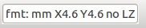
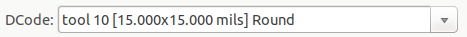

:author: The KiCad Team
:doctype: article
:toc:
:ascii-ids:

= Gerber Viewer

_Reference manual_

[[copyright]]
*Copyright*

This document is Copyright (C) 2010-2021 by its contributors as listed
below. You may distribute it and/or modify it under the terms of either
the GNU General Public License (https://www.gnu.org/licenses/gpl.html),
version 3 or later, or the Creative Commons Attribution License
(https://creativecommons.org/licenses/by/3.0/), version 3.0 or later.

All trademarks within this guide belong to their legitimate owners.

[[contributors]]
*Contributors*

The KiCad Team.

[[feedback]]
*Feedback*

The KiCad project welcomes feedback, bug reports, and suggestions related to the software or its
documentation.  For more information on how to submit feedback or report an issue, please see the
instructions at https://www.kicad.org/help/report-an-issue/

//Since docbook "article" is more compact, I have to separate this page
<<<<

== Introduction to GerbView

GerbView is a Gerber file (RS-274X format) and Excellon drill file viewer. Up to 32 files can be
displayed at once.

For more information about the Gerber file format please read
http://www.ucamco.com/files/downloads/file/81/the_gerber_file_format_specification.pdf[the Gerber File Format Specification].
Details about drill file format can be found at
http://web.archive.org/web/20071030075236/http://www.excellon.com/manuals/program.htm[the Excellon format description].

== Interface

=== Main window

<<<<<

=== Top toolbar

[width="100%",cols="41%,59%",]
|=======================================================================
|
|Clear all layers

|
|Load Gerber files

|
|Load Excellon drill files

|image:images/icons/sheetset_24.png[sheetset_png]
|Set page size

|
|Print

|image:images/icons/refresh_24.png[zoom_redraw_png]
|Redraw view

|image:images/icons/zoom_in_24.png[zoom_in_png]
image:images/icons/zoom_out_24.png[zoom_out_png]
|Zoom in or out

|
|Zoom to fit page

|
|Zoom to selection

|
|Select active layer

|
|Display info about active layer

|image:images/gerbview_x2_component.png[scaledwidth="70%",alt="gerbview_x2_component_png"]
|Highlight items belonging to selected component (Gerber X2)

|
|Highlight items belonging to selected net (Gerber X2)

|image:images/gerbview_x2_attribute.png[scaledwidth="70%",alt="gerbview_x2_attributeo_png"]
|Highlight items with the selected attribute (Gerber X2)

|
|Highlight items of selected D Code on the active layer
|=======================================================================

<<<<<

=== Left toolbar

[width="100%",cols="5%,95%",]
|=======================================================================
|image:images/icons/cursor_24.png[cursor_png]
|Select items

|
|Measure between two points

|
|Toggle grid visibility

|
|Toggle polar coordinates display

|image:images/icons/unit_inch_24.png[unit_inch_png]
image:images/icons/unit_mil_24.png[unit_mm_png]
image:images/icons/unit_mm_24.png[unit_mm_png]
|Select inch, mils, or millimeter units

|image:images/icons/cursor_shape_24.png[cursor_shape_png]
|Toggle full-screen cursor

|
|Display flashed items in sketch (outline) mode

|image:images/icons/showtrack_24.png[track_sketch_png]
|Display lines in sketch (outline) mode

|
|Display polygons in sketch (outline) mode

|
|Show negative objects in ghost color

|
|Show/hide D Codes

|
|Display layers in diff (compare) mode

|
|Toggle inactive layers between normal and dimmed display

|image:images/icons/layers_manager_24.png[layers_manager_png]
|Show/hide layer manager

|image:images/icons/flip_board_24.png[flip_board_24]
|Show Gerbers as mirror image

|=======================================================================

<<<<<

=== Layers Manager

image::images/gerbview_layer_manager.png[scaledwidth="40%",alt="gerbview_layer_manager_png"]

The Layers Manager controls and displays visibility of all layers. An arrow
indicates the active layer, and each layer can be shown or hidden with
the checkboxes.

Mouse button assignments:

* Left click: select the active layer
* Right click: show/hide/sort layers options
* Middle click or double click (on color swatch): select the layer color

The Layers tab allows you to control the visibility and color of all loaded
Gerber and drill layers.  The Items tab allows you to control the color and
display of the grid, D Codes, and negative objects.

== Commands in menu bar

=== File menu

* *Export to PCB Editor* is a limited capability to export Gerber files into a KiCad PCB. The final
  result depends on what features of the RS-274X format are used in the original Gerber files:
  rasterized items cannot be converted (typically negative objects), flashed items are converted to
  vias, lines are converted to track segments (or graphic lines for non-copper layers).

=== Tools menu

* *List DCodes* shows the D Code information for all layers.
* *Show Source* displays the Gerber file contents of the active layer in a text editor.
* *Measure Tool* allows measuring the distance between two points.
* *Clear Current Layer* erases the contents of the active layer.

== Printing

To print layers, use the

icon or the *File -> Print* menu.

[CAUTION]
========================================
Be sure items are inside the printable area. Use
image:images/icons/sheetset_24.png[sheetset_png] to select a
suitable page format.

Note that many photoplotters support a large plottable area, much
bigger than the page sizes used by most printers. Moving the entire
layer set may be required.

========================================
