:author: The KiCad Team
:doctype: book
:toc:
:ascii-ids:
:experimental:

= Getting Started in KiCad

[[copyright]]
*Copyright*

This document is Copyright (C) 2010-2024 by its contributors as listed below. You may distribute it
and/or modify it under the terms of either the GNU General Public License
(http://www.gnu.org/licenses/gpl.html), version 3 or later, or the Creative Commons Attribution
License (http://creativecommons.org/licenses/by/3.0/), version 3.0 or later.

All trademarks within this guide belong to their legitimate owners.

[[contributors]]
*Contributors*

Graham Keeth, Jon Evans, Glenn Peterson.

[[former-contributors]]
*Former Contributors*

David Jahshan, Phil Hutchinson, Fabrizio Tappero, Christina Jarron, Melroy van den Berg.

[[feedback]]
*Feedback*

The KiCad project welcomes feedback, bug reports, and suggestions related to the software or its
documentation. For more information on how to submit feedback or report an issue, please see the
instructions at https://www.kicad.org/help/report-an-issue/

[[introduction-to-kicad]]
== Introduction to KiCad Version 8

KiCad is an open-source software suite for creating electronic circuit schematics, printed
circuit boards (PCBs), and associated part descriptions. KiCad supports an integrated design
workflow in which a schematic and corresponding PCB are designed together, as well as standalone
workflows for special uses. KiCad also includes several utilities to help with circuit and PCB
design, including a PCB calculator for determining electrical properties of circuit structures,
a Gerber viewer for inspecting manufacturing files, a 3D viewer for visualizing the finished
PCB, and an integrated SPICE simulator for inspecting circuit behavior.

KiCad runs on all major operating systems and a wide range of computer hardware. It supports PCBs
with up to 32 copper layers and is suitable for creating designs of all complexities. KiCad is
developed by a volunteer team of software and electrical engineers around the world with a mission
of creating free and open-source electronics design software suitable for professional designers.

The latest documentation for KiCad is available at https://docs.kicad.org. This
document applies to KiCad version 8.0.

[[download-and-install-kicad]]
=== Downloading and installing KiCad

KiCad runs on many operating systems, including Microsoft Windows, Apple macOS, and many major
Linux distributions.

You can find the most up to date instructions and download links at
https://www.kicad.org/download/. These instructions are not included in this manual as they may
change over time with the release of operating system updates.

IMPORTANT: KiCad stable releases occur periodically per the
https://dev-docs.kicad.org/en/rules-guidelines/release-policy/[KiCad
Stable Release Policy]. New features are continually being added to the
development branch. If you would like to take advantage of these new
features and help out by testing them, please download the latest
nightly build package for your platform. Nightly builds may introduce
bugs such as file corruption, generation of bad Gerbers, etc., but it
is the goal of the KiCad Development Team to keep the development
branch as usable as possible during new feature development.

[[support]]
=== Support
If you have ideas, remarks or questions, or if you just need help:

* The https://forum.kicad.info/[official KiCad user forum] is a great place to connect with other
  KiCad users and get help.
* Join our communities on https://www.kicad.org/community/chat/[Discord or IRC] for real-time
  discussion with users and developers.
* Check the KiCad website for https://www.kicad.org/help/learning-resources/[learning resources]
  made by the KiCad community.

== Basic Concepts and Workflow
The typical workflow in KiCad consists of two main tasks: drawing a schematic
and laying out a circuit board.

The schematic is a symbolic representation of the circuit: which components are
used and what connections are made between them. Schematic symbols are pictorial
representations of electronic components in a schematic, such as a zigzag or
rectangle for a resistor or a triangle for an opamp. The schematic contains
symbols for every component in the design, with wires connecting pins in the
symbols. The schematic is typically drawn first, before laying out the circuit
board.

The board is the physical realization of the schematic, with component
footprints positioned on the board and copper tracks making the connections
described in the schematic. Footprints are a set of copper pads that match the
pins on a physical component. When the board is manufactured and assembled, the
component will be soldered onto its corresponding footprint on the circuit
board.

KiCad has separate windows for drawing the schematic ("Schematic Editor"),
laying out the board ("PCB Editor"), and editing symbols and footprints ("Symbol
Editor" and "Footprint Editor"). KiCad comes with a large library of high
quality, user contributed symbols and footprints, but it is also simple to create
new symbols and footprints or modify existing symbols and footprints.

Finally, it is important to understand that KiCad has a project-based workflow.
A KiCad project is a folder with a project file, a schematic, a board layout,
and optionally other associated files such as symbol and footprint libraries,
simulation data, purchasing information, etc. Many project-related settings,
including net classes and design rules, are stored at the project level. Opening
a board outside of its associated project may result in missing design
information, so be sure to keep all files associated with a project together.

=== PCB Design Workflow

Typically, the schematic is drawn first. This means adding symbols to the
schematic and drawing the connections between them. Custom symbols may need to
be created if appropriate symbols are not already available. At this stage
footprints are also selected for each component, with custom footprints created
as necessary. When the schematic is complete and the design has passed an
electrical rules check (ERC), the design information in the schematic is
transferred to the board editor and layout begins.

The schematic describes which components are in the design and how they are
connected; the board editor uses this information to make layout easier and to
prevent mismatches between the schematic and PCB. The layout process requires
careful placement of each footprint on the circuit board. After component
placement, copper tracks are drawn between components based on the connections
in the schematic as well as other electrical considerations, such as trace
resistance, controlled impedance requirements, crosstalk, etc.

Often the schematic will need to be updated after layout has begun; the
schematic changes can be easily pulled into the board design. The reverse can
often happen: any design changes made in the board layout can be pushed back to
the schematic to keep the two consistent.

When the board layout is complete and the board has passed the Design Rules
Check (DRC), fabrication outputs are generated so that the board can be
manufactured by a PCB fabricator.

== Tutorial Part 1: Project

The first thing to do when starting a new design is to create a new project.
Opening KiCad will bring up the Project Manager. Click **File** -> **New
Project**, browse to your desired location, and give your project a name, such
as `getting-started`. Make sure the **Create a new folder for the project**
checkbox is ticked, then click **Save**. This will create your project files in
a new subfolder with the same name as your project.

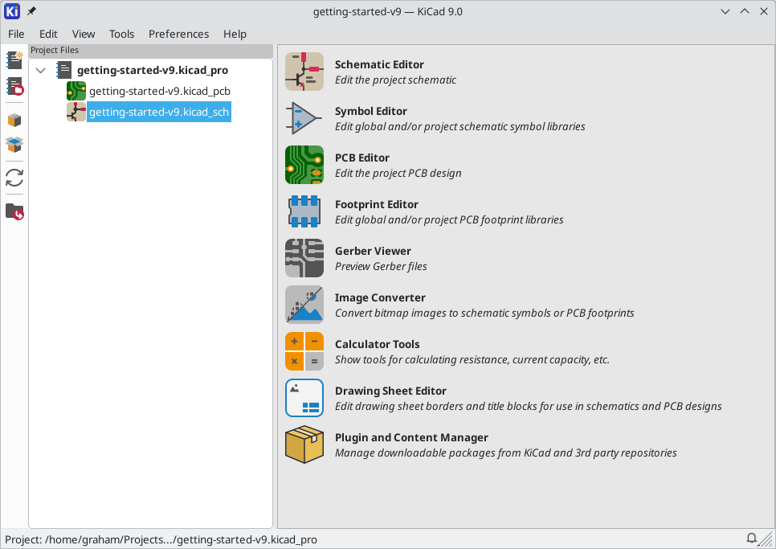

At left, the Project Files pane lists the files in the new project. There is a
project file with the extension `.kicad_pro`, a schematic file with the
extension `.kicad_sch`, and a board file with the extension `.kicad_pcb`. These
files all share a name with your project.

There may also be a `-backups` directory: KiCad will automatically create
backups of your project when you save, and optionally at fixed time intervals.
The backup settings are configurable by going to **Preferences** ->
**Preferences** -> **Common** -> **Project Backup**.

NOTE: Opening the Preferences dialog may trigger a library table configuration
      dialog. This dialog is explained <<sym-lib-table-setup,below>>.

NOTE: On macOS, the Preferences dialog is in the **KiCad** menu, not the
      **Preferences** menu.

At right of the Project Window, there are buttons to launch the various tools that
KiCad provides. Launching these tools will automatically open the associated design
file (schematic or PCB) from the current project. Start by opening the Schematic
Editor.

== Tutorial Part 2: Schematic

[[sym-lib-table-setup]]
=== Symbol Library Table Setup
The first time the schematic editor is opened, a dialog will appear asking how
to configure the global symbol library table. The symbol library table tells
KiCad which symbol libraries to use and where they are located. If you have
installed the default libraries with KiCad, which is recommended, select the
default option: **Copy default global symbol library table (recommended)**.

[[sym-lib-table-default-location]]
If KiCad cannot find the libraries in their expected installation location, this
option will be disabled. In this case, the user should choose the second
option, **Copy custom global symbol library table**. Click the folder button at
the bottom, and browse to the location given below. Select the `sym-lib-table`
file.

The location of the default library table files depends on operating system and
may vary based on installation location. Below are the defaults for each
operating system:

* Windows: `C:\Program Files\KiCad\8.0\share\kicad\template\`
* Linux: `/usr/share/kicad/template/`
* macOS: `/Applications/KiCad/KiCad.app/Contents/SharedSupport/template/`

=== Schematic Editor Basics
To pan around the schematic, click and drag with the middle mouse button or
right mouse button. Zoom in and out with the mousewheel or kbd:[F1] and
kbd:[F2]. Laptop users may find it useful to change the mouse controls to be
better suited to a touchpad; the mouse controls are configurable in
**Preferences** -> **Preferences...** -> **Mouse and Touchpad**.

NOTE: On macOS, the Preferences dialog is in the **KiCad** menu, not the
      **Preferences** menu.

By default, KiCad enables a mouse setting called **Center and Warp Cursor on
Zoom**. When this feature is enabled, the mouse cursor is automatically moved to
the center of the screen when the user zooms in or out. This keeps the zoomed
region centered at all times. This feature is unusual, but many users find it
useful once they get used to it. Try zooming in and out with the mouse cursor in
different areas of the canvas. If the default zoom behavior is uncomfortable,
disable the feature in the Mouse and Touchpad preferences.

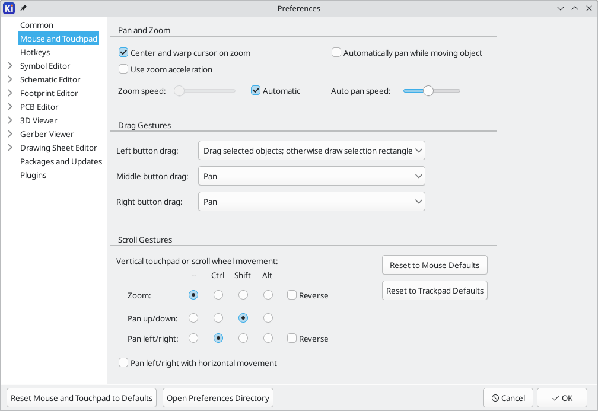

The toolbar at the left side of the schematic editor screen contains basic
display settings. The toolbar at the right side of the screen contains tools for
editing the schematic.

Most tools in KiCad either have default hotkeys assigned, or can have custom
hotkeys assigned. To view all hotkeys, go to **Help** -> **List Hotkeys...**.
Hotkeys can be changed in the **Hotkeys** panel of the Preferences dialog.

=== Schematic Sheet Setup

Before drawing anything in the schematic, set up the schematic sheet itself.
Click **File** -> **Page Settings**. Give the schematic a title and date, and
change the paper size if desired.

[[fp-lib-table-setup]]
=== Adding Symbols to the Schematic
Start making the circuit by adding some symbols to the schematic. Open the
Choose Symbol dialog by clicking the **Add Symbols** button
image:images/add_component_24.png[] on the right side of the window or
pressing kbd:[A].

This action will trigger the Footprint Library Table Setup dialog if it has not
already been triggered. This dialog is equivalent to the
<<sym-lib-table-setup,Symbol Library Table Setup dialog explained earlier>>, but
for footprints instead of symbols.

Again, select the default option: **Copy default global footprint library table
(recommended)**. If this is option is disabled, select the second option, **Copy
custom global footprint library table**. Click the folder button at the bottom,
and browse to the location given in
<<sym-lib-table-default-location,the symbol library table setup instructions>>.
Select the `fp-lib-table` file and click **OK**.

The Choose Symbol dialog lists the available symbol libraries and the component
symbols contained within them. Basic devices like passive components, diodes,
and other generic symbols are found in the `Device` library. Specific devices,
such as a particular LED, may be found in other libraries.

Scroll down to the `Device` library, expand it, and select the `LED` symbol.
Click **OK**, and click again to place the symbol in the schematic.

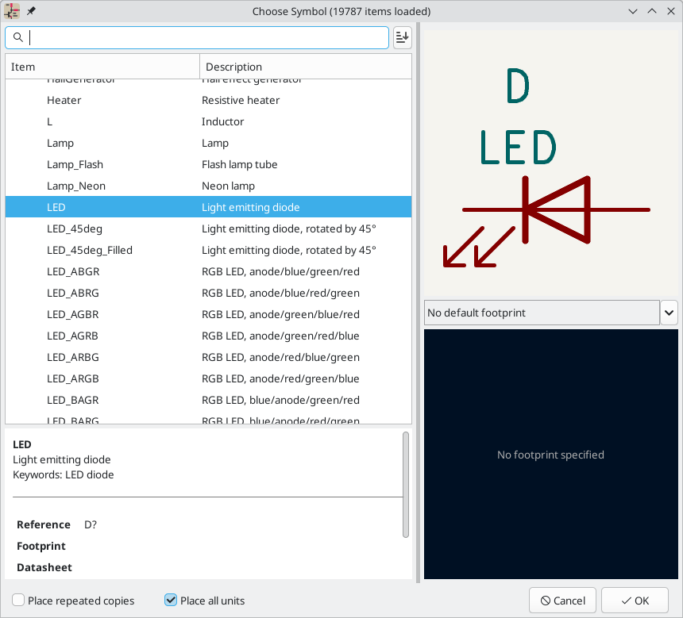

Next, add a current-limiting resistor. Go back to the symbol chooser, but this
time try searching for a resistor by entering `R` in the filter box at the top.
Again, it is found in the `Device` library. The `R` device is an IEC-style
rectangular resistor symbol. An `R_US` symbol is also available for users who
prefer the ANSI-style zigzag symbol. Select a resistor symbol and add it to the
schematic.

Finally, add a battery to power the LED. The `Device` library has a suitable
`Battery_Cell` symbol.

image::images/symbols-placed.png["Schematic with Symbols Placed"]

=== Selecting and Moving Objects
Next, position the symbols correctly relative to each other, as shown in the
screenshot. Do this by selecting, moving, and rotating the symbols.

In KiCad 8.0, objects are selected by clicking on them while the selection tool
is active. The selection tool is the default tool when no other tool is active,
so you can enter the selection tool by quitting any active tool (kbd:[Esc]) or
by clicking the image:images/cursor_24.png["Select tool icon"] button in the
right toolbar.

Additional objects can be added to the selection with kbd:[Shift]+click, or
removed with kbd:[Ctrl+Shift]+click (macOS: kbd:[Cmd+Shift]+click). You can
toggle an item's selection state with kbd:[Ctrl]+click (macOS: kbd:[Cmd]+click).

Drag selection is also possible; dragging from left-to-right selects objects
that are entirely enclosed by the selection box, while dragging right-to-left
also selects objects that are partially enclosed by the selection box.
kbd:[Shift], kbd:[Ctrl+Shift] (kbd:[Cmd+Shift]), and kbd:[Ctrl] (kbd:[Cmd]) can
also be used with drag selection to add, subtract, or toggle from the selection,
respectively.

Note that it is possible to select an entire symbol (by clicking on the symbol
shape itself) or to select one text field in the symbol without selecting
the rest of the symbol (by clicking the text). When just a text field is
selected, any actions performed will act only on the selected text and not on
the rest of the symbol.

Selected objects are moved by pressing kbd:[M] and rotated by pressing kbd:[R].
The kbd:[G] hotkey (drag) can also be used to move objects. For moving
unconnected symbols, kbd:[G] and kbd:[M] behave identically, but for symbols
with wires attached, kbd:[G] moves the symbol and keeps the wires attached,
while kbd:[M] moves the symbol and leaves the wires behind. Selected objects can
be deleted with the kbd:[Del] key.

=== Wiring the Schematic

The symbol pins all have small circles on them, indicating that they are not
connected. Fix that by drawing wires between symbol pins as shown in the
screenshot. Click the **Add a Wire** button
image:images/add_line_24.png[] on the right-hand toolbar or use the
kbd:[W] hotkey. Click to start drawing a wire, and finish drawing the wire by
clicking on a symbol pin or double clicking anywhere. Pressing Escape will
cancel drawing the wire.

Another convenient method of drawing wires is to hover over an unconnected pin.
The mouse cursor will change to indicate that a wire can be drawn starting from
that location. Clicking on the pin will then begin drawing a wire automatically.

Next, add power and ground symbols to the schematic. While not strictly necessary
in such a simple schematic, these make it easier to understand large schematics.

A number of power and ground symbols are available in the `Power` symbol library.
However, there is a shortcut for adding these symbols: click the **Add a Power
Symbol** button image:images/add_power_24.png[] or use the kbd:[P] hotkey. This
brings up the **Choose a Symbol** dialog, but only displays symbol libraries
that contain power symbols.

Add a VCC symbol and GND symbol and then connect them to the circuit with wires.

Finally, add a label to the wire between the LED and resistor. Again, this may not
be necessary in a simple circuit, but it is good practice to label important nets.
Click the **Draw Net Labels** button  in the right
toolbar (kbd:[L]), type a label name (`led`), and place the label into the
schematic so that the square attachment point overlaps with the wire. Rotate and
align the label as necessary.

Note that labels and power symbols with the same name are connected together.
Another GND symbol or wire labeled `led` on this schematic page would be shorted
to the existing one, even without wires visually connecting them.

=== Annotation, Symbol Properties, and Footprints

==== Annotation
Each symbol needs a unique reference designator assigned to it. This process is
also known as annotation.

By default in KiCad 8.0, symbols are automatically annotated when they are added
to the schematic. Automatic annotation can be enabled or disabled using the
 button in the left toolbar.

While it is not necessary for this guide, symbols can be manually annotated or
reannotated using the **Fill in schematic symbol reference designators** button
() in the top toolbar.

==== Symbol Properties
Next, fill in values for each component. Select the LED, right-click, and select
Properties... (kbd:[E]). This project will use a red LED, so change the `Value`
field to be `red`. In a real project, it might be better to write the LED
manufacturer's part number here instead. Note that it's possible to edit
reference designators individually in each symbol's properties.

This project will use a 3V lithium coin cell battery, so change the `Value`
field of `BT1` to `3V`. Change the resistor's value to `1k`.

[[footprint-assignment]]
==== Footprint Assignment
Finally, assign a footprint to each component. This defines how each component
will attach to the PCB. Some symbols come with footprints pre-assigned, but
for many components there are multiple possible footprints, so the user needs
to select the appropriate one.

There are several ways to assign footprints, but one convenient way is to use
the footprint assignment tool by clicking the
image:images/icon_cvpcb_24_24.png[] button in the top toolbar.

The left pane of this window lists the available footprint libraries. The
middle pane shows the symbols in the schematic. All of these symbols will get
footprints assigned to them. The right pane shows the footprints that can be
chosen for the symbol selected in the middle pane. To assign a footprint to a
symbol, select the symbol in the middle pane and double click on the desired
footprint in the right pane. You can preview a footprint by right-clicking the
footprint's name and selecting **View selected footprint**.

Many footprints are included with KiCad, so the footprint assignment tool offers
several ways to filter out footprints that aren't relevant to the symbol in
question.

* [[footprint-filters]] The leftmost button
  image:images/module_filtered_list_24.png[] activates filters that can be
  defined in each symbol. For example, an opamp symbol might define filters
  that show only SOIC and DIP footprints. Sometimes those predefined filters
  are missing or too restrictive, so it can be useful to turn this filter off
  in some situations.
* The middle button image:images/module_pin_filtered_list_24.png[] filters by
  pin count, so that only 8-pad footprints are shown for 8-pin symbols. This
  filter is almost always useful.
* The right button  filters by selected
  library. Libraries are selected in the left pane; footprints not in the
  selected library will be filtered out. This filter is useful as long as it is
  known which library contains the right footprint. Often it's best to use this
  filter or the symbol filters, but not both.
* The text box filters out footprints that don't match the text in the box.
  This filter is disabled when the box is empty.

Using the filters, find each of the footprints shown in the central column in
the screenshot above. Assign each footprint to a symbol by selecting the symbol
in the central column and then double clicking the appropriate footprint in the
right column. Once all of the footprints have been assigned, click **OK**.

There are other ways to assign footprints; one way is through the symbol
properties window. For more information on assigning footprints, see the
xref:../eeschema/eeschema.adoc#assigning-footprints[manual].

=== Electrical Rules Check

The last remaining thing to do in the schematic is to check for electrical
errors. KiCad's Electrical Rules Checker (ERC) cannot make sure that the design
in the schematic will work, but it can check for some common connection issues
such as unconnected pins, two power outputs shorted together, or a power input
that isn't powered by anything. It also checks for some other mistakes like
symbols that aren't annotated and typos in net labels. To see the full list of
electrical rules and to adjust their severity, go to **File** ->
**Schematic Setup...** -> **Electrical Rules** -> **Violation Severity**. It is
a good idea to run ERC before starting layout.

Run an electrical rules check by clicking the **ERC** button
() in the top toolbar and then clicking **Run ERC**.

Even in this simple schematic, KiCad has found two potential errors. The errors
are listed in the ERC window, and arrows point to the violation locations in the
schematic. Selecting a violation in the ERC window highlights the corresponding
arrow.

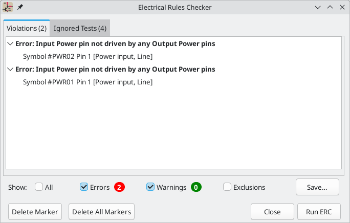

You can exclude individual violations or ignore entire classes of violations by
right clicking on each error message. However, it's usually worth addressing the
violations, even if they aren't actual design errors, in order to get a clean
ERC report and avoid missing real problems.

In this case, KiCad reports "Input Power pin not driven by any Output Power
pins" for both the `VCC` and `GND` nets. This is a common KiCad ERC error.
Power symbols are set up to require a power output pin, such as the output of a
voltage regulator, on the same net; otherwise KiCad thinks the net is undriven.
To a human, it is obvious that `VCC` and `GND` are driven by the battery, but
it's necessary to explicitly show that in the schematic.

image::images/symbols-pwr-flag.png["PWR_FLAG Added to Schematic"]

There is a special `PWR_FLAG` symbol in the `Power` symbol library that is used
to solve this problem by telling KiCad that the nets are actually driven. Add this
symbol to the `VCC` and `GND` nets and re-run ERC. When ERC passes without any
violations, the schematic is complete.

=== Bill of Materials
A final optional step is to generate a Bill of Materials listing all components
used in the project. Click **Tools** -> **Generate Bill of Materials...**.

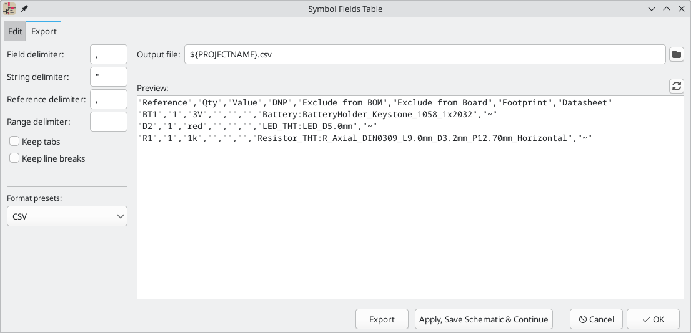

KiCad 8.0 has a GUI for BOM export. You can configure which symbol metadata will
be exported, and how the symbols are grouped, in the **Edit** tab, and configure
the output format in the **Export** tab. 

For now, the default settings should be fine, but you can see a raw view of what
will be exported in the preview pane. Specify an output file in the **Export**
tab, then press the **Export** button.

The BOM should look like the below image when it is opened in a spreadsheet
program.

== Tutorial Part 3: Circuit Board
With the schematic completed, go back to the Project Window and open the PCB
Editor, either by clicking the PCB Editor button or opening the board file.

=== PCB Editor Basics
Navigation in the PCB Editor is the same as the Schematic editor: pan by
dragging with the middle mouse button or right mouse button, and zoom with the
scrollwheel or kbd:[F1]/kbd:[F2].

The main part of the PCB Editor is a canvas where the board will be designed.
The toolbar on the left side has various display options for the board,
including units and toggles for outline/filled display modes for tracks, vias,
pads, and zones. The toolbar just to the right of the canvas contains tools for
designing the PCB.

NOTE: Some buttons on the right toolbar have a small triangle in the bottom
      right corner image:images/pcbnew_palette_buttons.png[]. The triangle
      indicates that the button has an expanding palette containing several
      related tools, for example different kinds of dimensions. To select an
      alternate tool, click and hold on the button until the palette appears,
      then click on the alternate tool. Another way to use the palettes is to
      click on the button and drag to the left until the palette appears, then
      release the mouse button when the desired tool is highlighted.

At far right is the Appearance Panel and Selection Filter. The Appearance panel
is used to change visibility, colors, and opacity of PCB layers, objects, and
nets. The active layer is changed by clicking on the name of a layer.

Below the Appearance Panel is the Selection Filter, which enables and disables
selection of various types of PCB objects. This is useful to select specific
items in a crowded layout.

=== Board Setup and Stackup
Before designing the board, set the page size and add information to the title
block. Click **File** -> **Page Settings...**, then choose an appropriate paper
size and enter a date, revision, and title.

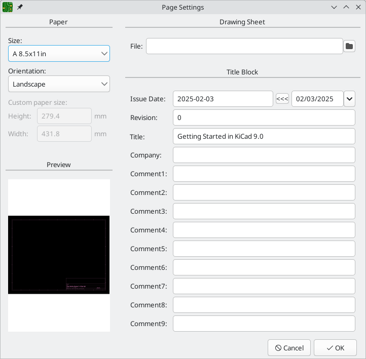

Next, go to **File** -> **Board Setup...** to define how the PCB will be
manufactured. The most important settings are the stackup, i.e. what copper and
dielectric layers the PCB will have (and their thicknesses), and the design
rules, e.g. sizes and spacing for tracks and vias.

To set the stackup, open the **Board Stackup** -> **Physical Stackup** page of
the Board Setup window. For this guide, leave the number of copper layers at 2,
but more complicated projects might require more layers.

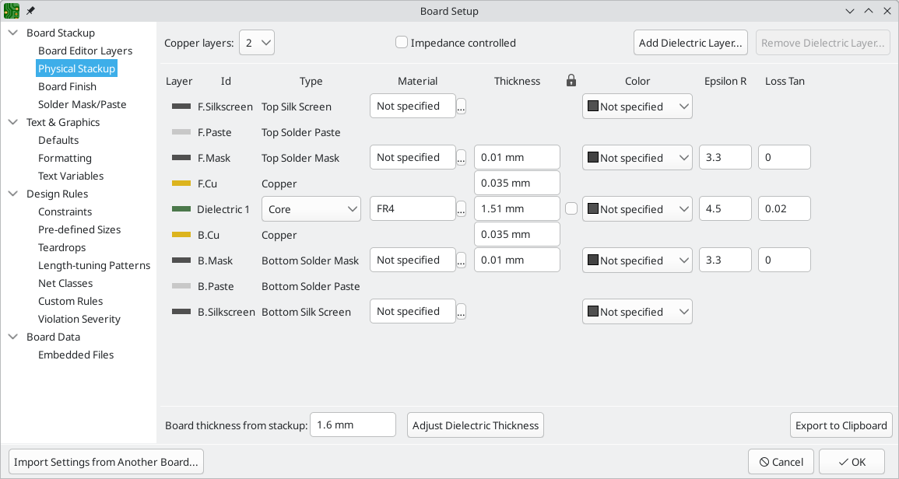

Next, go to the **Design Rules** -> **Constraints** page. The settings on this
page specify the overriding design rules for everything in the board design. For
the purposes of this guide, the defaults are fine. However, for a real project
these should be set according to the capabilities of the PCB fab house so that
the PCB design is manufacturable.

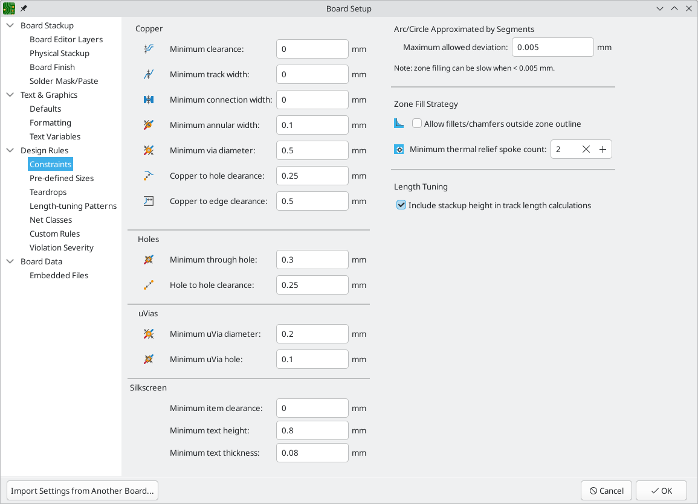

Finally, open the **Design Rules** -> **Net Classes** page. A net class is a set
of design rules associated with a specific group of nets. This page lists the
design rules for each net class in the design and allows assigning nets to each
net class.

Track width and spacing can be managed manually by the designer during layout,
but net classes are recommended because they provide an automatic way to manage
and check design rules.

In this design, no net classes are specified, so all nets will belong to the
`Default` net class. The default design rules for this net class are
acceptable for this project, but other designs may have multiple net classes,
each with different design rules. For example a board might have a `High
Current` netclass with wide traces, or a `50 ohm` netclass with specific width
and clearance rules for 50 ohm controlled-impedance traces.

=== Importing Changes From Schematic
The schematic is complete, but there are not yet any components in the layout.
To import design data from the schematic into the layout, click **Tools** ->
**Update PCB from Schematic...**, or press kbd:[F8]. There is also a button
image:images/update_pcb_from_sch_24.png[] in the top toolbar.

Read through the messages in the **Changes To Be Applied** window, which will
say that the three components in the schematic will be added to the board. Click
**Update PCB**, **Close**, and click on the canvas to place the three
footprints. The location of each footprint relative to the others will be
changed later.

In KiCad, updating the PCB with changes in the schematic is a manual process:
the designer decides when it is appropriate to update the PCB with modifications
in the schematic. Each time the schematic is edited, the designer must use the
**Update PCB from Schematic** tool to keep the schematic and layout in sync.

=== Drawing A Board Outline
Now the three components have been placed, but the board itself has not been
defined. The board is defined by drawing a board outline on the `Edge.Cuts`
layer.

It's often useful to draw the board outline with a coarse grid, which makes
it easy to get round numbers for the board size. Switch to a coarse grid by
selecting 1mm in the Grid dropdown menu above the canvas.

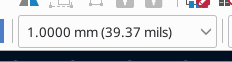

To draw on the `Edge.Cuts` layer, click **Edge.Cuts** in the Layers tab of the
Appearance panel at right. Choose the rectangle tool
image:images/add_rectangle_24.png[] in the right toolbar, click on the canvas to
place the first corner, then click again to place the opposite corner so that
the rectangle roughly surrounds the three footprints. The other graphic tools
(line image:images/add_line_24.png[], arc image:images/add_arc_24.png[], circle
image:images/add_circle_24.png[], polygon
image:images/add_graphical_polygon_24.png[], or a combination of them) could
also be used to define the board outline; the only requirement is that the
outline is a single closed shape that doesn't intersect itself.

=== Placing Footprints
The next step in the layout process is to arrange the footprints on the board.
In general, there are a several considerations for positioning footprints:

* Some footprints may have exact requirements for their locations, such as
  connectors, indicators, or buttons and switches.
* Some components may need to be placed according to electrical considerations.
  Bypass capacitors should be close to the power pins of the associated IC and
  sensitive analog components should be far from digital interference.
* Almost all components have a "Courtyard" (or two if both Front and Back are
  defined). Generally Courtyards should not intersect.
* Otherwise components should be positioned for ease of routing. Connected
  components should generally be close together, and arranged to minimize
  routing complexity. The ratsnest (the thin lines indicating connections
  between pads) is useful for determining how best position footprints relative
  to other footprints.

For the purposes of this guide, the only placement goal is to make the routing
process as simple as possible.

Start by moving the battery holder `BT1` onto the back side of the board. Click
it to select it, then press kbd:[M] to move it. Press kbd:[F] to flip it to the
opposite side; it now appears mirrored and its pads have changed from red to
blue.

All PCB layers are viewed from front side of the board. Footprints on the bottom
of the board are therefore upside down and appear mirrored.

Each PCB layer has a unique color, which is shown by the swatches in the Layers
tab of the Appearance panel. In the default color scheme, items on the `F.Cu`
(Front Copper) layer are red, while items on the `B.Cu` (Back Copper) are blue.

Now place the other two components. One at a time, select each component, then
move and rotate it with kbd:[M] and kbd:[R]. Watch the ratsnest lines between
each pad to choose the simplest arrangement of components; a good arrangement
will leave the lines untangled. One possible arrangement is shown in the
screenshot below.

=== Routing Tracks
With the components in place, it's time to connect the pads with copper traces.

The first trace will be drawn on the front of the board, so change the active
layer to `F.Cu` in the Layers tab of the Appearance panel.

Click **Route Tracks**  in the right-hand
toolbar or press kbd:[X]. Click on the `led` pad of `D1`. The ratsnest line
indicates there is an unrouted connection to the `led` pad of `R1`, so click on
that pad to draw a trace connecting the two pads. Clicking on the second pad
completes the trace. The ratsnest line between the `led` pins is no longer drawn
because the connection has been made in copper.

Now draw a trace between the `GND` pads of `BT1` and `D1`, starting with the `BT1`
pad on the back of the board. Notice that the active layer automatically changed
to `B.Cu` after clicking on the `BT1` pad. Click on the `D1` pad to finish the
track.

While `BT1` has surface mount pads that are only on the bottom of the board,
`D1` has through hole pads that can connect to tracks on both the front and
back. Through hole pads are one way to make a connection between multiple
layers. In this case, `D1` is a component on the front side of the board, but
its through hole pads are used to connect to a trace on the back of the board.

Another way to make a connection across layers is with a via. Start routing at the
`VCC` pad of `BT1` on the back of the board. Press kbd:[V] and click halfway
between `BT1` and `R1` to insert a via, which also switches the active layer to
`F.Cu`. Complete the track on the top side of the board by clicking on the
`VCC` pad of `R1`.

At this point, all connections are routed. This can be confirmed by looking at
the status screen in the bottom left of the window, where the number of unrouted
nets is given as 0.

=== Placing Copper Zones
Copper zones are regions of copper with an associated net. Zones automatically
connect to copper objects belonging to the same net and avoid objects belonging
to other nets. Zones are often used for ground and power connections because they
provide a lower impedance connection than traces.

Add a `GND` zone on the bottom of the board by switching to the bottom copper
layer and clicking the **Add a filled zone** button
image:images/add_zone_24.png[] in the right toolbar. Click on the PCB to place
the first corner of the zone.

In the Copper Zone Properties dialog that appears, select the `GND` net and make
sure that the `B.Cu` layer is selected. Click **OK**, then click to place the other
three corners of the zone. Double click when placing the last corner to complete
the zone.

The zone outline is displayed on the canvas, but the zone is not yet filled --
there is no copper in the zone area, and therefore the zone is not making any
electrical connections. Fill the zone with **Edit** -> **Fill All Zones**
(kbd:[B]). Copper has been added to the zone, but it doesn't connect to the
`VCC` or `led` pads and traces, and is clipped by the board edge. It overlaps
with the `GND` trace drawn earlier, and it connects to the `GND` pads through
thin traces. These are thermal reliefs, which make the pads easier to solder.
Thermal reliefs and other zone settings can be modified in the zone properties
dialog.

In KiCad, zones are not filled automatically when they are first drawn or
modified, or when footprints within them are moved. Zones are refilled by
manually filling them and when running <<drc,DRC>>. Make sure zone fills are
up-to-date before generating <<fab,fabrication outputs>>.

Sometimes filled zones can make it hard to see other objects in a crowded board
design. Zones can be hidden except for their boundaries using the **Show only
zone boundaries** button  on the
left-hand toolbar. Zones retain their filled status when only their outlines are
shown -- hiding a zone fill is not the same as unfilling it.

Zones can also be made transparent using the Appearance panel, and inactive
layers can also be hidden or dimmed using the **Layer Display Options** in the
Appearance Panel.

[[drc]]
=== Design Rule Checking
Design Rule Checking is the layout equivalent of Electrical Rule Checking for
the schematic. DRC looks for design mistakes like mismatches between the
schematic and layout, copper regions that have insufficient clearance or are
shorted together, and traces that do not connect to anything. Custom rules can
also be written in KiCad 8.0. To view the full list of design rules that are
checked and to adjust their severity, go to **File** -> **Board Setup...** ->
**Design Rules** -> **Violation Severity**. Running DRC and fixing all errors
is strongly advised before generating <<fab,fabrication outputs>>.

Run a DRC check with **Inspect** -> **Design Rules Checker**, or use the button
 in the top toolbar. Click **Run DRC**. When the
checks are complete, no errors or warnings should be reported. Close the DRC
window.

Now intentionally cause a DRC error by moving the resistor footprint to overlap
the filled area of the zone. Use kbd:[D] (Drag) to move the resistor footprint
slightly while keeping the traces attached to its pads. This creates a clearance
violation because the `VCC` and `led` pads of the resistor are shorted to the
`GND` zone fill. Ordinarily this would be fixed by refilling the zone, but don't
refill the zone yet.

Run DRC again, but make sure to uncheck the **Refill all zones before performing
DRC** checkbox. DRC reports 6 violations: for each pad of `R1`, there is a
clearance violation between the pad and the zone, another clearance violation
between the pad's through hole and the zone, and a third violation where the
pad's solder mask opening exposes the copper of two different nets (the `GND`
fill and the trace connected to the pad). Arrows point to each violation in the
canvas. Clicking on each violation message zooms in on the respective
violation.

Close the DRC dialog, press kbd:[B] to refill the zone, and re-run DRC.
Alternatively, check the **Refill all zones before performing DRC** checkbox and
re-run DRC. All violations are fixed.

=== 3D Viewer
KiCad offers a 3D viewer that is useful for inspecting the PCB. Open the 3D
viewer with **View** -> **3D Viewer**. Pan by dragging with the middle mouse
button, and orbit by dragging with the left mouse button. Orbit around the PCB
to see the LED and resistor on the top, and the battery holder on the bottom.

A raytracing mode is available, which is slower but offers more accurate
rendering. Switch to the raytracing mode with **Preferences** ->
**Raytracing**.

Many of the footprints in KiCad's library come with 3D models, including all of
the footprints used in this guide. Some footprints do not come with 3D models,
<<footprints-and-3d-models,but users can add their own>>.

[[fab]]
=== Fabrication Outputs
With the board design finished, the final step is to generate fabrication
outputs so the board can be manufactured.

Open the Plot dialog with **File** -> **Plot...**. This dialog can plot the
design in several formats, but Gerber is usually the right format for ordering
from a PCB fabricator.

Specify an output directory so that the plotted files will be collected in a
folder. Otherwise, the default settings are fine, but make sure all the necessary
layers are checked: include the copper layers (`++*++.Cu`), board outline
(`Edge.Cuts`), soldermask (`++*++.Mask`), and silkscreen (`++*++.Silkscreen`).
The paste layers (`++*++.Paste`) are useful for manufacturing solder paste
stencils. The Adhesive layers (`++*++.Adhesive`) are needed only if any
components will be glued to the board during assembly. Other layers may be
useful to plot, but are not typically necessary for PCB fabrication.

Click **Plot** to generate the Gerber files. Also click **Generate Drill
Files...** and then **Generate Drill File** to create files specifying the
location of all holes that will be drilled in the board. Finally, close the Plot
dialog. The design is finished.

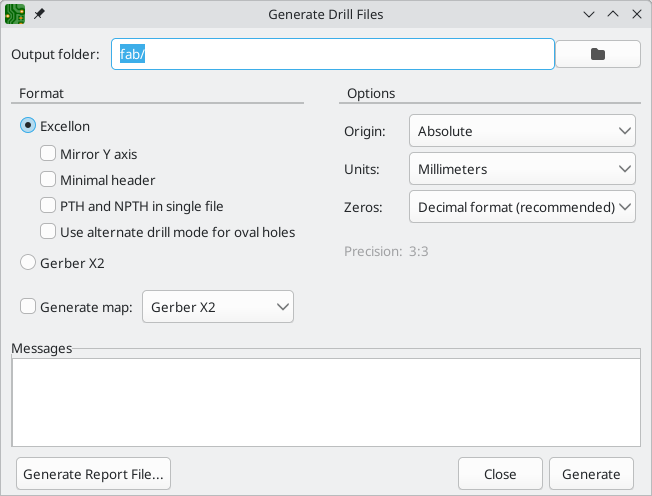

== Tutorial Part 4: Custom Symbols and Footprints

The circuit would be improved by adding a switch to turn the LED on and off. The
process to add this switch will require creating a new symbol and footprint
library, drawing a switch symbol, and creating a footprint for the switch.

The specific switch that will be used in this guide is the
https://www.nkkswitches.com/pdf/MtogglesBushing.pdf[NKK M2011S3A1W03], an SPST
toggle switch. Many other switches could be used, but the pin numbering and
footprint dimensions may need to be adjusted.

=== Library and Library Table Basics

Symbols and footprints are organized into libraries. A library can hold symbols
or footprints, but not both.

KiCad keeps track of the user's symbol libraries and footprint libraries in the
symbol library table and footprint library table, respectively. Each library
table is a list of library names and the location of where each library exists
on disk.

In addition to global symbol and footprint library tables, there are also
project library tables for symbols and footprints. Symbols and footprints that
are added to the global tables are available in all projects, while symbols and
footprints in the project-specific tables are available only for that specific
project. Users can add their own libraries to the global library tables or to
project-specific tables.

The symbol library tables can be viewed or edited with **Preferences** ->
**Manage Symbol Libraries...** in the Schematic Editor or Symbol Editor windows.
The footprint library tables can be viewed or edited with **Preferences** ->
**Manage Footprint Libraries...** in the Board Editor or Footprint Editor. Both
library tables can also be accessed from the Project Manager.

Often, paths to libraries are defined with path substitution variables. This
enables a user to move all of their libraries to a new location without
modifying the library tables. The only thing that needs to change is to redefine
the variable to point to the new location. KiCad's path substitution variables
are edited with **Preferences** -> **Configure Paths...** in the Project Manager
or any of the Editor windows.

One useful path substitution variable is `${KIPRJMOD}`. This variable always
points at the current project directory, so it can be used for including
project-specific libraries that are stored inside the project directory.

On first run, KiCad
<<sym-lib-table-setup,prompts the user to set up the symbol library table>>
and <<fp-lib-table-setup,footprint library table>>. To go through this setup
again, delete or rename the symbol library table or footprint library table
files. Make a backup of the tables before deleting them.

The location of the symbol and footprint library table files depends on
operating system.

* Windows: `%APPDATA%\kicad\8.0\sym-lib-table` and `%APPDATA%\kicad\8.0\fp-lib-table`
* Linux: `~/.config/kicad/8.0/sym-lib-table` and `~/.config/kicad/8.0/fp-lib-table`
* macOS: `~/Library/Preferences/kicad/8.0/sym-lib-table` and
    `~/Library/Preferences/kicad/8.0/fp-lib-table`

=== Creating New Global or Project Libraries

The first step in drawing a new symbol or footprint is to choose a library in
which to store it. For this guide, the switch symbol and footprint will go into
new project-specific libraries.

Open the Symbol Editor from the Project Manager. Click **File** -> **New
Library**, and select **Project**. Choose a name for the new library (e.g.
`getting-started.kicad_sym`) and save it in the project directory. The empty new
library is now selected in the Libraries pane at left, and has been
automatically added to the project library table (check the Project Specific
Libraries tab in **Preferences** -> **Manage Symbol Libraries...**).

=== Creating New Symbols

Now create the switch symbol in the new library. With the `getting-started`
library selected in the Libraries pane, click **File** -> **New Symbol...**. In
the **Symbol name** field, enter the part number: `M2011S3A1W03`. Switch symbols
should have reference designators that start with `SW`, so change the **Default
reference designator** field to `SW`. All other fields can remain as the
defaults.

In the Libraries pane, the `M2011S3A1W03` symbol now appears under the
`getting-started` library. In the canvas, a cross indicates the center of
the footprint, and text has been added for the reference designator. For now,
move the text away from the center of the symbol to get it out of the way.

==== Symbol Pins

Start drawing the symbol by adding a pin. Click the **Add a pin** button
 on the right toolbar. The Pin Properties dialog will
appear. Set **Pin name** to `A`, **Pin number** to `2`, **Electrical type** to
`Passive`, and **Orientation** to `Right`. Set **X Position** to `-200 mils` and
**Y Position** to `0`. Click **OK**, then click on the canvas to place the pin.
If the pin moved after clicking **OK**, it might be necessary to edit the pin's
properties again (double click the pin, or right click on the pin ->
**Properties...**) to set the position correctly.

NOTE: It is strongly recommended to always use mils (or inches) in the Schematic
      Editor and Symbol Editor, particularly for symbol pins. Mixing imperial and
      metric units will result in symbol pins that cannot be properly connected
      because they do not align with wires or other pins. The KiCad libraries
      use a 50 mil grid for their pins; using a different unit system will
      prevent your symbols and schematics from connecting with KiCad's builtin
      symbols. Note that unlike in the PCB editor, units in the schematic have
      no physical meaning.

Add a second pin, but this time don't use the **Add a pin** tool. Instead, press
kbd:[Insert]. A new pin numbered 3 is added to the symbol, just below pin 2.

TIP: In many places in KiCad, pressing kbd:[Insert] will repeat the last action.
     The location of the new item will be shifted and the numbering incremented
     automatically, as applicable. In the Symbol Editor, this can be used to
     place a large number of pins quickly. In the Schematic Editor, it can be
     used to repeatedly place a component, or to label a large component's pins
     with numbered labels. kbd:[Insert] can be useful in the Footprint and Board
     Editors as well.

We want Pin 3 to be on the right side of the switch symbol, so edit the
properties of pin 3 and change **X position** to `200 mils`, **Y position** to `0`,
and **Orientation** to `Left`. Also, change **Pin name** to `B`.

==== Graphical Features

With the pins placed, use the circle image:images/add_circle_24.png[] and line
image:images/add_line_24.png[] tools to make the symbol look like an SPST
switch. For this step, it will be useful to switch to a finer grid: right click
the canvas and select a smaller grid in the **Grid** submenu. After adding the
graphical shapes, switch back to a 50 mil grid.

WARNING: Small grids are useful for graphical features, but **symbol pins must
always be placed on a 50 mil (1.27 mm) grid**. Pins which are not aligned to a
50 mil grid will not be able to connect to wires in the schematic.

==== Symbol Properties

Now edit the properties for the whole symbol with **File** -> **Symbol
Properties**, or by double clicking on the canvas. Change the **Value** field to
`M2011S3A1W03`, and add `spst switch toggle` to the **Keyword** field to make it
easier to find the symbol by searching. For this symbol, the pin names do not
add any useful information, so uncheck **Show pin name** to make the symbol
visually simpler.

After clicking **OK**, move the value field's text lower so that it does not
overlap with the symbol graphics.

The symbol is now complete. Save it and move on to creating a footprint.

=== Creating New Footprints

Open the Footprint Editor and create a new project-specific footprint library
named `getting-started.pretty` (**File** -> **New Library...**). As with symbol
libraries, the new footprint library is added to the project library table. With
the new library selected in the Libraries pane, create a new footprint (**File**
-> **New Footprint...**). Set the name to `Switch_Toggle_SPST_NKK_M2011S3A1x03`
and the type to `Through hole`.

==== Footprint Pads

The switch has two pins, numbered in the datasheet as 2 and 3, and spaced 4.7 mm
apart. For ease of placement, adjust the grid to match the pad spacing. Open the
grid settings by right-clicking the image:images/grid_24.png[] button in the
left toolbar and selecting **Edit Grids...**. Add a new grid with the plus
button at the bottom. Set the new grid's X size to `4.7 mm`. Accept the dialog,
go back to the editing canvas, and then switch to the new grid in the grid
dropdown in the top toolbar, if it is not already selected.

By convention, through-hole footprints have pin 1 located at (0,0) and are
oriented with pin 1 in the top left. The SPST version of this switch does not
have pin 1, so the footprint will leave (0,0) empty and place pads 2 and 3 at
(0, 4.7 mm) and (0, 9.4 mm). Note that in KiCad's default coordinate system, the
positive Y-axis is oriented downwards.

Use the **Add a pad** tool  in the right toolbar to
place a pad one grid division below the origin, which is (0, 4.7 mm). Press
kbd:[Esc] to exit the pad tool, then double click on the pad to edit its
properties. Change the pad number to `2` and verify that the position is
correct. The switch pins are 1.17 mm x 0.8 mm, which gives a diagonal (maximum
pin dimension) of 1.42 mm. Therefore set the hole diameter to 1.42 mm + 0.2 mm =
`1.62 mm`, and the pad diameter to 1.62 mm + 2*0.15 mm = `1.92 mm` to provide a
sufficient annular ring.

Now use the **Add a pad** tool again to place the other pad at (0, 9.4 mm).
Notice that the pad number is automatically incremented and the properties
including pad size and hole size are copied from the previous pad.

With both pads placed, the annular rings look slightly small. The switch will be
easier to solder and mechanically more robust if the annular rings are made
larger. Increase the annular ring thickness from 0.15 mm to 0.3 mm by editing
pad 2 and changing the pad size to 1.62 mm + 2*0.3 mm = `2.22 mm`. Do not change
the hole size. Note that the pad size field accepts mathematical expressions, so
`1.62+2*0.3` can be entered directly and will evaluate to 2.22 mm.

TIP: Many text boxes in KiCad support mathematical expressions, including unit
     conversions.

Make the same annular ring modification to the other pad as well. As a shortcut,
right click on pad 2, click **Push Pad Properties to Other Pads...**, and then
click **Change Pads on Current Footprint**.

==== Footprint Graphics
A good footprint will have the exact part outline drawn on the fabrication layer
(`F.Fab`), a slightly larger outline on the silkscreen layer (`F.Silkscreen`),
and a courtyard (`F.Courtyard`) surrounding the entire footprint to prevent
overlaps with other footprints.

Switch to the front fabrication layer by clicking **F.Fab** in the Layers panel
at right. The fabrication outline should precisely match the physical dimensions
of the part, which is 7.9 mm wide and 13 mm tall. Use the line
image:images/add_line_24.png[], rectangle image:images/add_rectangle_24.png[],
or polygon image:images/add_graphical_polygon_24.png[] tools to draw the outline
of the part as shown in the screenshot below. One way to precisely place the
outline is to create a new grid with an X spacing of `7.9 mm` and a Y spacing of
`13 mm`. Then adjust the grid origin by right-clicking the
image:images/grid_24.png[] button and selecting **Grid Origin...**. Set the X
origin is 7.9 mm / 2 = `3.95 mm` and the Y origin to 4.7 mm - (13 mm / 2) =
`-1.8 mm`.

Next, switch to the `F.Silkscreen` layer. The silkscreen outline should be just
outside of the part outline, so the silkscreen lines are moved outwards from the
fabrication drawing by 0.11 mm (half of 0.10 mm fab line width, plus half of the
0.12 mm silkscreen line width). The exact coordinates are shown in the
screenshot below, and helpful grid settings are:

* X grid: 7.9 mm + 2 * 0.11 mm = `8.12 mm`
* Y grid: 13 mm + 2 * 0.11 mm = `13.22 mm`
* X origin: 8.12 mm / 2 = `4.06 mm`
* Y origin: -1.8 mm - 0.11 mm = `-1.91 mm`

Finally, select the `F.Courtyard` layer. The courtyard outline should surround
the part with a 0.25 mm clearance.

Use a different strategy to draw this layer. Switch to a 1mm grid instead of a
custom grid, and draw a rectangle roughly surrounding the footprint. Double click
on the rectangle to edit its properties, and enter the corner coordinates of the
rectangle directly -- they are shown in the screenshot below.

After completing the outlines, position the text as shown below. The footprint
is complete.

==== Kicad Library Conventions

To maintain high-quality symbol and footprint libraries, KiCad has a
https://klc.kicad.org/[KiCad Library Conventions] document, which is a set of
guidelines for symbols and footprints. It is not necessary to follow these
conventions for personal libraries, but they are a good starting point.
Footprints and symbols in the https://gitlab.com/kicad/libraries[official
library] are required to follow KLC. KLC is used as a basis for the symbol and
footprint in this guide.

==== Add Switch to Schematic

[[default-footprint]]
Now that the footprint is complete, the switch symbol can be modified so that
the matching footprint is used for it by default.

Go back to the symbol editor and open the switch symbol. Edit the Symbol
Properties. Click in the `Footprint` field, then click the library book icon
 that appears. Browse to the project
footprint library and double click on the switch footprint. Save the symbol.

The switch footprint is now assigned to this symbol by default; the footprint does
not need to be manually selected each time the symbol is added to a schematic.

Open the schematic, add a new symbol, and select the new switch symbol. Wire it
to connect or disconnect the LED and the battery.

It isn't necessary to manually choose a footprint for the switch, because the
switch symbol already specifies a footprint. Run ERC to make sure that the
modified schematic doesn't violate any electrical rules.

==== Add Switch to Layout

Make sure the schematic is saved, then open the Board Editor to add the symbol
to the layout. Update the PCB with the schematic changes using **Tools** ->
**Update PCB from Schematic...** and place the switch footprint onto the board
as shown.

The ratsnest shows the new connections that need to be routed. Additionally, the
connection between the battery and the resistor needs to be deleted.

First, delete the unneeded traces. Select one of the traces between the battery
and the resistor -- it doesn't matter which. Press kbd:[U] several times to
expand the selection to include all the segments between the battery and
resistor. Press kbd:[Delete] to remove the connection.

Route the new traces between the battery and the switch, and between the switch
and the resistor. Press kbd:[B] to refill the zones.

Finally, re-run DRC to make sure the modified board doesn't violate any design
rules.

[[linking-symbols-footprints-3d-models]]
=== Linking Symbols, Footprints, and 3D Models

==== Symbols and Footprints

As described in <<footprint-assignment,the footprint assignment section>>, each
symbol in the schematic needs to have a footprint assigned to it during the
schematic entry process. The name of the footprint assigned to each symbol is
stored in the `Footprint` field of the symbol's properties.

Symbols can specify a preselected footprint. Footprints do not need to be
manually assigned to such symbols, because a footprint was chosen when the
symbol was created. Users can override the preselected footprint during the
footprint assignment process as normal. Defining a default footprint is a good
idea for symbols that will usually or always have the same footprint assigned to
it, for example a component which is only available in one package. The switch
footprint <<default-footprint,was set as the default for its matching symbol.>>

Symbols can also specify footprint filters, which can be used to hide footprints
that are incompatible with the symbol. For example, the `74HC00` symbol has
footprint filters that result in only the applicable DIP and SO14 footprints being
displayed in the <<footprint-filters,assign footprints tool>>.

The https://klc.kicad.org/symbol/s5/s5.2/[KLC requirements for footprint filters]
contain some useful tips for effective footprint filters.

[[footprints-and-3d-models]]
==== Footprints and 3D Models

3D models for components are stored in separate files. Filenames for the
component's 3D model(s) are saved in the footprint. Any number of 3D models can
be added to each footprint. 3D model filenames, along with model scale,
rotation, offset, and opacity, are set in the **3D Models** tab of the Footprint
Properties.

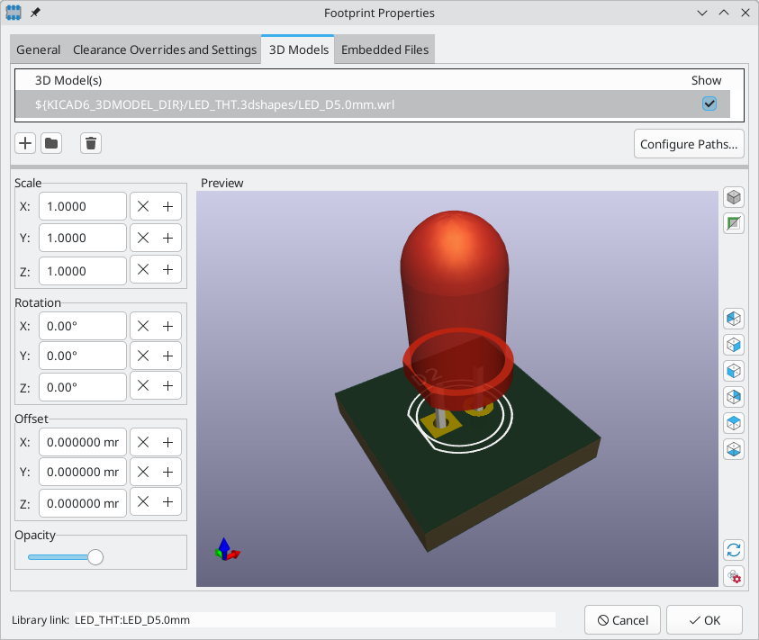

Both STEP (`.step`) and VRML (`.wrl`) 3D model formats are supported. STEP files
are useful where dimensional accuracy is needed, while VRML files can be used
for more visually attractive renders. Many footprints in KiCad's library have
associated 3D models; these models are provided in both VRML and STEP formats.
Only one of the two models needs to be listed in the footprint (typically the
VRML filename is given). KiCad can automatically substitute the STEP version
when exporting a 3D model of the board for mechanical CAD purposes.

NOTE: Not all footprints in KiCad's library are provided with 3D models,
but all footprints list a 3D model filename even if the 3D model does not
exist. This is so 3D models can be added at a later date without needing to edit
the footprint.

https://www.freecadweb.org/[FreeCAD] together with the
https://github.com/easyw/kicadStepUpMod/[StepUp Workbench] are useful for
creating component 3D models; they are used for many of the models in KiCad's
library. StepUp is used to generate STEP and VRML files with correct placement,
scaling, and rotation.

== Where To Go From Here

=== More Learning Resources

For more information on how to use KiCad, see the https://docs.kicad.org/[manual].

Other resources include the
https://forum.kicad.info/[official KiCad user forum],
https://www.kicad.org/community/chat/[Discord or IRC], and additional
https://www.kicad.org/help/learning-resources/[learning resources] from the
KiCad community.

To see more of what's possible with KiCad, browse the
https://www.kicad.org/made-with-kicad/[Made With KiCad] section of the website,
or open the demo projects included with KiCad
(**File** -> **Open Demo Project...**).

=== Help Improve KiCad

To report a bug or request a feature, please use **Help** -> **Report a Bug**
or open an issue on https://gitlab.com/kicad/code/kicad/-/issues[Gitlab].

To contribute to KiCad's development, please see the
https://dev-docs.kicad.org/en/contribute/[Developer Contribution page]. Users
can also help by contributing to the
https://www.kicad.org/libraries/contribute/[libraries] or
https://www.kicad.org/contribute/docs-team/[documentation and translation].
Finally, consider https://www.kicad.org/donate/faq/[financially supporting]
continued development of KiCad.

