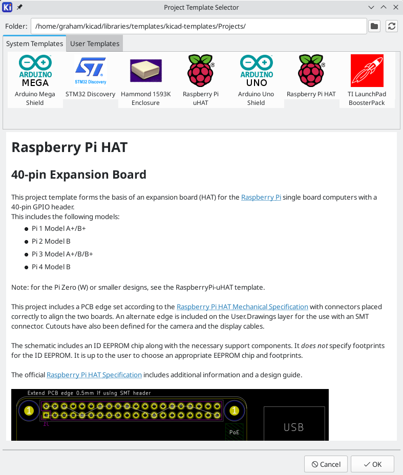

:author: The KiCad Team
:doctype: book
:toc:
:ascii-ids:
:experimental:

= KiCad

_Reference manual_

[[copyright]]
*Copyright*

This document is Copyright (C) 2010-2024 by its contributors as listed below. You may distribute it
and/or modify it under the terms of either the GNU General Public License
(http://www.gnu.org/licenses/gpl.html), version 3 or later, or the Creative Commons Attribution
License (http://creativecommons.org/licenses/by/3.0/), version 3.0 or later.

All trademarks within this guide belong to their legitimate owners.

[[contributors]]
*Contributors*

Jean-Pierre Charras, Fabrizio Tappero, Jon Evans, Graham Keeth.

[[feedback]]
*Feedback*

The KiCad project welcomes feedback, bug reports, and suggestions related to the software or its
documentation.  For more information on how to submit feedback or report an issue, please see the
instructions at https://www.kicad.org/help/report-an-issue/

== Introduction

KiCad is an open-source software suite for creating electronic circuit schematics and printed
circuit boards (PCBs).  KiCad supports an integrated design workflow in which a schematic and
corresponding PCB are designed together, as well as standalone workflows for special uses.  KiCad
also includes several utilities to help with circuit and PCB design, including a PCB calculator for
determining electrical properties of circuit structures, a Gerber viewer for inspecting 
manufacturing files, and an integrated SPICE simulator for inspecting circuit behavior.

KiCad runs on all major operating systems and a wide range of computer hardware.  It supports PCBs
with up to 32 copper layers and is suitable for creating designs of all complexities.  KiCad is
developed by a volunteer team of software and electrical engineers around the world with a mission
of creating free and open-source electronics design software suitable for professional designers.

The latest version of this documentation is available at https://docs.kicad.org. 

=== System Requirements

KiCad is capable of running on a wide variety of hardware and operating systems, but some tasks
may be slower or more difficult on lower-end hardware.  For the best experience, a dedicated
graphics card and display with 1920x1080 or higher resolution is recommended.

Please check the KiCad website for the latest system requirements:
https://kicad.org/help/system-requirements/

=== KiCad files and folders

KiCad creates and uses files with the following specific file extensions (and folders)
for schematic and board editing.

Many of these files include important design information,
especially the project file (`.kicad_pro`), the schematic file(s) (`.kicad_sch`), and the
board file (`.kicad_pcb`). Other files may also be necessary. Such files should always be
included when distributing the project. Some files are not necessary to distribute with the
project, such as the project-local settings file (`.kicad_prl`) or the `fp-info-cache` file.
Files that are unnecessary to distribute are noted in the table below.

==== Project files
[width="100%",cols="20%,80%",]
|=================================================================
|`*.kicad_pro` |Project file, containing settings that are shared between the schematic and PCB
|`*.pro`
      |Legacy (KiCad 5.x and earlier) project file.
      Can be read and will be converted to a `.kicad_pro` file by the project manager.
|=================================================================

==== Schematic editor files
[width="100%",cols="20%,80%",]
|=================================================================
|`*.kicad_sch` |Schematic files, containing all symbol and connection information.
|`*.kicad_sym` |Schematic symbol library file, containing the symbol descriptions: graphic shape, pins, fields.
|`*.kicad_blocks` |Schematic design block library folders. The folder itself is the library.
|`*.kicad_block`
      |Schematic design block folder for defining a reusable schematic design.
      The folder is the design block, and contains a `.kicad_sch` file defining
      the design block's schematic and a `.json` file defining the design
      block's metadata.
|`*.wbk` |Simulator workbook file containing SPICE simulation setup information.
|`*.sch`
      |Legacy (KiCad 5.x and earlier) schematic file.
      Can be read and will be converted to a `.kicad_sch` file on write.
|`*.lib` |Legacy (KiCad 5.x and earlier) schematic library file. Can be read but not written.
|`*.dcm` |Legacy (KiCad 5.x and earlier) schematic library documentation. Can be read but not written.
|`*-cache.lib`
      |Legacy (KiCad 5.x and earlier) schematic component library cache file.
      Required for proper loading of a legacy schematic (`.sch`) file.
|`sym-lib-table` |Symbol library table: list of symbol libraries available in the schematic editor.
|`design-block-lib-table` |Design block library table: list of design block libraries available in the schematic editor.
|=================================================================

==== Board editor files and folders
[width="100%",cols="20%,80%",]
|=================================================================
|`*.kicad_pcb` |Board file containing all info but the page layout.
|`*.pretty` |Footprint library folders. The folder itself is the library.
|`*.kicad_mod` |Footprint files, containing one footprint description each.
|`*.kicad_dru` |Design rules file, containing custom design rules for a certain `.kicad_pcb` file.
|`*.brd`
      |Legacy (KiCad 4.x and earlier) board file.
      Can be read, but not written, by the current board editor.
|`*.mod`
      |Legacy (KiCad 4.x and earlier) footprint library file.
      Can be read by the footprint or the board editor, but not written.
|`fp-lib-table` |Footprint library table: list of footprint libraries available in the board editor.
|`fp-info-cache`
      |Cache to speed up loading of footprint libraries. Does not need to be
      distributed with the project or put under version control.
|=================================================================

==== Common files
[width="100%",cols="20%,80%",]
|=================================================================
|`*.kicad_prl` |Local settings for the current project; helps KiCad remember
the last used settings such as layer visibility or selection filter.
Does not need to be distributed with the project or put under version control.
|`*.kicad_wks` |Page layout (drawing border and title block) description file.
|`*.kicad_jobset` |Jobset definition file containing output jobsets.
|`*.net` |Netlist file created from the schematic, and read by the board editor.
Note that the
xref:../pcbnew/pcbnew.adoc#forward-and-back-annotation[recommended
workflow for transferring information from the schematic to the board] does not
require the use of netlist files.
|`*.cmp` |Association between components used in the schematic and their footprints.
It can be created by the Board Editor and imported by the Schematic Editor.
Its purpose is to import changes from the board to the schematic, for users
who change footprints in the Board Editor (for instance using **Exchange
Footprints** command) and want to import these changes back to the schematic.
Note that the
xref:../pcbnew/pcbnew.adoc#forward-and-back-annotation[recommended
workflow for transferring information from the board to the schematic] does not
require the use of `.cmp` files.
|=================================================================

==== Fabrication and documentation files
[width="100%",cols="20%,80%",]
|=================================================================
|`*.gbr` |Gerber files, for fabrication.
|`*.drl` |Drill files (Excellon format), for fabrication.
|`*.pos` |Position files (ASCII format), for automatic insertion machines.
|`*.rpt` |Report files (ASCII format), for documentation.
|`*.ps`  |Plot files (Postscript), for documentation.
|`*.pdf` |Plot files (PDF format), for documentation.
|`*.svg` |Plot files (SVG format), for documentation.
|`*.dxf` |Plot files (DXF format), for documentation.
|`*.plt` |Plot files (HPGL format), for documentation.
|=================================================================

==== Storing and sending KiCad files

KiCad schematic and board files contain all the schematic symbols and footprints used in the
design, so you can back up or send these files by themselves with no issue.  Some important
design information is stored in the project file (`.kicad_pro`), so if you are sending a complete
design, make sure to include it.

Some files, such as the project-local settings file (`.kicad_prl`) and the `fp-info-cache` file,
are not necessary to send with your project.  If you use a version control system such as Git to
keep track of your KiCad projects, you can add these files to the list of ignored files so
that they are not tracked.

== Installing and Upgrading KiCad

[[settings]]
=== Importing settings

Each major release of KiCad has its own configuration, so that you may run multiple KiCad versions
on the same computer without the configurations interfering.  The first time you run a new version
of KiCad, you will be asked how to initialize the settings:

image::images/configure_settings.png[]

If a previous version of KiCad is detected, you will have the option to import the settings from
that version.  The location of the previous configuration files is detected automatically, but you
may override it to choose another location if desired.

Please note that, the schematic symbol and footprint library tables from the previous version of
KiCad will **not** be imported.

You may also choose to start with default settings if you do not want to import settings from a
previous version.

[[config-file-location]]
KiCad stores the settings files in a folder inside your user directory.  Each KiCad version will
use a different versioned subfolder. For KiCad 8, those folders are:

[width="75%",cols="25%,75%"]
|===========================
|Windows |`%APPDATA%\kicad\8.0`
|Linux   |`~/.config/kicad/8.0`
|macOS  |`/Users/<username>/Library/Preferences/kicad/8.0`
|===========================

=== Migrating files from previous versions

Modern versions of KiCad can open files created in earlier versions, but can only write files in
the latest formats.  This means that in general, there are no special steps to migrate files from
a previous version besides opening the files.  In some cases, the file extension for a file has
changed from one KiCad version to the next.  After opening these files, they will be saved in the
new format with the new file extension.  The old files will not be deleted automatically.

The schematic editor documentation describes several particular considerations
for opening
xref:../eeschema/eeschema.adoc#opening-legacy-schematics[legacy schematics].

In general, files created or modified by one version of KiCad **cannot** be opened by older
versions of KiCad.  For this reason, it is important to keep backup copies of your projects when
testing a new KiCad release, until you are confident that you will not need to use the older
KiCad version anymore.

NOTE: Hotkey configurations are not imported from previous versions at this time.  You can manually
      import hotkey configurations by copying the various `*.hotkeys` files from the old version
      configuration directory to the new one.  If you do so, please note that KiCad will not
      automatically detect conflicts such as one key being assigned to multiple actions.

== Using the KiCad project manager

The KiCad project manager is a tool which creates and opens KiCad projects and launches the
other KiCad tools (schematic and board editors, Gerber viewer, and utility tools).

The KiCad project manager window is composed of a tree view on the left showing the files
associated with the open project, and a launcher on the right containing shortcuts to the various
editors and tools.

The toolbar on the left side of the window provides shortcuts for common project operations:

[width="100%",cols="10%,90%",]
|=======================================================================
|
|Create a new project.
|
|Open an existing project.
|
|Create a zip archive of the whole project. This includes schematic
files, libraries, PCB, etc.
|image:images/icons/unzip_24.png[]
|Extract a project zip archive into a directory. Files in the destination
directory will be overwritten.
|image:images/icons/refresh_24.png[]
|Refresh the tree view, to detect changes made on the filesystem.
|
|Open the project working directory in a file explorer.
|=======================================================================

The tree view shows a list of files inside the project folder.  Double-clicking on a file in the
tree view will open it in the associated editor.  Right-clicking on a file will open a context
menu with some file manipulation commands. If the project is part of a Git repository, the tree
shows icons indicating the <<git-integration,version control status>> of each file and lists
the active branch next to the project name.

NOTE: Only files that KiCad understands how to open are displayed in the project tree view.

KiCad projects contain at least a project file, a schematic, and a board design. Schematics
may contain multiple sheets, each in its own file, but a project can only contain a single
board. KiCad expects the project file, schematic root sheet file, and board file to all have
the same name.

=== Standalone mode

You can also run the KiCad editor tools in _standalone_ mode, by launching them directly from
your operating system's application launcher rather than from the project manager. It is
usually *not recommended* to run the tools in standalone mode, except for some specific
situations where it is necessary, such as when importing projects from other EDA tools.
When running in standalone mode, some project features are not available, including:

* cross probing between the schematic editor and the board editor
* design synchronization between the schematic and the board

=== Creating a new project

Most KiCad designs start with the creation of a project.  There are two ways to create a project
from the KiCad project manager: you may create an empty project, or create a project based on an
existing template.  This section will cover the creation of a new, empty project.  Creating
projects from templates is covered in the <<project-templates,Project Templates>> section.

To create a new project, use the **New Project...** command in the **File** menu, click the
**New Project** button in the top toolbar, or use the keyboard shortcut (`Ctrl+N` by default).

You will be prompted for a name to give your project.  By default, a directory will be created for
your project with the same name.  For example, if you enter the name `MyProject`, KiCad will create
the directory `MyProject` and the project file `MyProject/MyProject.kicad_pro` inside it.

If you already have a directory to store your project files in, you can uncheck the
_Create a new directory for the project_ checkbox in the **New Project** dialog.

NOTE: It is strongly recommended that you store each KiCad project inside its own directory.

Once you select the name of your project, KiCad will create the following files inside the project
directory:

[width="100%",cols="27%,73%",]
|=================================================================
|`example.kicad_pro` |KiCad project file.
|`example.kicad_sch` |Main schematic file.
|`example.kicad_pcb` |Printed circuit board file.
|=================================================================

=== Importing a project from another EDA tool

KiCad is able to import files created by some other software packages.  Some software formats can
be imported as complete projects.  Others can only be imported as standalone schematics or boards
at the moment, and must be manually linked together into a KiCad project. Currently the following
types of project are supported:

[width="100%",cols="27%,73%",]
|=============================================
|`\*.sch`, `*.brd`  |Eagle 6.x or newer (XML format)
|`\*.csa`, `*.cpa`  |CADSTAR archive format
|`\*.zip`           |EasyEDA (JLCEDA) Standard Backup
|`\*.epro`, `*.zip` |EasyEDA (JLCEDA) Pro Project
|=============================================

To import a project from one of these tools, choose the appropriate option from the **Import
Non-KiCad Project** submenu of the **File** menu.

You will be prompted to select either a schematic or a board file in the import file browser
dialog. The imported schematic and board files should have the same base file name (e.g.
project.sch and project.brd). Once the requested files are selected, you will be asked to select a
directory to store the resulting KiCad project.

Currently the following types of documents can be imported standalone.  To import these documents,
start the KiCad Schematic Editor or PCB Editor standalone (do not open the KiCad project manager
first) and choose **File > Import > Non-KiCad Schematic** or
**File > Import > Non-KiCad Board File**.  When importing Altium projects, we recommend importing
the PCB first, saving the resulting project, and then copying each schematic sheet into the project
after importing it in a standalone Schematic Editor window.

[width="100%",cols="27%,73%",]
|=============================================
|`*.SchDoc` |Altium Designer, Circuit Studio, Circuit Maker schematic documents
|`*.PcbDoc` |Altium Designer PCB
|`*.CMPcbDoc` |Altium Circuit Maker PCB
|`*.CSPcbDoc` |Altium Circuit Studio PCB
|`*.pcb` |P-Cad 200x ASCII PCB
|`\*.txt`, `*.fab` |Fabmaster PCB
|=============================================

NOTE: KiCad does not support schematics with multiple top-level sheets.  When importing designs
from other tools that do support this feature, each schematic sheet must be imported, and then the
imported sheets must be placed as hierarchical sheets in a new KiCad project.

[[project-archive]]
=== Saving and loading project archives

You can archive your project's files into a zip archive with the Archive tool
(**File** -> **Archive Project...**).

You can also unarchive a project using the Unarchive tool (**File** ->
**Unarchive Project...**). When you unarchive a project into the currently
loaded project directory, the project will be reloaded automatically to reflect
any changes that were in the archived version of the project.

The archive tool saves the following files from your project folder into the
archive:

[width="100%",cols="40%,60%",]
|=================================================================
|`\*.kicad_prl`, `*.kicad_pro`,
      `\*.kicad_sch`, `*.kicad_sym`,
      `\*.kicad_pcb`, `*.kicad_mod`,
      `\*.kicad_dru`, `*.kicad_wks`,
      `\*.kicad_jobset`, `*.wbk`, `*.json`,
      `fp-lib-table`, `sym-lib-table`, `design-block-lib-table`
      | KiCad design files
|`\*.pro`, `*.sch`,
      `\*.lib`, `*.dcm`, `\*.cmp`, `*.brd`, `*.mod`
      | Legacy KiCad design files
|`\*.stp`, `*.step`
      | 3D models
|`\*.g?`, `*.g??`,
      `\*.gm??`, `*.gbrjob`
      | Gerber files
|`\*.pos`, `*.drl`, `\*.nc`, `*.xnc`, `\*.d356`, `*.rpt`
      | Manufacturing files
|`*.net`
      | Netlists
|`*.py`
      | Python scripts
|`\*.pdf`, `*.txt`
      | Documentation files
|`\*.cir`, `*.sub`, `*.model`
      | SPICE models
|`\*.ibs`, `*.pkg`
      | IBIS models
|=================================================================

=== Git integration

The KiCad Project Manager integrates with the Git version control tool for
tracking changes in your projects. It can work with an existing local Git
repository, clone a project from a remote repository, or create a new repository
in an existing project. You can use the tool to commit changes from your
project, push and pull from a remote repository, and switch branches.

If you open a project that is already under version control with Git, i.e. it is
part of an existing Git repository, you can use KiCad's version control features
to track changes in the project without any additional configuration. The active
branch is displayed next to the project name, and the version control status of
each file in your project is shown graphically in the project files tree. For
example, the  icon indicates a file is
unchanged,  indicates a file has
uncommitted changes, and  indicates a file is
not tracked. No icons are shown if the project is not part of a Git repository.

If an existing project is not already under version control, you can initialize
a new Git repository in the project by right clicking on one of the files in the
project files tree and clicking **Version Control** ->
**Add Project to Version Control...**. You must configure a remote when
initializing a repository in this way. Configuring the repository requires the
following information:

* **Name**: A name for the repository. This field can be anything and is not used.
* **Location**: The URL or file path to the remote.
* **Connection Type**: The protocol for connecting to the remote.
  This can be HTTPS, SSH, or local (file). HTTPS connections use username and
  password authentication. SSH connections use a username, private key, and an
  optional password for the keyfile. Local connections do not use
  authentication. You can check the connection and authentication by clicking
  the **Test** button.

To clone an existing repository and open the cloned project, use **File** ->
**Clone Project from Repository...**. You can clone a remote repository using
SSH or HTTPS, or clone a local repository. The configuration settings for
cloning are the same as the settings for configuring a new repository and remote
for an existing project.

When you have made changes that you want to commit, you can commit either the
entire project (right click -> **Version Control** -> **Commit Project...**) or
a specific file (right click the file -> **Version Control** -> **Commit
File...**). Both actions open the Commit Changes dialog, but the Commit Project
action shows all changed files in the repository, while the Commit File action
shows only the file that was right clicked.  The Commit Changes dialog lets you
select the changed files you want to include in the commit, provide a commit
message and author, and commit the changes.

To push changes to the remote, right click in the project files tree and select
**Version Control** -> **Push**. To pull from the remote, right click and select
**Version Control** -> **Pull**. You can switch branches by selecting the
desired branch from the **Version Control** -> **Switch to Branch** menu.

Finally, you can remove version control entirely, deleting all tracked history
from the local repository, by right clicking and selecting **Version Control**
-> **Remove Version Control**.

[[kicad-manager-configuration]]
== KiCad configuration

The KiCad preferences can always be accessed from the **Preferences** menu, or by using the hotkey
(default kbd:[Ctrl+,]). The Preferences dialog is shared between the running KiCad tools.  Some
preferences apply to all tools, and some are specific to a certain tool (such as the schematic or
board editor).

=== Common preferences

**Accelerated graphics antialising:** KiCad can use different methods to prevent aliasing
(jagged lines) when rendering using a graphics card.  Different methods may look better on
different hardware, so you may want to experiment to find the one that looks best to you.

**Fallback graphics antialiasing:** KiCad can also apply antialiasing when using the fallback
graphics mode.  Enabling this feature may result in poor performance on some hardware.

**Text editor:** Choose a text editor to use when opening text files from the project tree view.

**PDF viewer:** Choose a program to use when opening PDF files.

**Show icons in menus:** Enables icons in drop-down menus throughout the KiCad user interface.

NOTE: Icons in menus are not displayed on some operating systems.

**Show scrollbars in editors:** When enabled, scrollbars are displayed next to the editing
canvases in each tool. When disabled, scrollbars are not shown.

**Focus follows mouse between schematic and PCB editors:** When enabled, the window under the
mouse cursor will automatically become focused.

**Icon scale:** Sets the size of the icons used in menus and buttons throughout KiCad.  Choose
_Automatic_ to pick an appropriate icon scale automatically based on your operating system
settings.

**Icon theme:** Sets whether to use the icon theme designed for light window backgrounds or dark
window backgrounds.  The default setting of Automatic will choose the theme based on the lightness
of the operating system window theme.

**High-contrast mode dimming factor:** Sets how much non-focused items are
dimmed in high-contrast display mode.

**Warp mouse to origin of moved object:** When enabled, the mouse cursor will be repositioned
(warped) to the origin of an object when you start a move command on that object.

**First hotkey selects tool:** When disabled, pressing the hotkey for a command such as _Add Wire_
will immediately start the command at the current cursor location.  When enabled, pressing the
hotkey the first time will just select the _Add Wire_ tool but will not immediately begin a wire.

**Remember open files for next project launch:** When enabled, KiCad will automatically re-open any
files that were previously open when a project is re-opened.

**Auto save:** When editing schematics and board files, KiCad can automatically save your work
periodically.  Set to `0` to disable this feature.

**File history size:** Configure the number of entries in the list of recently-opened files

**3D cache file duration:** KiCad creates a cache of 3D models in order to speed up the 3D viewer.
You can configure how long to keep this cache before deleting old files.

**Automatically backup projects:** When enabled, KiCad projects will be archived to ZIP files
automatically according to the settings below.  The archives will be stored in a subfolder of the
project folder.  Backups are created when saving files in the project.

**Create backups when auto save occurs:** When enabled, a backup will be created every time an
automatic file save occurs (if the backup is permitted by the settings below).  This setting has
no effect if the auto save interval is set to `0` (disabled).

**Maximum backups to keep:** When creating a new backup, the oldest backup file will be deleted to
keep the total number of backup files below this limit.

**Maximum backups per day:** When creating a new backup, the oldest backup file created on the
current day will be deleted to stay below this limit.

**Minimum time between backups:** If backup is triggered (for example, by saving a board file),
the backup will not be created if an existing backup file is newer than this limit.

**Maximum total backup size:** When creating a new backup file, the oldest backup files will be
deleted to keep the total size of the backup files directory below this limit.

=== Mouse and touchpad preferences

**Center and warp cursor on zoom:** When enabled, zooming using the hotkeys or mouse wheel will
cause the view to be centered on the cursor location.

**Use zoom acceleration:** When enabled, scrolling the mouse wheel or touchpad faster will cause
the zoom to change faster.

**Zoom speed:** Controls how much the zoom changes for a given amount of scrolling the mouse wheel
or touchpad.  Use _Automatic_ to set a default value depending on your operating system.

**Automatically pan while moving object:** When enabled, the view can be panned while moving an
object by moving close to the edge of the canvas.

**Auto pan speed:** Controls how fast the canvas pans while moving an object.

**Mouse buttons:** You can set the behavior of dragging the middle and right mouse buttons to zoom
the view, pan the view, or have no effect.  You can also set the behavior of dragging the left
mouse button depending on whether or not any objects are already selected in the editing canvas.

NOTE: The left mouse button is always used for selecting and manipulating objects.

**Mouse wheel and touchpad scrolling:** You can set the behavior of scrolling the mouse wheel or
vertical motion of the touchpad while pressing certain modifier keys.

**Pan left/right with horizontal movement:** When enabled, you can pan the view using the touchpad
or horizontal scroll wheel (if present on your mouse).

=== Hotkey preferences

image::images/preferences_hotkeys.png[width="100%"]

You can use this dialog to customize the hotkeys used to control KiCad.  The hotkeys in the
_Common_ section are shared between every KiCad program. Hotkeys for each specific KiCad program
are shown when that program is running.  You can assign the same hotkey to a different action in
different KiCad programs (for example, the schematic editor and the board editor), but you cannot
assign a hotkey to more than one action in the same program.

There are many available commands, and so not all of them have a hotkey assigned by default.  You
can add a hotkey to any command by double-clicking on the command in the list.  If you choose a
hotkey that is already assigned to a different command, you can choose to use that hotkey on your
chosen command, which will remove the hotkey assignment from the conflicting command.

Changes that you have made to hotkey assignments are shown with a `*` character at the end of the
command name.  You can undo changes to a specific command by right-clicking that command and
selecting **Undo Changes**, or you can undo all changes with the button below the command list.

**Importing hotkeys**

Hotkey preferences are stored in `.hotkeys` files in the KiCad settings directory (see the
<<settings,Settings>> section for information about where the settings directory is on your
operating system).  If you have configured KiCad hotkeys the way you like on one computer, you can
transfer that configuration to another computer by importing the appropriate `.hotkeys` file(s).

[[path-variables]]
=== Paths configuration

In KiCad, one can define paths using a *path variable*.
A few path variables are internally defined by KiCad,
and can be used to define paths for libraries, 3D shapes, etc.

This is useful when absolute paths are not known or are subject to change (e.g.
when you transfer a project to a different computer), and also when one base
path is shared by many similar items. Consider the following which may be
installed in varying locations:

* Schematic symbol libraries
* Footprint libraries
* 3D model files used in footprint definitions

For instance, the path to the `connect.pretty` footprint library,
when using the `KICAD8_FOOTPRINT_DIR` path variable, would be defined as
`$\{KICAD8_FOOTPRINT_DIR\}/connect.pretty`.

The *Preferences* -> *Configure Paths...* menu
allows you to define paths for some built-in KiCad path variables,
and add your own path variables to define personal paths, if needed.

NOTE: KiCad will automatically resolve versioned path variables from
      older versions of KiCad to the value of the corresponding variable from
      the current KiCad version, as long as the old variable is not explicitly
      defined itself. For example, `$\{KICAD8_FOOTPRINT_DIR\}` will
      automatically resolve to the value of `$\{KICAD9_FOOTPRINT_DIR\}` if there
      is no `KICAD8_FOOTPRINT_DIR` variable defined.

[[kicad-environment-variables]]
==== KiCad path variables

[width="100%",cols="30%,70%",]
|=================================================================
|`KICAD8_3DMODEL_DIR`
  |Base path of KiCad's standard 3D footprint model library
  files.
|`KICAD8_3RD_PARTY`
  |Location for plugins, libraries, and color themes installed by the
  <<plugin-content-manager,Plugin and Content Manager>>.
|`KICAD8_FOOTPRINT_DIR` |Base path of KiCad's standard footprint library files.
|`KICAD8_SYMBOL_DIR` |Base path of KiCad's standard symbol library files.
|`KICAD8_TEMPLATE_DIR` |Location of KiCad's standard project template library files.
|`KICAD_USER_TEMPLATE_DIR` |Location of personal project templates.
|`SPICE_LIB_DIR`
  |Location of personal xref:../eeschema/eeschema.adoc#sim-library[simulation model libraries].
  This variable is not defined by default.
|`KIPRJMOD`
  |Absolute path to the current project directory. This variable is set
  automatically and cannot be redefined.
|=================================================================

image::images/configure_path_dlg.png[scaledwidth="80%"]

Paths set in the Configure Paths dialog are internal to KiCad and are not
visible as environment variables outside of KiCad. They are stored in
<<config-file-location,KiCad's user configuration files>>.

Paths can also be set as system environment variables outside of KiCad, which
will override any settings in the user's configuration.

NOTE: You cannot override a system environment variable that has been set
      outside of KiCad by using the Configure Paths dialog. Any variable that
      has been set externally will be shown as read-only in the dialog.

Note also that the path variable `KIPRJMOD` is *always* internally
defined by KiCad, and expands to the **current project absolute path**.
For instance, `$\{KIPRJMOD\}/connect.pretty` is always the `connect.pretty`
folder (the footprint library) inside **the current project folder**.
The `KIPRJMOD` variable cannot be changed in the Configure Paths dialog or
overridden by an external environment variable.

==== Advanced environment variables

Some advanced environment variables can be set to customize where KiCad expects
certain files to be located. By default, these locations are set based on your
platform, but they can be overridden by system environment variables. These
variables are not shown in the Configure Paths dialog and cannot be used in path
substitutions.

Changing these variables will not result in KiCad moving any files from the
default location to the new location, so if you change these variables you will
need to copy any desired settings or files manually.

[width="100%",cols="30%,70%",]
|=================================================================
|`KICAD_CONFIG_HOME` |Base path of KiCad configuration files. Subdirectories will be created
    within this directory for each KiCad minor version.
|`KICAD_DOCUMENTS_HOME` |Base path of KiCad user-modifiable documents, such as projects, templates,
    Python scripts, libraries, etc. Subdirectories will be created within this directory for each
    KiCad minor version. This directory is provided as a suggested user data location, but does
    not need to be used.
|`KICAD_STOCK_DATA_HOME` |Base path of KiCad stock data, including default libraries. The data
    in this directory is managed by the KiCad installer or system package manager, and is not
    intended for user-writeable data.
|=================================================================

WARNING: If you modify the configuration of paths, please quit and restart KiCad
to avoid any issues in path handling.

[[libraries-configuration]]
=== Libraries configuration

The *Preferences* -> *Manage Symbol Libraries...* menu lets you manage the
list of symbol libraries
(xref:../eeschema/eeschema.adoc#managing-symbol-libraries[symbol library table]).

Likewise, use the *Preferences* -> *Manage Footprint Libraries...* menu to manage
the list of footprint libraries
(xref:../pcbnew/pcbnew.adoc#managing-footprint-libraries[footprint library table]).

For each type of library (symbol and footprint), there are 2 library tables:
global and project specific. The global library table is located in the
<<config-file-location,user configuration directory>> and contains a list of
libraries available to all projects. The project-specific library table is
optional and contains a list of libraries specific to the project. It is located
in the project directory.

[[jobsets]]
== Jobsets

KiCad lets you configure a list of outputs that are all generated with a single click. The list of output jobs and where they will be saved is called a __jobset__. For example, a jobset might contain jobs to generate Gerber files, assembly data, a bill of materials, PDF plots of the schematic and PCB, while also running ERC and DRC checks, with all of the outputs saved to a compressed archive. The full list of available jobs is given <<job-types,below>>.

Each __job__ in a jobset defines a single type of generated output, such as a bill of materials or a set of Gerbers. A job can be configured in the same way as if the output was manually generated from the schematic or board editor. The configuration for each job is stored in the jobset and remembered when you load the jobset later. Jobs are configured individually, so if you include the same type of job multiple times in a single jobset, each job will have its own independent configuration. For example, this lets you generate PDF outputs in color as well as black and white.

In addition to the jobs, jobsets also contain __jobset output__ configurations, which define a list of jobs to run and how to store their outputs. Jobset output configurations can simply store the chosen jobs' output files in a specified location, or they can add the output files to a compressed archive. Each jobset output configuration can select a different subset of jobs from the full list of jobs in the jobset. You can run each jobset output individually or run all jobset outputs at once. As an example, you could set up one jobset output configuration that generates PDFs of the board and schematic and copies them to an external location, while another jobset output configuration generates the fabrication files and compresses them in a zip archive to send to the board manufacturer.

Projects can have multiple jobsets, with each jobset defining a different list of jobs and output configurations. Each jobset is stored in a `.kicad_jobset` file, which can be specific to a single project, copied between projects, or even stored in a central location and shared between projects.

To use a jobset, first create a new jobset file in the KiCad project manager (**File** -> **New Jobset File...**) and choose a name and location for it. Alternatively, you can open an existing jobset file with **File** -> **Open Jobset File...**. Jobset files that are stored in the project directory are considered part of the project and are displayed in the project file tree. You can open a jobset file in the project file tree by double clicking on it.

Once you create or open a jobset, it is displayed in a new tab in the project manager. The list of jobs is shown in the middle and the list of jobset outputs is shown on the right. New jobsets will not contain any jobs or outputs. When you make changes to a jobset, you can save the changes by clicking the **Save Jobset** button.

=== Defining jobs

To add a new job, click the image:images/icons/small_plus_16.png[] button under the Jobs list. In the Add New Job dialog that appears, select the desired type of job. You can filter which types of jobs are shown in the list by typing in the **Filter** textbox at the bottom.

When you select a job and press **OK**, the configuration dialog for that type of output will appear. Each output configuration dialog provides the same options you would have if you manually generated that type of output from the schematic or board editor.

NOTE: Output filenames and paths specified in job configurations are relative to the <<jobset-outputs,jobset output>> folder or archive root. You can use certain xref:../eeschema/eeschema.adoc#text-variables[text variables], like `${PROJECTNAME}`, `${CURRENT_DATE}`, and xref:../eeschema/eeschema.adoc#schematic-setup-text-variables[project text variables].

When you accept the output configuration dialog, the job is added to the list of jobs, where you can optionally change the new job's description from its default. To change a job's description or settings later, right click the job in the list and select **Edit Job Description** or **Edit Job Settings...**. Double clicking on a job also edits its settings. To remove a job, select the job and click the image:images/icons/small_trash_16.png[] button. To reorder the list, select a job and move it up or down using the image:images/icons/small_up_16.png[] or image:images/icons/small_down_16.png[] buttons.

[[jobset-outputs]]
=== Defining jobset outputs

You cannot generate any outputs from a jobset until you add a jobset output configuration. To add a jobset output, click the image:images/icons/small_plus_16.png[] button under the Outputs list. When the Add New Output dialog appears, select a type of output:

* **Archive** saves the outputs generated by the jobs in a compressed zip archive.
* **Folder** saves the outputs generated by the jobs uncompressed in a folder.

Once you have selected a type of output, the Output Options dialog appears. 

Here you can select which jobs will be run as part of this jobset output, as well as the folder or archive name that will be used to store them. By default all jobs are enabled. You can also set a description for the output which will be displayed in the Outputs list. The output path controls where the files generated by the jobs will be saved. The path here can be absolute or relative to the project directory, and it can use <<kicad-environment-variables,path variables>> or certain text variables (`${PROJECTNAME}`, `${CURRENT_DATE}`, and xref:../eeschema/eeschema.adoc#schematic-setup-text-variables[project text variables]). Filenames defined in job configurations are relative to the jobset output directory or archive root.

When you click **OK** in this dialog, the new jobset output is added to the Outputs list. You can modify an existing jobset output configuration by clicking its  button, or remove it by clicking its image:images/icons/small_trash_16.png[] button.

After configuring your jobs and outputs, you can generate an individual set of outputs by clicking the **Generate** button for the desired output configuration. You can run all outputs at once by clicking the **Generate All Outputs** button.

If a jobset output runs and generates its outputs successfully, a blue check is shown that indicates the last run was successful. If a jobset output fails to complete successfully, a red exclamation point is shown to indicate the run was not successful. Clicking on the success/failure indicator will display the Job Output Run Log dialog, which displays the status of each job in the jobset output configuration. Clicking on a specific job will display the logged output from that job, if there is any.

[[job-types]]
=== Available job types

The following types of jobs are available:

[width="100%",cols="30%,70%",]
|====
| Job | Description
| PCB: Export 3D Model
      | Exports a xref:../pcbnew/pcbnew.adoc#_3d-export[3D model] of the board. The model format can be STEP, GLB (binary glTF), XAO, BREP (OCCT), PLY, or STL.
| PCB: Export Drill Data
      | Exports a xref:../pcbnew/pcbnew.adoc#drill_files[drill file] from the board.
| PCB: Export DXF
      | Exports the board design to a xref:../pcbnew/pcbnew.adoc#fabrication_outputs_and_plotting[DXF file].
| PCB: Export Gerbers
      | Exports the board design to xref:../pcbnew/pcbnew.adoc#fabrication_outputs_and_plotting[Gerber files], with one file per selected layer.
| PCB: Export IPC2581
      | Exports the board design in xref:../pcbnew/pcbnew.adoc#ipc-2581-export[IPC-2581 format].
| PCB: Export ODB{pp}
      | Exports the board design in xref:../pcbnew/pcbnew.adoc#odb-export[ODB{pp} format].
| PCB: Export PDF
      | Exports the board design to xref:../pcbnew/pcbnew.adoc#fabrication_outputs_and_plotting[PDF files], with one file per selected board layer. You can also generate a single PDF with multiple layers depending on the plot configuration.
| PCB: Export Position Data
      | Exports a xref:../pcbnew/pcbnew.adoc#component_placement_files[position (component placement) file] from the board.
| PCB: Export SVG
      | Exports the board design to a xref:../pcbnew/pcbnew.adoc#fabrication_outputs_and_plotting[SVG file].
| PCB: Perform DRC
      | Performs a xref:../pcbnew/pcbnew.adoc#design-rule-checking[Design Rule Check] on the board and generates a report. If DRC violations are found, this job can optionally report a job failure.
| PCB: Render
      | Generates a xref:../pcbnew/pcbnew.adoc#threed-viewer[raytraced rendering of the 3D model of the board] as a PNG or JPG file.
| Schematic: Export DXF
      | Exports the schematic to a xref:../eeschema/eeschema.adoc#plotting[DXF file].
| Schematic: Export HPGL
      | Exports the schematic to a xref:../eeschema/eeschema.adoc#plotting[HPGL file].
| Schematic: Export Netlist
      | Exports a xref:../eeschema/eeschema.adoc#netlist-export[netlist] from the schematic, with various formats available.
| Schematic: Export PDF
      | Exports the schematic to a xref:../eeschema/eeschema.adoc#plotting[PDF file].
| Schematic: Export Postscript
      | Exports the schematic to a xref:../eeschema/eeschema.adoc#plotting[PostScript file].
| Schematic: Export SVG
      | Exports the schematic to a xref:../eeschema/eeschema.adoc#plotting[SVG file].
| Schematic: Generate Bill of Materials
      | Exports a xref:../eeschema/eeschema.adoc#bom-export[bill of materials] from the schematic.
| Schematic: Perform ERC
      | Performs an xref:../eeschema/eeschema.adoc#erc[Electrical Rule Check] on the schematic and generates a report. If ERC violations are found, this job can optionally report a job failure.
| Special: Copy files
      | Copies the specified file to the specified destination. A failure to copy the files can optionally cause the output job to fail. You can control whether files in the destination should be overwritten or not.
| Special: Execute Command
      | Executes an arbitrary command. Output from the command can optionally be logged to a file. You can either ignore non-zero output codes or cause them to fail the output job.
|====

[[project-templates]]
== Project templates

Using a project template facilitates setting up a new project with predefined
settings. Templates may contain pre-defined board outlines, connector
positions, schematic elements, design rules, etc. Complete schematics and/or
PCBs used as seed files for the new project may even be included.

=== Using templates

The **File** -> **New Project from Template** menu will
open the Project Template Selector dialog:

A single click on a template's icon will display the template information,
and a further click on the OK button creates the new project. The template
files will be copied to the new project location and renamed to reflect
the new project's name.

[[template-locations]]
=== Template locations

KiCad looks for system templates in the path defined in the
`KICAD8_TEMPLATE_DIR` path variable, and user templates in the path defined in
`KICAD_USER_TEMPLATE_DIR`. However, you can browse for templates in an arbitrary
directory using the **Folder** control at the top of the dialog.

=== Creating templates

A KiCad template is simply a directory containing the template project files,
as well as some required metadata for the template in a subdirectory named
`meta`. The name of the directory containing the template files determines the
name of the template. When you create a project from a template, KiCad copies
the template files to the new project directory, renaming them to match the new
project name as described below.

All files in the template are copied, with two exceptions:

* Files with names beginning with the `.` character (dotfiles) are not copied.
  There is a special case for files named `.gitignore` or `.gitattributes`,
  which are copied if they exist.
* The `meta` directory is not copied

The `meta` directory must contain an HTML file named `info.html`, which is
displayed in the KiCad template browser and should contain basic information
describing the template. Basic HTML features are supported, including images.
Any images referenced by `info.html` should also be stored in the `meta`
directory.

The `<title>` tag determines the name of the template that is displayed during
template selection. Note that the project template name will be cut off if it's
too long. This display name does not need to be the same as the template
directory name.

Here is a sample `info.html` file:

[source,html]
----------------------------------------------------------------
<!DOCTYPE HTML PUBLIC "-//W3C//DTD HTML 4.0 Transitional//EN">
<HTML>
<HEAD>
<META HTTP-EQUIV="CONTENT-TYPE" CONTENT="text/html;
charset=windows-1252">
<TITLE>Raspberry Pi - Expansion Board</TITLE>
</HEAD>
<BODY LANG="fr-FR" DIR="LTR">

This project template is the basis of an expansion board for the
<A HREF="http://www.raspberrypi.org/" TARGET="blank">Raspberry Pi $25
ARM board.</A>   This base project includes a PCB edge defined
as the same size as the Raspberry-Pi PCB with the connectors placed
correctly to align the two boards. All IO present on the Raspberry-Pi
board is connected to the project through the 0.1&quot; expansion
headers.   The board outline looks like the following:

    

(c)2012 Brian Sidebotham (c)2012 KiCad Developers

</BODY>
</HTML>
----------------------------------------------------------------

Finally, `meta` can optionally contain an image named `icon.png`, which will be
used as the template's icon in the template selection dialog. The icon should be
a 64 x 64 pixel PNG image.

==== Template file renaming

All files and directories in a template are copied to the new project
path when a project is created using a template, except `meta` and any dotfiles.
Files and directories containing the template directory name will be renamed
with the new project file name.

For example, using a template named `example` (left) to create a project named
`newproject` (right), with renamed files shown in *bold*:

[width="100%",cols="50%,50%",options="header"]
|=======================================================================
|Files in template `example` directory
|Files created in project `newproject` directory
|
`example.kicad_pro` +
`example.kicad_sch` +
`example.kicad_pcb` +
`example-first.kicad_sch` +
`second-example.kicad_sch` +
`third.kicad_sch` +
`third.kicad_pcb`
|
`*newproject.kicad_pro*` +
`*newproject.kicad_sch*` +
`*newproject.kicad_pcb*` +
`*newproject-first.kicad_sch*` +
`*second-newproject.kicad_sch*` +
`third.kicad_sch` +
`third.kicad_pcb`
|=======================================================================

A template does not need to contain a complete project. If a required
project file is missing, KiCad will create the file using the default create
project behavior:

[width="100%",cols="50%,50%",options="header"]
|=======================================================================
|Files in template `example` directory
|Files created in `newproject` directory
|
`example.kicad_sch` +
`first-example.kicad_sch` +
`first-example.kicad_pcb` +
`second-example.kicad_sch` +
`second-example.kicad_pcb`
|
`*newproject.kicad_sch*` +
`*first-newproject.kicad_sch*` +
`*first-newproject.kicad_pcb*` +
`*second-newproject.kicad_sch*` +
`*second-newproject.kicad_pcb*` +
`*newproject.kicad_pro*` (default) +
`*newproject.kicad_pcb*` (default)
|=======================================================================

As an exception to the template name renaming rule, if the template contains
one project file (`.kicad_pro`) and its name doesn't match the template name,
KiCad will do the renaming based on that project file name instead:

[width="100%",cols="50%,50%",options="header"]
|=======================================================================
|Files in template `example` directory
|Files created in `newproject` directory
|
`example.kicad_sch` +
`example.kicad_pcb` +
`*first-example.kicad_pro*` +
`first-example.kicad_sch` +
`first-example.kicad_pcb` +
`second-example.kicad_sch` +
`second-example.kicad_pcb`
|
`example.kicad_sch` +
`example.kicad_pcb` +
`*newproject.kicad_pro*` +
`*newproject.kicad_sch*` +
`*newproject.kicad_pcb*` +
`second-example.kicad_sch` +
`second-example.kicad_pcb`
|=======================================================================

NOTE: It is not recommended to create a template with multiple project files.

[[plugin-content-manager]]
== Plugin and Content Manager

NOTE: This section of the KiCad documentation has not yet been written.  We
      appreciate your patience as our small team of volunteer documentation
      writers work to update and expand the documentation.

// actions reference (section header in included file)
include::kicad_projmgr_actions_reference.adoc[po4a]
