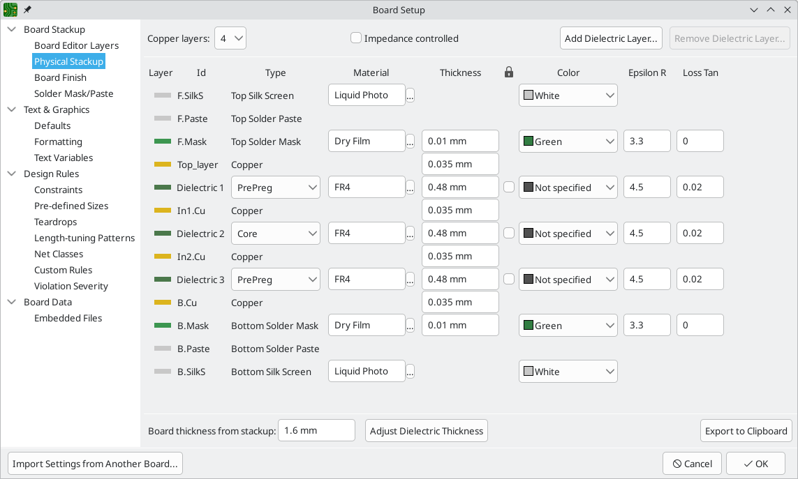
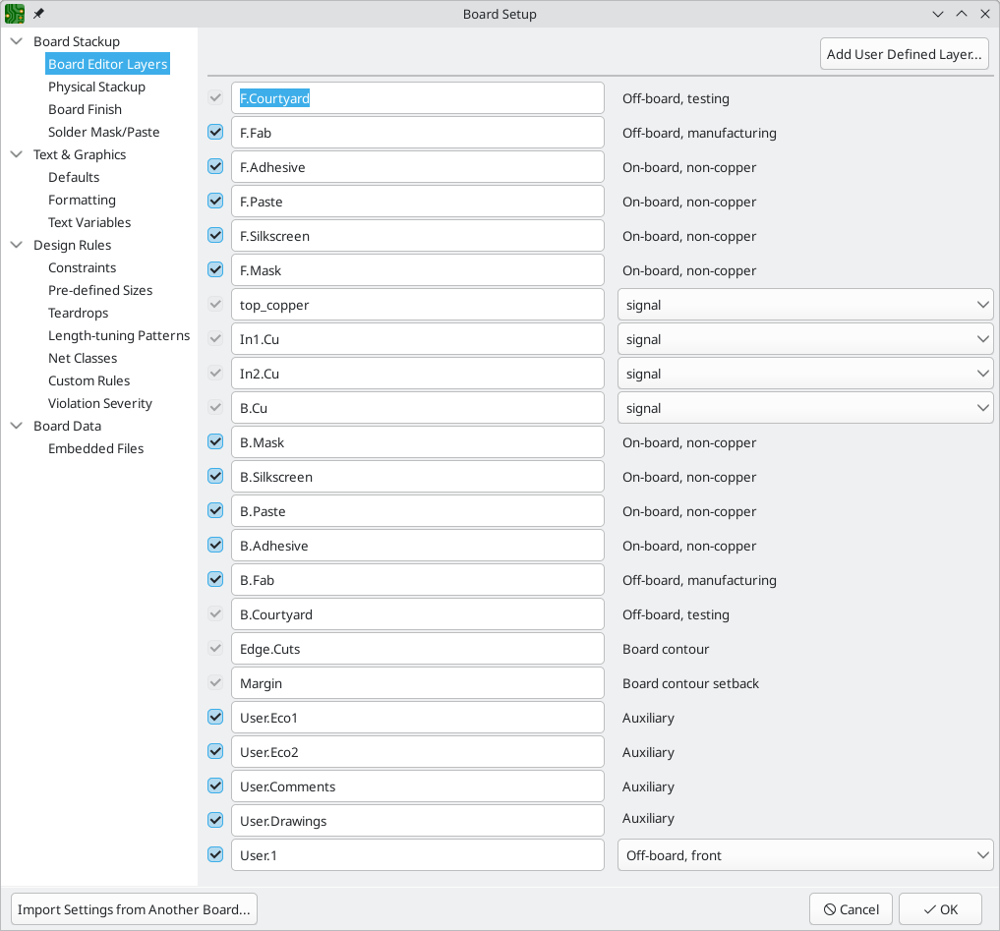
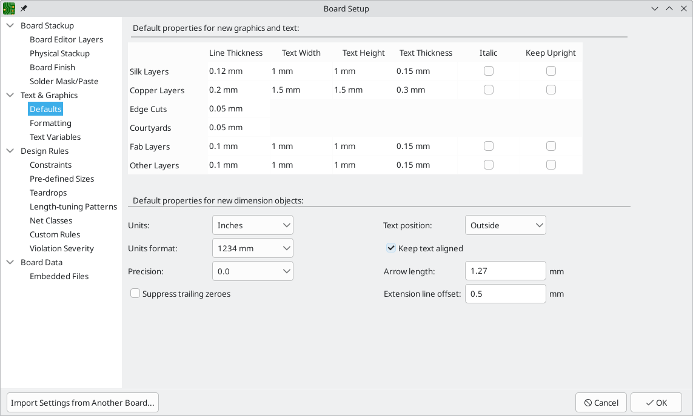
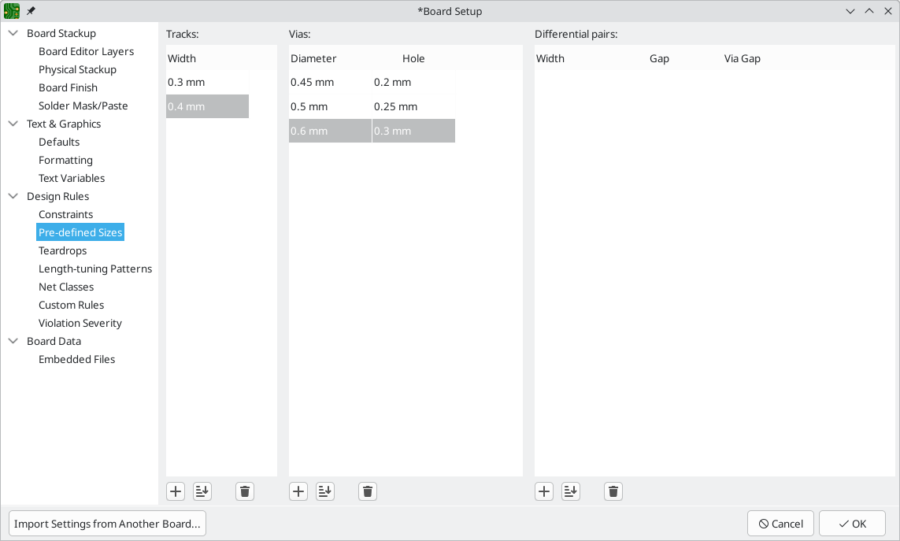
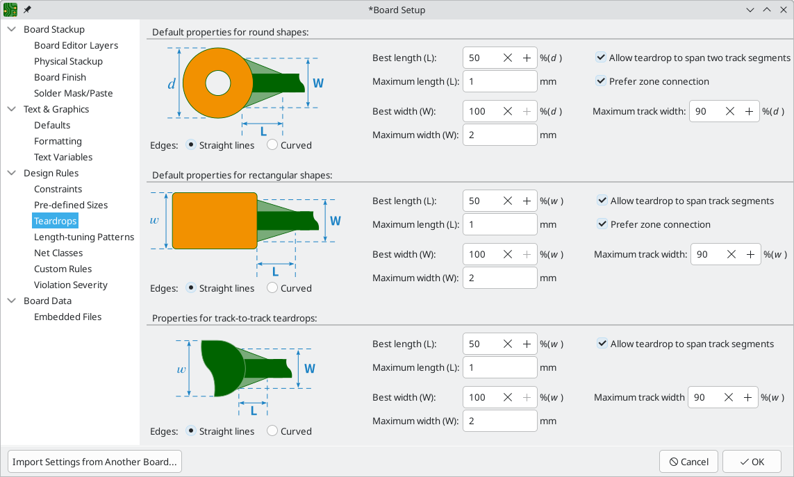
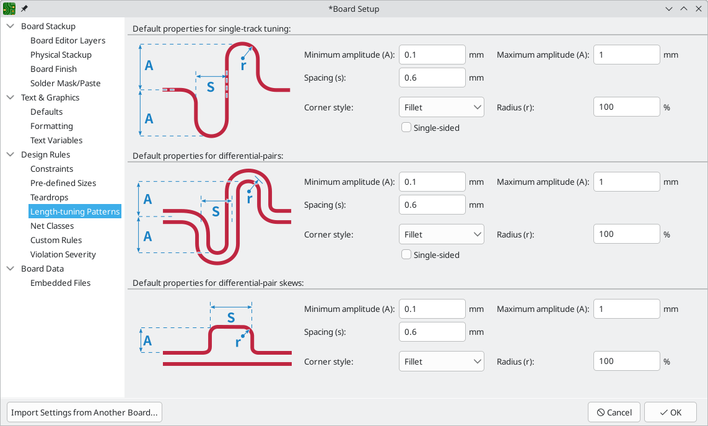
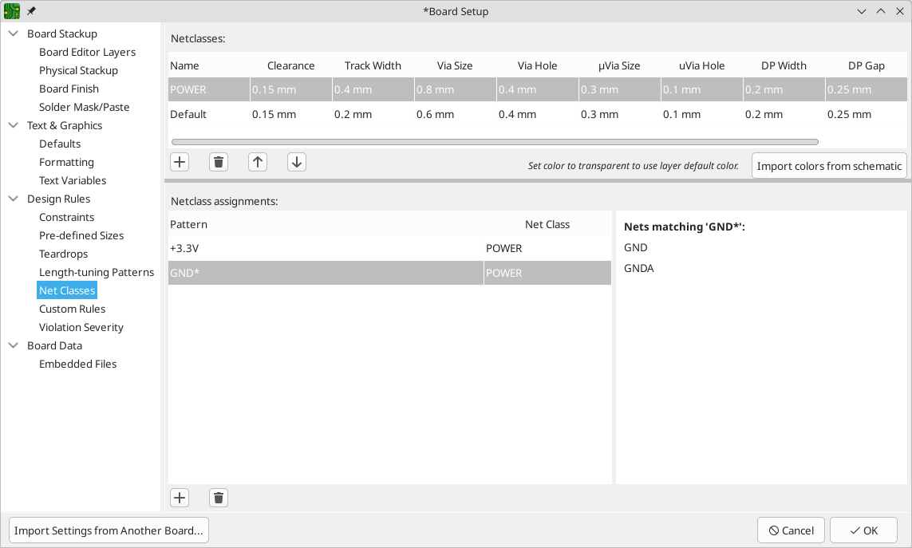
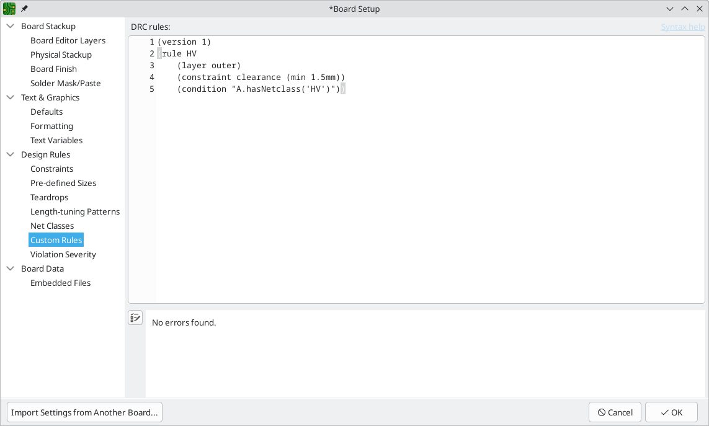
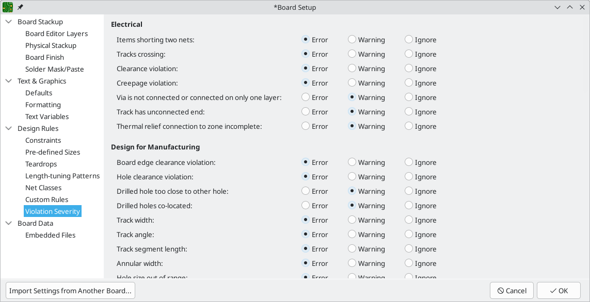

:experimental:

== Creating a PCB

=== Basic PCB concepts

A printed circuit board in KiCad is generally made up of *footprints* representing electronic
components and their pads, *nets* defining how those pads connect to each other, *tracks*, *vias*,
and *filled zones* that form the copper connections between pads in each net, and various graphic
shapes defining the board edge, silkscreen markings, and any other desired information.

KiCad normally keeps the information about nets on a PCB synchronized with an associated
schematic, but nets can also be created and edited directly within the PCB editor.

=== Capabilities

KiCad is capable of creating printed circuit boards with up to 32 copper layers, 14 technical
layers (silkscreen, solder mask, component adhesive, solder paste, etc), and 13 general-purpose
drawing layers.

The internal measurement resolution of all objects in KiCad is 1 nanometer, and measurements are
stored as 32-bit integers.  This means it is possible to create boards up to approximately
4 meters by 4 meters.

KiCad currently supports one board file per project / schematic.

=== Starting from a schematic

Creating a board from a schematic is the recommended workflow for KiCad.  When you create a new
project, KiCad will generate an empty board file with the same name as the project.  To start
designing the board after you have created a schematic, simply open the board file.  You can do
this either from the KiCad project manager, or by clicking the "Open PCB in board editor" button in
the schematic editor.  To import the schematic design information into the board editor, including
footprints and net connections, use the **Tools** -> **Update PCB from Schematic...** action
(kbd:[F8]). You can also use the
image:images/icons/update_pcb_from_sch_24.png["Update pcb from schematic icon"]
icon in the top toolbar.

NOTE: Update PCB from Schematic is the preferred way to transfer design
information from the schematic to the PCB. In older versions of KiCad, the
equivalent process was to export a netlist from the Schematic Editor and import
it into the Board Editor. It is no longer necessary to use a netlist file.

image::images/update_pcb_from_schematic.png[alt="Update PCB from schematic",scaledwidth="70%"]

For more information about the Update Schematic from PCB tool, see the
<<forward-and-back-annotation,forward annotation section of the manual>>.

[[starting-from-scratch]]
=== Starting from scratch

It is also possible to create a board with no matching schematic, although this workflow has some
limitations and is not recommended for most users.  To do this, you must start the PCB editor
standalone (not from the KiCad project manager).  Before beginning your design, it is a good idea
to save the board file, which will also create a project file to store board settings.  Use "Save
As..." from the File menu to choose where to save your board file.  A project file with the same
name will be created in the same location you choose to save the board file in.

=== Board setup

Before beginning your board design, use the Board Setup dialog to configure the basic parameters of
the board.  To open Board Setup, click the  icon in the top
toolbar or choose "Board Setup..." from the File menu.

==== Configuring board stackup and physical parameters

There are two sections of Board Setup used to configure the stackup and layers of the board.  The
Board Editor Layers section is used to enable or disable technical (non-copper) layers, and give
custom names to layers if desired.  The Physical Stackup section is used to configure the number of
copper layers, as well as the physical parameters of the copper and dielectric layers such as
thickness and material type. Dielectric, soldermask, and silkscreen layers can have colors
assigned to them, which affects the board's appearance in the 3D viewer.

To configure the board stackup, start on the Physical Stackup section:

Set the number of copper layers in the upper left corner and then enter the physical parameters of
the stackup if desired.  These parameters may be left at their default values, but note that the
board thickness value will be used when exporting a 3D model of the board, and layer thicknesses
will be included in net length calculations for any nets that include vias.  If you plan to use
these features, it is a good idea to ensure that the stackup thickness is correct.

NOTE: KiCad currently only supports stackups with an even number of copper layers.  To create
      designs with an odd number of layers (for example, flexible printed circuits or metal-core
      printed circuits), simply choose the next highest even number and ignore the extra layer.

Next, if desired, use the Board Editor Layers section to rename layers or hide non-copper layers
that you will not be using in the design.  For example, if you will not use a back silkscreen on
the design, uncheck the box next to the `B.Silkscreen` layer.

NOTE: Copper layers can be designated as signal, power plane, mixed, or jumper in the Board Editor
      Layers section.  This designation is intended as a guide for the user only.  Tracks and zones
      can be routed on any copper layer, no matter what the type is configured to in this dialog.

Some additional board stackup settings are found on the Board Finish and Solder Mask/Paste sections
of the Board Setup dialog.  The Board Finish section has settings for defining the copper finish
and special features such as castellations or edge plating.  Note that these settings only impact
the board attributes output as part of Gerber job files at this time.

The Solder Mask/Paste section allow global adjustment of the clearance (positive or negative)
between the copper shapes and solder mask / solder paste shapes of pads on the board.  These values
will be added to any clearance overrides set on individual footprints or pads.  Positive clearance
values will result in the shape of the solder mask or paste opening being _larger_ than the copper
shape.  Negative clearance values will result in the opening being _smaller_ than the copper shape.

WARNING: Most commercial PCB fabricators expect these values to be zero and make their own
         adjustments to solder mask and paste openings as part of their CAM process.  It is usually
         best to leave these values at their default of zero unless you are making the PCB yourself
         or have specific advice from your fabricator to use different values.

[[board-setup-text-variables]]
==== Configuring default text and graphic settings

The Text & Graphics Defaults section of the Board Setup dialog can be used to configure the
properties that will be used for new text and graphic shapes that are placed on the board.

Line thickness, text size, and text appearance can be configured for the six different categories
of layers shown in the dialog.  Additionally, the properties for dimension objects can be
configured for all layers.  For more details about dimension properties, see the Dimensions section
below.

Dashed line appearance is controlled in the Formatting section. *Dash length*
controls the length of dashes, while *Gap length* controls the spacing between
dashes and dots. The dash and gap lengths are relative to the line width: a gap
length of `2` means twice the width of the line.

Text replacement variables can be created in the Text Variables section.  These variables allow
you to substitute the variable name for any text string.  This substitution happens anywhere the
variable name is used inside the variable replacement syntax of `${VARIABLENAME}`.

For example, you could create a variable named `VERSION` and set the text substitution to `1.0`.
Now, in any text object on the PCB, you can enter `${VERSION}` and KiCad will substitute `1.0`.  If
you change the substitution to `2.0`, every text object that includes `${VERSION}` will be updated
automatically.  You can also mix regular text and variables.  For example, you can create a text
object with the text `Version: ${VERSION}` which will be substituted as `Version: 1.0`.

Text variables can also be created in
xref:../eeschema/eeschema.adoc#schematic-setup[Schematic Setup].
Text variables are project-wide; variables created in the schematic editor are
also available in the board editor, and vice versa. 

There are also a number of
<<text-variables,built-in system text variables>>.

==== Configuring design rules

Design rules control the behavior of the interactive router, the filling of copper zones, and the
<<design-rule-checking,design rule checker>>.  Design rules can be modified at any time, but we recommend that you establish
all known design rules at the beginning of the board design process.

[[board-setup-constraints]]
===== Constraints

Basic design rules are configured in the Constraints section of the Board Setup dialog.  Constraints
in this section apply to the entire board and should be set to the values recommended by your board
manufacturer.  Any minimum value set here is an _absolute_ minimum and cannot be overridden with a
more specific design rule.  For example, if you need the copper clearance on part of a board to be
0.2mm and in the rest 0.3mm, you must enter 0.2mm for the minimum copper clearance in the
Constraints section and use a net class or custom rule to set the larger 0.3mm clearance.

In addition to setting minimum clearances, a number of features can be configured here:

[options="header",cols="25%,75%"]
|====
| Setting | Description
| Arc/circle approximated by segments
  | In some situations, KiCad must use a series of straight line segments to approximate round
    shapes such as those of arcs and circles.  This setting controls the maximum error allowed by
    this approximation: in other words, the maximum distance between a point on one of these line
    segments and the true shape of the arc or circle.  Setting this to a lower number than the
    default value of 0.005mm will result in smoother shapes, but can be very slow on larger boards.
    The default value typically results in arc approximation error that is not detectable in the
    manufactured board due to manufacturing tolerances.
| Allow fillets outside zone outline
  | Zones can have fillets (rounded corners) added in the Zone Properties dialog.  By default, no
    zone copper, including fillets, is allowed outside the zone outline.  This effectively means
    that inside corners of the zone outline will not be filleted even when a fillet is configured.
    By enabling this setting, inside corners of the zone outline will be filleted even though this
    results in copper from the zone extending outside the zone outline.
| Minimum thermal relief spoke count
  | This sets the minimum acceptable number of thermal relief spokes connecting a pad to a
    zone. A DRC violation will be generated if this constraint is violated.
| Include stackup height in track length calculations
  | By default, the length tuner uses the height of the stackup to calculate the additional length
    of a track that travels through vias from one layer to another.  This calculation relies on the
    board stackup height being correctly configured.  In some situations, it is preferable to ignore
    the height of vias and just calculate the track length assuming that vias add no length.  Disabling
    this setting will exclude via length from length tuner track length calculations.
|====

[[board-setup-pre-defined-sizes]]
===== Pre-defined Sizes

The pre-defined sizes section allows you to define the track and via dimensions you want to have
available while routing tracks.  Net classes can be used to define the default dimensions for tracks
and vias in different nets (see below) but defining a list of sizes in this section will allow you
to step through these sizes while routing.  For example, you may want the default track width on a
board to be 0.2 mm, but use 0.3 mm for some sections that carry more current, and 0.15 mm for some
sections where space is limited.  You can define each of these track widths in the Board Setup
dialog and then switch between them when routing traces.

===== Teardrops

The teardrops section lets you set default parameters for various types of teardrops. There are
different settings for teardrop connections to round objects, rectangular objects, and teardrop
connections between tracks. The default teardrop parameters can be overridden when teardrops are
added, and also changed in the properties for individual connected items. See the
<<editing-teardrops,teardrops documentation>> for more information.

===== Length-tuning patterns

The length-tuning patterns section lets you set default parameters for each type of length-tuning
pattern (single-track length, differential-pair length, and differential-pair skew). These defaults
can be overridden in the properties of each tuning pattern added to the board. See the
<<length-tuning,length tuning documentation>> for more information.

[[board-setup-net-classes]]
===== Net Classes

The Net Classes section allows you to configure routing and clearance rules for different classes
of nets.  In KiCad, each net is part of exactly one net class.  If you do not add a net to a
specific class, it will be part of the Default class, which always exists.
xref:../eeschema/eeschema.adoc#schematic-setup-netclasses[Net classes may be created and edited]
in either the Schematic or Board Setup dialogs.

The upper portion of the Net Classes section contains a table showing the net
classes in the design and the design rules that apply to each net class.  Every
class has values for copper clearance, track width, via sizes, and differential
pair sizes.  These values will be used when creating tracks and vias unless a
more specific rule overrides them (see Custom Rules below).

NOTE: No rule may override the minimum values set in the Constraints section of Board Setup.  For
      example, if you set a net class clearance to `0.1 mm`, but the Minimum Clearance in the
      Constraints section is set to `0.2 mm`, nets in that class will have a clearance of `0.2 mm`.

The track widths and via sizes defined for each net class are used when the track width and via
size controls are set to "use netclass values" in the PCB editor.  These widths and sizes are
considered the default, or optimal, sizes for that net class.  They are not minimum or maximum
values.  Manually changing the track width or via size to a different value from that defined in
the Net Classes section will not result in a DRC violation.  To restrict track width or via size to
specific values, use <<custom-design-rules,Custom Rules>>.

The lower portion of the Net Classes section lists pattern-based net class
assignments. Working with pattern-based net class assignments is explained in the
xref:../eeschema/eeschema.adoc#schematic-setup-netclasses[Schematic Editor documentation];
pattern-based assignments can be edited in either the Board or Schematic Setup
windows.

Note that pattern-based assignments can be created directly from the
PCB editing canvas by right clicking a copper track or zone and clicking
**Assign netclass...**. Net classes can also be assigned in the schematic using
xref:../eeschema/eeschema.adoc#netclass-directive [net class directives or labels]
instead of pattern-based assignments.

===== Custom Rules

The Custom Rules section contains a text editor for creating design rules using the custom rules
language.  Custom rules are used to create specific design rule checks that are not covered by the
basic constraints or net class settings.

Custom rules will only be applied if there are no errors in the custom rules
definitions.  Use the Check Rule Syntax button to test the definitions and fix any problems before
closing Board Setup.

See <<custom-design-rules,Custom Design Rules>> in the Advanced Topics chapter for more information on the custom rules
language as well as example rules.

[[board-setup-violation-severity]]
===== Violation Severity

The Violation Severity section allows you to configure the severity of each type of design rule
check.  Each rule may be set to create an error marker, a warning marker, or no marker (ignored).

NOTE: Individual rule violations may be ignored in the Design Rule Checker.  Setting a rule to
      Ignore in the Violation Severity section will completely disable the corresponding design
      rule check.  Use this setting with caution.

For descriptions of each violation type, and how to ignore individual violations without disabling
all violations of that type, see the <<design-rule-checking,DRC documentation>>.

==== Importing settings

You can import part or all of the board setup from an existing board.  This technique can be used
to create a "template" board that has the settings you want to use on multiple designs, and then
importing these settings from the template board into each new board rather than entering them
manually.

To import settings, click the Import Settings from Another Board... button at the bottom of the
Board Setup dialog and then choose the `kicad_pcb` file you want to import from.  Select which
settings you want to import and the current settings will be overwritten with the values from the
chosen board.
