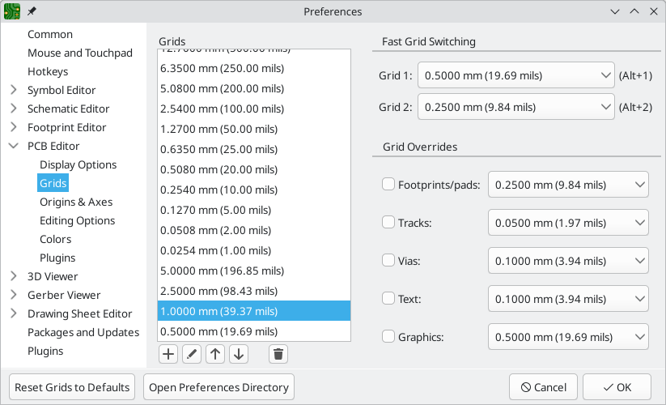
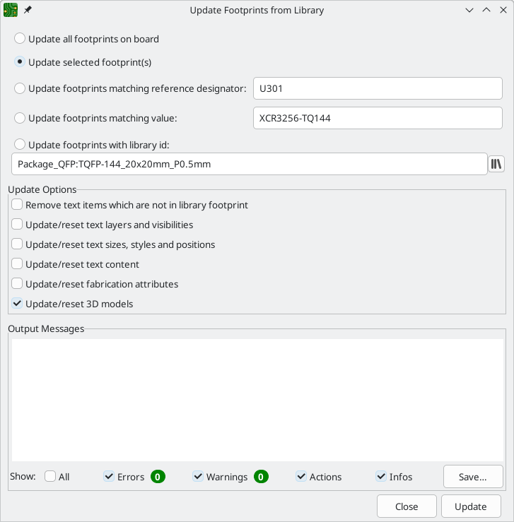
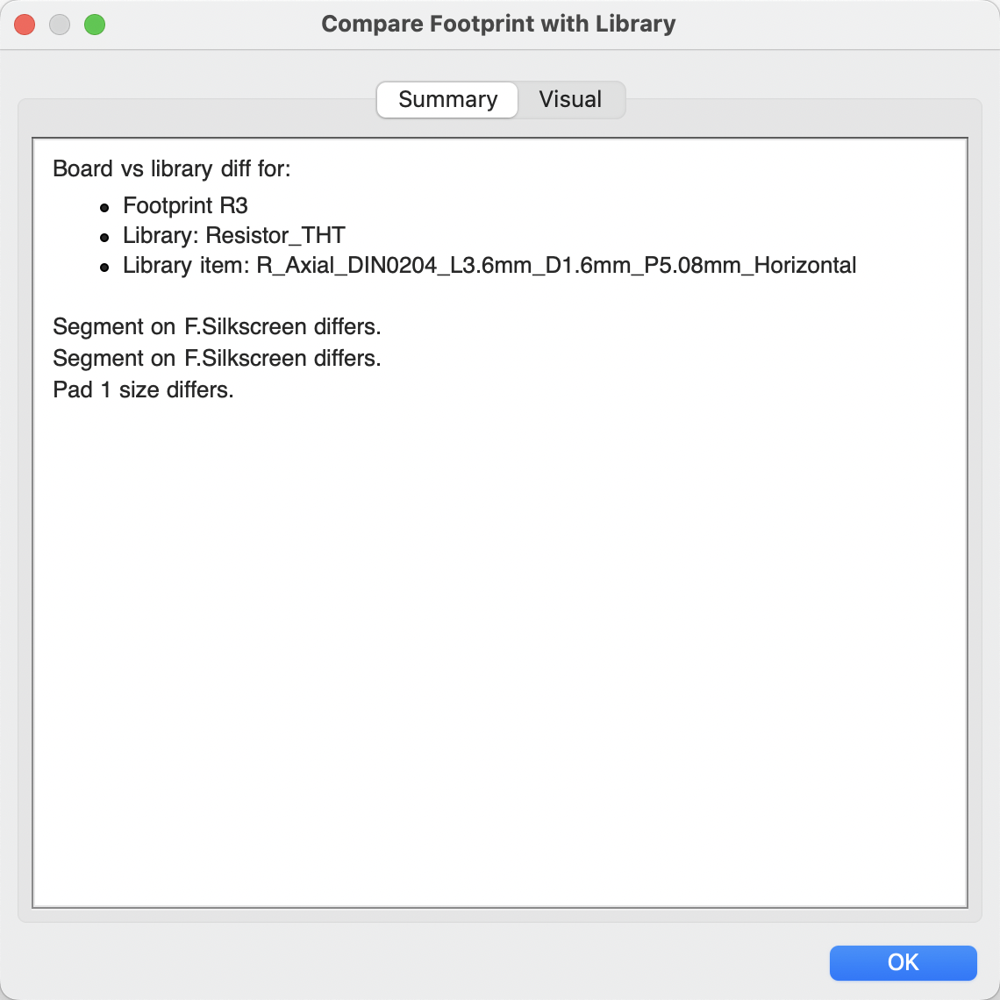
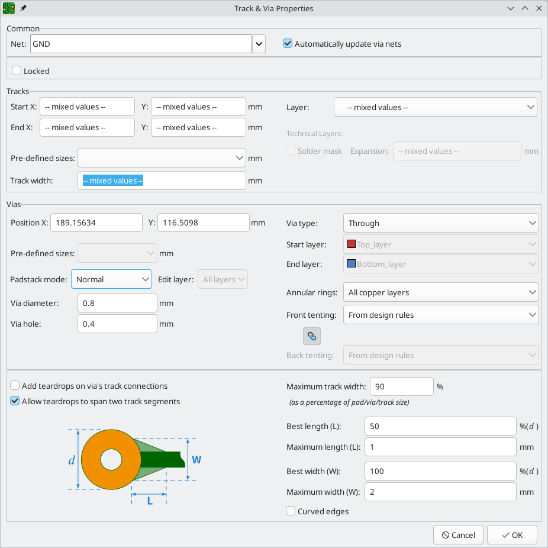
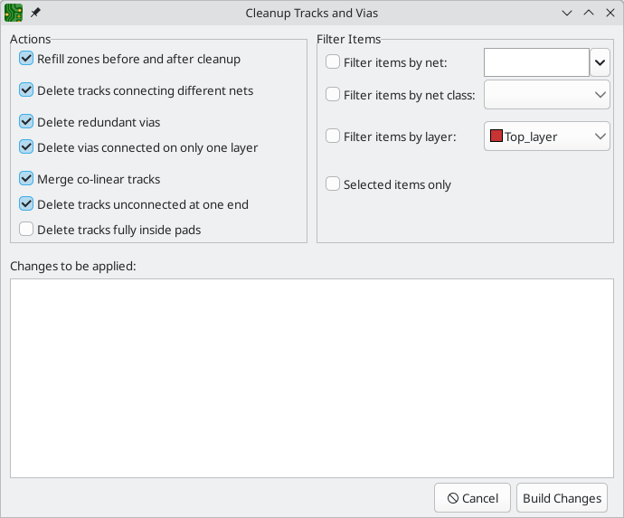
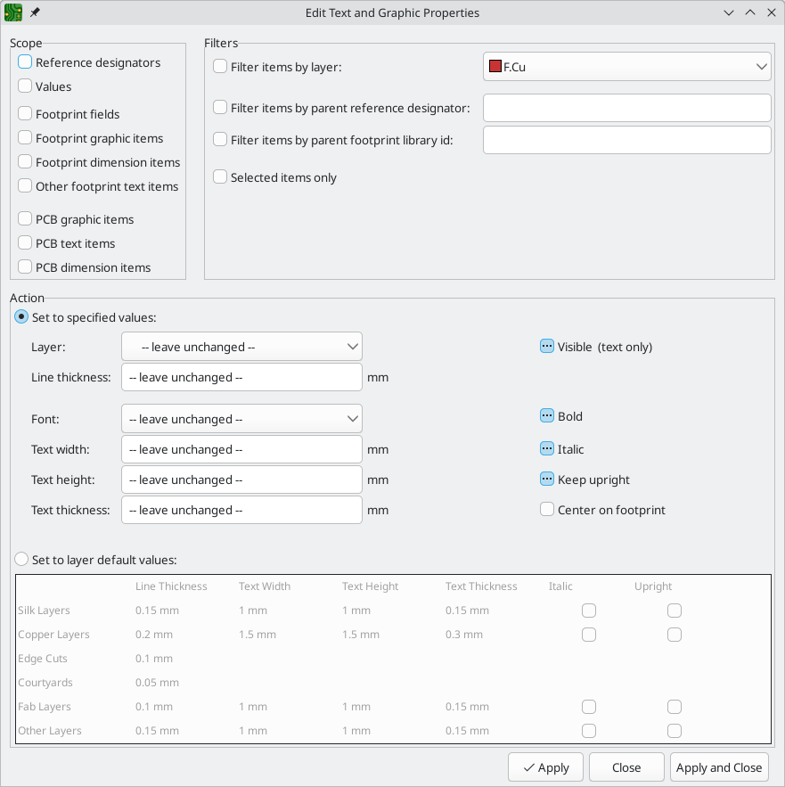
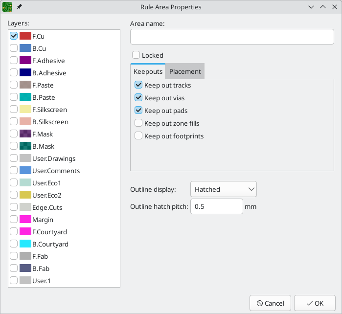
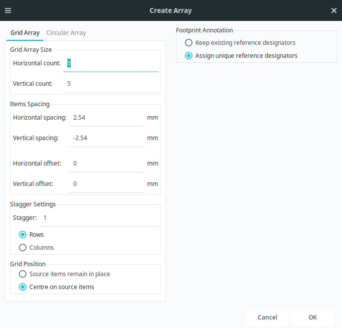
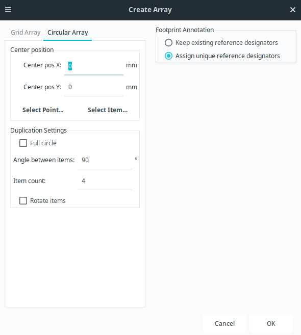
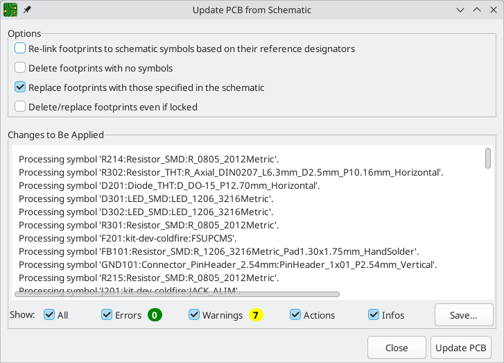

:experimental:

== Editing a board

=== Placement and drawing operations

Placement and drawing tools are located in the right toolbar.  When a tool is activated, it stays
active until a different tool is selected or the tool is canceled with the kbd:[Esc] key.  The
selection tool is always activated when any other tool is canceled.

Some toolbar buttons have more than one tool available in a palette.  These tools are indicated
with a small arrow in the lower-right corner of the button:


To show the palette, you can click and hold the mouse button on the tool or click and drag the
mouse.  The palette will show the most recently used tool when it is closed.

[width="100%",cols="5%,95%",]
|====
| image:images/icons/cursor_24.png[]
    | Selection tool (the default tool).
| 
    | Local ratsnest tool: when the board ratsnest is hidden, selecting footprints with this tool
      will show the ratsnest for the selected footprint only.  Selecting the same footprint again
      will hide its ratsnest.  The local ratsnest setting for each footprint will remain in effect
      even after the local ratsnest tool is no longer active.
| 
    | Footprint placement tool: click on the board to open the footprint chooser, then click again
      after choosing a footprint to confirm its location.
| image:images/icons/add_tracks_24.png[]

  
    | Route tracks / route differential pairs: These tools activate the interactive router and
      allow placing tracks and vias.  The interactive router is described in more detail in the
      Routing Tracks section below.
| 

  
    | Tune length: These tools allow you to tune the length of single tracks or the length or
    skew of differential pairs, after they have been routed.  See the
    <<length-tuning,Routing Tracks>> section for details.
| 
    | Add vias: allows placing vias without routing tracks.

    Vias placed on top of tracks using this tool will take on the net of the closest track segment
    and will become part of that track (the via net will be updated if the pads connected to the
    tracks are updated).

    Vias placed anywhere else will take on the net of a copper zone at that location, if one
    exists.  These vias will not automatically take on a new net if the net of the copper zone is
    changed.
| 
    | Add filled zone: Click to set the start point of a zone, then configure its properties before
      drawing the rest of the zone outline.  Zone properties are described in more detail below.
| 
    | Add rule area: Rule areas, formerly known as keepouts, can restrict the placement of items
      and the filling of zones and can also define named areas to apply specific custom design
      rules to.
| image:images/icons/add_line_24.png[]
    | Draw lines.

    *Note:* Lines are graphical objects and are not the same as tracks placed with the Route Tracks
          tool.
| image:images/icons/add_arc_24.png[]
    | Draw arcs: pick the center point of the arc, then the start and end points. By right clicking this button, you can change the arc editing mode between a mode that maintains the existing arc center and a mode that maintains the arc radius.
| 
    | Draw rectangles.  Rectangles can be filled or outlines.
| 
    | Draw circles.  Circles can be filled or outlines.
| image:images/icons/add_graphical_polygon_24.png[]
    | Draw graphical polygons.  Polygons can be filled or outlined.

    *Note:* Filled graphical polygons are not the same as filled zones: graphical polygons cannot
    be assigned to a net and will not keep clearance from other items.
| 
    | Add bitmap image for reference. Reference images are not included in
    fabrication outputs.
| 
    | Add text.
| 
    | Add a textbox.
| 

  

  

  

  
    | Add dimensions.  Dimension types are described in more detail below.
| 
    | Deletion tool: click objects to delete them.
| 

  
    | Set grid origin or drill/place origin (used for fabrication outputs).
| image:images/icons/measurement_24.png[]
    | Interactively measure the distance between two points.

|====

=== Grids and snapping

When moving, dragging, and drawing board elements, the grid, pads, and other elements can have
snapping points depending upon the settings in the user preferences.  In complex designs, snap
points can be so close together that it makes the current tool action difficult.  Both grid and
object snapping can be disabled while moving the mouse by using the modifier keys in the table
below.

NOTE: On Apple keyboards, use the kbd:[Cmd] key instead of kbd:[Ctrl].

[options="header",cols="40%,60%"]
|====
| Modifier Key | Effect
| kbd:[Ctrl] | Disable grid snapping.
| kbd:[Shift] | Disable object snapping.
|====

Tools only snap to objects on visible layers. You can reduce unwanted snapping
points by hiding unneeded layers or using the single-layer view mode.
Additionally, you can toggle between snapping to objects on all layers or only
snapping to objects on the current layer by pressing kbd:[Shift+S].

Snapping to different types of objects (pads, tracks, and graphics) can be
configured in the Editing Options section of the PCB Editor preferences.

You can adjust the grid size using the grid dropdown in the top toolbar or by
right-clicking and selecting a new grid from the list in the **Grid** submenu.
Pressing the kbd:[n] or kbd:[N] hotkeys will cycle to the next and previous grid
in the list, respectively.

You can also select a new grid or edit the available grids in the **Grids** pane
of the preferences dialog. As a shortcut to reach this dialog, right click the
image:images/icons/grid_24.png[show grid button] button on the left toolbar and
select **Edit Grids...**.



In this dialog you can select an active grid from the list of grids, reorder the
list of grids, and add or remove grids. Grids defined in this dialog can have
unequal X and Y spacing as well as an optional name.

This dialog also lets you designate two grids from the list as "Fast Grids",
which can be quickly selected using kbd:[Alt+1] and kbd:[Alt+2].

Finally, you can configure grid overrides for different types of objects. Grid
overrides let you set particular grid sizes for different types of objects which
will be used instead of the default grid when working with those objects. For
example, you can set a 100 mil grid for footprints and pads while using
smaller grids to finely position tracks, vias, and text. Grid overrides can be
individually enabled and disabled in this dialog, or globally enabled and
disabled using the
image:images/icons/grid_override_24.png[grid override enable button] button on
the left toolbar (kbd:[Ctrl+Shift+G]).

To change the origin (zero point) of the grid, use **Place** -> **Grid Origin**
and click to place the origin in the canvas. This function is also available
with the  button
in the right toolbar. Alternatively, you can enter explicit coordinates for the
grid origin with **Edit** -> **Grid Origin...**.

The visual appearance of the grid can also be customized in several ways. You
can change the thickness of the grid markings, switch their shape (dots, lines,
or crosses), and set the minimum displayed spacing in the **Display Options**
page of the preferences dialog, and you can change the grid color in the
**Colors** page of the preferences dialog.

The grid can be shown or hidden using the
image:images/icons/grid_24.png[show grid button] button on the left-hand
toolbar. By default the grid is still active even if it is hidden, but this is
configurable in the **Display Options** preferences page. There you can set the
grid to be disabled when it is hidden or even disable the grid entirely.

[[editing-object-properties]]
=== Editing object properties

All objects have properties that are editable in a dialog.  Use the hotkey kbd:[E] or select
**Properties** from the right-click context menu to edit the properties of selected item(s).  You can
only open the properties dialog if all the items you have selected are of the same type.

You can also view and edit item properties using the Properties Manager. The
Properties Manager is a docked panel that displays the properties of the
selected item or items for editing. If multiple types of items are selected at
once, the properties panel displays only the properties shared by all of the
selected item types.


Editing a property in the Properties Manager immediately applies the change.
When multiple items are selected, property modifications are applied to each
selected item individually, not to the whole selection as a group. For example,
when changing the orientation of multiple items, each item is individually
rotated around its own origin, not the group's origin.

Show the Properties Manager with **View** -> **Show Properties Manager** or the
image:images/icons/tools_24.png[Properties Manager icon] button on the left toolbar.

Several tools are available for editing properties of specific types of objects in bulk.
For text and graphical items, you can use the
<<pcbnew-edit-text-and-graphics-properties,Edit Text and Graphics Properties tool>>. Tracks and vias
can be bulk-edited using the <<modifying-tracks,Edit Track and Via Properties tool>>.
Teardrop properties can be edited with the <<editing-teardrops,Edit Teardrops tool>>.

In properties dialogs and many other dialogs, any field that contains a numeric
value can also accept a basic math expression that results in a numeric value.

For example, a dimension may be entered as `2 * 2mm`, resulting in a value of
`4mm`.  Basic arithmetic operators as well as parentheses for defining order of
operations are supported.

=== Board outlines (Edge Cuts)

KiCad uses graphical objects on the `Edge.Cuts` layer to define the board outline.  The outline
must be a continuous (closed) shape, but can be made up of different types of graphical object such
as lines and arcs, or be a single object such as a rectangle or polygon.  If no board outline is
defined, or the board outline is invalid, some functions such as the 3D viewer and some design rule
checks will not be functional.

[[working-with-footprints]]
=== Working with footprints

==== Adding footprints to the board

Footprints are automatically added to the board when the PCB is
<<forward-and-back-annotation,updated from the schematic>>. The footprint associated with each
schematic symbol is added to the board if it is not already present, and each footprint pad is
associated with the corresponding symbol pin's net. Symbol pins are matched to footprint pads by
pin/pad number.

When footprints are added to the board after an update from the schematic, they are grouped by
schematic sheet and by geographical location in the schematic. They are initially attached to the
cursor; you can place them by clicking in the desired location.

You can also add footprints to the board manually using the
xref:../eeschema/eeschema.adoc#assigning-footprints-in-symbol-properties[Add Footprint tool]
(kbd:[A] or the  button).

NOTE: Footprints added in this way will not be automatically associated with a
      symbol or have nets assigned to their pads, and subsequent updates from
      the schematic will remove these unassociated footprints unless the
      footprint is locked or the **Delete footprints with no symbols** option is
      unchecked in the Update PCB From Schematic dialog. For these reasons, it
      is usually recommended to avoid manually adding footprints to the board.
      Manually adding footprints is necessary for
      <<starting-from-scratch,PCB-only workflows>>, and can also be useful for
      adding logos or other footprints that do not need a corresponding
      schematic symbol.

==== Placing and moving footprints

Once footprints have been added to the board, you can reposition them in many ways.

The Move command (kbd:[M]) moves a footprint or a selection of footprints, ignoring any connected
track segments that are not selected. No DRC checking is done when moving footprints with the Move
command, although any footprint courtyards that collide with the moved footprint's courtyard will
be highlighted.

There is a reference point for the move operation, which is the point in the footprint which
attaches to the cursor and therefore the point in the footprint that snaps to the grid and to other
objects. The reference point during a move is determined by the location of the cursor when the Move
command is initiated. If the cursor is over a pad, the pad's center will be used as the reference
point. If the cursor is not over a pad, the footprint's anchor (coordinate origin point) will be
used. To select an arbitrary snapping point, you can use the Move With Reference command instead of
the regular Move command (right click -> **Positioning Tools** -> **Move with Reference**). After
initiating the command, click on the desired reference point; KiCad will then begin the move with
that point as the reference.

You can also use the Drag command (kbd:[D]) to move the selected footprint using the interactive
router, maintaining all track connections to the footprint. Dragging footprints behaves like the
Highlight Collisions router mode: obstacles will not be avoided or shoved, only highlighted.
Ordinarily the router will prevent you from dragging a footprint into a position that violates DRC:
when you click to commit a drag in a position that violates DRC, the footprint will return to its
original position. To force a drag to be committed even if it violates DRC, kbd:[Ctrl]-click to
commit the drag. Like the Move command, colliding courtyards are highlighted.

NOTE: Only tracks that end at the origin of the footprint's pads will be dragged. Tracks that
      simply pass through the pad or that end on the pad at a location other than the origin will
      not be dragged.

You can move a footprint to the opposite side of the board with the Flip command (kbd:[F]). Any
parts of the footprint on a front layer will be swapped to the corresponding back layer, and vice
versa.

Footprints can be rotated counter-clockwise using the kbd:[R] hotkey, or clockwise using kbd:[Shift+R].
By default, footprints are rotated by 90 degrees every time the rotate command is used, but you
can configure the rotation angle step in **Preferences** -> **PCB Editor** -> **Editing Options**.

You can directly set a footprint's exact absolute position, rotation angle, and PCB side using
either the Footprint Properties dialog or the Properties panel.

To reposition a footprint relative to its current position, use the Move Exactly tool
(kbd:[Shift+M]). The dialog lets you specify an X and Y translation, as well as a rotation, that
will be applied to the footprint. The rotation can be performed relative to either the footprint's
anchor, the local coordinate origin, or the drill/place origin. You can also use polar coordinates
instead of Cartesian coordinates.

image::images/pcbnew_move_exactly.png[alt="Move Exactly dialog"]

To position a footprint relative to another object, you can use the Position Relative tool
(kbd:[Shift+P]). With this tool, you select a reference point for the move, which can be the local
origin, the grid origin, or another arbitrary point, such as a pad in another footprint. The
selected footprint is moved to the specified offset from the reference point.


You can swap the position of two selected footprints using the Swap command (kbd:[S]). The
first footprint is assigned the location, rotation, and board side of the second footprint, and
vice versa. If there are more than two footprints selected, the locations are cycled: the last
footprint gets the position of the first footprint, the first footprint gets the location of the
second, and so on.

There are several convenience features that make it easier to find, select, and move specific
footprints or footprints related to another footprint.

The Get and Move Footprint command (kbd:[T]) prompts you to choose a footprint from a list or by
typing a reference designator. KiCad then attaches the chosen footprint to your cursor for a move
operation.

There are two commands to select other footprints that need to be connected to the selected
footprint but don't yet have routed connections. The Select All Unconnected Footprints command
(kbd:[O]) selects all footprints that have ratsnest lines to the currently selected footprints.
The command can be executed repeatedly to further expand the selection based on the newly selected
items. The Grab Nearest Unconnected Footprint command (kbd:[Shift+O]) selects the closest footprint
with ratsnest lines to the currently selected footprint, and additionally begins to move it. If
there are multiple footprints initially selected, the command will act like the Move Individually
command described below, individually moving the closest unconnected footprint for each of the
initially selected footprints.

You can select footprints based on their schematic sheet using the right click -> **Select** ->
**Items in Same Hierarchical Sheet** command, which selects all other footprints that are in the
same schematic sheet as the originally selected footprint.

If you want to move multiple selected footprints in sequence, use the Move Individually command
(kbd:[Ctrl+M]). After triggering the command, KiCad will begin moving the first selected footprint.
After you click to place the footprint, KiCad will immediately start moving the next footprint, in
the same order that you selected the footprints. You can skip moving a footprint by pressing
kbd:[Tab], commit the current move and skip any remaining moves by double-clicking, or cancel all
moves (including those already completed) by pressing kbd:[Esc].

If you want to move a collection of footprints at once into one area, the Pack and Move
Footprints command (kbd:[P]) closely packs the selected footprints together and moves them as
a block.

TIP: Move Individually and Pack and Move Footprints are useful in combination with other selection
     convenience features, such as cross-selection from the schematic or the advanced footprint
     selection features described above. For example, you could select a group of bypass capacitors
     in the Schematic Editor, switch to the PCB Editor where the corresponding footprints are now
     selected, and then use Move Individually to quickly place all of the bypass capacitor
     footprints close to their respective ICs. Alternatively, you could use one of the other
     selection tools, such as Select All Unconnected Footprints, to select many footprints from
     all over the board, then use Pack and Move Footprints to quickly put them all into a small
     area.

Finally, KiCad can automatically place footprints onto the board. The auto-place function attempts to
optimally place footprints to simplify ratsnest connections to other footprints. You can auto-place
the selected footprints with **Place** -> **Auto-Place Footprints** -> **Place Selected Footprints**,
or auto-place all footprints outside of the board outline with **Place** ->
**Auto-Place Footprints** -> **Place Off-Board Footprints**.

[[board-editing-footprints]]
==== Editing Footprints

Footprints in the board can be individually edited. Editing a footprint in the
board only affects that particular instance of the footprint; it does not affect
any other copies of that footprint in the board, and it does not affect the
library footprint.

To edit a footprint in the board, open its properties dialog (kbd:[E])


The majority of the settings in this dialog are the same as in the
<<footprint-editor-properties,footprint editor>>. You can edit the footprint's
fields, attributes, clearance and zone connection settings, and 3D models, as in
the footprint editor. However, here you can also set the footprint's position,
orientation, and side. You can also update the footprint from the library,
exchange it for a different footprint, or edit the footprint itself in the
footprint editor.

There are two options for editing the footprint in the footprint editor.

* **Edit Footprint...** will open the specific instance of the footprint in the
  footprint editor. Editing this footprint will only affect this one instance of
  the footprint in the board. It will not affect other instances of the
  footprint in the board, and it will not affect the library copy of the
  footprint.
* **Edit Library Footprint...**  will open the library copy of the footprint in
  the footprint editor. Editing the library copy of the footprint will edit the
  footprint in the footprint library, but will not immediately affect any
  instances of that footprint in the board. To update footprints in the board
  with changes to the library footprint, use the
  **Update Footprint from Library...** tool.

==== Editing footprint fields

An individual symbol text field can be edited directly with the kbd:[E] hotkey
(with a field selected instead of a footprint) or by double-clicking on the
field.


The options in this dialog are the same as those in the full Footprint
Properties dialog, but are specific to a single field.

Only footprint fields can be edited this way in the board editor. Unlike fields,
Footprint text is a graphic object that can only be edited or moved in the
footprint editor.

NOTE: In versions of KiCad before version 8.0, footprint fields did not exist.
      Instead, footprint text could be edited directly in the board editor. In
      KiCad 8.0, footprint text is not editable in the board editor and can only
      be edited in the footprint editor.

==== Updating and exchanging footprints

When a footprint is added to the board, KiCad embeds a copy of the library
footprint in the board so that the board is independent of the system
libraries. Footprints that have been added to the board are not automatically
updated when the library changes. Library footprint changes are manually synced
to the board so that the board does not change unexpectedly.

NOTE: You can use the <<comparing-footprints,Compare Footprint with Library tool>>
      to inspect the differences between a footprint in a board with its
      corresponding library footprint.

To update footprints in the board to match the corresponding library footprint,
use **Tools** -> **Update Footprints from Library...**, or right click a
footprint and select **Update Footprint...**. You can also access the tool from
the <<board-editing-footprints,footprint properties dialog>>.



The top of the dialog has options to choose which footprints will be updated.
You can update all footprints on the board, update only the selected footprints,
or update only the footprints that match a specific reference designator, value,
or library identifier. The reference designator and value fields support
wildcards: `*` matches any number of any characters, including none, and `?`
matches any single character.

The middle of the dialog has options to control what parts of the footprint will be
updated. You can select specific fields to update or not update, which
properties of the fields to update (text, visibility, size and style, and
position), and how to handle fields that are missing or empty in the library
footprint. You can also choose whether to update footprint attributes, such as
footprint type, **not in schematic**, **exclude from position files** /
**bill of materials**, **exempt from courtyard requirement**, and
**do not populate**.

The bottom of the dialog displays messages describing the update actions that
have been performed.

To change an existing footprint to a different footprint, use **Edit** ->
**Change Footprints...**, or right click an existing footprint and select
**Change Footprint...**. This dialog is also accessible from the
<<board-editing-footprints,footprint properties dialog>>.


The options for the Change Footprints dialog are very similar to the Update
Footprints from Library dialog.

[[comparing-footprints]]
==== Comparing footprints between board and library

When a footprint in a board diverges from the corresponding footprint in the
original footprint library, you can use the Compare Footprint with Library tool
to inspect the differences between the two versions of the footprint. Run the
tool using **Inspect** -> **Compare Footprint With Library**.



The **Summary** tab shows the name of the footprint, including its library and
board reference designator, and provides a list of the differences between the
board and library versions of the footprint.


The **Visual** tab shows a visual comparison of the board and library versions
of the footprint. This can be used as a visual diff tool.

By default, the comparison displays both versions of the footprint superimposed
on each other. To see the changes more easily, you can drag the slider at the
bottom of the tab to the right to emphasize the library version of the footprint
in the superimposed view (making the board version of the footprint more
transparent) or drag it to the left to emphasize the board version (making the
library version more transparent). At the far right and left ends of the
slider, the board and library versions of the footprint, respectively, are fully
hidden. It may be helpful to drag the slider back and forth to see the changes
more clearly.

The screenshot above shows a visual comparison with the board version of the
footprint deemphasized. Looking at pad 1 on the left, you can see a large,
partially transparent pad (from the board footprint) surrounding a fully opaque,
smaller pad (from the library footprint). This indicates that the pad was
enlarged in the board version of the footprint, or shrunk in the library version
of the footprint.

=== Working with pads

The properties of each individual pad of a footprint can be inspected and edited after placing the
footprint on the board.  In other words, it is possible to override the design of an individual
footprint pad in a specific instance of the footprint on the board, if the footprint design in the
library is not appropriate.  For example, you may wish to remove the solder paste aperture for a
pad that needs to remain unsoldered in a specific design, or you may wish to move the location of
a through-hole pad for an axial-lead resistor in order to fit a specific design.

NOTE: By default, the position of all footprint pads are locked, so it is possible to edit the pad
      properties but not move the pad's location relative to the rest of the footprint.  Pads may
      be unlocked to allow free movement, which can be useful for certain applications (such as
      through-hole footprints with varying lead positions) but is generally never recommended for
      surface-mount footprints.

The pad properties dialog is opened through the context menu or default hotkey kbd:[E] when a pad
is selected.  Note that KiCad assumes that if you click near a pad, you are probably trying to
select the entire footprint rather than a single pad.  To select a single pad, make sure to click
inside the pad area, or turn off the Footprints setting in the selection filter (and make sure the
Pads setting is turned on) to prevent accidental selection of the entire footprint rather than a
specific pad.


This dialog lets you edit the physical properties of the pad, including size and shape. You can
also modify how the pad connects to other objects on the board, including clearance properties,
teardrops, and thermal reliefs.

This dialog is the same as the pad properties dialog in the footprint editor, except that here you
can also manually assign a net to a pad using the **net name** selector. The remaining options are
explained in the <<footprint-pads,Footprint Editor documentation>>.

NOTE: While you can manually assign nets to pads in the PCB editor, this is not a typical workflow.
      Usually net-to-pad connections are defined by the schematic and then
      <<forward-and-back-annotation,transferred to the PCB editor>>.

[[working-with-zones]]
=== Working with zones

Copper zones, also sometimes called copper pours or fills by other EDA tools, are solid or hatched
areas of copper assigned to a particular net that automatically keep clearance from other copper
objects.  Zones are commonly used to fill in all free space on a board layer (or a portion of a
layer) in order to create ground and power planes, carry high currents, or to provide shielding.

NOTE: Some EDA tools have separate tools for creating "plane layers" and for creating copper zones
      on signal layers.  In KiCad, the Copper Zone tool is used for both these applications.

Zones are defined by a polygonal **outline** that defines the maximum extent of the filled copper
area.  This outline does not represent physical copper and will not appear in exported
manufacturing data.  The actual copper areas of the zone must be **filled** each time the outline,
or any objects inside the outline, are modified.  The filling process may be run on a single zone,
or on all zones in a board (default hotkey kbd:[B]).  Zones may be **unfilled** (default hotkey
kbd:[Ctrl+B]) to improve performance and reduce visual clutter while editing large boards.

NOTE: By default, zone filling is a manual process rather than occurring every time an object
      changes that would result in a change to the zone copper.  This is because zone filling can
      be a slow process on older computers or very large designs.  It is important to make sure zone
      fills are up-to-date before generating outputs.  KiCad will check that zones have been updated
      and warn you before generating outputs or running DRC when zones have not yet been refilled.
      You can optionally enable automatic zone-filling in the Preferences dialog (**PCB Editor** ->
      **Editing Options** -> **Miscellaneous** -> **Automatically refill zones**).

To draw a zone, click the Add Filled Zone tool () on the right
toolbar, or use default hotkey kbd:[Ctrl+Shift+Z].  Click to choose the first point of the zone
outline.  The Zone Properties dialog will appear, allowing you to choose the zone net and other
properties.  These properties may be edited at any time, so it is not critical to choose them all
correctly at first.  Accept the dialog and continue placing points to define the zone outline.  To
finish the zone, double-click to set the last point.  Zone outline points may be modified like
graphic polygons, by dragging the square handles to move a corner or dragging the circular handles
to move an edge.  To edit the zone's properties, use hotkey kbd:[E] or select Properties from the
context menu.


**Layer:** A single zone object can create filled copper on one or more copper layers.  Check the
box next to each copper layer that this zone outline should fill on.  The copper on each layer will
be filled independently, but all layers will share the same net.

**Net:** Select the electrical net that the zone copper should be connected to.  It is possible to
create zones with no net assignment.  Zones with no net will keep clearance from any copper objects
on any net.

**Zone name** can be used to assign a specific name to a zone.  This name can be used to refer to
the zone in custom DRC rules.

**Zone priority level** determines the order in which multiple zones on a single layer are filled.
The highest priority level zone on a given layer will be filled first.  Lower-priority zones will
keep clearance to the filled areas of higher-priority zones.  Two zones on the same layer with the
same priority level will overlap (short-circuit) with each other, unless they are assigned different
nets. When two zone outlines with the same priority and different nets touch, one zone will maintain
clearance to the other so that they don't short.

**Locked** controls whether or not the zone outline object is <<locking,locked>>.  Locked objects may not be
manipulated or moved, and cannot be selected unless the **Locked Items** option is enabled in the
Selection Filter panel.

**Outline display** controls how the zone outline is drawn on screen.  In **Line** mode, only the
border lines of the outline are drawn.  In **Hatched** mode, hatch lines are drawn on the inside of
the outline border for a short distance, to make the zone outline more apparent.  In **Fully
Hatched** mode, hatch lines are drawn across the entire inside of the zone outline.

**Corner smoothing** controls the behavior of the filled copper areas at corners of the outline.
Corners can be smoothed by a chamfer or fillet, or can extend all the way to the outline corner if
smoothing is disabled. The chamfer or fillet size is configurable when those modes are selected.

NOTE: By default, chamfers and fillets are not added to **inside corners** of the zone outline,
      because this would result in filled copper extending _outside_ the outline.  If smooth inside
      corners are desired, enable the **Allow fillets outside zone outline** option in the
      Constraints section of the Board Setup dialog.

**Clearance** controls the minimum clearance the filled areas of this zone will keep from other
copper objects.  Note that if two clearance values are in conflict, the larger clearance value will
be used.  For example, if a zone is set to use 0.2mm clearance but its netclass is set to use 0.3mm
clearance, the result will be an 0.3mm clearance.

**Minimum width** controls the minimum size of narrow necks of copper created inside the zone.  Any
copper areas that would be below this minimum width are removed during the filling process.

**Pad connection** controls the way that the filled zone areas will connect to footprint pads on
the same net.  **Solid** connections will result in the copper completely overlapping the pads.
**Thermal reliefs** will result in small copper spokes connecting the pad to the rest of the copper
zone, increasing the thermal resistance between the pad and the rest of the zone.  This can be
useful for hand soldering.  **Reliefs for PTH** will apply thermal reliefs to plated through-hole
pads and use solid connections for surface mount pads.  **None** will result in the zone not
connecting to any pads on the same net.

**Thermal relief gap** controls the distance maintained between any pad and the copper zone when
the pad connection mode is set to generate thermal reliefs.

**Thermal spoke width** controls the width of the "spokes", or short copper segments connecting
the pad to the rest of the copper zone.

**Fill type** controls how the copper zone is filled: the default is **solid fill**, which will
result in copper filling in all available space within the zone outline.  The zone can also be set
to fill a **hatch pattern**, which will fill the area with a pattern that contains less copper.
This can be useful for flexible printed circuits and other specialty applications.

**Orientation** controls the angle of the hatch pattern lines.  An orientation of 0 degrees will
result in the hatch pattern using horizontal and vertical lines.

**Hatch width** controls the width of each line in the hatch pattern.

**Hatch gap** controls the distance between each line in the hatch pattern.

**Smoothing effort** controls the style of smoothing applied to the hatch pattern.  A value of 0
will result in no smoothing, and a value of 3 will result in the finest smoothing.  Higher values
will result in longer processing time and larger Gerber files.

**Smoothing amount** is a ratio that controls the size of the smoothing chamfers or fillets that
are generated when **smoothing effort** is set to a value other than 0.  An amount of 0.0 results
in no smoothing, and a value of 1.0 results in maximum smoothing (in other words, a chamfer or
fillet equal to half of the hatch gap).

**Remove islands** controls the behavior of isolated copper areas, also called islands, after the
initial zone fill.  When this is set to **always**, isolated areas inside the zone are removed.
When set to **never**, isolated areas are left alone, and will result in copper areas that are not
connected to the rest of the net.  When set to **below area limit**, a **minimum island size** can
be specified, and islands below this threshold will be removed.

NOTE: Regardless of the **remove islands** setting, islands are never removed
      from zones that are electrically unconnected. In other words, islands are
      only removed from zones that have at least one electrical connection.

[[routing-tracks]]
=== Routing tracks

KiCad features an interactive router that:

* Allows manual or guided (semi-automatic) routing of single tracks and differential pairs
* Enables modifications of existing designs by:
** Re-routing existing tracks when they are dragged
** Re-routing tracks attached to footprint pads when the footprint is dragged
* Allows tuning of track lengths and differential pair skew (phase) by inserting serpentine +
 tuning shapes for designs with tight timing requirements

By default, the router respects the configured design rules when placing tracks: the size (width)
of new tracks will be taken from the design rules and the router will respect the copper clearance
set in the design rules when determining where new tracks and vias can be placed.  It is possible
to disable this behavior if desired by using the Highlight Collisions router mode and turning on
the Allow DRC Violations option in the router settings (see below).

The router has three modes that can be selected at any time.  The router mode is used for routing
new tracks, but also when dragging existing tracks using the Drag (hotkey kbd:[D]) command.  These
modes are:

- **Highlight Collisions**: in this mode, most of the router features are disabled and routing is
  fully manual.  When routing, _collisions_ (clearance violations) will be highlighted in green
  and the newly-routed tracks cannot be fixed in place if there is a collision unless the Allow
  DRC Violations option is turned on.  In this mode, up to two track segments may be placed at a
  time (for example, one horizontal and one diagonal segment).
- **Shove**: in this mode, the track being routed will walk around obstacles that cannot be moved
  (for example, pads and locked tracks/vias) and _shove_ obstacles that can be moved out of the
  way.  The router prevents DRC violations in this mode: if there is no way to route to the cursor
  position that does not violate DRC, no new tracks will be created.
- **Walk Around**: in this mode, the router behaves the same as in Shove mode, except no obstacles
  will be moved out of the way.

Which mode to use is a matter of preference.  For most users, we recommend using Shove mode for
the most efficient routing experience or Walk Around mode if you do not want the router to modify
tracks that are not being routed.  Note that Shove and Walk Around modes always create horizontal,
vertical, and 45-degree (H/V/45) track segments.  If you need to route tracks with angles other
than H/V/45, you must use Highlight Collisions mode and enable the Free Angle Mode option in the
Interactive Router Settings dialog.

There are four main routing functions: Route Single Track, Route Differential Pair, Tune length
of a single track, and Tune skew of a differential pair.  All
of these are present in both the Route menu dropdown (individually) on the top toolbar and the
drawing toolbar in two overloaded icons on the drawing toolbar on the right.  The use of the
overloaded icons is described above.  One is for the two Route functions and one is for the two
Tune functions.  In addition, the Route menu allows the selection of Set Layer Pair and
Interactive Router Settings.

To route tracks, click the Route Tracks image:images/icons/add_tracks_24.png[] icon (from the
drawing toolbar or from the top toolbar under *Route*) or use the hotkey kbd:[X].  Click on a
starting location to select which net to route and begin routing.  The net being routed will
automatically be highlighted and the allowable clearance for the net will be indicated with a
gray outline around the tracks being routed.  The clearance outline can be disabled by changing
the Clearance Outlines setting in the Display Options section of the Preferences dialog.

NOTE: The clearance outline shows the maximum clearance from the routed net to any other copper on
      the PCB.  It is possible to use custom design rules to specify different clearances for a net
      to different objects.  These clearances will be respected by the router, but only the largest
      clearance value will be shown visually.

When the router is active, new track segments will be drawn from the routing start point to the
editor cursor.  These tracks are _unfixed_ temporary objects that show what tracks will be created
when you use a left-click or the kbd:[Enter] key to _fix_ the route.  The unfixed track segments
are shown in a brighter color than the fixed track segments.  When you exit the router using the
kbd:[Esc] key or by selecting another tool, only the fixed track segments will be saved.  The
Finish Route action (hotkey kbd:[End]) will fix all tracks and exit the router.

While you are routing, you can use the Undo Last Segment command (hotkey kbd:[Backspace]) to unfix
the tracks you most recently fixed.  You can use this command repeatedly to step back through the
route that you have already fixed.

In previous versions of KiCad, using the left mouse button or kbd:[Enter] to fix the routed
segments would fix all segments up to but _not including_ the segment ending at the mouse cursor
location.  In KiCad 6 and later, this behavior is optional, and by default, all segments
_including_ the one ending at the mouse cursor location will be fixed.  The old behavior
can be restored by disabling the "Fix all segments on click" option in the Interactive Router
Settings dialog.

While routing, you can hold the kbd:[Ctrl] key to disable grid snapping, and hold the kbd:[Shift]
key to disable snapping to objects such as pads and vias.

NOTE: Snapping to objects can also be disabled by changing the Magnetic Points preferences in the
      Editing Options section of the Preferences dialog.  We recommend that you leave object
      snapping enabled in general, so that you do not accidentally end tracks slightly off-center
      on a pad or via.

[[track-posture]]
==== Track posture

When routing in H/V/45 mode, the _posture_ refers to how a set of two track segments connect two
points that cannot be reached by a single H/V/45-degree segment.  In such a case, the points will
be connected by one horizontal or vertical segment and one diagonal (45-degree) segment.  The
posture refers to the order of these segments: whether the horizontal/vertical segment or the
diagonal segment comes first.


KiCad's router attempts to pick the best posture automatically based on a number of factors.  In
general, the router will attempt to minimize the number of corners in a route, and will avoid "bad"
corners such as acute angles whenever possible.  When routing from or to a pad, KiCad will choose
the posture that lines up the route with the longest edge of the pad.

In some cases, KiCad cannot guess the posture you intend correctly.  To switch the posture of the
track while routing, use the Switch Track Posture command (hotkey kbd:[/]).

In situations where there is no obvious "best" posture (for example, when starting a route from a
via), KiCad will use the movement of your mouse cursor to select the posture.  If you would like
the route to begin with a straight (horizontal or vertical) segment, move the mouse away from the
starting location in a mostly horizontal or vertical direction.  If you would like the route to
begin diagonally, move in a diagonal direction.  Once the cursor is a sufficient distance away from
the routing start location, the posture is set and will no longer change unless the cursor is
brought back to the starting location.  Detection of posture from the movement of the mouse cursor
can be disabled in the Interactive Router Settings dialog as described below.

NOTE: If you use the Switch Track Posture command to override the posture chosen by KiCad, the
      automatic detection of posture from mouse movement will be disabled for the remainder of the
      current routing operation.

==== Track corner mode

KiCad's router can place tracks with either sharp or rounded (arc) corners when routing in H/V/45
mode.  To switch between sharp and rounded corners, use the Track Corner Mode command (hotkey
kbd:[Ctrl+/]).  When routing with rounded corners, each routing step will place either a straight
segment, a single arc, or both a straight segment and an arc.  The track posture determines whether
the arc or the straight segment will be placed first.

Track corners can also be rounded after routing by using the Fillet Tracks command after selecting
the tracks on either side of the corner to be filleted. If a contiguous track selection contains
multiple corners, they will all be filleted.

NOTE: Dragging of tracks with arcs is not supported. Arcs are treated as immovable by the shove
router.

==== Track width

The width of the track being routed is determined in one of three ways: if the routing start point
is the end of an existing track and the  button on the top
toolbar is enabled, the width will be set to the width of the existing track.  Otherwise, if the
track width dropdown in the top toolbar is set to "use netclass width", the width will be taken
from the netclass of the net being routed (or from any custom design rules that specify a different
width for the net, such as inside a neckdown area).  Finally, if the track width dropdown is set to
one of the <<board-setup-pre-defined-sizes,pre-defined track sizes>> configured in the Board Setup
dialog, this width will be used.

NOTE: The track width can never be lower than the minimum track width configured in the Constraints
      section of the Board Setup dialog.  If a pre-defined width is added that is lower than this
      minimum constraint, the minimum constraint value will be used instead.

KiCad's router supports a single track width for the active route.  In other words, to change widths
in the middle of a track, you must end the route and then restart a new route from the end of the
previous route.  To change the width of the active route, use the hotkeys kbd:[W] and kbd:[Shift+W]
to step through the track widths configured in the Board Setup dialog.

==== Placing vias

While routing tracks, switching layers will insert a through via at the end of the current
(unfixed) track.  Once you place the via, routing will continue on the new layer.  There are several
ways to select a new layer and insert a via:

- By using the hotkey to select a specific layer, such as kbd:[PgUp] to select `F.Cu` or kbd:[PgDn]
  to select `B.Cu`.
- By using the Next Layer or Previous Layer hotkeys (kbd:[+] and kbd:[-]).
- By using the Place Via hotkey (kbd:[V]), which will switch to the next layer in the active
  layer pair.
- By using the Select Layer and Place Through Via action (hotkey kbd:[<]), which will open a dialog
  to select the target layer.

After using any of the above methods to add a via and change layer, but before clicking to fix the
via and commit the current trace segment, you can cancel placing the via by pressing kbd:[V]. The
via will be removed and routing will continue on the original layer.

You can place a via and end the current trace, without changing layers, by pressing kbd:[V] and
then double-clicking or kbd:[Shift]-clicking to place the via.

The size of the via will be taken from the active Via Size setting, accessible from the drop-down
in the top toolbar or the Increase Via Size (kbd:[']) and Decrease Via Size (kbd:[\ ]) hotkeys.
Much like track width, when the via size is set to "use netclass sizes", the via sizes configured
in the Net Classes section of the Board Setup will be used (unless overridden by a custom design
rule).

You can also place microvias and blind/buried vias while routing. Use the hotkey kbd:[Ctrl+V] to
place a microvia and kbd:[Alt+Shift+V] to place a blind/buried via.  Microvias may only be placed
such that they connect one of the outer copper layers to an adjacent layer.  Blind/buried vias
may be placed on any layer.

Vias placed by the router are considered to be part of a routed track.  This means that the via net
can be updated automatically (just like track nets can), for example when updating the PCB from the
schematic changes the net name of the track.  In some cases this may not be desired, such as when
creating stitching vias.  The automatic update of via nets can be disabled for specific vias by
turning off the "automatically update via nets" checkbox in the via properties dialog.  Vias placed
with the Add Free-standing Vias tool are created with this setting disabled.

[[modifying-tracks]]
==== Modifying tracks

After tracks have been routed, they can be modified by moving or dragging, or deleted and
re-routed.  When a single track segment is selected, the hotkey kbd:[U] can be used to expand the
selection to all connected track segments.  The first press of kbd:[U] will select track segments
between the nearest junctions with pads or vias.  The second press of kbd:[U] will expand the
selection again to include all track segments connected to the selected track on all layers.
Selecting tracks with this technique can be used to quickly delete an entire routed net.

There are two different drag commands that can be used to reposition a track segment.  The Drag
(45-degree mode) command, hotkey kbd:[D], is used to drag tracks using the router.  If the router
mode is set to Shove, dragging with this command will shove nearby tracks.  If the router mode is
set to Walk Around, dragging with this command will walk around or stop at obstacles.  The Drag
Free Angle command, hotkey kbd:[G], is used to split a track segment into two and drag the new
corner to any location.  Drag Free Angle behaves like the Highlight Collisions router mode:
obstacles will not be avoided or shoved, only highlighted.

NOTE: Dragging of tracks containing arcs is not yet possible.  Attempting to drag these tracks will
      result in the arcs being removed in some cases.  It is possible to resize a particular arc by
      selecting it and using the drag command (kbd:[D]).  When resizing an arc using this command,
      no DRC checking is performed.

The Move command (hotkey kbd:[M]) can also be used on track segments.  This command will pick up
the selected track segments, ignoring any attached track segments or vias that are not selected.  No
DRC checking is done when moving tracks using the Move command.

It is also possible to move a footprint while keeping tracks attached to the footprint as it moves.
To do so, use the drag command (kbd:[D]) with a footprint selected.  Any tracks that end at one of the
footprint's pads will be dragged along with the footprint.  This feature has some limitations:
it only operates in Highlight Collisions mode, so the tracks attached to footprints will not walk
around obstacles or shove nearby tracks out of the way.  Additionally, only tracks that end at the
origin of the footprint's pads will be dragged.  Tracks that simply pass through the pad or that
end on the pad at a location other than the origin will not be dragged.

To break a single track segment into two, use the Break tool (right click a track -> **Break Track**).
The track will be broken into two connected track segments at the cursor location. Each track segment
can then be selected, moved, and edited individually. To recombine the segments into a single segment,
drag the drack, or use the **merge co-linear tracks** option in the
<<cleaning-up-tracks-and-vias,Cleanup Tracks and Vias dialog>>.

==== Editing track and via properties

You can modify the width of tracks and the size of vias, without re-routing them, in the properties
dialog for the track or via. This modifies all selected tracks and vias. The properties dialog shows
the relevant properties for the items in the selection: if both tracks and vias are selected, then
properties for both types of objects will be displayed, but if only one type of object is selected
then properties for the other type of object will not be shown.



In the Common section, you can change the assigned net of the selected objects using the **Net**
dropdown. If the **Automatically update via nets** option is checked, the selected vias cannot have
their assigned net manually changed, but instead will be assigned the net of any zone or pad that
they touch. You can also <<locking,lock>> the selected objects.

In the Tracks section, you can set the start and end position of the tracks and the layer they are
on. You can also change the track width, either from a list of
<<board-setup-pre-defined-sizes,pre-defined sizes>> or to an arbitrary value.

In the Vias section, you can change the position of a via, the via's type (through, micro, or
blind/buried), and which layers it spans. You can modify the via annulus and hole diameters, either
from a list of <<board-setup-pre-defined-sizes,pre-defined sizes>> or to arbitrary values. You can
also change the <<editing-teardrops,teardrop properties>> for vias here.

NOTE: The properties of selected tracks and vias can also be modified using the
      <<editing-object-properties,Properties Manager>>.

To modify tracks and vias in bulk you can use the **Edit Track and Via Properties** dialog
(**Edit** -> **Edit Track & Via Properties...**)..


*Scope* settings restrict the tool to editing only tracks, vias, or both. If
no scopes are selected, nothing will be edited.

*Filter Items* restricts the tool to editing particular objects in the selected scope.
Objects will only be modified if they match all enabled and relevant filters
(some filters do not apply to certain types of objects. For example, via size
filters do not apply to tracks). If no filters are enabled, all objects in the
selected scope will be modified. For filters with a text box, wildcards are
supported: `*` matches any characters, and `?` matches any single character.

*Filter items by net* filters to items assigned the specified net.
*Filter items by netclass* filters to items assigned to the specified netclass.

*Filter items by layer* filters to items on the specified board layer.

*Filter tracks by width* filters to tracks with the specified track width.
*Filter vias by size* filters to vias with the specified track width.

*Selected items only* filters to the current selection.

Properties for filtered objects can be set to new values in the bottom part of the dialog.
Properties can be set to arbitrary values by selecting *set to specified values* or set to
the default value from the net class (or custom rule) by selecting
*set to net class / custom rule values*.

Drop-down lists can be set to `-- leave unchanged --` to preserve existing values, or set to
a <<board-setup-pre-defined-sizes,pre-defined track or via size>> to change the filtered
objects' size. You can also change the filtered objects' layer.

[[cleaning-up-tracks-and-vias]]
==== Cleaning up tracks and vias

There is a dedicated tool for performing common cleanup operations on
tracks and vias, which is run via **Tools** -> **Cleanup Tracks & Vias...**.



The following cleanup actions are available and will be performed when selected:

*Delete tracks connecting different nets:* removes any track segments that short
multiple nets.

*Delete redundant vias:* remove vias that are redundant because they are located
on top of another via or on top of a through hole pad.

*Delete vias connected on only one layer:* removes vias that are only connected
to copper on a single layer and are therefore unnecessary.

*Merge co-linear tracks:* merges any track segments that are connected and
co-linear into a single equivalent track segment.

*Delete tracks unconnected at one end:* removes track segments that have at
least one dangling end.

*Delete tracks fully inside pads:* removes tracks that have both start and end
points within a pad and are therefore unnecessary.

Any changes that will be applied to the board are displayed at the bottom of the
dialog after clicking the **Build Changes** button. After building the changes,
the button changes to say **Update PCB**. The changes are not applied until
you press the **Update PCB** button.

==== Routing Convenience Functions

KiCad offers several functions to make certain routing operations more convenient.

If you need to route a number of traces from a set of pads, you can use the Route Selected tool to
quickly route from each pad in sequence. Select the pads you want to use as starting points, then
press kbd:[Shift+X] to route from each pad in sequence. The router will begin a trace from the first
selected pad, which you can route as you would any other trace. When you complete the trace, the
router will automatically begin a new trace from the next pad in the selection, in the same order
that you selected the pads. Pads that already have traces attached are skipped. You can also skip
routing the current trace and move on to the next pad by pressing kbd:[Esc]. You can also select
footprints instead of pads; all unrouted pads in the selected footprints will be used as starting
points.

If you want to route a number of traces _to_ a set of pads, instead of _from_ the pads, you can use
the Route Selected From Other End tool (kbd:[Shift+E]). This tool works the same way as the Route
Selected tool, except it uses each selected pad as an end point rather than a starting point. The
starting point for each trace is the other end of the ratsnest line for each selected pad.

Routing from the other end is also possible while routing individual traces: press kbd:[Ctrl+E] while
routing a trace to commit the current segment and begin routing from the other end of the in-progress
trace's ratsnest line.

Finally, you can quickly unroute traces connected to an object (footprint, pad, or trace) by
selecting the object, right-clicking, and selecting **Unroute Selected**. Any traces connected to the
selected object will be removed, starting at the selected object and continuing until another pad is
encountered.

==== Automatically completing traces

KiCad's router can automatically route individual traces, based on the connections defined in the
schematic. This can be thought of as a limited form of auto-routing that considers a single trace at
a time. The router will only use the current layer; it will not use vias or change layers.

While routing, press the kbd:[F] key to have the router attempt to automatically finish the current
trace. The trace will be automatically routed from the end of the last fixed trace segment to the
closest ratsnest anchor. If the router can't automatically finish the trace, it will allow you to
complete the trace manually. This action can also be performed by clicking **Attempt Finish** in the
context menu while routing.

When the router is not the active tool, you can automatically route multiple traces by selecting
footprints, pads, and traces to route from and pressing kbd:[Shift+F]. You do not need to select
both ends of a desired connection; the router will route from the selected item to its nearest
ratsnest anchor. If multiple items were selected, each item will be routed in sequence, in the order
that they were selected. If a connection cannot be automatically completed, the tool will pause with
the router active so that you can complete the trace manually. With the automatic completion paused
for a manual connection, you can press kbd:[Esc] to skip routing the current trace. After manually
completing the trace or skipping the connection, the tool will continue attempting to route the
remaining connections.

==== Routing differential pairs

Differential pairs in KiCad are defined as nets with a common _base name_ and a positive and
negative suffix.  KiCad supports using `{plus}` and `-`, or `P` and `N` as the suffix.  For example, the
nets `USB{plus}` and `USB-` form a differential pair, as do the nets `USB_P` and `USB_N`.  In the first
example, the base name is `USB`, and `USB_` in the second.  The suffix styles cannot be mixed: the
nets `USB{plus}` and `USB_N` do not form a differential pair.  Make sure you name your differential pair
nets accordingly in the schematic in order to allow use of the differential pair router in the PCB
editor.

To route a differential pair, click the Route Differential Pairs
 icon (from the drawing toolbar or from the top toolbar under
*Route*) or use the hotkey kbd:[6].  Click on a pad, via, or the end of an existing differential
pair track to start routing.  You can start routing from either the positive or negative net of a
differential pair.

The differential pair router will attempt to route the pair of tracks with a gap taken from the
design rules (differential pair gap can be configured in the Net Classes section of the Board Setup
dialog, or by using custom design rules).  If the starting or ending location of the route is a
different distance apart from the configured gap, the router will create a short "fan out" section
to minimize the length of track where the differential pair is not coupled.

When switching layers or using the Place Via (kbd:[V]) action, the differential pair router will
create two vias next to each other.  These vias will be placed as close as possible to each other
while respecting the design rules for copper and hole-to-hole clearance.

[[length-tuning]]
==== Length tuning

The length tuning tools can be used to add serpentine tuning shapes to tracks after routing.
Length tuning shapes are persistent objects that can be modified after they are created. To
tune the length of a track, first pick the appropriate tool.

- The single-track length tuning tool (icon  or hotkey kbd:[7])
  will add serpentine shapes to bring the length of a single track up to the target value.
- The differential pair length tuning tool (icon  or
  hotkey kbd:[8]) will do the same for a differential pair.
- The differential pair skew tuning tool (icon 
  or hotkey kbd:[9]) will add length to the shorter member of a differential pair in order to
  eliminate skew (phase difference) between the positive and negative sides of the pair.

As with the Routing icons, the Tuning icons are found in both the **Route** menu dropdown from
the top toolbar and the drawing toolbar on the right.

When a tuning tool is active, you can hover over traces in the board to show a status window that
displays their current length or skew as well as the target values. Click on the desired trace to
start tuning it. As you move the mouse cursor along the track, meander shapes will be added
interactively. If a target length has been set, meanders will stop being added when the target
length is reached. You can set a target length with custom DRC rules or in the tuning shape
properties; both methods are explained below. The popup window next to the cursor shows a live
measure of the length or skew compared to the design targets. You can adjust the spacing (kbd:[1]
to increase and kbd:[2] to decrease) and amplitude (kbd:[3] to increase and kbd:[4] to decrease)
while you tune. When you are done, click again to commit the tuned shape. The tuned trace doesn't
need to be perfect because you can adjust the shape after committing it. You can also place multiple
tuning shapes on the same track.

NOTE: The length tuning tools only support tuning the length of point-to-point nets between two
      pads.  Tuning the length of nets with different topologies is not supported.

NOTE: Differential pair length tuning can only be applied to the coupled portions of differential
      pairs. To apply length tuning to the uncoupled portions of differential pairs, you must use
      single-track length tuner.

===== Editing tuning patterns

After a tuning pattern has been added, it can be selected, modified, and moved. While it is selected,
the target length and routed length are shown in the message panel at the bottom left of the window.


When a pattern is selected, editing handles appear, which let you adjust the pattern geometry.

- Dragging the handles at the ends of the pattern will expand or contract the pattern along
  the trace.
- Dragging the corner handle towards or away from the trace will respectively decrease or
  increase the maximum meander amplitude.
- The final handle controls the meander spacing; dragging it towards the corner handle will
  increase the spacing, while dragging it away from the corner handle will increase the spacing.

The selection box and editing handles represent the maximum allowable extents of the tuning pattern.
Making the box smaller will reduce the size of the tuning pattern, even if this results in the tuned
trace being shorter than the target length. When the box is enlarged, the tuning pattern will expand
to fill the box until the target length is reached.

You can move a tuning pattern along its track by selecting it and dragging with the mouse, or
using the Move tool (kbd:[M]). Deleting a tuning pattern (kbd:[Del]) removes the tuning pattern
and restores the original untuned tracks. You can also ungroup the tuning pattern, which will
decompose it into its component tracks. The basic tracks have the same shape as the tuning pattern
but can be edited individually. Once ungrouped into tracks, a tuning pattern cannot be regrouped.

Another way to edit a tuning pattern is through its properties dialog. The properties dialog
exposes several additional parameters that can't be modified using the on-canvas interactive
editor. These properties can also be edited in the
<<editing-object-properties,Properties Manager>>.


As with the interactive editor, you can set a maximum amplitude for the tuning pattern and a
spacing between meanders, but here you can set a minimum amplitude and configure the corner style.
Corners can be *filleted* (rounded) or *chamfered*. In each case you can set the *radius* as a
percentage of the maximum possible radius for the spacing and amplitude. You can also configure
the tuning pattern to be *single-sided*, which restricts it to one side of the baseline, as opposed
to the default style which positions meanders on both sides of the baseline.

You can set default values for these properties in the **Design Rules** ->
**Length-tuning Patterns** page of the Board Setup dialog. Each type of tuning pattern (single
track length, differential pair length, and differential pair skew) can have its own defaults.

Finally, the tuning pattern properties dialog is one of two ways to set the target length or skew
for a tuning pattern. Setting length targets is explained below.

===== Setting target length and skew

There are two ways to set a target length or skew for a net:

- In the properties dialog for a tuning pattern that has already been added to a track.
- Using a custom DRC rule with the `length` and/or `skew` constraints.

The first method is to specify a target in the **target length** or **target skew** field of the tuning pattern's
properties dialog. This target will only apply to the selected tuning pattern. Therefore, length
targets set in this way must be set separately for each tuning pattern in the design. The properties
dialog for a tuning pattern is only accessible after the pattern is initially created, so changing
a target length or skew in this way may require the pattern to be adjusted to meet the new target
value, if the pattern's geometric constraints do not allow sufficient space to meet the new target.

You can also set a target length and/or skew using <<custom-design-rules,custom design rules>>. If
custom rules are used, they will override any targets set in tuning pattern properties, unless the
**override custom rules** checkbox is enabled in the tuning pattern properties.

Using a custom rule allows you to set a net's target length and/or skew up front, before a pattern
is created. With custom rules you can set different length and skew targets based on specific criteria,
such as netclass or net name. You will also result in a DRC violation if the net's length or skew is
out of bounds.

When target length or skew is adjusted in a custom DRC rule after a pattern is created, the pattern
geometry will not be automatically updated to achieve the new target. You can use **Edit** ->
**Update All Tuning Patterns** to recalculate all tuning patterns to meet the new targets.

The following example custom rule sets a target length and skew for nets in the `high_speed` netclass.
The target length is 100mm, and a DRC error will be raised if it is below 95mm or above 105mm. The
target skew is at most 0.1mm.

```
(rule "target length and skew"
      (condition "A.NetClass == 'high_speed'")
      (constraint length (min 95mm) (opt 100mm) (max 105mm))
      (constraint skew (max 0.1mm)))
```

See the custom rule documentation for more details of how to create rules that only apply to certain nets.

===== Length tuning pitfalls and tips

The length tuner only tunes nets with a point-to-point topology; branching nets are not supported.
When the length tuner encounters a branch, it stops at the branch and only considers the length of the
net up to that branch.

Sometimes you may end up with leftover stub tracks somewhere in your design. These can turn what appears to
be a point-to-point net into a branched topology, which will prevent length tuning from working as expected.
It may be easier to find such stub tracks when you switch footprints, vias, and tracks to outline mode
(image:images/icons/pad_sketch_24.png[], , and
 buttons, respectively). You can also use the
<<cleaning-up-tracks-and-vias,track cleanup tool>> (**Tools** -> **Cleanup Tracks and Vias...**) to remove
many of these stubs automatically.

By default, the length tuner includes vias in its length calculations. Only the layer-to-layer length
of the via is used, which may be shorter than the full top-to-bottom via height if the tuned path is
not exclusively on the board top and bottom. The accuracy of this calculation depends on the board
stackup being accurately configured. Via length can be ignored in length tuner calculations by
deselecting **include stackup height in track length calculations** in the **Constraints** page of
the <<board-setup-constraints,Board Setup dialog>>.

The length tuner is optimized for adjusting the effective electrical distance between two points,
and therefore it calculates net length in a slightly different way than other tools, such as the Net
Inspector. In addition to discounting net branches and unused portions of vias,
the length tuner also optimizes paths through pads to use the shortest possible path in its
calculations. In comparison, the Net Inspector reports a simple summation of copper segment lengths.
Both calculations are accurate, but they are optimized for different purposes. These differences are
discussed in more detail in the <<net-inspector,Net Inspector documentation>>.

[[editing-teardrops]]
==== Teardrops

Teardrops are areas of extra copper that smooth the transition between track
and pads, vias, or other tracks. Teardrops are added to increase the mechanical
robustness of a trace connection. They also reduce the risk of a misaligned
drill hole disconnecting a trace from a drilled pad or via.


You can add teardrops to your design in bulk using the **Edit** ->
**Edit Teardrops...** dialog. This dialog has controls for filtering which
objects are affected and settings for configuring the shape of the new
teardrops. It also lets you edit or remove existing teardrops.

The **Scope** section controls which types of objects will be affected: PTH
pads, SMD pads, vias, and/or track-to-track connections. The **Filter Items**
section lets you filter objects by other criteria; you can filter items by net,
net class, and layer, or choose to act only on round pads, pre-existing
teardrops, or the objects in your selection.

The **Action** section controls whether to add or remove teardrops, as well as
the size and shape of the new teardrops. Adding a teardrop to an object that
already has a teardrop will update the existing teardrop with the new settings.
When adding teardrops, you can choose to use the default teardrop settings from
the Board Setup dialog, or choose specific values for the new teardrops.

**Prefer zone connection:** if selected, a teardrop will not be created if the
object is also connected to a zone.
**Allow teardrops to span 2 track segments:** if selected, the teardrop will be
able to spread over a second track segment if the first segment is too short to
support a full teardrop.
**Maximum track width:** a teardrop will not be created for a track connection
that is wider than this percentage of the pad width (minimum pad dimension).
**Best length:** the ideal length of the teardrop, as a percentage of the width
(smallest dimension) of the attached object.
**Maximum length:** the maximum length of the teardrop, as an absolute length.
**Best width:** the ideal width of the teardrop, as a percentage of the width
(smallest dimension) of the attached object.
**Maximum width:** the maximum width of the teardrop, as an absolute width.
**Curved edges:** if selected, the teardrop edges will be curved instead of a
straight line. If curved, **points** controls the number of points in the curve;
more points will result in a smoother curve.


Default properties for teardrops can be configured in the Board Setup dialog.
These defaults will be used in the Edit Teardrops dialog when
**add teardrops with default values for shape** is selected in that dialog. The
defaults are configured separately for teardrops connecting to round shapes,
rectangular shapes, or between tracks. The available options for each type of
teardrop are the same as in the Edit Teardrops dialog.

image::images/board_setup_teardrops.png[Board Setup Teardrops panel]

Rather than in bulk, you can add or edit teardrops for individual vias
in the properties dialog for that via, or for individual pads in the
**Connections** tab of the pad's properties dialog. The settings in the
properties dialogs are the same as in the Edit Teardrops dialog. You can also
edit teardrops for individual pads and vias with the
<<editing-object-properties,Properties Manager>>.


Teardrops in KiCad are small zones, meaning that when they refill they avoid
shorting to copper objects on other nets. They are initally filled when they are
added, but they are unfilled and refilled with other zones on the board: when
using the Unfill All Zones and Refill All Zones commands, running DRC,
generating fabrication outputs, etc. Teardrops can be shown in filled or outline
mode using the zone display controls in the left toolbar.

==== Interactive router settings

The interactive router settings can be accessed through the **Route** menu, or by right-clicking
on the image:images/icons/add_tracks_24.png[Route Tracks icon] button in the toolbar.  These
settings control the router behavior when routing tracks as well as when dragging existing tracks.


[options="header",cols="25%,75%"]
|====
| Setting | Description
| Mode    | Sets the operating mode of the router for creating new tracks and dragging existing
            tracks.  <<See above>> for more information.
| Free angle mode | Allows routing tracks at any angle, instead of just at 45-degree increments.
                    This option is only available if the router mode is set to Highlight
                    collisions.
| Allow DRC violations | Allow placing tracks and vias that violate DRC rules.  This option is only
                         available if the router mode is set to Highlight collisions.
| Shove vias | Allow the router to shove vias along with tracks. When this is disabled, vias cannot
               be shoved. This option is only available if the router mode is set to Shove.
| Jump over obstacles | Allow the router to attempt to move colliding tracks behind solid obstacles
                        (such as pads). This option is only available if the router mode is set to
                        Shove.
| Remove redundant tracks | Automatically removes loops created in the currently-routed track,
                            keeping only the most recently routed section of the loop.
| Optimize pad connections | When this setting is enabled, the router attempts to avoid acute
                             angles and other undesirable routing when exiting pads and vias.
| Smooth dragged segments | When dragging tracks, attempts to combine track segments together to
                            minimize direction changes.
| Optimize entire track being dragged
    | When enabled, dragging a track segment will result in KiCad optimizing the rest of the track
      that is visible on the screen.  The optimization process removes unnecessary corners, avoids
      acute angles, and generally tries to find the shortest path for the track.  When disabled,
      no optimizations are performed to the track outside of the immediate section being dragged.
| Use mouse path to set track posture
    | Attempts to pick the track posture based on the mouse path from the routing start location.
| Fix all segments on click
    | When enabled, clicking while routing will fix the position of all the track segments that
      have been routed, including the segment that ends at the mouse cursor.  A new segment will
      be started from the mouse cursor location.  When disabled, the last segment (the one that
      ends at the mouse cursor) will not be fixed in place and can be adjusted by further mouse
      movement.

|====

[[pcb-graphical-objects]]
=== Graphical objects

Graphical objects (lines, arcs, rectangles, circles, polygons, text, and dimensions) can exist on any layer. Unlike
zones, the shape of a graphical object is exactly defined by its own properties, and is not affected by
other objects. Shape properties include size, position, line width, and fill.

Graphical objects on copper layers can be assigned nets and make connections to other copper objects,
just like tracks and zones.

==== Graphical shapes

The buttons on the right toolbar can be used to create:

* Lines (image:images/icons/add_line_24.png[], default hotkey kbd:[Ctrl+Shift+L])
* Arcs (image:images/icons/add_arc_24.png[], default hotkey kbd:[Ctrl+Shift+A])
* Rectangles ()
* Circles (, default hotkey kbd:[Ctrl+Shift+C])
* Polygons (image:images/icons/add_graphical_polygon_24.png[], default hotkey kbd:[Ctrl+Shift+P])

Arcs have two editing modes, which are selectable in **Preferences** ->
**PCB Editor** -> **Editing Options** or by right clicking the
image:images/icons/add_arc_24.png[] button on the right toolbar. The first mode
(**keep arc center, adjust radius**) maintains the position of the arc center as
as the arc endpoints or midpoint are dragged, changing the radius as necessary.
The second mode (**keep arc endpoints or direction of starting point**)
maintains the position of the arc endpoints and the arc's direction of curvature
as the midpoint or center are dragged.

Just like with tracks, you can expand a selection from one graphic line to include all other
contiguous graphic lines by pressing kbd:[U].

The properties of a graphic shape can be adjusted in the shape's properties dialog or with the
<<editing-object-properties,Properties Manager>>. Rectangles, circles, and polygons can be filled
shapes or outlines.  The **line width** option controls the width of the outline, even for filled
objects.  The outline width extends on both sides of the "ideal" shape of the graphic object.
For example, a graphic circle that is defined to have 2mm radius and 0.2mm line width will consist
of a torus with an outer radius of 2.1mm and inner radius of 1.9mm.  If the **filled shape**
option is enabled and the line width is set to 0, the shape will be a filled circle with 2mm
radius. Several line styles are available: solid, dashed, dotted, dash-dot, and dash-dot-dot.


NOTE: You can customize the default style of newly-created graphical shapes in the Text & Graphics
      Defaults section of the Board Setup dialog.

Graphical shapes on copper layers can have a net assigned in their properties dialog. Copper
shapes with a net make connections like tracks or zones. Unlike zones, copper graphical
objects always maintain their shape and do not keep clearance to other copper objects.

===== Shape modification tools

KiCad has several tools for modifying combinations of graphic shapes in useful
ways, such as chamfering two lines or combining two polygons. These tools are
used by selecting the shapes you want to modify, right clicking, and then
choosing the relevant tool in the **Shape Modification** submenu. Different
tools are available for different combinations of selected shapes.

**Heal shapes** fixes a discontinuity between two lines or arcs. A new line
segment is added to connect the ends of each shape together, up to a specified
tolerance.

**Fillet lines** adds an arc to round the corner between two connected lines
with a specified radius. The two original lines are shortened to meet the
endpoints of the arc.

**Chamfer lines** adds a line segment to create a new edge between two connected
lines with a specified setback. The two original lines are shortened to meet the
endpoints of the new segment.

**Extend lines to meet** lengthens two selected lines until they intersect each
other. The two lines will share a coincident endpoint.

**Merge polygons** combines two or more selected polygons into one new polygon
that is the union of the original shapes.

**Subtract polygons** subtracts one or more polygons from another polygon,
resulting in a new polygon that is the difference of the original shapes. The
first-selected polygon(s) are subtracted from the last-selected polygon.

**Intersect polygons** results in a new polygon that is the shape of the
overlapping area between two or more selected polygons.

===== Converting objects to and from graphic shapes

KiCad provides tools to convert graphic objects to other types of objects, other
types of objects to graphic objects, and graphic objects to other kinds of
graphic objects. These tools are used by selecting the shapes you want to
convert, right clicking, and then choosing the desired result object from the
**Create From Selection** submenu. Most types of object conversions have several
conversion options that are presented in a settings dialog. The exact options
differ based on the target object type.

When converting to a graphic polygon, rule area, or zone, there are several
options for how to convert the source objects into a polygonal outline.

* If **copy line width of first object** is selected, an unfilled polygon will
  be created that has its line width taken from the line width of the first
  selected source object. This option is only available when converting to a
  graphic polygon, and the source object must be a closed shape.
* If **use centerlines** is selected, an object with zero line width will be
  created, with its outline placed at the centerlines of the source objects. The
  source object must be a closed shape. If the target object is a graphic
  polygon, it will be filled.
* If **create bounding hull** is selected, an object will be created
  with the specified **line width**. The object's outline will be offset from
  the outermost extents of the source object by the specified **gap**. The
  source object does not need to be a closed shape when a bounding hull is
  created.

Most conversions provide a **delete source objects after conversion** option,
which will result in the original object being deleted during the conversion,
only leaving the new object in place. If this option is not selected, the
conversion will leave the original object in place in addition to the new
object. The original object will be selected following the conversion so that it
can be manually deleted by pressing kbd:[Delete].


The following conversion types are available:

* **Create Polygon From Selection** converts a graphic shape, text, zone, rule
  area, or track into a polygon. This can be used to convert separate graphic
  shapes, such as lines and arcs, into a unified shape. It can also be used to
  convert a text object into a shape that can have its outline manipulated
  graphically.
* **Create Zone From Selection** converts a graphic shape, text, zone, rule
  area, or track into a zone. In addition to the conversion settings, the
  conversion dialog also shows options for
  <<working-with-zones,configuring the resulting zone>>. This can be used to
  create zone outlines with complex shapes, such as curves, that would otherwise
  be difficult to create using the zone tool.
* **Create Rule Area From Selection** converts a graphic shape, text, zone, rule
  area, or track into a rule area. In addition to the conversion settings, the
  conversion dialog also shows options for
  <<pcb-rule-areas,configuring the resulting rule area>>. This can be used to
  create rule area outlines with complex shapes, such as curves, that would
  otherwise be difficult to create using the rule area tool.
* **Create Lines From Selection** converts a graphic polygon or rectangle into
  graphic lines that follow the source shape's outline. This can be used to
  convert a unified shape into its constituent outline segments.
* **Create Tracks From Selection** converts a graphic shape, zone, or rule area
  into tracks that follow the source shape's outline. If the source object is
  not on a copper layer, a dialog will be presented to specify the target copper
  layer. The source object is not removed following conversion, but remains
  selected so that it can be easily deleted if desired.
* **Create Arc From Selection** converts a graphic line segment or track segment
  into a graphic arc. The arc's endpoints are placed at the endpoints of the
  source segment and its thickness is taken from the source object's line
  thickness. The source segment is not removed following conversion, but remains
  selected so that it can be easily deleted if desired.

==== Text objects

Graphical text may be placed by using the  button in the right
toolbar or by keyboard shortcut kbd:[Ctrl+Shift+T].  Activating the tool brings up a text
properties dialog. After configuring the text and its properties and accepting the dialog,
you can click in the canvas to place the text.

You can also add text boxes, which are similar to regular text except that they have an optional
border and they automatically reflow text within that border. Text boxes are placed with the
 button, and require clicking twice to specify the top
left and bottom right corners of the box.


**Locked** controls whether or not the text object is <<locking,locked>>.  Locked objects may not be
manipulated or moved, and cannot be selected unless the **Locked Items** option is enabled in the
Selection Filter panel.

**Layer** controls the text's layer. Text may be placed on any layer, but note that text on
copper layers cannot be associated with a net and cannot form connections to tracks or pads.
Copper zones will fill around the rectangular bounding box of text objects.

There are several formatting options: text can be bolded, italicized, left/right/center aligned,
and reversed. Regular text objects (not text boxes) can also have their vertical alignment
adjusted. The **knockout** option, which is also limited to regular text objects, adds a solid
rectangle surrounding the text and makes the text itself a negative cutout.

The text itself can use any TTF font available on your system, or the built-in KiCad stroke font.

NOTE: User fonts are not embedded in the project. If the project is opened on another computer
that does not have the selected font installed, a different font will be substituted. For maximum
compatibility, use the KiCad font. Also consider converting text objects to polygons before sharing
a project (right click a text object -> **Create from Selection** ->
**Create Polygon from Selection...**). Text converted to polygons is not editable as text, but will
render identically on any computer.

You can adjust the text size with the **text width** and **text height** controls. When you are using
the KiCad font, you can also adjust the stroke width with the **thickness** control.

**Position X** and **position Y** control the text object's location. These properties are not
available for text boxes.

**Orientation** is the rotation angle of the text object. You can select an angle in 90 degree
increments from the dropdown, or type in an arbitrary angle.

Text boxes additionally have options controlling their border. The **border** checkbox makes the
border visible or invisible. For visible borders, you can adjust the border's thickness with the **border width** control and the line style with the **border style** control (solid, dashed, dotted, dash-dot, or dash-dot-dot).

NOTE: You can customize the default style of newly-created text objects in the Text & Graphics
      Defaults section of the Board Setup dialog.

Finally, text supports markup for superscripts, subscripts, overbars, evaluating project
variables, and accessing symbol field values.

[options="header",cols="30%,40%,40%"]
|====
| Feature | Markup Syntax | Result
| Superscript
  | `text^{superscript}`
  | text^superscript^
| Subscript
  | `text_{subscript}`
  | text~subscript~
| Overbar
  | `~{text}`
  | [overline]#text#
| <<schematic-setup-text-variables,Variables>>
  | `${variable}`
  | _variable_value_
| <<text-variables,Symbol Fields>>
  | `${refdes:field}`
  | _field_value_ of symbol _refdes_
|====

NOTE: Variables must be defined in
      <<board-setup-text-variables,Board Setup>> before they can be
      used. There are also a number of
      <<text-variables,built-in text variables>>.

==== Dimensions

Dimensions are graphical objects used to show a measurement or other marking on a board design.
They may be added on any drawing layer, but are normally added to one of the User layers.  KiCad
currently supports five different types of dimension: aligned, orthogonal, center, radial, and
leader.

**Aligned** dimensions () show a measurement of
distance between two points.  The measurement axis is the line that connects those two points, and
the dimension graphics are kept parallel to that axis.

**Orthogonal** dimensions () also measure the
distance between two points, but the measurement axis is either the X or Y axis.  In other words,
these dimensions show the horizontal or vertical component of the distance between two points.
When creating orthogonal dimensions, you can select which axis to use as the measurement axis based
on where you place the dimension after selecting the two points to measure.

**Center** dimensions () create a cross mark to
indicate a point or the center of a circle or arc.

**Radial** dimensions () show a measurement between
a center point and the outside of a circle or arc. The center point is indicated by a cross.

**Leader** dimensions () create an arrow with a leader line
connected to a text field.  This text field can contain any text, and an optional circular or
rectangular frame around the text.  This type of dimension is often used to call attention to parts
of the design for reference in fabrication notes.


After creating a dimension, its properties may be edited (hotkey kbd:[E]) to change the format of
the displayed number and the style of the text and graphic lines.

NOTE: You can customize the default style of newly-created dimension objects in the Text & Graphics
      Defaults section of the Board Setup dialog.


===== Dimension format options

**Override value:** When enabled, you may enter a measurement value directly into the **Value**
field that will be used instead of the actual measured value.

**Prefix:** Any text entered here will be shown before the measurement value.

**Suffix:** Any text entered here will be shown after the measurement value.

**Layer:** Selects which layer the dimension object exists on.

**Units:** Selects which units to display the measured value in.  **Automatic** units will result
in the dimension units changing when the display units of the board editor are changed.

**Units format:** Select from several built-in styles of unit display.

**Precision:** Select how many digits of precision to display.

===== Dimension text options

Most of the dimension text options are identical to those options available for other graphical
text objects (see the Graphical Objects section above).  Some specific options for dimension text
are also available:

**Position mode:** Choose whether to position the dimension text manually, or to automatically keep
it aligned with the dimension measurement lines.

**Keep aligned with dimension:** When enabled, the orientation of the dimension text will be
adjusted automatically to keep the text parallel with the measurement axis.

===== Dimension line options

**Line thickness:** Sets the thickness of the graphical lines that make up a dimension's shape.

**Arrow length:** Sets the length of the arrow segments of the dimension's shape. A negative
arrow length reverses the arrow direction.

**Extension line offset:** Sets the distance from the measurement point to the start of the
extension lines.

**Extension line overshoot:** Sets the distance from the dimension's line to the end of the
extension lines.

===== Leader options


**Value:** Enter the text to show at the end of the leader line.

**Text frame:** Select the desired border around the text (circle, rectangle, or none).

[[pcbnew-edit-text-and-graphics-properties]]
==== Bulk editing text and graphics

Properties of text and graphics, including dimensions, can be edited in bulk using the *Edit Text and
Graphics Properties* dialog (**Edit** -> **Edit Text & Graphic Properties...**).



===== Scope and Filters

*Scope* settings restrict the tool to editing only certain types of objects. If
no scopes are selected, nothing will be edited.

*Filters* restrict the tool to editing particular objects in the selected scope.
Objects will only be modified if they match all enabled and relevant filters
(some filters do not apply to certain types of objects. For example, parent
footprint filters do not apply to graphic items and are ignored for the purpose
of changing graphic properties). If no filters are enabled, all objects in the
selected scope will be modified. For filters with a text box, wildcards are
supported: `*` matches any characters, and `?` matches any single character.

*Filter items by layer* filters to items on the specified board layer.

*Filter items by parent reference designator* filters to fields in the
footprint with the specified reference designator. *Filter items by parent
footprint library id* filters to fields in footprint with the specified library
identifier.

*Selected items only* filters to the current selection.

===== Action

Properties for filtered objects can be set to new values in the bottom part of
the dialog. Properties can be set to arbitrary values by selecting *set to
specified values* or reset to their layer's default value by selecting *set to
layer default values*.

Drop-down lists and text boxes can be set to `-- leave unchanged --` to preserve
existing values. Checkboxes can be checked or unchecked to enable or disable a
change, but can also be toggled to a third "leave unchanged" state.

All items can have their *layer* set.

Graphic items can have their *line thickness* modified.

Text properties that can be modified are *font*, *text width*, *text height*,
*text thickness* (KiCad font only), emphasis (*bold* and *italic*), orientation
(*keep upright*), and alignment (*center on footprint*). Footprint text can also
have its *visibility* set.

==== Cleaning up graphics

There is a dedicated tool for performing common cleanup operations on
graphics, which is run via **Tools** -> **Cleanup Graphics...**.


The following cleanup actions are available and will be performed when selected:

*Merge lines into rectangles:* combines individual graphic lines that together
form a rectangle into a single rectangle shape object.

*Delete redundant graphics:* deletes graphics objects that are duplicated or
degenerate.

*Fix discontinuities in board outlines:* modifies the existing board outline to
fix any discontinuities that are within the specified tolerance.

Any changes that will be applied to the board are displayed at the bottom of the
dialog. They are not applied until you press the **Update PCB** button.

[[pcb-rule-areas]]
=== Rule areas (keepouts)

Rule areas, also known as keepouts, are board regions that can have specific DRC
rules defined for them. Some basic rules are available that will raise DRC
errors if certain types of objects are within the bounds of the rule area, but
rule areas can also be used together with
<<custom-design-rules,custom DRC rules>> to define complex DRC behavior that
only applies within the rule area.

You can add a rule area by clicking the
 button on the right toolbar
(kbd:[Ctrl+Shift+K]). Click on the canvas to place the first corner, which will
show the Rule Area Properties dialog. After configuring the rule area
appropriately, press **OK** to continue placing corners of the rule area. The
rule area shape can be an arbitrary polygon; click on the starting corner or
double click to finish placing the rule area.



The Rule Area Properties dialog has the following options:

The **layers** list determines which layers the rule area applies to. The area
only appears on these layers and the selected keepout rules only apply on these
layers. At least one layer must be selected. By default, the active layer in
the editing canvas is preselected in the rule area layer list.

The **area name** field is optional and provides an identifier for the rule
area. If it is provided, it is included in DRC violation messages to make them
clearer. It can also be used in custom DRC rules to identify a particular rule
area.

The **locked** checkbox determines if the rule area should be
<<locking,locked>>. As with other objects, rule areas can also be locked or
unlocked after they are created.

Several **basic rules** are available to keep out various types of objects.  The
basic rules can be configured to keep out tracks, vias, pads, zone fills, and/or
footprints. If an object of one of the selected types is within the rule area, a
DRC error will be raised. Additionally, zone fills will automatically avoid a
rule area if the rule area is configured to keep out zones.

NOTE: Even with no basic rules selected, rule areas can still be used to define
      specific areas in which to apply <<custom-design-rules,custom DRC rules>>.


There are a few options for the **outline display** of the rule area. The area
can be shown with a hatched outline, fully hatched throughout the area, or with
just the outline with no hatching. The **outline hatch pitch** is also
adjustable.

[[locking]]
=== Locking

Most objects can be locked through their properties dialogs, by using the right-click context menu,
or by using the Toggle Lock hotkey (kbd:[L]).  Locked objects cannot be selected unless the "Locked
items" checkbox is enabled in the selection filter.  Attempting to move locked items will result in
a warning dialog:


Selecting "Override Locks" in this dialog will allow moving the locked items.  Selecting "OK" will
allow you to move any unlocked items in the selection; leaving the locked items behind.  Selecting
"Do not show again" will remember your choice for the rest of your session.

Locked items are displayed with a colored shadow around them. This can be customized in your color
scheme.

=== Groups

Groups let you treat multiple objects as a single object for the purposes of
moving or rotating them. Each object in the group will maintain its position
relative to the other objects in the group. Groups can also have a name, which
is displayed in the editing canvas when the group is selected.


Most types of objects in the Board Editor can be grouped: footprints, tracks,
zones, graphic items, and even other groups. Groups can contain multiple
different types of objects at once.

To add objects to a group, select them, then right click and choose **Grouping**
-> **Group Items**. To remove all items from a group, select the group, right
click, and choose **Grouping** -> **Ungroup Items**.

Once objects have been added to a group, selecting any of the objects will
select the group as a whole instead of the constituent objects. To edit a
specific object within a group, first select the group, the right click and
choose **Enter Group**. Double clicking on a group also enters the group. When a
group has been entered, objects within the group can be selected and edited
individually without affecting the other objects in the group. To leave the
group and stop editing its members individually, right click and select
**Leave Group**, select an object outside the group, or use kbd:[Esc].

There are several ways to modify which objects belong to a group. To remove
objects from an existing group, enter the group, then select the objects you
want to remove, right click, and choose **Grouping** -> **Remove Items**. To add
items to a group, first ungroup all the items from the group. This will leave
the group's former members selected. Then add the new item to the selection and
group the selection. Note that without first ungrouping, this process would
create a nested group: a new group containing the new item and the entire
original group, not just the items in the original group.

You can also add or remove objects from a group in the group's properties
dialog. To open a group's properties dialog, press kbd:[E] or right click and
click **Properties...**. The properties dialog lists the objects contained in
the group. To add an additional object to the group, click the
image:images/icons/small_plus_16.png[] button, then click on the desired object
in the editing canvas. The object you click on will be added to the group. To
remove an object, select it in the list, then click the
image:images/icons/small_trash_16.png[] button.


The group properties dialog also lets you specify a name for the group or
<<locking,lock>> the group. Groups can also be named or locked using the
<<editing-object-properties,Properties Manager>>.

=== Aligning objects

The align tool moves a selection of objects so that they are all aligned with a
reference object. There are six different alignments to choose from, depending
on which part of the objects you wish to align. Objects can be horizontally
aligned by their left, center, or right edges, or they can be vertically aligned
by their top, center, or bottom edges. Objects are only moved in one dimension,
so objects stay in the same horizontal position when aligned vertically, and
vice versa. To align objects by a given edge, select the objects, then right
click and choose **Align/Distribute** -> **Align to Left** (or another alignment
as desired).

If the cursor is over an object in the selection, that object is used as the
reference object. Otherwise, the reference object is the object in the selection
which is located furthest in the alignment direction, for example the leftmost
object when aligning by left edge, or the topmost object when aligning by top
edge. The topmost object is used when aligning by vertical center, and the
leftmost when aligning by horizontal center.

.Before alignment


.After alignment


In the example above, R1-R4 are vertically aligned by their top edges, with R2
as the reference object. The first image shows them before alignment and the
second image shows them after alignment. In this case, R2 is the topmost object
before alignment, so it is chosen as the reference object if the cursor is not
over another resistor. After alignment, the top edges of the resistors are at
the same position, but the horizontal positions of the resistors are unchanged.

=== Distributing objects

You can use the distribute tool to move objects so they are evenly spaced from
each other (right click a selection -> **Align/Distribute** -> **Distribute
Horizontally** or **Distribute Vertically**). The two outermost objects in the
selection are not moved. This means the top and bottom objects when distributing
vertically, and the leftmost and rightmost objects when distributing
horizontally. The remaining objects in the selection are evenly distributed
between the outermost objects and maintain their relative ordering. Objects are
only moved in one dimension, so objects stay in the same horizontal position
when distributed vertically, and vice versa.

.Before distribution


.After distribution


In the example above, R1-R4 are horizontally distributed. The first image shows
them before distribution and the second image shows them after distribution. R1
and R4 are the leftmost and rightmost objects, so they are not moved. R2 and R3
are moved so the horizontal spacing between resistors is equal, but the vertical
positions remain unchanged. From left to right, R1-R4 are in the same order that
they were in before distribution.

[[creating-arrays]]
=== Arrays

KiCad has an array tool to create rectangular or circular arrays of objects
(footprints, vias, graphical objects, etc.). Two types of array are possible:
*Grid* and *Circular*.



**Grid Arrays** are rectangular and are described by a **horizontal count** and
a **vertical count**, which set the number of columns and rows in the array,
respectively. The **horizontal** and **vertical spacing** settings describe the
distance between columns and rows, while the **horizontal** and
**vertical offset** settings describe a shift applied to each row/column
compared to the previous row/column.

You can create a repeating staggered pattern by choosing a **stagger** setting,
which controls the number of rows or columns that are offset before the pattern
repeats. You can stagger by **row** or by **column**. For example, if two
staggered rows are selected, each row will be horizontally offset from the
previous row by half of the array's horizontal spacing setting. Every other row
will be placed at the original spacing and offset. If three staggered columns
are selected, each column will be vertically offset by a third of the array's
vertical spacing setting. Every third column will be placed at the original
spacing and offset. Offsets from the stagger settings are added to the previous
horizontal and vertical offset settings.



**Circular Arrays** are described by a center point, an angular spacing, and a
number of arrayed items. If **set center by position** is selected, the center
point of the array will be defined by the absolute X/Y position you enter in
**center pos X** and **center pos Y**. If **set center by radius** is selected,
the center point of the array will be defined by the **array radius** and
**array angle** parameters, which describe the position of the array center
relative to the source object's position. The source object's position is
displayed for reference as **ref point pos X** and **ref point pos Y**.

The **item count** field determines the number of objects in the array,
including the source object. The **angle** field determines the angular spacing
between items, with the center point at the center of the array. Positive angles
result in a counter-clockwise rotation relative to the center point and the
source item, while negative angles result in a clockwise rotation. An angle of
`0` will result in a complete circle with objects evenly spaced to provide the
specified number of objects. If the item count is too small to create a full
circle with the specified spacing between objects, the array will not be a
complete circle. When **rotate items** is selected, objects will be rotated
around their origins as array sweeps around the center point. Otherwise, objects
will maintain the same orientation as the source item.

When creating an array of footprints, whether rectangular or circular, the
**Footprint Annotation** settings control how the reference designators will be
set in the new footprints. This affects the linkage of the new footprints to the
schematic. If **keep existing reference designators** is selected, the new
footprints in the array will have the same reference designators as the source
footprints, resulting in duplicated reference designators in the board. If
**assign unique reference designators** is selected, each new footprint created
in the array will have a unique reference designator automatically assigned.

NOTE: Creating an array of footprints will result in multiple copies of the
      source footprint(s). If you are using a schematic-based workflow, this
      will result in footprints that are not represented in the schematic, so
      careful syncing between the board and the schematic will be needed.

After creating an array, the newly added objects remain selected (not including
the original source object), which allows you to easily delete the array if the
parameters need to be adjusted.

=== Importing vector drawings

NOTE: This section of the KiCad documentation has not yet been written.  We
      appreciate your patience as our small team of volunteer documentation
      writers work to update and expand the documentation.

[[pcb-reference-images]]
=== Using reference images

KiCad supports displaying reference images in the canvas. These are background
images that you can use to help you lay out a board; they are purely for
reference during the design process and are not included in any fabrication
outputs.

To add a reference image, use the  button on
the right toolbar and select the desired reference image file.

Once the image has been added to the canvas, you can scale it by dragging the
editing canvas or open its properties dialog (kbd:[E]) and set the scale
explicitly in the **Image** tab. Here you can also **Convert to Greyscale** if
you wish.


Reference images have an associated layer; they are shown and hidden along with
this layer. The layer initially associated with a reference image is the layer
that was active when the image was added. You can change the associated layer
in the image's properties.

Another way to hide reference images is with the Appearance Manager. You can
show or hide all reference images by toggling the visibility of **Image**
objects in the **Objects** tab ( button).
You can also adjust the opacity of reference images here.

[[forward-and-back-annotation]]
=== Forward and back annotation

Forward and back annotation are the processes for syncing schematic changes to
the board and syncing board changes to the schematic, respectively.

[[forward-annotation]]
==== Update PCB From Schematic (forward annotation)

Use the Update PCB from Schematic tool to sync design information from the
Schematic Editor to the Board Editor. The tool can be accessed with **Tools** ->
**Update PCB from Schematic** (kbd:[F8]) in both the schematic and board
editors. You can also use the

icon in the top toolbar of the Board Editor. This process is often called
forward annotation.

NOTE: Update PCB from Schematic is the preferred way to transfer design
information from the schematic to the PCB. In older versions of KiCad, the
equivalent process was to export a netlist from the Schematic Editor and import
it into the Board Editor. It is no longer necessary to use a netlist file.



The tool adds the footprint for each symbol to the board and transfers updated
schematic information to the board. In particular, the board's net connections
are updated to match the schematic.

The changes that will be made to the PCB are listed in the _Changes To Be
Applied_ pane. The PCB is not modified until you click the **Update PCB**
button.

You can show or hide different types of messages using the checkboxes at the
bottom of the window. A report of the changes can be saved to a file using the
**Save...** button.

===== Options

The tool has several options to control its behavior.

[cols="1,2"]
|===
| Option | Description

| Re-link footprints to schematic symbols based on their reference designators
| Footprints are normally linked to schematic symbols via a unique identifier
created when the symbol is added to the schematic. A symbol's unique identifier
cannot be changed.

If checked, each footprint in the PCB will be re-linked to the symbol that has
the same reference designator as the footprint.

If unchecked, footprints and symbols will be linked by unique identifier as
usual, rather than by reference designator. Each footprint's reference
designator will be updated to match the reference designator of its linked
symbol.

This option should generally be left unchecked. It is useful for specific
workflows that rely on changing the links between schematic symbols and
footprints, such as refactoring a schematic for easier layout or replicating
layout between identical channels of a design.

| Delete footprints with no symbols
| If checked, any footprint in the PCB without a corresponding symbol in the
schematic will be deleted from the PCB. Footprints with the "Not in schematic"
attribute will be unaffected.

If unchecked, footprints without a corresponding symbol will not be deleted.

| Replace footprints with those specified in the schematic
| If checked, footprints in the PCB will be replaced with the footprint that is
specified in the corresponding schematic symbol.

If unchecked, footprints that are already in the PCB will not be changed, even
if the schematic symbol is updated to specify a different footprint.
|===

[[back-annotation]]
==== Update Schematic from PCB (back annotation)

The typical workflow in KiCad is to make changes in the schematic and then sync
the changes to the board using the Update PCB From Schematic tool. However, the
reverse process is also possible: design changes can be made in the board and
then synced back to the schematic using **Tools** -> **Update Schematic From
PCB** in either the schematic or board editors. This process is often called
back annotation.

image::images/update_schematic_from_pcb.png[alt="Update schematic from PCB",scaledwidth="70%"]

The tool syncs changes in reference designators, values, footprint assignments,
and net names from the board to the schematic. Each type of change can be
individually enabled or disabled.

The changes that will be made to the schematic are listed in the _Changes To Be
Applied_ pane. The schematic is not modified until you click the **Update
Schematic** button.

You can show or hide different types of messages using the checkboxes at the
bottom of the window. A report of the changes can be saved to a file using the
**Save...** button.

===== Options

The tool has several options to control its behavior.

[cols="1,2"]
|===
| Option | Description
| Re-link footprints to schematic symbols based on their reference designators
| If checked, each footprint in the PCB will be re-linked to the symbol that has
the same reference designator as the footprint. This option is incompatible with
updating symbol reference designators.

If unchecked, footprints and symbols will be linked by unique identifier as
usual, rather than by reference designator.

| Reference designators
| If checked, symbol reference designators will be updated to match the
reference designators of the linked footprints.

If unchecked, symbol reference designators will not be updated.

| Values
| If checked, symbol values will be updated to match the values of the linked
footprints.

If unchecked, symbol values will not be updated.

| Footprint assignments
| If checked, footprint assignments will be updated for symbols which have had
their footprints changed or replaced in the board.

If unchecked, symbol footprint assignments will not be updated.

| Net names
| If checked, the schematic will be updated with any net name changes that have
been made in the board. Net labels will be updated or added to the schematic as
necessary to match the board.

If unchecked, net names will not be updated in the schematic.
|===

NOTE: The <<geographical-re-annotation,Geographical Reannotation>>
      feature can be used in combination with backannotating reference
      designators to reannotate all components in the design based on their
      location in the layout.

===== Back annotation with CMP files

Select changes can also be synced from the PCB back to the schematic by
exporting a CMP file from the PCB editor (**File** -> **Export** -> **Footprint
Association (.cmp) File...**) and importing it in the Schematic Editor (**File**
-> **Import** -> **Footprint Assignments...**).

NOTE: This method can only sync changes made to footprint assignments and
footprint fields. It is recommended to use the Update Schematic from PCB tool
instead.

[[geographical-re-annotation]]
==== Geographical re-annotation

The Geographical Reannotation tool lets you automatically set the reference
designators of footprints based on their physical location on the board.

To run the Geographical Reannotation tool, use **Tools** ->
**Geographical Reannotate...**. This opens the geographical reannotation dialog
with options for how to perform the reannotation.


The **Options** tab contains settings for how footprint locations affect
reannotation. The arrow diagrams indicate which geographical ordering to use
when reannotating. You can reannotate from left-to-right, right-to-left,
top-to-bottom, or bottom-to-top, and you can select whether to use a
column-major order (go through all footprints in the same column before moving
to the next column) or row-major order (go through all footprints in the same
row before moving to the next row).

Geographical reannotation can either use the location of the footprint itself or
the location of the footprint's reference designator. You can also select how
much to round footprint locations before determining which footprints are at the
same X or Y position. Rounding to a finer coordinate resolution will result in
fewer footprints considered to be in the same row or column.

Finally, you can select which footprints to reannotate. You can reannotate all
footprints on the board, all footprints on the front or back of the board, or
all footprints in your selection.


The **Reference Designators** tab contains options for how to allocate new
reference designators. There are separate settings for footprints on the front
and back of the board.

**Reference start** controls the number for the first new reference designator
on each side of the board. If no start value is given for the back of the board,
back side footprints will be annotated starting at one higher than the last
front side reference designator.

**Prefix** specifies a prefix string to insert at the beginning of each newly
assigned reference designator. This prefix will be inserted before any prefix
that is already present. If the **remove prefix** option is selected, footprints
with the specified prefix will instead have that prefix removed instead of
added. Footprints without that prefix will not have not have any prefix added or
removed.

If **exclude locked footprints** is checked, locked footprints will not be
reannotated. You can also avoid reannotating specific footprints by entering
their reference designators as a comma-separated list in the
**exclude references** box.

When you click the **Reannotate PCB** button, footprints will be reannotated
according to the selected settings.

NOTE: The Geographical Reannotation tool updates reference designators in the
      board, but not in the schematic. After geographically reannotating the
      board, be sure to sync the updated reference designators to the schematic
      by running the <<forward-and-back-annotation,Update Schematic from PCB>>
      tool with the **re-link footprints to schematic symbols based on their reference designators**
      option disabled. If the schematic is not updated, reference designators in
      the board will not match those in the schematic.
