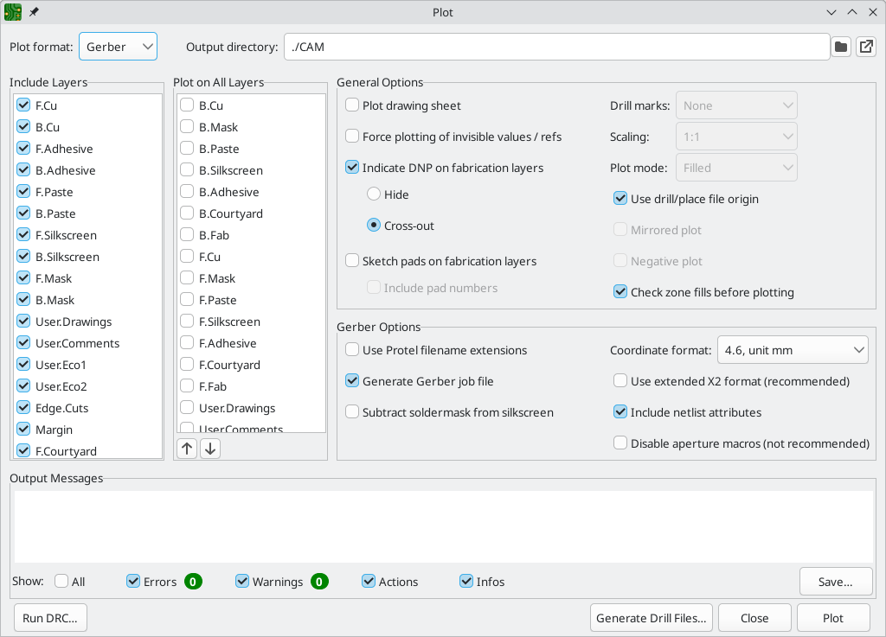
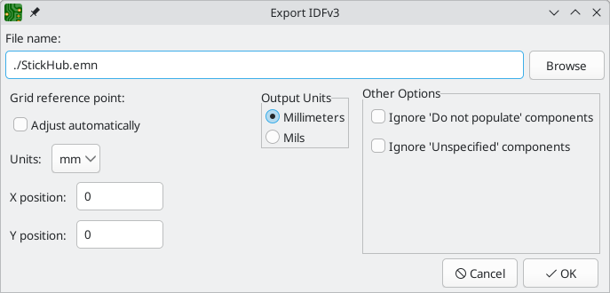

== Generating outputs

KiCad can generate and export files in a number of different formats useful for manufacturing PCBs
and interfacing with external software.  This functionality is available in the File menu in a few
different sections.  The Fabrication Outputs section contains the most common operations needed to
prepare a PCB for fabrication.  The Export section contains tools for generating files that can be
read by external software.  The Plot function allows you to export 2D line drawings of the PCB in
various formats.  The Print function allows you to send a view of the PCB to a 2D printer.

=== Fabrication outputs and plotting

KiCad uses Gerber files as its primary plotting format for PCB manufacturing.  To create Gerber
files, open the **Plot...** dialog from the **File** menu, or select **Gerbers (.gbr)...** from the
**Fabrication Outputs** section of the **File** menu.  The Plot dialog will open, allowing you to
configure and generate Gerber files.

==== Plotting options

**Include Layers:** Check that every layer used on your board is enabled in the list.  Disabled
layers will not be plotted.

**Plot on All Layers:** Selected layers will be included in the plot for each layer selected in the
**include layers** list. The additional layers are plotted on top of the base layer. You can
reorder these layers using the arrow buttons at the bottom; items that are lower in the list are
plotted after (on top of) items that are higher in the list.

**Output directory:** Specify the location to save plotted files.  If this is a relative path, it
is created relative to the project directory.

**Plot drawing sheet:** If enabled, the drawing sheet border and title block will be
plotted on each layer.  This should usually be disabled when plotting Gerber files.

**Plot footprint values:** If enabled, the Value field of each footprint will be plotted on
whatever layer it exists on (unless the field visibility is disabled for a specific footprint).

**Plot reference designators:** If enabled, the Reference Designator field of each footprint will
be plotted on whatever layer it exists on (unless the field visibility is disabled for a specific
footprint).

**Plot footprint text:** If enabled, text fields in footprints will be plotted on whatever layers
they exist on (unless the field visibility is disabled for a specific footprint). Disabling this
option also disables the **plot footprint values** and **plot reference designators** options.

**Force plotting of invisible values / refs:** If enabled, all footprint values and reference
designators will be plotted, even if the field visibility is disabled for some of these fields.

**Plot Edge.Cuts on all layers:** If enabled, the Edge.Cuts (board outline) layer will be added to
all other layers.  Check with your manufacturer to see what the correct value of this setting is
for their manufacturing process.

**Sketch pads on fabrication layers:** If enabled, footprint pads on fabrication (F.Fab, B.Fab)
layers will be drawn as unfilled outlines rather than filled shapes.

**Check zone fills before plotting:** When enabled, zone fills will be checked (and refilled if
outdated) before generating outputs.  Plot outputs may be incorrect if this option is disabled!

**Drill marks:** For plot formats other than Gerber, marks may be plotted at the location of all
drilled holes.  Drill marks may be created at the actual size (diameter) of the finished hole, or
at a smaller size.

**Scaling:** For plot formats that support scaling other than 1:1, the plot scale may be set.  The
Auto scaling setting will scale the plot to fit the specified page size.

**Plot mode:** For some plot formats, filled shapes may be plotted as outlines only (sketch mode).

**Use drill/place file origin:** When enabled, the coordinate origin for plotted files will be the
drill/place file origin set in the board editor.  When disabled, the coordinate origin will be the
absolute origin (top left corner of the worksheet).

**Mirrored plot:** For some plot formats, the output may be mirrored horizontally when this option
is set.

**Negative plot:** For some plot formats, the output may be set to negative mode.  In this mode,
shapes will be drawn for the empty space inside the board outline, and empty space will be left
where objects are present in the PCB.

**Do not tent vias:** If enabled, vias will be left uncovered on the solder mask layers (F.Mask,
B.Mask).  If disabled, vias will be covered by solder mask (tented).

NOTE: KiCad does not support tenting or uncovering specific vias.  Tenting may only be controlled
      globally (for all vias on a board).

==== Gerber options

**Use Protel filename extensions:** When enabled, the plotted Gerber files will be named with file
extensions based on Protel (`.GBL`, `.GTL`, etc).  When disabled, the files will have the `.gbr`
extension.

**Generate Gerber job file:** When enabled, a Gerber job file (`.gbrjob`) will be generated along
with any Gerber files.  The Gerber job file is an extension to the Gerber format that includes
information about the PCB stackup, materials, and finish.  More information about Gerber job files
is available at link:https://www.ucamco.com/en/gerber/gerber-job-file[the Ucamco website].

**Subtract soldermask from silkscreen:** When enabled, silkscreen will be automatically removed
from board areas that aren't covered by soldermask.

**Coordinate format:** Configure how coordinates will be stored in the plotted Gerber files.  Check
with your manufacturer for their recommended setting for this option.

**Use extended X2 format:** When enabled, the plotted Gerber files will use the X2 format, which
includes information about the netlist and other extended attributes.  This format may not be
compatible with older CAM software used by some manufacturers.

**Include netlist attributes:** When enabled, the plotted Gerber files will include netlist
information that can be used for checking the design in CAM software.  When X2 format mode is
disabled, this information is included as comments in the Gerber files.

**Disable aperture macros:** When enabled, all shapes will be plotted as primitives rather than by
using aperture macros.  This setting should only be used for compatibility with old or buggy CAM
software when requested by your manufacturer.

==== PostScript options

**Scale factor:** Controls how coordinates in the board file will be scaled to coordinates in the
PostScript file.  Using a different value for X and Y scale factors will result in a stretched / 
distorted output.  These factors may be used to correct for scaling in the PostScript output device
to achieve an exact-scale output.

**Track width correction:** A global factor that is added (or subtracted, if negative) from the
size of tracks, vias, and pads when plotting a PostScript file.  This factor may be used to correct
for errors in the PostScript output device to achieve an exact-scale output.

**Force A4 output:** When enabled, the generated PostScript file will be A4 size even if the KiCad
board file is a different size.

==== SVG options

**Precision:** Controls how many significant digits will be used to store coordinates.

**Output mode:** Controls whether the generated SVG file is in color or black and white.

==== DXF options

**Plot graphic items using their contours:** Graphic shapes in DXF files have no width.  This
option controls how graphic shapes with a width (thickness) in a KiCad board are plotted to a DXF
file.  When this option is enabled, the outer contour of the shape will be plotted.  When this
option is disabled, the centerline of the shape will be plotted (and the shape's thickness will not
be visible in the resulting DXF file).

**Use KiCad font to plot text:** When enabled, text in the KiCad design will be plotted as graphic
shapes using the KiCad font.  When disabled, text will be plotted as DXF text objects, which will
use a different font and will not appear in exactly the same position and size as shown in the
KiCad board editor.

**Export units:** Controls the units that will be used in the DXF file.  Since the DXF format has
no specified units system, you must export using the same units setting that you want to use for
importing into other software.

==== HPGL options

**Default pen size:** Controls the plotter pen size used to create graphics.

==== PDF options

**Output mode:** Controls whether the generated PDF file is in color or black and white.

**Generate property popups for front footprints:** When enabled, interactive popups will be added
to the generated PDF containing part information for each footprint on the front of the board.

**Generate property popups for back footprints:** When enabled, interactive popups will be added
to the generated PDF containing part information for each footprint on the back of the board.

=== Drill files

KiCad can generate CNC drilling files required by most PCB manufacturing processes in either
Excellon or Gerber X2 format.  KiCad can also generate a drill map: a graphical plot of the board
showing drill locations.  Select the **Drill Files (.drl)...** option from the **Fabrication Outputs**
section of the **File** menu to open the dialog:

**Output folder:** Choose the folder to save generated drill and map files to.  If a relative path
is entered, it will be relative to the project directory.

**Drill file format:** Choose whether to generate Excellon drill files (required by most PCB
manufacturers) or Gerber X2 files.

**Mirror Y axis:** For Excellon files, choose whether or not to mirror the Y-axis coordinate.  This
option should in general not be used when having PCBs manufactured by a third party, and is
provided for convenience for users who are making PCBs themselves.

**Minimal header:** For Excellon files, choose whether to output a minimal header rather than a
full file header.  This option should not be enabled unless requested by your manufacturer.

**PTH and NPTH in single file:** By default, plated holes and non-plated holes will be generated in
two different Excellon files.  With this option enabled, both will be merged into a single file.
This option should not be enabled unless requested by your manufacturer.

**Oval holes drill mode:** Controls how oval holes are represented in an Excellon drill file.  The
default setting, **Use route command**, is correct for most manufacturers.  Only choose the **Use
alternate drill mode** setting if requested by your manufacturer.

**Map file format:** Choose the output format for plotting a drill map.

**Drill origin:** Choose the coordinate origin for drill files.  **Absolute** will use the page 
origin at the top left corner.  **Drill/place file origin** will use the origin specified in the
board design.

**Drill units:** Choose the units for drill coordinates and sizes.

**Zeros format:** Controls how numbers are formatted in an Excellon drill file.  Select an option
here based on your manufacturer's recommendations.

=== IPC-2581 files

IPC-2581 files are XML files that contain complete fabrication and assembly data for a board design.
If your manufacturer accepts IPC-2581 files, these can replace Gerber files, drill files, and
component placement files. To create an IPC-2581 file, select **IPC-2581 File (.xml)...** from the
**Fabrication Outputs** section of the **File** menu.

**Units:** Choose the units for the generated file.

**Precision:** Choose the number of digits after the decimal point for numbers in the generated file.

**Version:** Choose the IPC-2581 standard version (B or C).

**Compress output:** If enabled, the generated file will be compressed as a ZIP file.

**Internal ID:** Choose the footprint field to use for the BOM's internal ID column. This can be a
generated unique ID or set to any footprint field in the design.

**Manufacturer PN:** Choose the footprint field to use for the BOM's manufacturer part number column.
This can be omitted or set to any footprint field in the design.

**Manufacturer:** Choose the footprint field to use for the BOM's manufacturer column. This can be
omitted or set to any footprint field in the design.

**Distributor PN:** Choose the footprint field to use for the BOM's distributor part number column.
This can be omitted or set to any footprint field in the design.

**Distributor:** Choose the footprint field to use for the BOM's distributor column. This can be
omitted or set to any footprint field in the design.

=== Component placement files

Component placement files are text files that list each component (footprint) on the board along
with its center position and orientation.  These files are usually used for programming
pick-and-place machines, and may be required by your manufacturer if you are ordering
fully-assembled PCBs. To create placement files, select **Component Placement (.pos, .gbr)...**
from the **Fabrication Outputs** section of the **File** menu.

NOTE: A footprint will not appear in generated placement files if the "Exclude from position files"
      option is enabled for that footprint.  This may be used for excluding certain footprints that
      do not represent physical components to be assembled. You can also optionally exclude DNP
      components, depending on your manufacturer's requirements.

**Format:** Choose between generating a plain text (ASCII), comma-separated text (CSV), or Gerber
X3 placement file format.

**Units:** Choose the units for component locations in the placement file.

**Files:** Choose whether to generate separate files for footprints on the front and back of the
board or a single file combining both sides.

**Include only SMD footprints:** When enabled, only footprints with the SMD fabrication attribute
will be included.  Check with your manufacturer to determine if non-SMD footprints should be
included or excluded from the position file.

**Exclude all footprints with through hole pads:** When enabled, footprints will be excluded from
the placement file if they contain any through-hole pads, even if their fabrication type is set to
SMD.

**Exclude all footprints with the Do Not Populate flag set:** When enabled, footprints will be
excluded from the placement file if they have the Do Not Populate attribute set. Check with your
manufacturer to determine if DNP components should be included or excluded from the position file.

**Include board edge layer:** For Gerber placement files, controls whether or not the board outline
is included with the footprint placement data.

**Use drill/place file origin:** When enabled, component positions will be relative to the 
drill/place file origin set in the board design.  When disabled, the positions will be relative to
the page origin (upper left corner).

**Use negative X coordinates for footprints on bottom layer:** When enabled, the X coordinates will
be flipped (negated) for footprints on the bottom layer.

=== Additional fabrication outputs

KiCad can also generate footprint report files, IPC-D-356 netlist files, and a bill of materials
(BOM) from the board design.  These output formats have no configurable options.

=== Printing

KiCad can print the board view to a standard printer using the Print action in the File menu.

**Include layers:** Select the layers to include in the printout.  Unselected layers will be
invisible. Right-click the list for layer selection commands.

**Output mode:** Choose whether to print in black and white or full color.

**Print drawing sheet:** When enabled, the page border and title block will be printed.

**Print according to objects tab of appearance manager:** When enabled, any objects that have been
hidden in the Objects tab of the Appearance panel will be hidden in the printout.  When disabled,
these objects will be printed if the layer they appear on is selected in the Included Layers area.

**Print background color:** When printing in full color, this option controls whether or not the
view background color will be printed.

**Use a different color theme for printing:** When printing in full color, this option allows a
different color theme to be used for printing.  When disabled, the color theme used by the board
editor will be used for printing.

**Drill marks:** Controls whether to show drilled holes at their actual size, at a small size, or
hide them from the printout.

**Print mirrored:** When enabled, the printout will be mirrored horizontally.

**Print one page per layer:** When enabled, each layer selected in the Included Layers area will be
printed to an individual page.  If this option is enabled, the **Print board edges on all pages**
option controls whether to add the Edge.Cuts layer to each printed page.

**Scale:** controls the scale of the printout relative to the page size configured in Page Setup.

=== Exporting files

KiCad can export a board design to various third-party formats for use with external software.
These functions are found in the **Export** section of the **File** menu.

==== Specctra DSN exporter

The Specctra DSN exporter creates a file suitable for importing into certain third-party autorouter
software.  This exporter has no configurable options.

==== GenCAD exporter

The GenCAD exporter creates a GenCAD file for fabrication, testing, or importing into other software.

The GenCAD exporter has several options.

**Flip bottom footprint padstacks:** If enabled, separate flipped padstack definitions will be added
for bottom-side footprints. This may be necessary for importing into some third-party software.

**Generate unique pin names:** If enabled, a suffix will be added to each pin name so that no
footprint in the generated file will have two pins with the same name.

**Generate a new shape for each footprint instance:** If enabled, a unique footprint will be output
for every footprint instance, even if two footprints are identical.

**Use drill/place file origin as origin:** If enabled, coordinates in the generated file will be
relative to the drill/place file origin.

**Save the origin coordinates in the file:** If enabled, the selected origin coordinates will be
included in the generated file. If not enabled, the origin in the generated file will be set to (0,0).

==== VRML exporter

The VRML exporter creates a VRML (`.wrl`) 3D model file containing the PCB and any VRML files
specified in footprints. VRML models are suitable for use in applications where visual appearance is
important and dimensional accuracy is not critical.

The VRML exporter has several options.

**Coordinate origin options:** Selects the origin for the generated model. If **user defined origin**
is selected, you can manually specify the origin point.

**VRML units for output files:** Selects the unit system for the generated model. Dimensions in the
generated model will be scaled appropriately.

**Copy 3D model files to 3D model path:** If enabled, VRML files referenced in footprints will be copied
into a subdirectory of the directory containing the generated board VRML model, and the generated model
will reference the copied files. The subdirectory name is set by the **footprint 3D model path** field.
If disabled, VRML files referenced in footprints will be embedded in the generated VRML files.

**Use relative paths to model files in board VRML file:** If enabled, references to external models will
use paths relative to the generated board VRML file. If disabled, the references will use absolute paths.
This option is only available when the **copy 3D model files to 3D model path** option is enabled.

[[idf-exporter]]
==== IDF exporter

The IDF exporter exports an
http://www.simplifiedsolutionsinc.com/images/idf_v30_spec.pdf[IDFv3] compliant
board (`.emn`) and library (`.emp`) file for communicating mechanical dimensions
to a mechanical CAD package. The exporter exports the board outline and cutouts,
all pad and mounting through holes including slotted holes, and component
outlines; this is the most basic set of mechanical data required for interaction
with mechanical designers. All other entities described in the IDFv3
specification are currently not exported.

NOTE: You must attach IDF component models to your design's footprints before
they will be included in the exported model. For more information on attaching
models to footprints, see the <<creating-and-editing-footprints,footprint
documentation>>. Some IDF-specific guidance is included in the
<<idf-component-outlines,Advanced Topics documentation>>.

NOTE: For more information on creating IDF component models, including descriptions
of the IDF utility tools included with KiCad, see the
<<idf-component-outlines,Advanced Topics documentation>>.

Once models have been specified for all desired components, the model of the
board can be exported. In the PCB Editor, select **File** -> **Export** ->
**IDFv3...**.

**Grid reference point:** Choose where the exported model's reference point
should be. If the **Adjust automatically** option is selected, KiCad will set
the reference point to the centroid of the PCB. Otherwise, the reference point
is set relative to the display origin.

**Output units:** Choose whether the exported model's units are millimeters or
mils.

The outputs can be viewed directly in a mechanical CAD application or converted
to VRML using the <<idf2vrml,`idf2vrml` tool>>.

==== STEP exporter

The STEP exporter creates a STEP (`.step`) 3D model file containing the PCB and any STEP files
specified in footprints. STEP models are suitable for use in mechanical CAD applications.

The STEP exporter can also export a binary GLTF (`.glb`) model file by changing the output
file's format to Binary GLTF.

NOTE: KiCad's footprint library includes both STEP and VRML (`.wrl`) versions of each model.
      However, footprints in KiCad's library only reference the VRML versions of the models.
      VRML models are not included in STEP exports, but the STEP exporter will instead include
      the corresponding STEP version of the model if the **subsitute similarly named models**
      option is enabled.

**Coordinates:** Selects the origin for the generated model. If **user defined origin**
is selected, you can manually specify the origin point.

**Ignore 'Do not populate' components:** If enabled, components with the DNP attribute set
will not be included in the exported STEP model.

**Ignore 'Unspecified' components:** If enabled, components with the Unspecified footprint
type will not be included in the exported STEP model.

**Substitute similarly named models:** VRML models cannot be used for STEP exports, but
if this option is enabled the exporter will look for an identically named STEP model to include
in the export instead of a footprint's specified VRML model. Note that footprints in KiCad's
footprint library specify VRML models, but suitably named STEP models are included for each
VRML model. Therefore this option must be enabled in order to export STEP models for footprints
from KiCad's library.

**Overwrite old file:** If enabled, the exported STEP model will overwrite an existing file
with the same name.

**Optimize STEP file:** If enabled, parametric curves will be disabled in the exported
STEP model. This reduces the file size, but may reduce compatibility with some software.

**Export tracks, pads and vias:** If enabled, tracks, pads, and vias on outer layers will
be modeled in the exported STEP model. This option may increase the export time.

**Export zones:** If enabled, zones on outer layers will be modeled in the exported STEP
model. This option may increase the export time.

**Board outline chaining tolerance:** Controls the minimum distance between two points for
the points to be considered coincident. If the board outline in the exported STEP model is
not contiguous, try increasing this tolerance.

==== SVG exporter

The SVG exporter creates a vector graphics image of the board.

**Layers:** The selected layers will be included in the generated SVG.

**Print mode:** Controls whether the generated SVG file is in color or black and white.

**Color theme:** Controls the color theme used for the generated SVG file. If the
**use current board theme** option is selected, the theme that is selected in the board
editor will be used.

**SVG page size:** Controls the size of the generated SVG drawing. If
**page with frame and title block** is selected, the drawing will match the board's sheet
size and will include the drawing sheet and title block. If **current page size** is selected,
the drawing will match the board's sheet size but will not include the drawing sheet. If
**board area only** is selected, the drawing will be just big enough to fit the board itself.

**Print mirrored:** When selected, layers will be horizontally mirrored.

**Print one page per layer:** When selected, a separate SVG file will be generated for each
selected layer. If the **print board edges on all pages** option is selected, the `Edge.Cuts`
layer will be included in all generated SVGs, even if it is not selected as a layer.

==== Footprint association (CMP) exporter

CMP files are used to sync footprint assignments and some other footprint fields between the PCB
and the schematic. You can import CMP files into the schematic using the schematic editor's
**File** -> **Import** -> **Footprint Assignments** menu item. This provides a very limited form of
xref:../eeschema/eeschema.adoc#backannotation[back annotation]. It is recommended to use the
Update Schematic from PCB tool instead.

This exporter has no configurable options.

==== Hyperlynx exporter

The Hyperlynx exporter creates a file suitable for importing into Mentor Graphics (Siemens) HyperLynx
simulation and analysis software. This exporter has no configurable options.