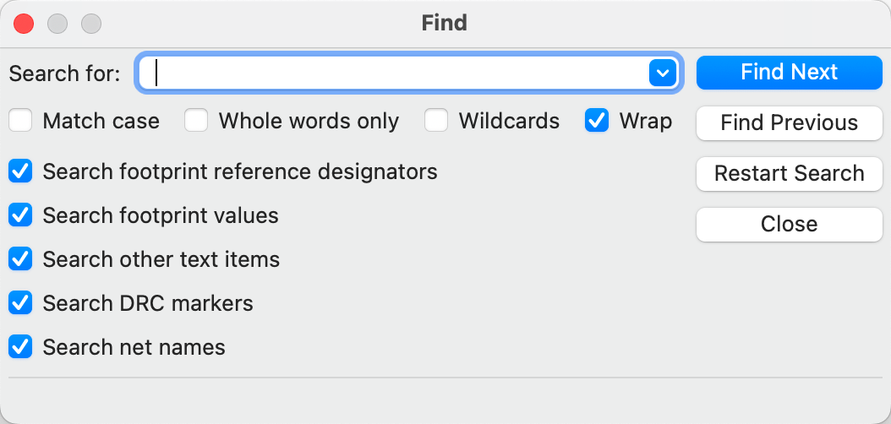

:experimental:

== Inspecting a board

[[design-rule-checking]]
=== Design rule checking

The design rule checker is used to verify that the PCB meets all the requirements established in
the Board Setup dialog and that all pads are connected according to the netlist or schematic.
KiCad can automatically prevent some design rule violations while routing tracks, but many others
cannot be prevented automatically.  This means it is important to use the design rule checker
before creating manufacturing files for a PCB.

To use the design rule checker, click the image:images/icons/erc_24.png[] icon in the top toolbar,
or select **Design Rules Checker** from the **Inspect** menu.

The top section of the DRC Control window contains some options that control the design rule
checker:

**Refill all zones before performing DRC:** when enabled, zones will be refilled every time the
design rule checker is run.  Disabling this option may result in incorrect DRC results if zones
have not been refilled manually.

**Report all errors for each track:** when enabled, all clearance errors will be reported for each
track segment.  When disabled, only the first error will be reported.  Enabling this option will
result in the design rule checker running more slowly.

**Test for parity between PCB and schematic:** when enabled, the design rule checker will test for
differences between the schematic and PCB in addition to testing the PCB design rules.  This option
has no effect when running the PCB editor in standalone mode.

After running DRC, any violations will be shown in the center part of the DRC Control window.
Rule violations, unconnected items, and differences between the schematic and the PCB are shown in
three different tabs.  The controls below the list of violations can be used to show or hide
violations depending on their severity.  A report file in plain text format can be created after
running DRC using the Save button.

Each violation involves one or more objects on the PCB.  In the list of violations, the objects
involved are listed below the violation.  Clicking on the violation in the list view will move
the PCB Editor view so that the affected area is centered.  Clicking on one of the objects involved
in a violation will highlight the object.

The numbers at the bottom of the window show the number of errors, warnings, and
exclusions. Each type of violation can be filtered from the list using the
respective checkboxes. Clicking **Delete Markers** will clear all violations
until DRC is run again.

Violations can be right-clicked in the dialog to ignore them or change their
severity:

* *Exclude this violation:* ignores this particular violation, but does not
  affect any other violations.
* *Change severity:* changes a type of violation from warning to error, or error
  to warning. This affects all violations of a given type.
* *Ignore all:* ignores all violations of a given type. This test will now
  appear in the **Ignored Tests** tab rather than the **Violations** tab.

Excluded and ignored violations are remembered between runs of the design rule
checker.

[[clearance-and-constraint-resolution]]
==== Clearance and constraint resolution

The clearance and constraint resolution tools allow you to inspect which clearance and design
constraint rules apply to selected items.  These tools can help when designing PCBs with complex
design rules where it is not always clear which rules apply to an object.

To inspect the clearance rules that apply between two objects, select both
objects and choose **Clearance Resolution** from the **Inspect** menu.  The
Clearance Report dialog will show the clearance required between the objects on
each copper layer, as well as the design rules that resulted in that clearance.

To inspect the design constraints that apply to an object, select it and choose **Constraints
Resolution** from the **Inspect** menu.  The Constraints Report dialog will show any constraints that
apply to the object.

==== DRC configuration

The severity of each DRC check can be configured in the **Violation Severity**
section of the <<board-setup-violation-severity,Board Setup dialog>>. Each rule
may be set to create an error marker, a warning marker, or no marker (ignored).

NOTE: Individual rule violations may be ignored in the Design Rule Checker.  Setting a rule to
      Ignore in the Violation Severity section will completely disable the corresponding design
      rule check.  Use this setting with caution.

image::images/board_setup_violation_severity.png[scaledwidth="70%"]

[[list-of-drc-checks]]
==== List of DRC checks

The table below lists the design rules that KiCad checks and the default
violation severity for each check. All severities are configurable. Some design
are only available through <<custom-design-rules,custom design rules>>.

===== Electrical DRC checks

These DRC checks look for gross electrical issues on the board such as shorts
and clearance violations.

[options="header",cols="30%,50%,20%"]
|=======================================================================
| Violation
  | Description
  | Default Severity
| Items shorting two nets
  | This violation occurs when copper items on different nets collide with
    each other. If this is intentional, consider using a <<net-ties,net tie>>.
  | Error
| Tracks crossing
  | This violation occurs when tracks with different nets cross each other.
  | Error
| Clearance violation
  | This violation occurs when the distance between two copper items with
    different nets is smaller than the configured clearance for those nets.
    The allowed clearance between two items can come from the
    <<board-setup-constraints,board-level minimum clearance>>, the
    <<board-setup-net-classes,net class settings>> for each net, or from
    <<custom-design-rules,custom rules>>. To see detailed information about the
    configured and actual clearances between two selected items, run the
    <<clearance-and-constraint-resolution,clearance resolution>> tool.

    This violation is also reported when the distance between two items is
    smaller than the configured physical clearance for those two
    items. Physical clearance constraints are not configured by default; see the
    <<custom-design-rules,custom rule>> documentation for how to configure
    physical clearance.
  | Error
| Via is not connected or is connected on only one layer
  | This violation occurs when a via is connected to copper objects on only
    one layer or is not connected to anything. As vias are intended to connect
    copper objects on different layers, this may indicate that an intended
    connection is missing.
  | Warning
| Track has unconnected end
  | This violation occurs when the end of a track segment is not connected
    to another copper object, such as another track segment, a via or pad, or a
    zone or copper graphical shape.
  | Warning
| Thermal relief connection to zone incomplete
  | This violation occurs when a pad's connection to a zone does not have enough
    connected thermal relief spokes. The minimum allowed number of spokes can
    come from the
    <<board-setup-constraints,board-level minimum thermal relief spoke count>>
    or can be configured with more granularity using
    <<custom-design-rules,custom rules>>.
    
    This check counts automatically generated spokes as well as manually drawn
    connections, so if the pad and zone geometry prevent enough spokes from
    being generated, you can manually add additional connections using tracks
    between the pad and the zone.
  | Error
|=======================================================================

===== Design for manufacturing DRC checks

These DRC checks look for issues in the board that may cause manufacturing
problems.

[options="header",cols="30%,50%,20%"]
|=======================================================================
| Violation
  | Description
  | Default Severity
| Board edge clearance violation
  | This violation occurs when the distance between a copper object and the
    board edge is smaller than the configured copper to edge clearance for those
    items. For the purposes of this check, oval holes (which are routed rather
    than drilled) are counted as board edges in addition to any graphic items
    on the `Edge.Cuts` layer.

    The allowed edge clearance between two items can come from the
    <<board-setup-constraints,board-level minimum copper to edge clearance>> or
    from <<custom-design-rules,custom rules>>. A negative edge clearance allows
    objects to overlap with the board edge. To see detailed information about
    the configured and actual edge clearances between two selected items, run
    the <<clearance-and-constraint-resolution,clearance resolution>> tool.
  | Error
| Hole clearance violation
  | This violation occurs when the distance between a hole (pad or via) and
    another copper object (pad, track, via, or zone) is smaller than the
    configured copper to hole clearance for those objects. Objects are only
    considered in this check if they have layers in common.
    The allowed hole clearance between two items can come from the
    <<board-setup-constraints,board-level minimum copper to hole clearance>> or
    from <<custom-design-rules,custom rules>>. To see detailed information about
    the configured and actual hole clearances between two selected items, run
    the <<clearance-and-constraint-resolution,clearance resolution>> tool.

    This violation is also reported when the distance between a hole and another
    object is smaller than the configured physical hole clearance for those two
    items. Physical hole clearance constraints are not configured by default;
    see the <<custom-design-rules,custom rule>> documentation for how to
    configure physical hole clearance.
  | Error
| Drilled hole too close to other hole
  | This violation occurs when the distance between a drilled hole and
    another hole is smaller than the configured hole to hole clearance.
    
    Through vias, blind/buried vias, and through holes in pads are considered
    drilled holes because the holes are made with a physical drill bit, which
    can shift or be damaged if other holes (drilled or otherwise) are too close.
    Micro vias are not considered drilled holes because they are drilled using a
    laser, which is not affected by other nearby holes. At least one of the
    holes must be mechanically drilled in order to be considered in this check.
  
    Blind/buried vias are only considered in this check when they share layers
    with the other hole.

    Non-circular holes are not included in this check because they are routed
    rather than drilled. Routing is typically performed after holes are
    drilled and with a stronger tool.
  | Error
| Drilled holes co-located
  | This violation occurs when a drilled hole and another hole are in the
    exact same location.

    The same types of holes are considered in this check as for the "Drilled
    hole too close to other hole" check.
  | Warning
| Track width
  | This violation occurs when the width of a track is outside of the configured
    range. The allowed width for a track can come from the
    <<board-setup-constraints,board-level minimum track width>> or from
    <<custom-design-rules,custom rules>>.
    
    Note that an optimal track width can be configured for each net class in the
    <<board-setup-net-classes,net class settings>>, which sets a track width for
    the interactive router to use, but it does not set a minimum and maximum
    track width. No DRC violations will be reported for net class track width
    settings unless a minimum and/or maximum are configured using custom rules.

    To see detailed information about the configured track width for a
    particular track, run the 
    <<clearance-and-constraint-resolution,constraints resolution>> tool.
  | Error
| Annular width
  | This violation occurs when a pad or via's annular width is outside of the
    configured range. 

    Board-level minimum annular width can be configured in 
    <<board-setup-constraints,board setup constraints>>. Board-level maximum
    width, as well as more specific rules, can be configured using
    <<custom-design-rules,custom rules>>.
  | Error
| Hole size out of range
  | This violation occurs when a drilled hole's diameter is outside of the
    configured range. 

    This check represents the smallest hole that can be drilled, i.e. the
    smallest drill bit size the manufacturer will use. This check therefore
    includes through vias, blind/buried vias, and through holes in pads.
    Micro vias are not included in this check because they are made using a
    laser rather than a physical drill bit.

    Board-level minimum through hole size can be configured in 
    <<board-setup-constraints,board setup constraints>>. Board-level maximum
    hole size, as well as more specific rules, can be configured using
    <<custom-design-rules,custom rules>>.
  | Error
| Micro via hole size out of range
  | This violation occurs when a micro via's hole diameter is outside of the
    configured range. 

    This check represents the smallest hole that can be laser drilled and
    therefore only applies to micro vias.

    Board-level minimum micro via hole size can be configured in 
    <<board-setup-constraints,board setup constraints>>. Board-level maximum
    hole size, as well as more specific rules, can be configured using
    <<custom-design-rules,custom rules>>.
  | Error
| Courtyards overlap
  | This violation occurs when a footprint's courtyard overlaps with another
    footprint's courtyard. A nonzero clearance between two courtyards can be
    configured using a `courtyard_clearance` constraint in 
    <<custom-design-rules,custom rules>>. A negative courtyard clearance allows
    courtyards to intersect.
  | Error
| Footprint has no courtyard defined
  | This violation occurs when a footprint does not contain any graphic
    shapes on its `F.Courtyard` or `B.Courtyard` layers.
  | Ignore
| Footprint has malformed courtyard
  | This violation occurs when a footprint has a courtyard containing
    non-closed shapes. Courtyards may contain multiple unconnected shapes
    without being considered malformed, as long as each shape is individually
    closed.
  | Error
| Board has malformed outline
  | This violation occurs when the shapes on the `Edge.Cuts` layer do not
    form a valid board outline. Valid board outlines consist of closed shapes
    that do not self-intersect. Board outlines may contain multiple unconnected
    shapes without being considered malformed, as long as each shape is
    individually closed and does not intersect with itself or other shapes. This
    check also reports very small (nanometer-scale) graphic shapes on the
    `Edge.Cuts` layer, which are difficult to find visually but may cause issues
    in other tools.
  | Error
| Copper sliver
  | This violation occurs when small, wedge-shaped protrusions of copper are
    detected. These slivers can cause manufacturing, reliability, or electrical
    issues.
  | Warning
| Solder mask aperture bridges items with different nets
  | This violation occurs when a single opening in the soldermask exposes
    multiple copper items with different nets. This can result in solder
    shorting the two copper items during assembly.
  | Error
| Copper connection too narrow
  | This violation occurs when a copper connection necks down to a width that is 
    narrower than the configured minimum connection width. The minimum
    connection width setting can come from the
    <<board-setup-constraints,board-level minimum connection width>> or can be
    configured with more granularity using <<custom-design-rules,custom rules>>.
  | Warning
|=======================================================================

===== Schematic parity DRC checks

These DRC checks look for differences between the schematic and the board.

[options="header",cols="30%,50%,20%"]
|=======================================================================
| Violation
  | Description
  | Default Severity
| Duplicate footprints 
  | This violation occurs when the board contains multiple footprints with
    the same reference designator are in the board. It is not reported if the
    footprints do not correspond to schematic symbols, however (if the
    footprints only exist in the board).
  | Warning
| Missing footprint
  | This violation occurs when a footprint is not in the board but is
    expected based on a corresponding symbol in the schematic.
  | Warning
| Extra footprint
  | This violation occurs when a footprint is in the board without a
    corresponding symbol in the schematic.
  | Warning
| Footprint attributes don't match symbol
  | This violation occurs when a footprint's `Value` field, "DNP" attribute, or
    "Exclude from BOM" attribute are set differently than the corresponding
    field/attribute in the matching schematic symbol. It also occurs when a
    symbol's assigned footprint is different than the actual footprint in the
    board.
    
    Typically this is fixed by performing an
    <<forward-annotation,Update PCB from Schematic>> or
    <<reverse-annotation,Update Schematic from PCB>> action to sync the fields
    and attributes, depending on whether the symbol or footprint, respectively,
    is correct.
  | Warning
| Pad net doesn't match schematic
  | This violation occurs when a net does not match between a footprint pad
    and the corresponding symbol pin. This can be because the symbol pin's net
    is different than the footprint pad's net, because the footprint pad does
    not have a corresponding symbol pin, or because the symbol pin does not have
    a corresponding footprint pad.
  | Warning
| Missing connection between items
  | This violation occurs when two copper objects with the same net are not
    connected on the board.
  | Error
|=======================================================================

===== Signal integrity DRC checks

These DRC checks look for signal integrity issues in the board.

[options="header",cols="30%,50%,20%"]
|=======================================================================
| Violation
  | Description
  | Default Severity
| Trace length out of range
  | This violation occurs when a trace in a differential pair is too long or too
    short compared to the configured minimum and maximum length for that trace.
    The allowable trace length for different traces can be configured using the
    `length` constraint in <<custom-design-rules,custom rules>>.
  | Error
| Skew between traces out of range
  | This violation occurs when the difference between the length of a trace and
    the average length of all traces being considered is longer than the
    configured maximum skew for that set of traces. For calculating the skew of
    a differential pair (two traces), the skew therefore is calculated as half
    the length difference between traces.

    The allowable maximum skew for a set of traces can be configured using the
    `skew` constraint in <<custom-design-rules,custom rules>>.
  | Error
| Too many or too few vias on a connection
  | This violation occurs when the number of vias assigned to a net is too low
    or too high compared to the configured minimum and maximum for that net. The
    allowable via count for different nets can be configured using the
    `via_count` constraint in <<custom-design-rules,custom rules>>.
  | Error
| Differential pair gap out of range
  | This violation occurs when the gap between the two traces in a differential
    pair is too small or too large compared to the configured minimum and
    maximum for that differential pair. The gap is only checked on coupled (i.e.
    parallel) portions of the differential pair.
    
    The minimum and maximum allowable gap for a differential pair can be
    configured using the `diff_pair_gap` constraint in
    <<custom-design-rules,custom rules>>.
    
    Note that an optimal differential pair gap can be configured for each net
    class in the <<board-setup-net-classes,net class settings>>, which sets a
    gap for the differential pair router to use, but it does not set a minimum
    and maximum gap. No DRC violations will be reported unless a minimum and/or
    maximum are configured using custom rules.
  | Error
| Differential uncoupled length too long
  | This violation occurs when the portion of a differential pair that is
    uncoupled is longer than the configured maximum. A differential pair is
    considered uncoupled when its tracks are not parallel, for example when
    fanning out from a footprint.
    
    The maximum allowable uncoupled length for a differential pair can be
    configured using the `diff_pair_uncoupled` constraint in
    <<custom-design-rules,custom rules>>.
  | Error
|=======================================================================

===== Readability DRC checks

These DRC checks look for issues that may affect legibility of text and other 
silkscreen objects on the board.

[options="header",cols="30%,50%,20%"]
|=======================================================================
| Violation
  | Description
  | Default Severity
| Silkscreen overlap
  | This violation occurs when a silkscreen object intersects another
    silkscreen object, which may affect readability. This check does not apply
    to silkscreen objects within the same footprint.
    
    The allowable distance between silkscreen objects can also be set to a
    nonzero number to enforce a silk to silk clearance using the
    <<board-setup-constraints,board-level silkscreen minimum item clearance>> or
    using <<custom-design-rules,custom rules>>. A negative silkscreen clearance
    allows silkscreen to intersect other objects.
  | Warning
| Silkscreen clipped by solder mask
  | This violation occurs when a silkscreen object intersects a solder mask
    opening. This may result in silkscreen printed on bare copper or substrate.
    Board manufacturers may also discard any silkscreen that does not have
    solder mask underneath. Such outcomes could affect board assembly as well as
    silkscreen durability and readability.
  | Warning
| Silkscreen clipped by board edge
  | This violation occurs when a silkscreen object intersects a board edge,
    meaning that part of the silkscreen is outside of the board area.
    
    The allowable distance between silkscreen and the board edge can also be set
    to a nonzero number to enforce a clearance to the board edge using the
    <<board-setup-constraints,board-level silkscreen minimum item clearance>> or
    using <<custom-design-rules,custom rules>>. A negative silkscreen clearance
    allows silkscreen to intersect other objects.
  | Warning
| Text height out of range
  | This violation occurs when a text object's text height is outside of the
    configured range.
    
    Board-level minimum text height can be configured in 
    <<board-setup-constraints,board setup constraints>>. Board-level maximum
    height, as well as more specific rules, can be configured using
    <<custom-design-rules,custom rules>>.
  | Warning
| Text thickness out of range
  | This violation occurs when a text object's text thickness is outside of the
    configured range. For the built-in KiCad stroke font, the thickness is the
    text thickness setting in the text object's properties. For external fonts,
    this is the minimum physical thickness of all glyphs in the text object;
    this depends on the font geometry in combination with the font size, bold,
    and italic settings.

    Board-level minimum text thickness can be configured in 
    <<board-setup-constraints,board setup constraints>>. Board-level maximum
    thickness, as well as more specific rules, can be configured using
    <<custom-design-rules,custom rules>>.

  | Warning
|=======================================================================

===== Miscellaneous DRC checks

These DRC checks look for other miscellaneous issues in the board.

[options="header",cols="30%,50%,20%"]
|=======================================================================
| Violation
  | Description
  | Default Severity
| Items not allowed
  | This violation occurs when objects are placed in a location where they are
    not allowed. This can be due to a <<pcb-rule-areas,rule area>> with a keep
    out rule for the object's type or due to a `disallow`
    <<custom-design-rules,custom rule>> constraint.
  | Error
| Copper zones intersect
  | This violation occurs when copper zones with different nets collide
    with each other, shorting the two nets.
  | Error
| Isolated copper fill
  | This violation occurs when part of a copper fill is not connected to
    any other copper items with the same net. This is also referred to as an
    island.
  | Warning
| Footprint is not valid
  | This violation occurs when a footprint's net tie group contains a pad that
    doesn't exist in the footprint, or when a pad is in more than one net tie
    group.
  | Error
| Padstack is questionable
  a| This violation occurs when a footprint pad has unusual settings that are
    probably a mistake. The settings that are checked are:

    * Plated through holes without copper pads on any layer
    * Pads with inappropriate properties, such as through hole pads with the BGA
      property
    * Connector pads with solder paste
    * SMD pads with copper on both sides
    * SMD pads with copper on the opposite side from the corresponding solder
      mask opening or solder paste
    * SMD pads with no copper on outer layers
    * Plated through hole pads with no copper annulus around the hole
    * Plated through hole pads with hole partially or fully outside of the
      copper
    * Potential issues with solder mask clearance
    * Pads with negative local electrical clearance
    * Pads with an excessively large corner chamfer/radius
  | Warning
| PTH inside courtyard
  | This violation occurs if a footprint's plated through hole pad is
    within the courtyard of another footprint.
  | Warning
| NPTH inside courtyard
  | This violation occurs if a footprint's nonplated through hole pad is
    within the courtyard of another footprint.
  | Warning
| Item on a disabled copper layer
  | This violation occurs if an item, for example a pad or via, is on a
    copper layer that does not exist in the
    <<configuring_board_stackup_and_physical_parameters,board stackup>>.
  | Error
| Unresolved text variable
  | This violation occurs when a <<text-variables,text variable>> in the
    board design or drawing sheet does not resolve (there is no defined value
    for the variable).
  | Error
| Footprint component type doesn't match footprint pads
  | This violation occurs when a footprint's component type (SMD, through
    hole, or unspecified) doesn't match the expected type based on the
    footprint's pads. If a footprint
    contains any through hole pads, it is expected to have the through hole
    component type. If it contains SMD pads and no through hole pads, its
    component type is expected to be SMD. If a footprint's component type is
    unspecified, the footprint is not compared against its pads.
  | Ignore
| Footprint not found in libraries
  | This violation occurs when a footprint in the board is not in an active
    library in <<managing-footprint-libraries,the global library table or the project-specific library table>>.
    This can be because the footprint's library does not contain the footprint,
    the footprint's library is not listed in either library table, or because
    the library is listed in a table but is disabled. As a consequence, you will
    not be able to update the footprint from the library or compare changes
    between the board and library versions of the footprint.
  | Warning
| Footprint doesn't match copy in library
  | This violation occurs when a footprint in the board is different than
    the library version of the footprint.
    
    You can compare between the board and library versions of the footprint
    using the <<comparing-footprints,Compare Footprint with Library>> tool. If
    desired, you can
    <<updating_and_exchanging_footprints,update the board footprint>> to match
    the library footprint.
  | Warning
| Through hole pad has no hole
  | This violation occurs when a through hole footprint pad does not have a
    hole.
  | Error
|=======================================================================

==== DRC report file

An DRC report file can be generated and saved by clicking the **Save...** button
in the DRC dialog. The file extension for DRC report files is `.rpt`. An example
DRC report file is given below.

----------------------------------------------------------------------
** Drc report for pic_programmer.kicad_pcb **
** Created on 2024-11-02T15:54:52-0400 **

** Found 4 DRC violations **
[starved_thermal]: Thermal relief connection to zone incomplete (layer bottom_layer; 1 spokes connected to isolated island)
    Local override; error
    @(223.5200 mm, 138.4300 mm): Zone [GND] on bottom_layer
    @(175.2600 mm, 68.5800 mm): PTH pad 8 [GND] of P3
[starved_thermal]: Thermal relief connection to zone incomplete (layer bottom_layer; zone min spoke count 2; actual 1)
    Local override; error
    @(223.5200 mm, 138.4300 mm): Zone [GND] on bottom_layer
    @(207.8990 mm, 118.1100 mm): PTH pad 5 [GND] of U5
[starved_thermal]: Thermal relief connection to zone incomplete (layer bottom_layer; 1 spokes connected to isolated island)
    Local override; error
    @(223.5200 mm, 138.4300 mm): Zone [GND] on bottom_layer
    @(125.7300 mm, 111.7600 mm): PTH pad 10 [GND] of U2
[starved_thermal]: Thermal relief connection to zone incomplete (layer bottom_layer; zone min spoke count 2; actual 1)
    Local override; error
    @(223.5200 mm, 138.4300 mm): Zone [GND] on bottom_layer
    @(118.1100 mm, 111.7600 mm): PTH pad 13 [GND] of U2

** Found 0 unconnected pads **

** Found 0 Footprint errors **

** End of Report **
----------------------------------------------------------------------

[[board-statistics]]
=== Board Statistics

The Board Statistics dialog shows a summary of the board's contents, including the number of
components, pads and vias; each by their own types as well as the overall board size.

image::images/Pcbnew_board_statistics.png[scaledwidth="70%"]

=== Measurement tool

The measurement tool allows you to make distance and angle measurements between points on the PCB.
To activate the tool, click the image:images/icons/measurement_24.png[] icon in the right toolbar,
or use the hotkey kbd:[Ctrl + Shift + M].  Once the tool is active, click once to set the
measurement start point, then click again to finish a measurement.

NOTE: The measurement tool is used for quick measurements that do not need to be displayed
      permanently.  Any measurement you make will only be shown while the tool is active.  To
      create permanent dimensions that will appear in printouts and plots, use the Dimension tools.

=== Find tool

The Find tool searches for text in the PCB, including reference designators,
footprint fields, and graphic text. When the tool finds a match, the canvas is
zoomed and centered on the match and the text is highlighted. Launch the tool
using the (image:images/icons/find_24.png[Find icon]) button in the top toolbar.

The Find tool has several options:

*Match case:* Selects whether the search is case-sensitive.

*Words:* When selected, the search will only match the search term with complete
words in the PCB. When unselected, the search will match if the search
term is part of a larger word in the PCB.

*Wildcards:* When selected, wildcards can be used in the search terms. `?`
matches any single character, and `\*` matches any number of characters. Note
that when this option is selected, partial matches are not returned: searching
for `abc*` will match the string `abcd`, but searching for `abc` will not.

*Wrap:* When selected, search results will return to the first hit after
reaching the last hit.

*Search footprint reference designators:* Selects whether the search should
apply to footprint reference designators.

*Search footprint values:* Selects whether the search should apply to footprint
value fields.

*Search other text items:* Selects whether the search should apply to other text
items, including graphical text and footprint fields other than value and
reference.

*Search DRC markers:* Selects whether the search should apply to the violation
descriptions of DRC markers shown on the board.

*Search net names:* Selects whether the search should apply to the names of nets
in the board.

=== Search panel

The search panel is a docked panel that lists information about footprints,
zones, nets, ratsnest lines (unrouted segments), and text from the PCB. You can
optionally filter the list based on a search string. When no filter is used, all
items in the design are listed in the corresponding tab.

Items are filtered based on their properties: footprints are filtered by their
reference designator and value, zones by the zone name, net and ratsnest items
by the net name, and text (text, textboxes, and dimensions) by the text content.
You can sort the filtered results in ascending or descending order of the value
in a particular column by clicking on that column header.

Filters support wildcards: `*` matches any characters, and `?` matches any
single character. You can also use
http://docs.wxwidgets.org/3.2/overview_resyntax.html[regular expressions], such
as `/footprint value/`.

The displayed information depends on the item type. In addition to the item's
name and/or value, physical items (footprints, zones, and text) list their layer
and X/Y location. Text also displays the type of text object (text, textbox, or
dimension.) Net and ratsnest items list their net name and net class.

When you click an item in the search panel, the item is selected in the editing
canvas. Double-clicking an item in the search panel opens its properties dialog
(for net and ratsnest items, the <<board-setup-net-classes,net classes dialog>>
is opened instead).

Show or hide the search panel with **View** -> **Show Search Panel** or use the
kbd:[Ctrl+G] shortcut.

[[threed-viewer]]
=== 3D Viewer

The 3D Viewer shows a 3-dimensional view of the board and the components on the
board. You can view the board from different perspectives, show or hide
different types of components, cross-probe from the PCB Editor to the 3D viewer,
and generate raytraced renders of the board. Show the 3D Viewer with **View**
-> **3D Viewer** or use the kbd:[Alt+3] shortcut.

NOTE: The 3D model for a component will only appear if the 3D model file exists
and has been <<working-with-footprints,assigned to the footprint>>.

NOTE: Many footprints in KiCad's standard library do not yet have model files
created for them. However, these footprints may contain a path to a 3D model
that does not yet exist, in anticipation of the 3D model being created in the
future.

==== Navigating the 3D view

Dragging with the left mouse button will orbit the 3D view. By default this is
the centroid of the board, but the pivot point can be reset to a new point on
the board by moving the cursor over the desired point and pressing kbd:[Space].
Scrolling the mouse wheel will zoom the view in or out.  Scrolling while holding
kbd:[Ctrl] pans the view left and right, and scrolling while holding kbd:[Shift]
pans up and down. Dragging with the middle mouse button also pans the view.

Different sized 3D grids can be set using the **View** -> **3D Grid**
menu. Bounding boxes for each component can be enabled with **Preferences** ->
**Show Model Bounding Boxes**.

When the PCB Editor and the 3D Viewer are both open, selecting a footprint in
the PCB Editor will also highlight the component in the 3D Viewer. The highlight
color is adjustable in **Preferences** -> **Preferences...** -> **3D Viewer** ->
**Realtime Renderer** -> **Selection Color**.

==== Appearance Manager

The Appearance Manager is a panel at the right of the viewer which provides
controls to manage the visibility, color, and opacity of different types of
objects and board layers in the 3D view.

Each layer or type of object in the list can be individually shown or hidden by
clicking its corresponding visibility icon. PCB layers can have their colors
customized; double-click on the color swatch next to the item type to edit the
item's color and opacity. To use the colors selected in the Board Setup dialog's
Physical Stackup editor, enable the **use board stackup colors** option.

You can save an appearance configuration as a preset, or load a configuration
from a preset, using the **Preset** selector at the bottom. The kbd:[Ctrl+Tab]
hotkey cycles through presets; press kbd:[Tab] repeatedly while holding
kbd:[Ctrl] to cycle through multiple presets. Several built-in presets are
available: "Follow PCB Editor" matches the visibility settings in
the PCB editor, "Follow PCB Plot Settings" matches the visibility settings
selected in the Plot dialog, and "legacy colors" matches the default 3D Viewer
color settings from older versions of KiCad.

Finally, you can save a viewport for later retrieval using the **Viewports**
selector at the bottom. You can quickly cycle between saved viewports using
kbd:[Shift+Tab]; pressing kbd:[Tab] repeatedly while holding kbd:[Shift] will
cycle through multiple viewports.

==== Generating images with the 3D Viewer

The current 3D view can be saved to an image with **File** -> **Export Current
View as PNG...** or **Export Current View as JPG...**, depending on the desired
image format. The current view can also be copied to the clipboard using the
 button, or **Edit** -> **Copy 3D
Image**.

The 3D Viewer has a raytracing rendering mode which displays the board using a
more physically accurate rendering model than the default rendering mode.
Raytracing is slower than the default rendering mode, but it can be used when
the most visually attractive results are desired. Raytracing mode is enabled
with the  button, or with
**Preferences** -> **Raytracing**. The 3D grid and selection highlights are not
shown in raytracing mode.

Colors and other rendering options, for both raytraced and non-raytraced modes,
can be adjusted in **Preferences** -> **Preferences...** -> **3D Viewer**.

==== 3D viewer controls

Many viewing options are controlled with the top toolbar.

[width="90%",cols="10%,90%",]
|=======================================================================
|
|Reload the 3D model

|
|Copy 3D image to clipboard

|
|Render current view using raytracing

|image:images/icons/refresh_24.png[]
|Redraw

|image:images/icons/zoom_in_24.png[]
|Zoom in

|image:images/icons/zoom_out_24.png[]
|Zoom out

|image:images/icons/zoom_fit_in_page_24.png[]
|Fit drawing in display area

|
|Rotate X clockwise

|
|Rotate X counterclockwise

|
|Rotate Y clockwise

|
|Rotate Y counterclockwise

|
|Rotate Z clockwise

|
|Rotate Z counterclockwise

|
|Flip board view

|
|Pan board left

|image:images/icons/right_24.png[]
|Pan board right

|image:images/icons/up_24.png[]
|Pan board up

|
|Pan board down

|
|Enable/disable orthographic projection

|
|Show/hide the Appearance Manager
|=======================================================================

[[net-inspector]]
=== Net inspector

The Net Inspector allows you to view statistics about all the nets in a board.  To open the
inspector, click the  icon at the top of the Nets section of
the Appearance panel, or select **Net Inspector** from the **Inspect** menu.

Clicking a net in the list will highlight that net on the board.  Clicking a column title allows
you to sort the list of nets by that column.

The **Group By** field allows you to combine different nets together and view the total length of the
combined nets.  For example, if you have two nets named `DATA0` and `DATA0_EXT`, using a Group By
value of `DATA0*` will create a group containing both nets.  More complicated groupings can be
created by changing the Group By mode from Wildcard to RegEx (regular expressions).  The substring
(Substr) variants of the Group By mode will create groups for each set of nets that matches the
pattern differently.

For example, if you have the nets `U1D+`, `U1D-`, `U2D+`, and `U2D-`, the grouping pattern `U*D`
will match all four nets in Wildcard mode, creating a single group `U*D`.  In Wildcard Substr mode,
it will match all four nets, but create two different groups: `U1D` and `U2D`.

**Pad Count** and **Via Count** show the number of pads (surface mount and through hole) and vias
on a net.  **Via Length** shows the total height of each via (not accounting for which copper
layers the via connects to).  In other words, Via Length is equal to Via Count multiplied by the
stackup height of the board.  **Track Length** shows the total length of all track segments in a
net, not accounting for topology.  **Die length** shows the total of all Pad to Die Length values
set for pads on the net.

==== Differences between Net Inspector and Length Tuner

The Net Inspector may report different net lengths than the <<length-tuning,length tuner>>, because
the two tools have different purposes and calculate track/net lengths differently. In short, the
Net Inspector sums up the total length of each track segment and via on a net, while the length tuner
calculates the effective electrical length of a path between two points on a net. The specific
differences are as follows:

- The Net Inspector reports track length as a simple sum of the length of each track segment on a net.
  The length tuner calculates an effective electrical length of a net, which includes optimizing paths
  through pads to calculate the shortest possible path.
- If a routed net has a branching topology, the Net Inspector total includes the length of each branch
  in the total. The length tuner calculates a point-to-point length; if there are any branches, the
  length tuner will stop at the closest branch and report the length up to the branch.
- The Net Inspector always includes the effective via height in its via length and total length
  calculations. If a via connects to traces on both the top and bottom layers, the full via height is
  included in the length calculation. Otherwise, only the stackup height between the connected layers
  is included. The length tuner calculates effective via height in the same way as the Net Inspector,
  but via height is only included in the length calculation when the **use stackup height** setting is
  enabled <<board-setup-constraints,board constraint settings>>. If the setting is disabled, the
  length tuner will not include vias in its calculations at all.
