:author: The KiCad Team
:doctype: article
:toc:
:ascii-ids:

= Drawing Sheet Editor

_Reference manual_

[[copyright]]
*Copyright*

This document is Copyright (C) 2024 by its contributors as listed below.
You may distribute it and/or modify it under the terms of either the GNU
General Public License (http://www.gnu.org/licenses/gpl.html),
version 3 or later, or the Creative Commons Attribution License
(http://creativecommons.org/licenses/by/3.0/),
version 3.0 or later.

[[contributors]]
*Contributors*

Jean-Pierre Charras, Graham Keeth

[[feedback]]
*Feedback*

The KiCad project welcomes feedback, bug reports, and suggestions related to the software or its
documentation. For more information on how to submit feedback or report an issue, please see the
instructions at https://www.kicad.org/help/report-an-issue/

//Since docbook "article" is more compact, I have to separate this page
<<<<<

[[introduction-to-pl_editor]]
== Introduction to the KiCad Drawing Sheet Editor

The Drawing Sheet Editor is a tool to create custom drawing sheets for use in
the KiCad Schematic and Board Editors. Drawing sheets can include custom title
blocks, frames, logos, as well as other text and graphics.

The frame, title block, and other graphic items (logos) are collectively called
a *drawing sheet*.

Basic drawing sheet items are:

* *Lines*

* *Rectangles*

* *Text* (with keywords that will be replaced by the actual text,
  like the date, page number...) in the Schematic or Board Editors.

* *Poly-polygons* (mainly to place logos and special graphic shapes)

* *Bitmaps*.

WARNING: Bitmaps can be plotted only by few plotters (PDF and
PS only) Therefore, for other plotters, only a bounding box will be
plotted.

* Items can be repeated, and text and poly_polygons can be rotated.

[[pl_editor-files]]
== Drawing Sheet Editor files

The Drawing Sheet Editor reads and writes KiCad drawing sheet files
(`.kicad_wks`). These files can be used as custom drawing sheets for schematic
and PCB designs by selecting a custom drawing sheet in the **Page Setup** dialog
in each editor.

When the Drawing Sheet Editor is first opened, it displays the default KiCad
drawing sheet is used until a different drawing sheet file is opened.

<<<<<

[[theory-of-operations]]
== Theory of operations

[[basic-page-layout-items-properties]]
=== Basic drawing sheet item properties

Basic drawing sheet items are:

* *Lines*

* *Rectangles*

* *Text* (with keywords, with will be replaced by the actual
  text, like the date, page number...) in the Schematic or PCB Editors.

* *Poly-polygons* (mainly to place logos and special graphic shapes).
  These poly polygons are created by the **Image Converter** tool, and cannot be
  built inside the Drawing Sheet Editor, because it is not possible to create
  such shapes by hand.

* *Bitmaps* to place logos.

WARNING: Bitmaps can be plotted only by few plotters: PDF and PS only.

Therefore:

* *Text, poly-polygons* and *bitmaps* are defined by a position, and
  can be rotated.

* *Lines* (in fact segments) and *rectangles* are defined by two points:
  a start point and a end point. They cannot be rotated (this is useless
  for segments).

These basic items can be repeated.

Repeated text also accepts an increment value for labels (has meaning only if
the text is one letter or one digit).

[[coordinates-definition]]
=== Coordinates definition

Each position, start point and end point of items is always relative to
a page corner. This feature allows you to define a drawing sheet which is not
dependent on the paper size.

[[reference-corners-and-coordinates]]
=== Reference corners and coordinates:

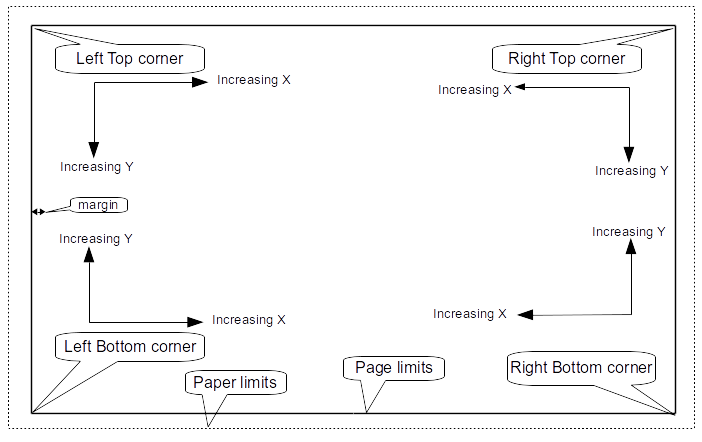

* When the page size is changed, the position of the item, relative to
  its reference corner does not change.

* Usually, title blocks are attached to the right bottom corner, and
  therefore this corner is the default corner, when creating an item.

For rectangles and segments, which have two defined points, each point
has its reference corner.

<<<<<

[[rotation]]
=== Rotation

Items which have a position defined by just one point (text and
poly-polygons) can be rotated:

Normal: Rotation = 0

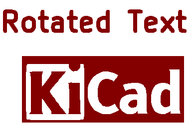

Rotated: Rotation = 20 and 10 degrees.

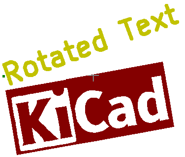

<<<<<

[[repeat-option]]
=== Repeat option

Items can be repeated:

This is useful to create grid and grid labels.

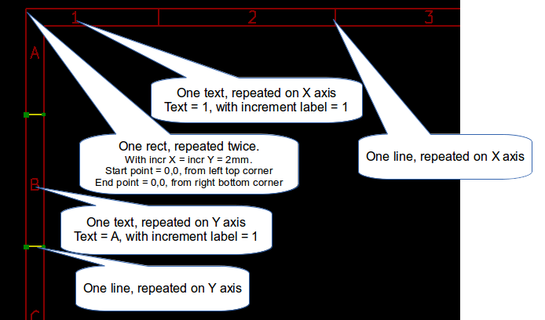]

<<<<<

[[texts-and-formats]]
== Text and keywords

[[format-symbols]]
=== Keywords

Text can be simple strings or can include keywords.

Keywords are replaced by actual values when the drawing sheet is used in a
schematic or PCB design. They behave like
xref:../eeschema/eeschema.adoc#text-variables[text variables] in the
Schematic and Board Editors, except the values are either automatically set by
the editor or set by the user in the Page Setup dialog of the respective editor.

The keyword syntax is `${KEYWORD}`. The keyword, including the surrounding
`${}`, will be replaced by the keyword's value.

[options="header",cols="20%,80%"]
|====
| Keyword name | Description
| `KICAD_VERSION`
  | Version number of KiCad.
| `#`
  | Sheet number.
| `##`
  | Total number of sheets.
| `COMMENT1` - `COMMENT9`
  | Contents of the `Comment<n>` field in Page Setup.
| `COMPANY`
  | Contents of the `Company` field in Page Setup.
| `FILENAME`
  | Filename of the schematic or PCB design file, with a file extension.
| `ISSUE_DATE`
  | Contents of the `Issue Date` field in Page Setup.
| `LAYER`
  | Name of the current PCB layer. This is blank in the Schematic and Board
    Editors. It is only shown in plots of PCB designs.
| `PAPER`
  | Current sheet's paper size, which is set in Page Setup.
| `REVISION`
  | Contents of the `Revision` field in Page Setup.
| `SHEETNAME`
  | Sheet name of the current sheet. This is blank in the Board Editor.
| `SHEETPATH`
  | Sheet path of the current sheet. This is blank in the Board Editor.
| `TITLE`
  | Contents of the `Title` field in Page Setup.
|====

For example, `Size: ${PAPER}` displays "Size: A4" when the paper size is set to
A4.

<<<<<

When the Preview display mode is active
(), the title block is
displayed like in the Schematic and PCB Editors, with keywords replaced with
the corresponding values. You can configure the displayed values in the
Page Preview Settings dialog (image:images/icons/sheetset_24.png[]).

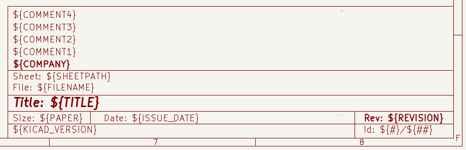

When the Edit mode is active
(), the title block is
displayed without replacing keywords.

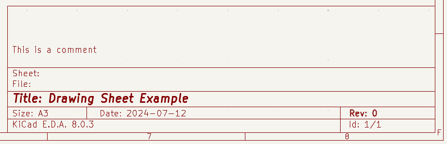

<<<<<

[[multi-line-texts]]
=== Multi-line text

Text can be multi-line.

There are 2 ways to insert a new line in text:

1.  Insert the `\n` 2 chars sequence (mainly in Page setup dialog in
    KiCad).

2.  Insert a new line in the Drawing Sheet Editor Design window.

Here is an example:

Setup

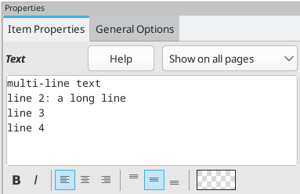

Output

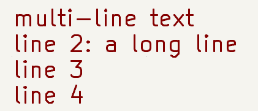

<<<<<

[[multi-line-texts-in-page-setup-dialog]]
=== Multi-line text in Page Setup dialog

In the Page Setup dialog, text controls do not accept multi-line text.

The `\n` 2 character sequence should be inserted to force a new line inside a
text object.

Here is a two line text object, in the Comment2 field:

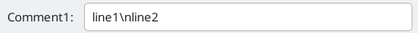

Here is the actual text:

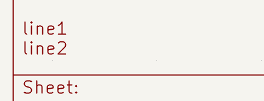

However, if you really want the `\n` inside the text, enter `\\n`.

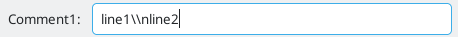

And the displayed text:

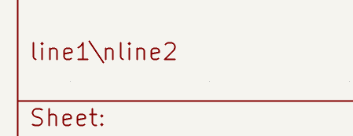

<<<<<

[[constraints]]
== Constraints

[[page-1-constraint]]
=== Page 1 constraint

When using the Schematic Editor, the full schematic often uses more than one page.

Usually drawing sheet items are shown on all pages, but you can also set each
item to be shown only on the first page or on all pages except the first page.
To change which pages an item is shown on, use the dropdown in the the item's
**Item Properties** panel. Options are **show on all pages**,
**first page only**, and **subsequent pages only**.

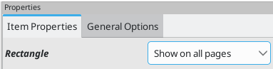

<<<<<

[[text-full-size-constraint]]
=== Text maximum size constraint

Text items have a maximum size constraint. You can set a **maximum height** and
**maximum width**, which together form a bounding box defining the maximum size
of the text object.

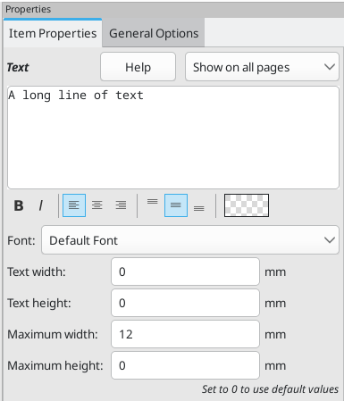

If the text object is bigger than the maximum size in a given dimension, the
text object will be dynamically compressed in that dimension in order to fit
within the bounding box. This will result in the text being visually distorted.
If the text fits within the bounding box, the text will not be compressed.

When either parameter is set to `0`, KiCad will not enforce a maximum size in
that dimension.

Some text with the maximum height and width set to `0`:

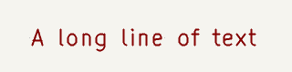

The same text compressed because the maximum width is set smaller than the width
of the text:

[[invoking-pl_editor]]
== Invoking the Drawing Sheet Editor

The Drawing Sheet Editor is typically invoked from a command line, or from the KiCad
Project Manager.

From a command line, the syntax is pl_editor <*.kicad_wks file to open>.

[[pl_editor-commands]]
== Drawing Sheet Editor Commands

[[main-screen]]
=== Main Screen

The image below shows the main window of the Drawing Sheet Editor.

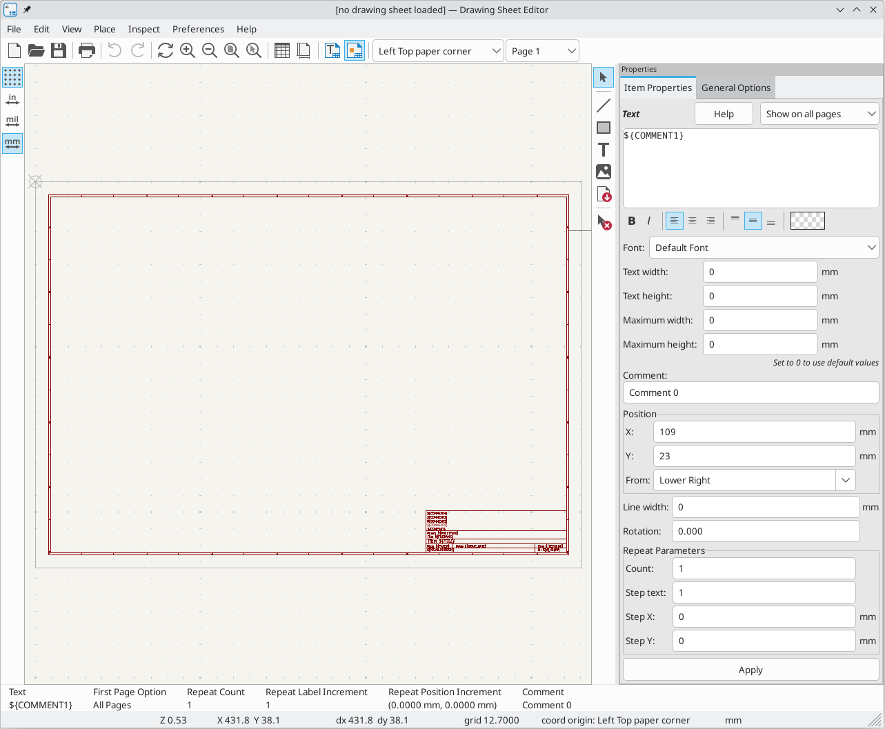

The main part of the screen is the editing canvas for the open drawing sheet.

The right pane is a properties editor for editing the selected item. It only
appears when an item is selected in the canvas.

<<<<<

[[main-window-toolbar]]
=== Main Window Toolbar

The top toolbar allows for easy access to the following commands:

[width="100%",cols="28%,72%",]
|=======================================================================
|
|Create a new drawing sheet.

|
|Load a drawing sheet file.

|
|Save the current drawing sheet in a `.kicad_wks` file.

|image:images/icons/sheetset_24.png[]
|Display the page size selector and the title block user data editor.

|
|Prints the current page.

|image:images/icons/undo_24.png[] 
|Undo/redo tools.

|image:images/icons/zoom_in_24.png[] image:images/icons/zoom_out_24.png[]
  image:images/icons/zoom_fit_in_page_24.png[] 
|Zoom in, out, redraw and auto, respectively.

|
|Show the drawing sheet in Preview mode: text is shown like in the Schematic or
PCB Editors, with text keywords replaced by user text.

|
|Show the drawing sheet in Edit mode: text is displayed "as is", without any
keyword replacement.

|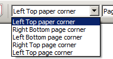
|Reference corner selection, for coordinates displayed to the status bar.

|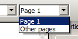
|Selection of the page number (page & or other pages).

This selection has meaning only if some items than have a page option,
are not shown on all pages (in a schematic for instance, which contains
more than one page).

|=======================================================================

[[commands-in-drawing-area-draw-panel]]
=== Commands in drawing area (draw panel)

[[keyboard-commands]]
==== Keyboard Commands

[width="100%",cols="20%,80%",]
|==================================================================
|F1 |Zoom In
|F2 |Zoom Out
|F3 |Refresh Display
|F4 |Move cursor to center of display window
|Home |Fit footprint into display window
|Space Bar |Set relative coordinates to the current cursor position
|Right Arrow |Move cursor right one grid position
|Left Arrow |Move cursor left one grid position
|Up Arrow |Move cursor up one grid position
|Down Arrow |Move cursor down one grid position
|==================================================================

[[mouse-commands]]
==== Mouse Commands

[width="100%",cols="32%,68%",]
|============================================================
|Scroll Wheel |Zoom in and out at the current cursor position
|Ctrl + Scroll Wheel |Pan right and left
|Shift + Scroll Wheel |Pan up and down
|Right Button Click |Open context menu
|============================================================

[[context-menu]]
==== Context Menu

Displayed by right-clicking the mouse:

* Add Line

* Add Rectangle

* Add Text

* Add Bitmap

* Zoom selection: direct selection of the display zoom.

* Grid selection: direct selection of the grid.

[[status-bar-information]]
=== Status Bar Information

The status bar is located at the bottom of the Drawing Sheet Editor and provides
useful information to the user.

Coordinates are always relative to the corner selected as the reference corner
in the reference corner dropdown in the menubar.

<<<<<

[[right-window]]
== Properties editor

The right pane is a properties editor. It only appears when an item is selected
in the canvas. The **Item Properties** tab contains properties for the selected
item. These properties depend on what type of item is selected. The
**General Options** tab lets you edit default properties and margins for the
*sheet.

Changes made in the properties editor are not applied until you click the
**Apply** button.

[width="100%",cols="50%,50%",]
|=======================================================================
|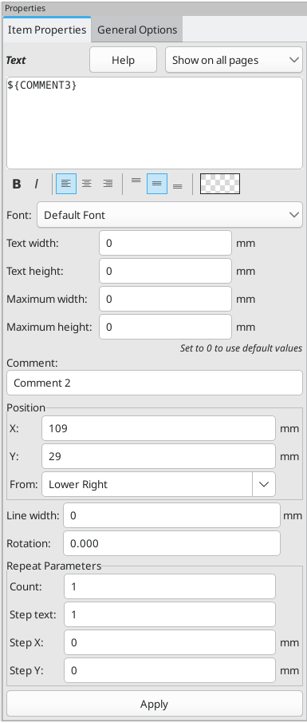
|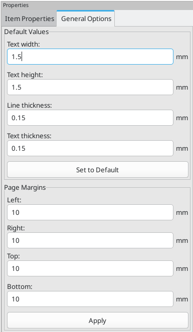
|=======================================================================

<<<<<

== Design Inspector window

The Design Inspector shows a table of every item in the drawing sheet and their
properties. Selecting an item in the Design Inspector also selects the item on
the canvas and leaves it selected when you close the Design Inspector.

To open the Design Inspector, use **Inspect** -> **Show Design Inspector**.

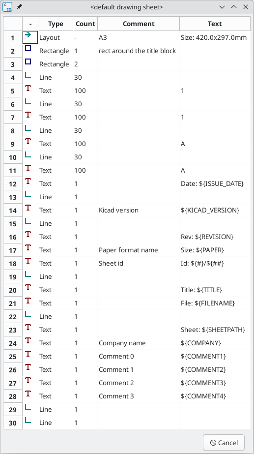

<<<<<
[[interactive-edition]]
== Interactive editing

[[item-selection]]
=== Item selection

An item can be selected:

* From the Design Inspector

* By Left clicking on it.

* By Right clicking on it (and a pop up menu will be displayed).

When selected, this item is drawn in a lighter shade of color and the properties
editor will be displayed for the selected item.

When right clicking on the item, a pop-up menu is displayed. The pop menu
contents depend on the type of object selected.

<<<<<

[[item-creation]]
=== Item creation

To add a new item, use the appropriate button in the right toolbar and then
click on the canvas. The item will be added to the canvas and selected, and the
properties editor for the new item will open. You can edit the item's properties
in the properties editor, then click **Apply** to modify the new item.

The available items are lines (),
rectangles (image:images/icons/add_rectangle_24.png[]), text
(image:images/icons/text_24.png[]), and bitmaps (image:images/icons/image_24.png[]).

You can also add new items from the right-click context menu.

Logos must first be created by the Image Converter tool, which creates a page
layout description file. You can use the **Append Existing Drawing Sheet**
command to insert the logo (a poly polygon) contained in the new drawing sheet.

<<<<<

[[adding-lines-rectangles-and-texts]]
=== Adding lines, rectangles and text

When you add lines, rectangles, or text, the item will be added to the canvas,
selected, and shown in the properties editor. You can edit the item's properties
in the properties editor, then click **Apply** to apply the changes.

You can also move the item in the canvas after it has been placed by dragging it
or using the Move command (kbd:[M]). Lines and rectangles can be moved as a
shape, but you can also move their points individually.

Lines and rectangles typically use the same corner reference for both the
start and end points. If this is not the case, the item's geometry will change
when the sheet size or margins are changed.

[[adding-logos]]
=== Adding logos

To add a logo, a poly polygon (the vectored image of the logo) must be
first created using the Image Converter tool, which is available in the main
KiCad Project Manager window. Polygons cannot be created by hand.

The Image Converter tool creates a drawing sheet file which contains
only one item: a poly polygon representing the source image. This drawing sheet
file is appended to the current design, using the
**Append Existing Drawing Sheet** command.

NOTE: This command can be used to append any drawing sheet file, regardless of
      what items it contains. All items in the appended file will be added to
      the current design.

Once a poly polygon is inserted, it can be moved and its parameters
edited.

[[adding-image-bitmaps]]
=== Adding image bitmaps

You can add an image bitmap using many common bitmap formats (PNG, JPEG, BMP,
etc.).

* When a bitmap is imported, its PPI (pixel per inch) definition is set
  to 300PPI.

* This value can be modified in the properties editor.

* The actual size of the bitmap in the drawing sheet depends on this parameter.

* Be aware that using higher definition values brings larger output files,
  and can have an effect on draw or plot time.

Bitmaps can be repeated but not rotated.